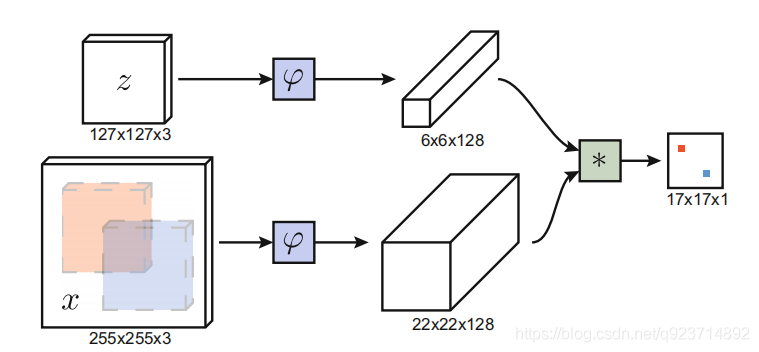
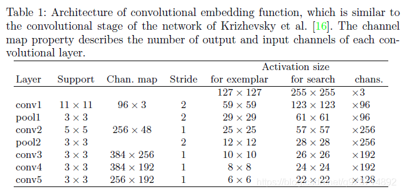
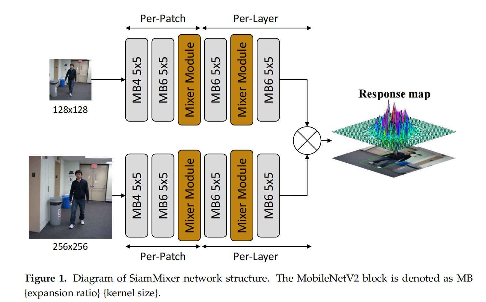
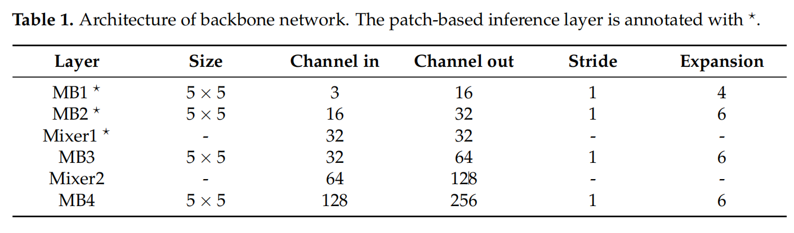
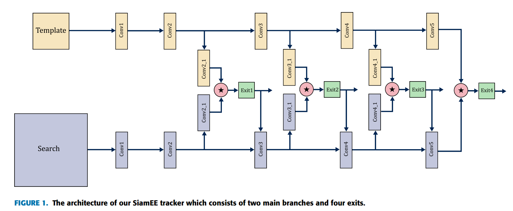

## 前言

### 目标跟踪难点

1. **形态变化** - 姿态变化是目标跟踪中常见的干扰问题。运动目标发生姿态变化时, 会导致它的特征以及外观模型发生改变, 容易导致跟踪失败。例如:体育比赛中的运动员、马路上的行人。
2. **尺度变化** - 尺度的自适应也是目标跟踪中的关键问题。当目标尺度缩小时, 由于跟踪框不能自适应跟踪, 会将很多背景信息包含在内, 导致目标模型的更新错误；当目标尺度增大时, 由于跟踪框不能将目标完全包括在内, 跟踪框内目标信息不全, 也会导致目标模型的更新错误。因此, 实现尺度自适应跟踪是十分必要的。
3. **遮挡与消失** - 目标在运动过程中可能出现被遮挡或者短暂的消失情况。当这种情况发生时, 跟踪框容易将遮挡物以及背景信息包含在跟踪框内, 会导致后续帧中的跟踪目标漂移到遮挡物上面。若目标被完全遮挡时, 由于找不到目标的对应模型, 会导致跟踪失败。
4. **图像模糊** - 光照强度变化, 目标快速运动, 低分辨率等情况会导致图像模型, 尤其是在运动目标与背景相似的情况下更为明显。因此, 选择有效的特征对目标和背景进行区分非常必要。

### 跟踪算法简要总结

- 相比于光流法、Kalman、Meanshift等传统算法，**相关滤波类**算法跟踪速度更快，**深度学习**类方法精度高；
- 具有**多特征**融合以及**深度特征**的追踪器在跟踪精度方面的效果更好；
- 使用**强大的分类器**是实现良好跟踪的基础；
- 尺度的自适应以及模型的更新机制也影响着跟踪的精度。

## SiameseFC

**[Fully-Convolutional Siamese Networks](https://link.zhihu.com/?target=https://arxiv.org/abs/1606.09549)**

[CSDN - SiameseFC超详解](https://blog.csdn.net/q923714892/article/details/119839796)

### 要做什么？

SOT的思想是，在视频中的某一帧中框出你需要跟踪目标的bounding box，在后续的视频帧中，无需你再检测出物体的bounding box进行匹配，而是通过某种相似度的计算，寻找需要跟踪的对象在后续帧的位置。

### 解决什么问题？

目前基于深度学习的跟踪方法，要不就是采用 shallow methods（如：correlation filters）利用网络的中间表示作为 feature；要不就是执行 SGD 算法来微调多层网络结构。但是，利用 shallow 的方法并不能充分发挥 end-to-end 训练的优势，采用 SGD 的方法来微调也无法达到实时的要求。

将DL用于tracking中，有两点制约其发展：

1. **训练数据的稀缺**。由于跟踪目标事先未知，只能通过最初的框选定，无法预先准备大量训练数据。
2. **实时的约束**。对于跟踪问题来说，基于DL的做法虽然能有效提升模型的丰富度，能够很好的提升跟踪的效果，但是在时效性这一方面却做的很差，因为DL复杂的模型往往需要很大的计算量，尤其是当使用的DL模型在跟踪的时候需要对模型进行更新的话，需要在线SGD调整网络参数，限制了速度，可能使用GPU都没法达到实时。

**Siamese-FC**分别针对这两点，利用ILSVRC15 数据库中用于目标检测的视频来训练模型（离线训练），在跟踪时，不更新模型（也就没有fine-tuning），保证速度够快。成为了使用了CNN进行跟踪，同时又具有很高的效率的跟踪算法。并因其速度很快，效果很好，成为之后很多算法（例如CFNet、DCFNet）的baseline。

### 如何解决？

使用**孪生网络**（Siamese Net）结构来进行**相似度比较**，对比模版图片（在训练前应该指定好）和需比较的目标图片之间的相似度。

### 效果如何？

速度是SiameseFC的最大优势。可以用于追踪任意物体（不需要预先训练）。

### 框架结构

图中z代表的是模板图像，算法中使用的是**第一帧**的groundtruth；

x代表的是search region，代表在后面的待跟踪帧中的**候选框搜索区域**；

ϕ代表的是一种**特征映射操作**，将原始图像映射到特定的特征空间，文中采用的是**CNN中的卷积层和pooling层**；6x6x128代表z经过ϕ后得到的特征，是一个128通道66大小feature，同理，22x22x128是x经过ϕ后的特征；后面的代表卷积操作，让22x22x128的feature被6x6x128的卷积核卷积，得到一个17*17的**score map**，代表着search region中各个位置与模板相似度值。score越大，相似度越大，越有可能是同一个物体。

总体来说，卷积网络将search image作为整体输入，**直接计算两个输入图像的feature map的相似度匹配**，节省了计算。计算得到相似度最高的位置，并反向计算出目标在原图中的位置。

算法本身是比较搜索区域与目标模板的相似度，最后得到搜索区域的score map。其实从原理上来说，这种方法和相关性滤波的方法很相似。其在搜索区域中逐个的对目标模板进行匹配，将这种逐个平移匹配计算相似度的方法看成是一种卷积，然后在卷积结果中找到相似度值最大的点，作为新的目标的中心。

上图所画的ϕ其实是CNN中的一部分，并且两个ϕ的网络结构是一样的，这是一种典型的孪生神经网络，并且在整个模型中只有conv层和pooling层，因此这也是一种典型的全卷积（fully-convolutional）神经网络。

### 网络结构

整个网络结构类似与AlexNet，但是没有最后的全连接层，只有前面的卷积层和pooling层。

其中pooling层采用的是max-pooling，每个卷积层后面都有一个ReLU非线性激活层，但是第五层没有。另外，在训练的时候，每个ReLU层前都使用了batch normalization，用于降低过拟合的风险。

### 不足之处

**鲁棒性不强**

SiameseFC是一个模板匹配的任务，在跟踪过程中**并不更新目标模板和网络权值**，这造成如下问题：

1. 当目标发生**较大的形变**时，会造成目标候选框与目标模板出现较大差异，从而导致跟踪失败。网络权值不更新导致要使用同一套网络结构和网络参数适应所有的跟踪场景，这是很难做到的。

2. 对于没有处于复杂背景下的跟踪来说，该算法能基本平衡实时性与准确性要求，但是跟踪目标一旦发生**遮挡、快速运动、相似外观**，搜索图像的大小可能就覆盖不了目标，通过最后的相似性度量函数得出来的结果就是错误的，随着跟踪过程中发生的错误累加，导致**跟踪不可恢复**，所以孪生结构网络的跟踪性能在背景复杂的情况下会下降。

### 失败原因

1. 目标特征不够具体、突出、全面 （AlexNet提取特征不够细致）
2. 没能利用好空间信息、运动信息 （运动模型不够合理）
3. 搜索域方法的局限性 （多尺度增加计算量，无法适应尺度变化）
4. 匹配与分类的本质差别 （分类对背景前景区分较好）

### 解决思路

1. 加入在线更新的策略（增加目标信息，牺牲速度或者增强特征的提取）

2. 需要对首帧标注图像做处理（抑制背景信息，增加前景和背景的区分度）
   SiamFC选用第一帧作为模板并不予更新，因此首帧目标信息为关键信息，而SiamFC模型中，最后采用相似度学习，如果不能降模板图像中背景信息的干扰，则必然会对结果造成影响。 因此应当对标注图像进行进一步的目标提取，并对背景信息进行抑制。

3. 利用空间信息，估计运动模型。在存在较多相似目标的场景中，可能特征匹配难以准确地判断哪个才是真正的目标。而人在这种场景下追踪目标的策略往往是根据：
   （1）目标的空间信息，例如一队人中的第几个，或者目标周围有哪些参照物。这一点可以通过对目标旁边的背景进行建模实现。
   （2）根据目标的运动轨迹进行预测，因为目标的变化(无论是位置还是外观)在序列中往往是连续可微的。

### 轻量化方案

1. 从现有的高性能网络出发，优化网络结构，压缩网络参数，最终使网络满足边缘端部署的要求。（**深度压缩、知识蒸馏、低位量化**，这些工作需要在精度、帧率和参数的数量之间进行权衡，从而引入过多的人工参与。）
2. 直接设计轻量级结构，然后结合剪枝和量化，最终满足边缘-端部署的要求。(**SqueezeNet、MobileNet**，集中于减少网络的权重参数)

## SiamMixer（内存优化）

**[SiamMixer: A Lightweight and Hardware-Friendly Visual Object-Tracking Network](https://www.webofscience.com/wos/alldb/full-record/WOS:000775437100001)**

**暂不需要**

构建轻量级主干网络。

骨干网络的主要目标是在有限的参数预算内对输入图像中的局部信息和全局信息进行建模。它在深度卷积层后应用一个1×1卷积层来进行结构编码。为了保持网络结构的简单性，用于结构编码的MobileNetV2块以相同的内核大小实现。

为了降低运行时内存成本，我们按补丁的顺序（卷积后的每个值）进行卷积层。在卷积层推理过程中，一次处理一个小的图像补丁。一旦小的图像补丁被处理，它们占用的内存空间就会被释放，从而可以降低峰值内存成本。该方法的主要缺点是由于空间受限，无法对输入图像的全局信息进行编码。因此该作者设计了Mixer模块用于对卷积特征映射进行全局编码。

未完待续。。。

## SiamEE（速度优化）

**[Early Exiting-Enabled Siamese Tracking for Edge Intelligence Applications](https://www.webofscience.com/wos/alldb/full-record/WOS:000709077100001)**

**1、允许模型在适用时提前退出。**

受BranchyNet的启发，我们在每个卷积层之后引入三个出口分支，从第二层开始并产生四个出口点，包括主分支出口。出口分支位于除第一层之外的每个卷积层之后。实验上，我们发现第一层表示良好跟踪特征的能力较差。此外，从第一层获得的分数图尺寸较大，需要下采样到输出尺寸。这个早期分支的好处并不能合理地满足额外计算成本的需求。因此，我们不会在第一层之后直接附加早期退出分支。

从离输入最近的出口分支开始，得到该分支的得分图。然后将最大分数与预定义的阈值 γb 进行比较。如果此分数大于 γb，则分数图作为最终输出返回，推理停止。否则，该过程将一直继续到最后一点，并依次检查每个出口分支的相应输出。对于单个样本，每个卷积层的输出仅计算一次，如果不满足退出条件，则将其馈送到下一层。

由于我们的目标是在不寻求额外计算开销的情况下实现合理的准确性，因此我们不包含任何提前退出的动态规则。相反，我们定义固定阈值并在训练结束后调整它们。此外，这些手动指定的阈值在调整准确度-速度权衡时会派上用场。

在在线跟踪期间，将搜索图像与初始模板图像进行比较，初始模板图像不会在每一帧中更新，这意味着模板图像的特征表示仅对所有出口分支计算一次，然后用于所有后续帧。这导致快速推理。

**2、通过简单的跳跃规则跳过比例搜索**

详尽的比例搜索策略是昂贵计算的另一个关键来源。由于本研究的目的是在允许合理的精度损失的同时降低计算成本，我们通过引入简单的跳跃规则修改了尺度搜索方法。跳过比例搜索可以显着节省计算量，因为在许多情况下，尤其是在高速运行时，比例差异在频繁帧中可以忽略不计。

由于我们的模型不提供预测置信度，因此我们使用预测分数图的最大值代替。

分数越高表示置信度越高。为了决定我们是否可以在下一帧中跳过多尺度搜索，我们观察这个得分值。如果分数在下降，我们就在下一帧应用多尺度搜索。在这项工作中，我们只将当前帧的分数与之前的分数进行比较。

