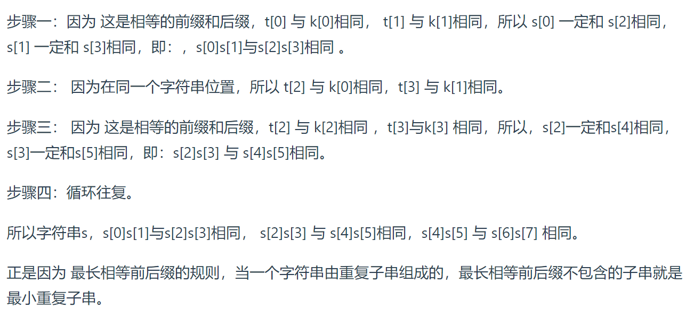

# 打卡4月LeetCode

## 2023.4.1

### 831.隐藏个人信息

#### 题干

太长。

**示例**

```
示例 1：
输入：s = "AB@qq.com"
输出："a*****b@qq.com"
```

```
示例 2：
输入：s = "1(234)567-890"
输出："***-***-7890"
```

#### 解法

基本思路：**模拟？**

这也算算法题。。吗？

#### 代码

```cpp
class Solution {
public:
    string maskPII(string s) {
        if(s[0] >= 'A'){
            int split = s.find('@');
            for(int i = split + 1; i < s.length(); ++i){
                if(s[i] <= 'Z' && s[i] >= 'A')
                    s[i] += 32;
            }
            if(s[0] <= 'Z') s[0] += 32;
            if(s[split - 1] <= 'Z') s[split - 1] += 32;
            s.replace(1, split - 2, "*****");
        }
        else{
            for(string::iterator i = s.begin(); i < s.end(); ++i){
                if(*i < '0')
                    s.erase(i--);
            }
            int len = s.length();
            if(len == 10)
                return "***-***-" + s.substr(6, 4);
            else if(len == 11)
                return "+*-***-***-" + s.substr(7, 4);
            else if(len == 12)
                return "+**-***-***-" + s.substr(8, 4);
            else if(len == 13)
                return "+***-***-***-" + s.substr(9, 4);
        }
        return s;
    }
};
```


### 54.螺旋矩阵、剑指 Offer 29. 顺时针打印矩阵

#### 题干

给你一个 `m` 行 `n` 列的矩阵 `matrix` ，请按照 **顺时针螺旋顺序** ，返回矩阵中的所有元素。

**示例**

```
示例 1：
输入：matrix = [[1,2,3],[4,5,6],[7,8,9]]
输出：[1,2,3,6,9,8,7,4,5]
```

```
示例 2：
输入：matrix = [[1,2,3,4],[5,6,7,8],[9,10,11,12]]
输出：[1,2,3,4,8,12,11,10,9,5,6,7]
```

#### 解法

基本思路：**模拟过程**

相比于 59.螺旋矩阵Ⅱ ，这题的长宽不一定相同，因此不再适用按圈缩减的方法。


1. 维护上、下、左、右四个边界的下标。
2. 第一次移动，从左到右移动一整行，移动后直接将1~4从上图中抹掉，变成了一个 4 x 2 的矩阵。如何抹掉？**维护的上边界加一**即可。因为**循环都是统一从一个边界到另一个边界的**。
3. 第二次移动，从上到下，移动后抹去8、12，相当于**右边界减一**。这样下一次移动中从右到左时从右边界开始就是从11开始的，顺序不会错乱。
4. 第三从右往左，第四次从下往上，四次组成一次大循环。
5. 每当有两个对应边界错位（**左 > 右，上 > 下**）时，就直接结束了。例如当仅剩一行时，上下边界重合，抹去这行时，无论up++还是down--，都会出现错位，以此为结束的判断依据。

思路清晰，逻辑明了。

#### 代码

```cpp
class Solution {
public:
    vector<int> spiralOrder(vector<vector<int>>& matrix) {
        vector<int> res;
        int up = 0, left = 0;
        int down = matrix.size() - 1, right = matrix[0].size() - 1;
        while(1){
            for(int i = left; i <= right; ++i) res.push_back(matrix[up][i]);
            if(++up > down) break;
            for(int i = up; i <= down; ++i) res.push_back(matrix[i][right]);
            if(--right < left) break;
            for(int i = right; i >= left; --i) res.push_back(matrix[down][i]);
            if(--down < up) break;
            for(int i = down; i >= up; --i) res.push_back(matrix[i][left]);
            if(++left > right) break;
        }
        return res;
    }
};
```


### 11.盛最多水的容器

#### 题干

给定一个长度为 **n** 的整数数组 **height** 。有 n 条垂线，第 **i** 条线的两个端点是 **(i, 0)** 和 **(i, height[i])** 。

找出其中的两条线，使得它们与 **x** 轴共同构成的容器可以容纳**最多**的水。返回容器可以储存的**最大水量**。

**示例**

```
示例 1：
输入：[1,8,6,2,5,4,8,3,7]
输出：49 
```

```
示例 2：
输入：height = [1,1]
输出：1
```

#### 解法

基本思路：**双指针**

代码很简单，这题主要在于思路上：为什么双指针按代码所示方法往中间移动时不会漏掉某种情况呢？

容量和两个因素有关：双指针的**距离**、双指针中**短的那个的高度**。

开始双指针在两端，距离是最大的，此时移动指针若想要让容量更大，就必须提高双指针中**短的那个的高度**，也就是把短的指针往中间移动找找有没有更高的位置。这样移动下来就不存在漏掉某种最大的情况了。

#### 代码

```cpp
class Solution {
public:
    int maxArea(vector<int>& height) {
        int n = height.size()， res = 0;
        int l = 0, r = n - 1;
        while(l < r){
            int area = min(height[l], height[r]) * (r - l);
            res = max(res, area);
            if(height[l] < height[r])	l++;
            else	r--;
        }
        return res;
    }
};
```


## 2023.4.3

### 1053.交换一次的先前排列

#### 题干

给你一个正整数数组 **arr**（可能存在重复的元素），请你返回可在 **一次交换**（交换两数字 arr[i] 和 arr[j] 的位置）后得到的、按**字典序**排列**小于** **arr** 的**最大排列**。

如果无法这么操作，就请返回**原数组**。

**示例**

```
示例 1：
输入：arr = [3,2,1]
输出：[3,1,2]
```

```
示例 2：
输入：arr = [1,9,4,6,7]
输出：[1,7,4,6,9]
```

#### 解法

基本思路：**贪心**

对于数组中的两元素下标 i 、j 且 **i < j**，若交换 arr[i] 和 arr[j] 得到的新数组按字典序排列比原数组小，显然有**arr[i] > arr[j]** 。因此符合题意要求的交换会使得数组  arr[i]  在下标 i 处的元素变小。那么为了得到按字典序排列小于原数组的最大新数组，尽可能地保持前面的元素不变是这一步的最优解，即让 **i 最大化**。

也就是说，从右往左遍历，找到的第一个**arr[i] > arr[i + 1]** 处，就是需要被交换的 i 。

显然，找到 i 后，j 需要在 i 右半边去找。在满足 **arr[i] > arr[j]** 的情况下，取**最大**的 **arr[j]** 是这一步的最优解，但需要注意元素可能存在重复的情况需要排除，此时把大的值换到相同数字的最左边，在小于原序列的状态下得到的序列是更大的，因此取**最大的、j 尽量小的 arr[j]** 为最优解。

#### 代码

```cpp
class Solution {
public:
    vector<int> prevPermOpt1(vector<int>& arr) {
        for(int i = arr.size() - 2; i >= 0; --i){
            if(arr[i] > arr[i + 1]){
                for(int j = arr.size() - 1; j > i; --j){
                    if(arr[j] < arr[i] && arr[j] != arr[j - 1]){
                        swap(arr[j], arr[i]);
                        return arr;
                    }
                }
            }
        }
        return arr;
    }
};
```


### 31.下一个排列

#### 题干

整数数组的一个 排列  就是将其所有成员以序列或线性顺序排列。

- 例如，arr = [1,2,3] ，以下这些都可以视作 arr 的排列：[1,2,3]、[1,3,2]、[3,1,2]、[2,3,1] 。

整数数组的 **下一个排列** 是指其整数的下一个字典序更大的排列。更正式地，如果数组的所有排列根据其字典顺序从小到大排列在一个容器中，那么数组的 下一个排列 就是在这个有序容器中排在它后面的那个排列。如果不存在下一个更大的排列，那么这个数组必须重排为字典序**最小**的排列（即其元素按升序排列）。

- 例如，arr = [1,2,3] 的下一个排列是 [1,3,2] 。

- 类似地，arr = [2,3,1] 的下一个排列是 [3,1,2] 。
- 而 arr = [3,2,1] 的下一个排列是 [1,2,3] ，因为 [3,2,1] 不存在一个字典序更大的排列。

给你一个整数数组 **nums** ，找出 **nums** 的下一个排列。必须 **原地** 修改，只允许使用**额外常数**空间。

**示例**

```
示例 1：
输入：nums = [1,2,3]
输出：[1,3,2]
```

```
示例 2：
输入：nums = [3,2,1]
输出：[1,2,3]
```

#### 解法

基本思路：**贪心？、双指针？**

这题和今天的每日一题是相同原理，是找大于原序列的最小字典序。

对于数组中的一部分，若完全的降序排列（不存在 **arr[i] < arr[i+1]** 的情况），则这段子序列是最大的。那么最优解就是从右往左找到第一个 **arr[i] > arr[i+1]** 处，就是从尾部开始的最大子序列长度再加一，i 即是要交换的位置。

显然，找到 i 后，j 需要在 i 右半边去找。在满足 **arr[i] < arr[j]** 的情况下，取**最小的** **arr[j]** 是这一步的最优解，此题不需要考虑元素重复的情况，因为换哪个都一样。

交换完成后，由于 i 增大了，要找大于原序列的最小字典序，右侧的子序列自然是要最小的，**因此升序排列即可**。

若找不到这样的 i ，说明原序列就是最大字典序，直接把整个数组升序排列即可。

#### 代码

```cpp
class Solution {
public:
    void nextPermutation(vector<int>& nums){
        for(int i = nums.size() - 2; i >= 0; --i){
        	if(nums[i] < nums[i+1]){
            	for(int j = nums.size() - 1; j > i; --j){  
            		if(nums[j] > nums[i]){
                		swap(nums[j], nums[i]);
        				sort(nums.begin()+i+1,nums.end());
                		return;
            		}
        		}
    		}
    	}
    	sort(nums.begin(),nums.end());
	}
};
```


## 2023.4.4

### 46.全排列

#### 题干

给定一个不含重复数字的数组 `nums` ，返回其 *所有可能的全排列* 。你可以 **按任意顺序** 返回答案。

**示例**

```
示例 1：
输入：nums = [1,2,3]
输出：[[1,2,3],[1,3,2],[2,1,3],[2,3,1],[3,1,2],[3,2,1]]
```

```
示例 2：
输入：nums = [1]
输出：[[1]]
```

#### 解法

基本思路：**回溯、DFS**

实际就是一个排列组合问题，每一个数字都要放到最前面，而对剩下的数字里同样是每个数字都要被放在最前（第二个）。。以此类推。这就是分布解决问题的过程。

**回溯法**采用的是试错思想：当它通过尝试发现现有的分步答案不能得到有效的正确的解答的时候，它将取消上一步甚至是上几步的计算，再通过其它的可能的分步解答再次尝试寻找问题的答案。这通常是使用递归来实现的。

而本题中不需要判断分步答案是否正确，只需记录所有分布答案即可。

**回溯与动态规划的异同：**

**1.共同点**

- 用于**求解多阶段决策**问题。即：求解一个问题分为很多步骤（阶段）；每一个步骤（阶段）可以有多种选择。

**2.不同点**

- 动态规划只需要求我们评估最优解是多少，最优解对应的具体解是什么并不要求。因此很适合应用于评估一个方案的效果；
- 回溯算法可以搜索得到所有的方案（当然包括最优解），但是本质上它是一种遍历算法，时间复杂度很高。

对于该题，示例1：


深度优先遍历有「回头」的过程，在「回头」以后， 状态变量需要设置成为和先前一样 ，因此在回到上一层结点的过程中，需要**撤销**上一次的选择，这个操作称之为「**状态重置**」

#### 代码

```cpp
class Solution {
public:
    void dfs(vector<vector<int>>& res, vector<int>& nums, int start, int end){
        if(start == end){
            res.push_back(nums);
            return;
        }
        for(int i = start; i < end; ++i){
            swap(nums[start], nums[i]);
            dfs(res, nums, start + 1, end);
            swap(nums[start], nums[i]);
        }
    }
    vector<vector<int>> permute(vector<int>& nums) {
        vector<vector<int>> res;
        dfs(res, nums, 0, nums.size());
        return res;
    }
};
```


## 2023.4.5

### 2427.公因子的数目

#### 解法

基本思路：**暴力**

公因子的最大值就是最大公约数，因此先求最大公约数（库函数 **__gcd** ），再从1开始循环判断。

#### 代码

```cpp
class Solution {
public:
    int commonFactors(int a, int b) {
        int divisor = __gcd(a, b);
        int res = 0;
        for(int i = 1; i <= divisor; ++i)
            if(a % i == 0 && b % i == 0)
                res++;
        return res;
    }
};
```


## 2023.4.6

### 1017.负二进制转换

#### 题干

给你一个整数 `n` ，以二进制字符串的形式返回该整数的 **负二进制（`base -2`）**表示。

**注意，**除非字符串就是 `"0"`，否则返回的字符串中不能含有前导零。

**示例**

```
示例 1：
输入：n = 2
输出："110"
解释：(-2)2 + (-2)1 = 2
```

```
示例 2：
输入：n = 3
输出："111"
解释：(-2)2 + (-2)1 + (-2)0 = 3
```

#### 解法

基本思路：**模拟、数学**

本题主要用到了**十进制转n进制**的方法：**除n取余，逆序排列**。代码模拟了这个过程。

注意：因为填入的结果只有0、1，而余数可能为 -1，可以通过商+1重新计算余数，不影响结果。

#### 代码

```cpp
class Solution {
public:
    string baseNeg2(int n) {
        if(n == 0)  
            return "0";
        string res = "";
        while(n){
            int quotient = n / -2;
            int remainder = n - quotient * -2;
            if(remainder < 0)
                remainder = n - ++quotient * -2;
            res += to_string(remainder);
            n = quotient;    
        }
        return string(res.rbegin(), res.rend());
    }
};
```


### 47.全排列Ⅱ

#### 题干

给定一个可包含重复数字的序列 `nums` ，***按任意顺序*** 返回所有不重复的全排列。

**示例**

```
示例 1：
输入：nums = [1,1,2]
输出：[[1,1,2],[1,2,1],[2,1,1]]
```

```
示例 2：
输入：nums = [1,2,3]
输出：[[1,2,3],[1,3,2],[2,1,3],[2,3,1],[3,1,2],[3,2,1]]
```

#### 解法

基本思路：**回溯、DFS**

相比于46.全排列，这题在输入数组中存在重复数字，这意味着按照之前的方法会导致重复数字被使用导致排列相同的情况。因此需要判断和剪枝。

首先，要先找到重复数字是哪些，最方便的方法就是先对原数组进行**排序**，那么是否重复只需和上一个数字比较即可。

其次，因为排序，不能直接在原数组上操作了，需要新开一个数组存储每次排列的结果，通过**push**和**pop**来实现**状态重置**。

接着，就需要找到要被剪枝的部分的**判断条件**——

以本题的示例1来说：


可以发现，对于一个重复数字，如果它的上一个相同数字已经被使用了（添加进了数组中），那么该数字是不影响接下来的使用的，因为是添加到上一个数字后面的。而对于未被使用（不在结果数组中）的相同数字，就会导致结果重复。1、1、2中选1和选1，剩下的都是1、2，那么结果也都是一样的，因此可以得到跳过的条件：

**遍历到的数字和上一个相同（重复了）且上一个数字未被使用。**使用一个数组进行记录使用情况，在递归前后改变状态完成状态重置。

注意：

1. i - 1 越界问题，要加上 i > 0;
2. 由于原数组被排序了，也无法得知上一个被push进数组的是哪个，因此for循环需要全部遍历一遍，对于已经被push的（状态数组为true，直接跳过即可）。
3. idx用于统计结果数组中已push的数字数量，满了就存储一个结果并开始状态重置。

#### 代码

```cpp
class Solution {
public:
    void dfs(vector<vector<int>>& res, vector<int>& sub, vector<bool>& used, vector<int>& nums, int idx){
        if(idx == nums.size()){
            res.push_back(sub);
            return;
        }
        for(int i = 0; i < nums.size(); ++i){
            if(used[i] || i > 0 && nums[i] == nums[i-1] && !used[i-1])
                continue;
            sub.push_back(nums[i]);
            used[i] = true;
            dfs(res, sub, used, nums, idx + 1);
            used[i] = false;
            sub.pop_back();
        }
    }
    vector<vector<int>> permuteUnique(vector<int>& nums) {
        vector<vector<int>> res;
        vector<int> sub;
        vector<bool> used(nums.size());
        sort(nums.begin(), nums.end());
        dfs(res, sub, used, nums, 0);
        return res;
    }
};
```


### 56.合并区间

#### 题干

以数组 **intervals** 表示若干个区间的集合，其中单个区间为 intervals[i] = [starti, endi] 。请你**合并所有重叠的区间**，并返回 **一个不重叠的区间数组**，该数组需恰好**覆盖**输入中的**所有区间** 。

**示例**

```
示例 1：
输入：intervals = [[1,3],[2,6],[8,10],[15,18]]
输出：[[1,6],[8,10],[15,18]]
```

```
示例 2：
输入：intervals = [[1,4],[0,4]]
输出：[[0,4]]
```

#### 解法

基本思路：**双指针？**

先对二维数组排序，sort默认按第一列升序排，不需要自定义比较函数（自定义的比较函数会让排序慢上很多，其中**单写函数比lambda函数要快一些**）。排完序后需要合并的区间必然是**连续**的。

双指针（这里用了一个大小为2的vector便于存储），只需要判断**左区间和上一个的右区间**即可。

- 左区间大，不用合并，则直接将当前区间加入结果，双指针替换为当前区间的左右边界；
- 左区间小，再判断**右区间和上一个的右区间**，只有当前右区间更大的时候需要替换右边界的值。

结束循环后，若最后一个区间需要合并，则值已经更新在双指针sub中；若不需要合并，则sub也已经替换为了该区间。仅需将sub再加入结果中即可。

#### 代码

```cpp
class Solution {
public:
    vector<vector<int>> merge(vector<vector<int>>& intervals) {
        sort(intervals.begin(), intervals.end());
        vector<vector<int>> res;
        vector<int> sub = intervals[0];
        for(int i = 1; i < intervals.size(); ++i){
            if(intervals[i][0] <= sub[1]){
                if(intervals[i][1] > sub[1])
                    sub[1] = intervals[i][1];
            }
            else{
                res.push_back(sub);
                sub = intervals[i];
            }
        }
        res.push_back(sub);
        return res;56
    }
};
```


### 57.插入区间

#### 题干

给你一个 **无重叠的** *，*按照区间起始端点排序的区间列表。

在列表中插入一个新的区间，你需要确保列表中的区间仍然有序且不重叠（如果有必要的话，可以合并区间）。

**示例**

```
示例 1：
输入：intervals = [[1,3],[6,9]], newInterval = [2,5]
输出：[[1,5],[6,9]]
```

```
示例 2：
输入：intervals = [[1,2],[3,5],[6,7],[8,10],[12,16]], newInterval = [4,8]
输出：[[1,2],[3,10],[12,16]]
```

#### 解法

基本思路：**模拟**

遍历一遍，每个元素判断以下三种状态：

1. 完全在插入区间左边，直接push
2. 与插入区间有重叠，求他们的并集，更新插入区间的左右边界。
3. 完全在插入区间右侧，需要判断插入区间是否push了，没push就push一下，然后push本次元素。

如果遍历完都没有push过，那么最后push插入区间。

#### 代码

```cpp
class Solution {
public:
    vector<vector<int>> insert(vector<vector<int>>& intervals, vector<int>& newInterval) {
        bool merged = false;
        vector<vector<int>> res;
        for (auto& range: intervals) {
            if (range[1] < newInterval[0])
                res.push_back(range);
            else if (range[0] > newInterval[1]) {
                if (!merged) {
                    res.push_back(newInterval);
                    merged = true;                    
                }
                res.push_back(range);
            }
            else {
                newInterval[0] = min(newInterval[0], range[0]);
                newInterval[1] = max(newInterval[1], range[1]);
            }
        }
        if (!merged) {
            res.push_back(newInterval);
        }
        return res;
    }
};
```


### 73.矩阵置0

#### 题干

给定一个 `m x n` 的矩阵，如果一个元素为 **0** ，则将其所在行和列的所有元素都设为 **0** 。请使用 **原地** 算法**。**

你能想出一个仅使用**常量空间**的解决方案吗？

**示例**

```
示例 1：
输入：matrix = [[1,1,1],[1,0,1],[1,1,1]]
输出：[[1,0,1],[0,0,0],[1,0,1]]
```

```
示例 2：
输入：matrix = [[0,1,2,0],[3,4,5,2],[1,3,1,5]]
输出：[[0,0,0,0],[0,4,5,0],[0,3,1,0]]
```

#### 解法

基本思路：**模拟**

仅用常数空间，那只能利用原数组进行操作，也就是挑一行和一列记录该行/列是否有0。于是问题转化为了如何记录这一行一列本身是否有0？

思考过程中发现，第一行是最先遍历的话，就能先知道这一行是否有0，那么这一行的值就不重要了，可以用来存储。那么对于列来说，如果是行内遍历列的话（for循环行在外面），只需要维护一个标志位，每次行内遍历时先判断的是第一列，如果是0，标志位置位，就知道了第一列是否有0。这样第一列的值也不重要了（判断过了），也可以用来存储了。

最后按照第一行和第一列的记录情况把对应行列置0。注意跟上述过程相反，为了将记录信息保存到最后，从右下角开始遍历，先向左（到第一列时，这个位置的记录就不需要了。**根据标志位对第一列单独置0**）再向上。

#### 代码

```cpp
class Solution {
public:
    void setZeroes(vector<vector<int>>& matrix) {
        bool col0 = false;
        int row = matrix.size();
        int col = matrix[0].size();
        for(int i = 0; i < row; ++i){
            if(matrix[i][0] == 0)   col0 = true;
            for(int j = 1; j < col; ++j){
                if(matrix[i][j] == 0){
                    matrix[i][0] = 0;
                    matrix[0][j] = 0;
                }
            }
        }
        for(int i = row - 1; i >= 0; --i){
            for(int j = col - 1; j >= 1; --j)
                if(matrix[i][0] == 0 || matrix[0][j] == 0)
                    matrix[i][j] = 0;
            if(col0)   matrix[i][0] = 0;
        }
    }
};
```


## 2023.4.8

### 203.移除链表元素

#### 解法

基本思路：**链表的删除**

注意：

- 创建的链表指针temp是**new**的，需要用**delete**手动释放；而tmp指向的是要删除的链表元素，因此也需要**delete**。
- cur指针不是**new**或**malloc**分配了空间的，系统会自动释放内存。
- **free**是C的API，适用于malloc和calloc；**delete**是C++的关键字，主要用于释放new分配的内存，也可用于malloc和calloc。

#### 代码

```cpp
class Solution {
public:
    ListNode* removeElements(ListNode* head, int val) {
        ListNode* temp = new ListNode(0, head);
        ListNode* cur = temp;
        while(cur->next){
            if(cur->next->val == val){
                ListNode* tmp = cur->next;
                cur->next = cur->next->next;
                delete tmp;
            }
            else
                cur = cur->next;
        }
        head = temp->next;
        delete temp;
        return head;
    }
};
```


### 707.设计链表

#### 题干

你可以选择使用单链表或者双链表，设计并实现自己的链表。

单链表中的节点应该具备两个属性：val 和 next 。val 是当前节点的值，next 是指向下一个节点的指针/引用。

如果是双向链表，则还需要属性 prev 以指示链表中的上一个节点。假设链表中的所有节点下标从 0 开始。

实现 **MyLinkedList** 类：

- **MyLinkedList()** 初始化 MyLinkedList 对象。
- int **get**(int index) 获取链表中下标为 index 的节点的值。如果下标无效，则返回 -1 。
- void **addAtHead**(int val) 将一个值为 val 的节点插入到链表中第一个元素之前。在插入完成后，新节点会成为链表的第一个节点。
- void **addAtTail**(int val) 将一个值为 val 的节点追加到链表中作为链表的最后一个元素。
- void **addAtIndex**(int index, int val) 将一个值为 val 的节点插入到链表中下标为 index 的节点之前。如果 index 等于链表的长度，那么该节点会被追加到链表的末尾。如果 index 比长度更大，该节点将 不会插入 到链表中。
- void **deleteAtIndex**(int index) 如果下标有效，则删除链表中下标为 index 的节点。

**示例**

```
示例 1：
输入：
["MyLinkedList", "addAtHead", "addAtTail", "addAtIndex", "get", "deleteAtIndex", "get"]
[[], [1], [3], [1, 2], [1], [1], [1]]
输出：[null, null, null, null, 2, null, 3]
```

#### 解法

基本思路：**链表的增删查**

#### 代码

```cpp
class MyLinkedList {
public:
    MyLinkedList() {
        dummy = new ListNode(0);
        length = 0;
    }
    int get(int index) {
        if(index >= length || index < 0)
            return -1;
        ListNode* cur = dummy->next;
        while(index--)
            cur = cur->next;
        return cur->val;
    }
    void addAtHead(int val) {
        ListNode* newNode = new ListNode(val);
        newNode->next = dummy->next;
        dummy->next = newNode;
        length++;
    }
    void addAtTail(int val) {
        ListNode* newNode = new ListNode(val);
        ListNode* cur = dummy;
        while(cur->next)
            cur = cur->next;
        cur->next = newNode;
        length++;
    }
    void addAtIndex(int index, int val) {
        if(index > length || index < 0)
            return;
        ListNode* newNode = new ListNode(val);
        ListNode* cur = dummy;
        while(index--)
            cur = cur->next;
        newNode->next = cur->next;
        cur->next = newNode;
        length++;
    }
    void deleteAtIndex(int index) {
        if(index >= length || index < 0)
            return;
        ListNode* cur = dummy;
        while(index--)
            cur = cur->next;
        ListNode* tmp = cur->next;
        cur->next = cur->next->next;
        delete tmp;
        length--;
    }
private:
    ListNode* dummy;
    int length;
};
```


### 206.反转链表

#### 解法

基本思路：**双指针**


#### 代码

```cpp
class Solution {
public:
    ListNode* reverseList(ListNode* head) {
        ListNode* tmp;
        ListNode* slow = nullptr;
        ListNode* fast = head;
        while(fast){
            tmp = fast->next;
            fast->next = slow;
            slow = fast;
            fast = tmp;
        }
        return slow;
    }
};
```

#### 优化

基本思路：**虚拟头节点、头插法**

建立一个新链表的虚拟头节点，指向nullptr。遍历原链表元素，依次插入到虚拟节点后。

速度比双指针快一些。

```cpp
class Solution {
public:
    ListNode* reverseList(ListNode* head) {
        ListNode* dummy = new ListNode(0);
        ListNode* cur = head;
        while(cur){
            ListNode* tmp = cur->next;
            cur->next = dummy->next;
            dummy->next = cur;
            cur = tmp;
        }
        cur = dummy->next;
        delete dummy;
        return cur;
    }
};
```


### 24.两两交换链表中的节点

#### 题干

给你一个链表，两两交换其中相邻的节点，并返回交换后链表的头节点。你必须在不修改节点内部的值的情况下完成本题（即，只能进行节点交换）。

**示例**

```
示例 1：
输入：head = [1,2,3,4]
输出：[2,1,4,3]
```

```
示例 2：
输入：head = [1]
输出：[1]
```

#### 解法

基本思路：**模拟**

#### 代码

```cpp
class Solution {
public:
    ListNode* swapPairs(ListNode* head) {
        ListNode* dummy = new ListNode(0, head);
        ListNode* cur = dummy;
        while(cur->next != nullptr && cur->next->next != nullptr){
            ListNode* tmp = cur->next;
            ListNode* tmp2 = cur->next->next->next;
            cur->next = cur->next->next;
            cur->next->next = tmp;
            cur->next->next->next = tmp2;
            cur = cur->next->next;
        }
        cur = dummy->next;
        delete dummy;
        return cur;
    }
};
```


## 2023.4.9

### 2399.检查相同字母间的距离

#### 解法

基本思路：**哈希表**

遍历，如果这个字符是第一次扫到（用**哈希表**存储判断），就判断与**该下标+对应distance+1处**的字符（**注意越界**）是否相同，任何一次不同就返回false。

#### 代码

```cpp
class Solution {
public:
    bool checkDistances(string s, vector<int>& distance) {
        unordered_set<char> hash;
        for(int i = 0; i < s.length(); ++i){
            if(!hash.count(s[i])){
                hash.emplace(s[i]);
                int idx = i + distance[s[i] - 'a'] + 1;
                if(idx >= s.length())
                    return false;
                if(s[i] != s[idx])
                    return false;
            }
        }
        return true;
    }
};
```


### 24.两两交换链表中的节点

#### 题干

给你一个链表，删除链表的倒数第 `n` 个结点，并且返回链表的头结点。

**示例**

```
示例 1：
输入：head = [1,2], n = 1
输出：[1]
```

```
示例 2：
输入：head = [1], n = 1
输出：[]
```

```
示例 3：
输入：head = [1,2,3,4,5], n = 2
输出：[1,2,3,5]
```

#### 解法

基本思路：**双指针、链表删除**

双指针的间距为 **n - 1**。当快指针到末尾元素时，慢指针的下一个元素就是要删的元素。

注意**删除的是末尾元素**和链表**只有一个元素**的情况。

#### 代码

```cpp
class Solution {
public:
    ListNode* removeNthFromEnd(ListNode* head, int n) {
        ListNode* slow = head;
        ListNode* fast = head;
        while(n--)
            fast = fast->next;
        if(fast != nullptr){
            while(fast->next != nullptr){
                fast = fast->next;
                slow = slow->next;
            }
            if(slow->next == fast)
                slow->next = nullptr;
            else{
                ListNode* tmp = slow->next;
                slow->next = slow->next->next;
                delete tmp;
            }
        }
        else
            head = head->next;
        return head;
    }
};
```


## 2023.4.10

### 1019.链表中的下一个更大节点

#### 题干

给定一个长度为 **n** 的链表 **head**，对于列表中的每个节点，查找下一个 **更大节点** 的值。也就是说，对于每个节点，找到它旁边的第一个节点的值，这个节点的值 **严格大于** 它的值。

返回一个整数数组 **answer** ，其中 **answer[i]** 是第 i 个节点( 从1开始 )的下一个**更大的节点的值**。如果第 i 个节点没有下一个更大的节点，设置 **answer[i] = 0** 。

**示例**

```
示例 1：
输入：head = [2,1,5]
输出：[5,5,0]
```

```
示例 2：
输入：head = [2,1,5]
输出：[5,5,0]
```

#### 解法

基本思路：**单调栈**

维护一个底大顶小的单调栈。假设前几个元素为9、7、5、3，此时没有任意一个更大的元素时，则把每个元素都压入栈。这时出现一个6，发现比栈顶的3大，那么把3出栈，更新该处的值为6。再跟栈顶的5比，还大，就继续出栈，更新。直至跟7比小了，就结束；然后把6入栈，记录该处的值为本身6。

也就是说，入栈的元素栈底的必然比上面的大，而每次来一个较大元素，都把所有比他小的元素出栈，一直遍历到链表结束。此时栈中若还有元素，说明整个链表他们右边没有更大的了，那么值就是0，依次出栈记录0即可。

用栈维护下标，值存储在数组中。

#### 代码

```cpp
class Solution {
public:
    vector<int> nextLargerNodes(ListNode* head) {
        vector<int> res;
        stack<int> bigger;
        for(ListNode* cur = head; cur; cur = cur->next){
            while(!bigger.empty() && res[bigger.top()] < cur->val){
                res[bigger.top()] = cur->val;
                bigger.pop();
            }
            bigger.emplace(res.size());
            res.push_back(cur->val);
        }
        while(!bigger.empty()){
            res[bigger.top()] = 0;
            bigger.pop();
        }
        return res;
    }
};
```


### 面试题 02.07.链表相交

#### 题干

给你两个单链表的头节点 headA 和 headB ，请你找出并返回两个单链表相交的起始节点。如果两个链表没有交点，返回 null 。

图示两个链表在节点 c1 开始相交：


题目数据 **保证** 整个链式结构中不存在环。

**注意**，函数返回结果后，链表必须 **保持其原始结构** 。

**示例**

```
示例 1：
输入：intersectVal = 8, listA = [4,1,8,4,5], listB = [5,0,1,8,4,5], skipA = 2, skipB = 3
输出：Intersected at '8'
```

```
示例 2：
输入：intersectVal = 0, listA = [2,6,4], listB = [1,5], skipA = 3, skipB = 2
输出：null
```

#### 解法

基本思路：**双指针	**

因为两个链表后半部分相同，因此只要将其末尾对齐，找有无公共节点即可。

#### 代码

```cpp
class Solution {
public:
    ListNode *getIntersectionNode(ListNode *headA, ListNode *headB) {
        ListNode* a = headA;
        ListNode* b = headB;
        int aLen = 0, bLen = 0;
        while(a){
            a = a->next;
            aLen++;
        }
        while(b){
            b = b->next;
            bLen++;
        }
        a = headA;
        b = headB;
        if(bLen > aLen){
            swap(a, b);
            swap(aLen, bLen);
        }
        int sub = aLen - bLen;
        while(sub--)
            a = a->next;
        while(a){
            if(a == b)
                return a;
            a = a->next;
            b = b->next;
        }
        return NULL;
    }
};
```

#### 优化

**天才解法**

设链表a长度为a，b长度为b，公共部分长度为c。可知a到公共节点前长度为a - c，b为 b - c。

双指针A、B指向a、b头部，A遍历完a后遍历b，B遍历完b后遍历a，当走到公共节点时，两者所走步数分别为a + b - c 和 b + a - c。

此时指针A、B重合，**a + (b - c) = b + (a - c)** 必然成立，会有两种情况：

- 有公共尾部，c ≠ 0，那么双指针肯定指向同一个节点，返回；
- 无公共尾部，c = 0，那么双指针都指向末尾NULL，也返回。

**真牛吧！**

```cpp
class Solution {
public:
    ListNode *getIntersectionNode(ListNode *headA, ListNode *headB) {
        ListNode *A = headA, *B = headB;
        while (A != B) {
            A = A != nullptr ? A->next : headB;
            B = B != nullptr ? B->next : headA;
        }
        return A;
    }
};
```


### 142.环形链表 Ⅱ

#### 题干

给定一个链表的头节点  **head** ，返回链表开始入环的第一个节点。 如果链表无环，则返回 **null**。

如果链表中有某个节点，可以通过连续跟踪 next 指针再次到达，则链表中存在环。 为了表示给定链表中的环，评测系统内部使用整数 pos 来表示链表尾连接到链表中的位置（索引从 0 开始）。如果 pos 是 -1，则在该链表中没有环。注意：pos 不作为参数进行传递，仅仅是为了标识链表的实际情况。

不允许**修改** 链表。

**示例**

```
示例 1：
输入：head = [3,2,0,-4], pos = 1
输出：返回索引为 1 的链表节点
```

```
示例 2：
输入：head = [1,2], pos = -1
输出：返回NULL
```

#### 解法

基本思路：**双指针**

第一步：**快慢指针，统计环长**

slow步长为1，fast步长为2。当第一次相遇时开始维护变量len，当第二次相遇时，len即为环长（由于双指针的速度差为1，当slow走完一圈时fast正好走完两圈相遇在同一位置，也就是slow动的次数即为环长）。

注意：fast步长为2，循环时要考虑到fast**后两个节点**是否为NULL的情况。以及循环结束时根据**len值**判断有无环。

第二步：**前后指针，找到进入环的节点**

slow与fast步长均为1，fast先走len步。于是当slow到达环入口节点时，fast多走了一个环长也到了入口处，两者相遇处即为答案。

#### 代码

```cpp
class Solution {
public:
    ListNode *detectCycle(ListNode *head) {
        ListNode* slow = head;
        ListNode* fast = head;
        int len = 0;
        int count = 0;
        while(fast && fast->next && fast->next->next){
            slow = slow->next;
            fast = fast->next->next;
            if(count)   len++;   
            if(slow == fast){
                if(count)   break;   
                count++;
            }
        }
        if(len == 0)
            return NULL;
        slow = head;
        fast = head;
        while(len--)
            fast = fast->next;
        while(slow != fast){
            fast = fast->next;
            slow = slow->next;
        }
        return slow;
    }
};
```


### 287.寻找重复数

#### 题干

给定一个包含 **n + 1** 个整数的数组 **nums** ，其数字都在 **[1, n]** 范围内（包括 1 和 n），可知至少存在一个重复的整数。

假设 **nums** 只有 **一个重复**的整数 ，返回 **这个重复的数** 。

你设计的解决方案必须 **不修改** 数组 **nums** 且只用常量级 **O(1)** 的额外空间。

**示例**

```
示例 1：
输入：nums = [1,3,4,2,2]
输出：2
```

```
示例 2：
输入：nums = [3,1,3,4,2]
输出：3
```

#### 解法

基本思路：**双指针**

思路同上题 142.环形链表 Ⅱ 。

居然把数组当成一个特殊链表来看，只有一个重复数就像只有一个环的入口。同时n+1的长度，元素在 [1，n] 范围内不存在越界问题。

#### 代码

```cpp
class Solution {
public:
    int findDuplicate(vector<int>& nums) {
        int slow = 0, fast = 0;
        int len = 0, count = 0;
        while(count != 2){
            if(count)   len++;
            if(nums[slow] == nums[fast])    count++;
            slow = nums[slow];
            fast = nums[nums[fast]];
        }
        slow = fast = 0;
        while(len--)
            fast = nums[fast];
        while(nums[slow] != nums[fast]){
            slow = nums[slow];
            fast = nums[fast];
        }
        return nums[slow];
    }
};
```


## 2023.4.11

### 1041.困于环中的机器人

#### 题干

在无限的平面上，机器人最初位于 **(0, 0)** 处，面朝**北方**。注意:

- 北方向 是y轴的正方向。

- 南方向 是y轴的负方向。
- 东方向 是x轴的正方向。
- 西方向 是x轴的负方向。

机器人可以接受下列三条指令之一：

- "G"：直走 1 个单位

- "L"：左转 90 度
- "R"：右转 90 度

机器人按顺序执行指令 **instructions**，并一直重复它们。只有在平面中存在环使得机器人永远无法离开时，返回 **true**。否则，返回 **false。**

**示例**

```
示例 1：
输入：instructions = "GGLLGG"
输出：true
```

```
示例 2：
输入：instructions = "GL"
输出：true
```

#### 解法

基本思路：**模拟**

主要就是判断走完后的状态。若回到原点了，那一定是环。

若没能回到原点，分四个方向：

- 朝北，说明回不去了，因为相当于一直在朝一个方向移动。
- 朝南，则下一次相当于原路返回原点，是环。
- 朝西、朝东，都是相当于每次移动相同形状的轨迹，转90°，也是环。

因此返回false的条件必须是**结束时不在原点且朝向北**。

#### 代码

```cpp
class Solution {
public:
    bool isRobotBounded(string instructions) {
        int x = 0, y = 0, direct = 0;
        vector<vector<int>> step = {{0, 1}, {1, 0}, {0, -1}, {-1, 0}};
        for(char c : instructions){
            if(c == 'G'){
                x += step[direct][0];
                y += step[direct][1];
            }
            else if(c == 'L'){
                direct += 3;
                direct %= 4;
            }
            else{
                direct++;
                direct %= 4;
            }
        }
        return !(direct == 0 && (x || y));
    }
};
```


## 2023.4.12

### 1147.段式回文

#### 题干

你会得到一个字符串 text 。你应该把它分成 **k** 个子字符串 (subtext1, subtext2，…， subtextk) ，要求满足:

subtexti 是 **非空** 字符串，所有子字符串的连接等于 text ( 即subtext1 + subtext2 + ... + subtextk == text )。对于所有 **i** 的**有效**值( 即 1 <= i <= k ) ，subtext**i** == subtext**k - i + 1** 均成立

返回k可能**最大值**。

**示例**

```
示例 1：
输入：text = "ghiabcdefhelloadamhelloabcdefghi"
输出：7
```

```
示例 2：
输入：text = "merchant"
输出：1
```

#### 解法

基本思路：**双指针**

双指针指向字符串头尾，用于锁定为判断字符串的范围。

因为要求最大值，因此字串长度要尽可能小。子串长度k从1开始（注意头串的尾部下标 < 尾串的头部下标），有相同的子串直接记录+2，双指针向中间移动k。

缩小判断范围后重复上述过程。如果k平分了整个字符串都没有找到，那就返回整个串作为子串，记录只能+1，并直接结束。

#### 代码

```cpp
class Solution {
public:
    int longestDecomposition(string text) {
        auto checkSame = [&](int i, int j, int k){
            while(k--)
                if(text[i++] != text[j++])
                    return false;
            return true;
        };
        int res = 0;
        for(int i = 0, j = text.length() - 1; i <= j;){
            bool flag = false;
            for(int k = 1; i + k - 1 < j - k + 1; ++k){
                if(checkSame(i, j - k + 1, k)){
                    res += 2;
                    i += k;
                    j -= k;
                    flag = true;
                    break;
                }
            }
            if(!flag){
                res++;
                break;
            }
        }
        return res;
    }
};
```

#### 匿名函数

**Lambda函数主体：**`[capture list] (params list) mutable exception-> return type { function body }`

| 捕获形式    | 说明                                                         |
| :---------- | ------------------------------------------------------------ |
| []          | 不捕获任何外部变量                                           |
| [变量名, …] | 默认以值得形式捕获指定的多个外部变量（用逗号分隔），如果引用捕获，需要显示声明（使用&说明符） |
| [this]      | 以值的形式捕获this指针                                       |
| [=]         | 以值的形式捕获所有外部变量                                   |
| [&]         | 以引用形式捕获所有外部变量                                   |
| [=, &x]     | 变量x以引用形式捕获，其余变量以传值形式捕获                  |
| [&, x]      | 变量x以值的形式捕获，其余变量以引用形式捕获                  |

- 若要**在匿名函数内**修改值引用的外部变量，可以在括号后使用 mutable 关键字（[a] () **mutable** { cout << ++a; }; 这里a在这个函数内部自加了，但是外部的a的值是**不变的**）。
- return type若不指定，编译器会根据内部返回值的类型确定该匿名函数的返回值类型。

## 2023.4.13

### 2404.出现最频繁的偶数元素

#### 题干

给你一个整数数组 `nums` ，返回出现最频繁的偶数元素。

如果存在多个满足条件的元素，只需要返回 **最小** 的一个。如果不存在这样的元素，返回 `-1` 。

**示例**

```
示例 1：
输入：nums = [0,1,2,2,4,4,1]
输出：2
```

```
示例 2：
输入：nums = [29,47,21,41,13,37,25,7]
输出：-1
```

#### 解法

基本思路：**哈希表**

用哈希表统计每个偶数元素出现的次数，然后遍历哈希表找到次数最多的元素中值最小的。

#### 代码

```cpp
class Solution {
public:
    int mostFrequentEven(vector<int>& nums) {
        unordered_map<int, int>  cnt;
        for(int n : nums){
            if(n % 2 == 0)
                cnt[n]++;
        }
        if(cnt.empty())
            return -1;
        int maxNum = 0, minVal = INT_MAX;
        for(auto c : cnt){
            if(c.second > maxNum || c.second == maxNum && c.first < minVal){
                maxNum = c.second;
                minVal = c.first;
            }   
        }
        return minVal;
    }
};
```


## 2023.4.14

### 1023.驼峰式匹配

#### 题干

如果我们可以将**小写字母**插入模式串 **pattern** 得到待查询项 query，那么待查询项与给定模式串匹配。（我们可以在**任何位置**插入每个字符，也可以插入 **0** 个字符。）

给定待查询列表 **queries**，和模式串 **pattern**，返回由布尔值组成的答案列表 answer。只有在待查项 queries[i] 与模式串 pattern 匹配时， answer[i] 才为 true，否则为 false。

**示例**

```
示例 1：
输入：queries = ["FooBar","FooBarTest","FootBall","FrameBuffer","ForceFeedBack"], pattern = "FB"
输出：[true,false,true,true,false]
```

```
示例 2：
输入：queries = ["FooBar","FooBarTest","FootBall","FrameBuffer","ForceFeedBack"], pattern = "FoBaT"
输出：[false,true,false,false,false]
```

#### 解法

基本思路：**双指针**

本质其实是字符串比较。规则是：**大写字符必须全部匹配**。

双指针i、j指向query和pattern，以pattern为循环体，字符比较

- 若不同
- ——小写字符，i++继续比较；
- ——大写字符直接false，不能有匹配不上的大写字符；
- 若相同
- ——i++、j++。

如果j没结束时i就遍历完了，说明 j 有没匹配到的，false。

如果j先遍历完了，遍历剩下的i，若有大写的false，全小写true。

#### 代码

```cpp
class Solution {
public:
    vector<bool> camelMatch(vector<string>& queries, string pattern) {
        vector<bool> res;
        auto check = [](string s, string t){
            int i = 0, j = 0;
            for(; j < t.length(); ++i, ++j){
                while(i < s.length() && s[i] != t[j] && s[i] > 96)
                    ++i;
                if(i == s.length() || s[i] != t[j])
                    return false;
            }
            while(i < s.length() && s[i] > 96)
                ++i;
            return i == s.length();
        };
        for(auto str : queries)
            res.push_back(check(str, pattern));
        return res;
    }
};
```


## 2023.4.17

### 2409.统计共同度过的日子数

#### 解法

基本思路：**模拟、数学计算**

简单的日期转换，转换为当年的第多少天，然后求交集。

#### 代码

```cpp
class Solution {
public:
    int getDays(string s){
        int days[13] = {0, 31, 28, 31, 30, 31, 30, 31, 31, 30, 31, 30, 31};
        int res = 0;
        int m = atoi(s.substr(0, 2).c_str());
        int d = atoi(s.substr(3, 2).c_str());
        for(int i = 1; i < m; ++i)
            res += days[i];
        return res + d;
    }
    int countDaysTogether(string arriveAlice, string leaveAlice, string arriveBob, string leaveBob) {
        int aa = getDays(arriveAlice);
        int la = getDays(leaveAlice);
        int ab = getDays(arriveBob);
        int lb = getDays(leaveBob);
        if(aa > lb || ab > la)
            return 0;
        return min(la, lb) - max(aa, ab) + 1;
    }
};
```


### 242.有效的字母异位词

#### 解法

基本思路：**哈希表**

#### 代码

```cpp
class Solution {
public:
    bool isAnagram(string s, string t) {
        if(s.length() != t.length())
            return false;
        vector<int> hash(26, 0);
        for(int i = 0; i < s.length(); ++i){
            hash[s[i] - 'a']++;
            hash[t[i] - 'a']--;
        }
        for(int n : hash)
            if(n)   return false;
        return true;
    }
};
```


### 383.赎金信

#### 解法

基本思路：**哈希表**

和上题242.有效的字母异位词一个思路。

#### 代码

```cpp
class Solution {
public:
    bool canConstruct(string ransomNote, string magazine) {
        vector<int> hash(26, 0);
        for(char c : magazine)
            hash[c - 'a']++;
        for(char c : ransomNote)
            hash[c - 'a']--;
        for(int n : hash)
            if(n < 0)   return false;
        return true;
    }
};
```


### 49.字母异位词分组

#### 题干

给你一个字符串数组，请你将 **字母异位词** 组合在一起。可以按**任意顺序**返回结果列表。

**字母异位词** 是由**重新排列**源单词的字母得到的一个新单词，所有源单词中的字母通常恰好只用**一次**。

**示例**

```
示例 1：
输入: strs = ["eat", "tea", "tan", "ate", "nat", "bat"]
输出: [["bat"],["nat","tan"],["ate","eat","tea"]]
```

```
示例 2：
输入: strs = [""]
输出: [[""]]
```

#### 解法

基本思路：**哈希**

因为所有的异位词在排序后都是相同的，那么就可以用哈希表存储vector保存属于同一种类的字符串。

#### 代码

```cpp
class Solution {
public:
    vector<vector<string>> groupAnagrams(vector<string>& strs) {
        vector<vector<string>> res;
        unordered_map<string, vector<string>> hash;
        auto sortStr = [](string str){
            sort(str.begin(), str.end());
            return str;
        };
        for(string s : strs)
            hash[sortStr(s)].push_back(s);
        for(auto m : hash)
            res.push_back(m.second);
        return res;
    }
};
```


### 438.找到字符串中所有字母异位词

#### 题干

给定两个字符串 s 和 p，找到 s 中所有 p 的 **异位词** 的子串，返回这些子串的起始索引。不考虑答案输出的**顺序**。

异位词 指由相同字母重排列形成的字符串（包括相同的字符串）。

**示例**

```
示例 1：
输入: s = "cbaebabacd", p = "abc"
输出: [0,6]
```

```
示例 2：
输入: s = "abab", p = "ab"
输出: [0,1,2]
```

#### 解法

基本思路：**滑动窗口、双指针、哈希**

第一想法是滑动窗口扫一遍，每次将窗口内字符排序后与排序后的p比较。实际是暴力解法，O(n^2)复杂度，其中有很多不必要的操作：

例如[i, j]和[i+1, j+1]两个子串在暴力法第二步中，需要各遍历一次，完全没必要。其实[i+1, j+1]完全可以在[i, j]的基础上做判断，也就是去掉头部的字符（i位置），加上尾部的字符（j+1位置）。这样第一步的复杂度可以降到O(1)，整体复杂度降到O(n)。

#### 代码

```cpp
class Solution {
public:
    vector<int> findAnagrams(string s, string p) {
        if(s.length() < p.length())
            return {};
        vector<int> res;
        vector<int> shash(26, 0);
        vector<int> phash(26, 0);
        for(char c : p)
            phash[c - 'a']++;
        for(int i = 0; i < p.length(); ++i)
            shash[s[i] - 'a']++;
        int i = p.length(), j = 0;
        for(; i < s.length(); ++i, ++j){
            if(shash == phash)
                res.push_back(j);
            shash[s[i] - 'a']++;
            shash[s[j] - 'a']--;
        }
        if(shash == phash)
            res.push_back(j);
        return res;
    }
};
```


## 2023.4.22

### 349.两个数组的交集

#### 解法

基本思路：**哈希表**

#### 代码

```cpp
class Solution {
public:
    vector<int> intersection(vector<int>& nums1, vector<int>& nums2) {
        unordered_set<int> hash;
        vector<int> res;
        for(int n : nums1)
            if(!hash.count(n))
                hash.emplace(n);
        for(int n : nums2){
            if(hash.count(n)){
                res.push_back(n);
                hash.erase(n);
            }
        }
        return res;
    }
};
```


### 350.两个数组的交集Ⅱ

#### 解法

基本思路：**哈希表**

#### 代码

```cpp
class Solution {
public:
    vector<int> intersect(vector<int>& nums1, vector<int>& nums2) {
        unordered_map<int, int> hash;
        vector<int> res;
        for(int n : nums1)
            ++hash[n];
        for(int n : nums2){
            if(hash.count(n) && hash[n] > 0){
                res.push_back(n);
                --hash[n];
            }
        }
        return res;
    }
};
```


### 202.快乐数

#### 解法

基本思路：**哈希表**

这题的关键在于找到什么情况下是无解的？**当某次平方和的值重复出现的时候**，那么用哈希表做个判断即可。

#### 代码

```cpp
class Solution {
public:
    bool isHappy(int n) {
        unordered_set<int> hash;
        int sum = 0, unit;
        while(1){
            unit = n % 10;
            sum += unit * unit;
            n /= 10;
            if(n == 0){
                n = sum;
                if(sum == 1)
                    return true;
                if(hash.count(sum))
                    return false;
                hash.emplace(sum);
                sum = 0;
            }
        }
        return true;
    }
};
```


### 1.两数之和

#### 解法

基本思路：**哈希表**

将数组元素依次加入哈希表，并判断target - 当前元素的值是否在哈希表中。

#### 代码

```cpp
class Solution {
public:
    vector<int> twoSum(vector<int>& nums, int target) {
        unordered_map<int, int> hashs; 
        for (int i = 0; i < nums.size(); i++) {
            auto iter = hashs.find(target - nums[i]);
            if (iter != hashs.end()) return {iter->second, i};
            hashs.insert({nums[i], i});
        }
        return {};
    }
};
```


### 454.四数相加Ⅱ

#### 题干

给你四个整数数组 nums1、nums2、nums3 和 nums4 ，数组长度都是 n ，请你计算有多少个元组 (i, j, k, l) 能满足：

- 0 <= i, j, k, l < n

- nums1[i] + nums2[j] + nums3[k] + nums4[l] == 0

**示例**

```
示例 1：
输入：nums1 = [1,2], nums2 = [-2,-1], nums3 = [-1,2], nums4 = [0,2]
输出：2
```

```
示例 2：
输入：nums1 = [0], nums2 = [0], nums3 = [0], nums4 = [0]
输出：1
```

#### 解法

基本思路：**哈希**

因为所有的异位词在排序后都是相同的，那么就可以用哈希表存储vector保存属于同一种类的字符串。

乍一看有点懵，实际就是转换一下条件，变成：**nums1[i] + nums2[j] == -(nums3[k] + nums4[l]）**

也就是先记录每一对1、2的和的数量存入哈希，然后将3、4的和放入哈希去找，若存在，直接增加记录的数量（因为和为该值的每一对1、2都能与这对3、4相匹配，所以直接加数量）。

#### 代码

```cpp
class Solution {
public:
    int fourSumCount(vector<int>& nums1, vector<int>& nums2, vector<int>& nums3, vector<int>& nums4) {
        unordered_map<int, int> hash;
        int res = 0;
        for(int i : nums1)
            for(int j : nums2)
                ++hash[i+j];
        for(int i : nums3)
            for(int j : nums4)
                if(hash.count(-i-j))
                    res += hash[-i-j];
        return res;
    }
};
```


## 2023.4.23

### 1105.填充书架

#### 题干

给定一个数组 **books** ，其中 **books[i] = [thicknessi, heighti]** 表示第 i 本书的厚度和高度。你也会得到一个整数 **shelfWidth** 。

按**顺序** 将这些书摆放到总宽度为 **shelfWidth** 的书架上。

先选几本书放在书架上（它们的**厚度**之和**小于等于**书架的宽度 shelfWidth ），然后再建一层书架。重复这个过程，直到把所有的书都放在书架上。例如，如果这里有 5 本书，那么可能的一种摆放情况是：第一和第二本书放在第一层书架上，第三本书放在第二层书架上，第四和第五本书放在最后一层书架上。

每一层所摆放的书的最大高度为这一层书架的层高，书架整体高度为各层高之和。以这种方式布置书架，返回书架整体可能的**最小高度**。

**示例**


```
示例 1：
输入：books = [[1,1],[2,3],[2,3],[1,1],[1,1],[1,1],[1,2]], shelfWidth = 4
输出：6
```

```
示例 2：
输入: books = [[1,3],[2,4],[3,2]], shelfWidth = 6
输出: 4
```

#### 解法

基本思路：**动态规划**

设前i本书摆放完成后的总高度为 **f[i]** ,答案为 **f[n]** 。那么对于第i本书的w和h：1.若单独拜访一层有  **f[i] = f[i - 1] + h** ；2.若与之前 ？本书一起放，则需要找到这些书的最大高度作为该层层高。

从第 i - 1 本书开始向前遍历，停止条件为累加书的w大于了shelfWidth。找到这些书中 的最大高度，那么可得 **f[i] = min(f[i], f[j - 1] + h)**

#### 代码

```cpp
class Solution {
public:
    int minHeightShelves(vector<vector<int>>& books, int shelfWidth) {
        int n = books.size();
        vector<int> f(n + 1, 0);
        for(int i = 1; i <= n; ++i){
            int w = books[i - 1][0], h = books[i - 1][1];
            f[i] = f[i - 1] + h;
            for(int j = i - 1; j > 0; --j){
                w += books[j - 1][0];
                if(w > shelfWidth)  break;
                h = max(h, books[j - 1][1]);
                f[i] = min(f[i], f[j - 1] + h);
            }
        }
        return f[n];
    }
};
```


### 344.反转字符串

#### 解法

基本思路：**双指针、swap**

swap的实现方法有两种：1.是通过临时变量存储交换；2.是通过位运算(异或)交换。

```cpp
a ^= b;
b ^= a;
a ^= b;
```

#### 代码

```cpp
class Solution {
public:
    void reverseString(vector<char>& s) {
        int l = 0, r = s.size() - 1;
        while(l < r)
            swap(s[l++], s[r--]);
    }
};
```


### 541.反转字符串Ⅱ

#### 解法

基本思路：**双指针、swap**

在上题344.反转字符串的基础上，判断每段要反转的部分的两端位置即可。

#### 代码

```cpp
class Solution {
public:
    string reverseStr(string s, int k) {
        auto revStr = [&s](int l, int r){
            while(l < r)
                swap(s[l++], s[r--]);
        };
        int cnt = s.length() / (2 * k);
        int unit = s.length() % (2 * k);
        for(int i = 0; i < cnt; ++i)
            revStr(i * k * 2, i * k * 2 + k - 1);
        if(unit >= k)
            revStr(cnt * k * 2, cnt * k * 2 + k - 1);
        else
            revStr(cnt * k * 2, s.length() - 1);
        return s;
    }
};
```


### 剑指offer 05.替换空格

#### 解法

基本思路：**双指针、string::resize()函数**

先统计空格数量，计算出要扩充的空间（cnt * 2）。

扩充之后使用双指针分别指向原字符串的末尾和现在的末尾，将原来的依次填入，碰到空格填入"%20"即可。

`resize(size_t n, char c)`

c为可选参数，表示扩充后的位置填入的字符。

n为扩充后的字符串长度。若n小于原长，删除 [0, n) 范围外的所有字符；若n大于原长，有c填入c，无c参数填入null。

#### 代码

```cpp
class Solution {
public:
    string replaceSpace(string s) {
        int cnt = 0;
        for(char c : s)
            cnt += c == ' ';
        int l = s.length() - 1;
        s.resize(s.length() + cnt * 2);
        int r = s.length() - 1;
        while(l >= 0){
            if(s[l] != ' ')	s[r--] = s[l];
            else{
                s[r--] = '0';
                s[r--] = '2';
                s[r--] = '%';
            }
            l--;
        }
        return s;
    }
};
```


### 151.反转字符串中的单词

#### 题干

给你一个字符串 s ，请你反转字符串中 **单词** 的顺序。**单词** 是由非空格字符组成的字符串。s 中使用至少一个空格将字符串中的 **单词** 分隔开。返回 单词 **顺序颠倒**且 单词 之间用**单个空格**连接的结果字符串。

注意：输入字符串 s中可能会存在前导空格、尾随空格或者单词间的多个空格。返回的结果字符串中，单词间应当仅用单个空格分隔，且不包含任何额外的空格。

**示例**

```
示例 1：
输入：s = "the sky is blue"
输出："blue is sky the"
```

```
示例 2：
输入：s = "a good   example"
输出："example good a"
```

#### 解法

基本思路：**双指针**

整体思路就是先处理掉多余空格，然后整体反转字符串，此时单词也是反的，再反转回来即可。

#### 代码

```cpp
class Solution {
public:
    string reverseWords(string s) {
        int cnt = 0;
        for(int i = 0; i < s.length(); ++i){
            // 只处理有字符的（每个单词的第一个字符）
            if(s[i] != ' '){	
                // 如果已经有单词填入了，那这时候进来说明找到下一个个词了，需用空格隔开
                if(cnt != 0)   s[cnt++] = ' ';			
                while(i < s.length() && s[i] != ' ')	// 双指针cnt和i，cnt是修改后的字符位置
                    s[cnt++] = s[i++];					// 把一个完整单词填入
            }
        }
        s.resize(cnt);						// 重置长度
        auto revStr = [&s](int l, int r){	// 反转函数
            while(l < r)
                swap(s[l++], s[r--]);
        };
        revStr(0, s.length() - 1);			// 先整体反转
        int start = 0;
        for(int i = 0; i <= s.length(); ++i){
            if(s[i] == ' ' || i == s.length()){			// 最后一个单词后没有空格，因此要多加一个判定条件
                revStr(start, i - 1);		// 把每个单词再单独反转回来
                start = i + 1;
            }
        }
        return s;
    }
};
```


## 2023.4.24

### 1163.按字典序排在最后的子串

#### 题干

给你一个字符串 `s` ，找出它的所有子串并按字典序排列，返回排在最后的那个子串。

**示例**

```
示例 1：
输入：s = "abab"
输出："bab"
```

```
示例 2：
输入：s = "leetcode"
输出："tcode"
```

#### 解法

基本思路：**双指针**

首先要明白如何判断是排最后的：**字母越大越靠后**、**子串末尾一定是s末尾**（假如存在非后缀的子串，那么再往后延伸一个字符一定更大）。

维护快慢指针slow和fast，slow表示当前最大的子串，fast向后遍历找有无更大的子串。

因为双指针指向两个子串的头部，因此如果判断相同位置字符相同时，往后移动判断需要另维护一个idx变量。

#### 代码

```cpp
class Solution {
public:
    string lastSubstring(string s) {
        int slow = 0, fast = 1, idx = 0;
        while(fast + idx < s.length()){
            if(s[slow + idx] == s[fast + idx]){
                ++idx;
            }
            else if(s[slow + idx] < s[fast + idx]){
                slow += idx + 1;
                idx = 0;
                if(slow >= fast)
                    fast = slow + 1;
            }
            else{
                fast += idx + 1;
                idx = 0;
            }
        }
        return s.substr(slow);
    }
};
```


## 2023.4.25

### 2418.按身高排序

#### 解法

基本思路：**排序**

#### 代码

```cpp
class Solution {
public:
    vector<string> sortPeople(vector<string>& names, vector<int>& heights) {
        int n = heights.size();
        vector<int> idx(n);
        for(int i = 0; i < n; ++i)
            idx[i] = i;
        sort(idx.begin(), idx.end(), [&heights](int i, int j){return heights[i] > heights[j];});
        vector<string> res;
        for(int i : idx)
            res.push_back(names[i]);
        return res;
    }
};
```


## 2023.4.26

### 剑指offer 58.Ⅱ 左旋转字符串

#### 解法

基本思路：**双指针**

在344.反转字符串的基础上，做多次反转。

#### 代码

```cpp
class Solution {
public:
    string reverseLeftWords(string s, int n) {
        auto revStr = [&s](int l, int r){	
            while(l < r)
                swap(s[l++], s[r--]);
        };
        revStr(0, n - 1);
        revStr(n, s.length() - 1);
        revStr(0, s.length() - 1);
        return s;
    }
};
```


### 28.找出字符串中第一个匹配项的下标

#### 题干

给你两个字符串 **haystack** 和 **needle** ，请你在 **haystack** 字符串中找出 **needle** 字符串的第一个匹配项的下标（下标从 0 开始）。如果 needle 不是 haystack 的一部分，则返回  **-1** 。

**示例**

```
示例 1：
输入：haystack = "sadbutsad", needle = "sad"
输出：0
```

```
示例 2：
输入：haystack = "leetcode", needle = "leeto"
输出：-1
```

#### 解法

基本思路：**字符串匹配、KMP**

#### 代码

```cpp
class Solution {
public:
    vector<int> getNextArr(string p){
        vector<int> next(p.length());
        next[0] = -1;
        int k = -1, j = 0;
        while(j < p.length() - 1){
            if(k == -1 || p[j] == p[k])
                next[++j] = ++k;
            else
                k = next[k];
        }
        return next;
    }

    int kmp(string pattern, string word){
        int i = 0, j = 0;
        int pLen = pattern.length(), wLen = word.length();
        vector<int> next = getNextArr(pattern);
        while(i < wLen && j < pLen){
            if(j == -1 || word[i] == pattern[j]){
                ++i;
                ++j;
            }
            else
                j = next[j];
            if(j == pLen)
                return i - pLen;
        }
        return -1;
    }

    int strStr(string haystack, string needle) {
        return kmp(needle, haystack);
    }
};
```


### 459.重复的子字符串

#### 解法

基本思路：**字符串匹配、KMP**

对于最小重复子串的理解：




**数组长度减去最长相同前后缀的长度相当于是第一个周期的长度，也就是一个周期的长度，如果这个周期可以被整除，就说明整个数组就是这个周期的循环。**

需要注意，如下的前缀表计算方式，存储的值是后移一位的，即next[2]对应的是到下标1（0~1）处的最长相同前后缀，因此在主程序中计算时做了特殊处理。

#### 代码

```cpp
class Solution {
public:
    vector<int> getNextArr(string p){
        vector<int> next(p.length());
        next[0] = -1;
        int k = -1, j = 0;
        while(j < p.length() - 1){
            if(k == -1 || p[j] == p[k])
                next[++j] = ++k;
            else
                k = next[k];
        }
        return next;
    }
    bool repeatedSubstringPattern(string s) {
        if(s.size() == 0)
            return false;
        vector<int> next = getNextArr(s+' ');
        int l = next.size();
        return next[l - 1] > 0 && (l - 1) % (l - 1 - next[l - 1]) == 0;
    }
};
```


# 打卡5月LeetCode

## 2023.5.3

### 1003.检查替换后的词是否有效

#### 题干

给你一个字符串 s ，请你判断它是否 **有效** 。
字符串 s **有效** 需要满足：假设开始有一个**空**字符串 t = "" ，你可以执行 **任意次** 下述操作将 t 转换为 s ：

- 将字符串 "**abc**" 插入到 t 中的**任意位置**。形式上，t 变为 tleft + "abc" + tright，其中 t == tleft + tright 。注意，tleft 和 tright 可能为 **空** 。

如果字符串 s 有效，则返回 true；否则，返回 false。

**示例**

```
示例 1：
输入：s = "abcabcababcc"
输出：true
```

```
示例 2：
输入：s = "abccba"
输出：false
```

#### 解法

基本思路：**模拟、栈**

用string模拟栈，出栈用erase。

将源字符串逐个入栈，直到入一个c，会同时消去上两个入的a、b。

如果前两个不是a、b，说明这个c出现的顺序是有问题的，字符串是无效的，直接false了。

如果最后栈空了，说明都消去了，字符串有效。

#### 代码

```cpp
class Solution {
public:
    bool isValid(string s) {
        if(s.length() % 3 != 0)
            return false;
        string tmp = "";
        for(int i = 0; i < s.length(); ++i){
            tmp += s[i];
            if(tmp.length() > 2 && s[i] == 'c')
                if(tmp.substr(tmp.length() - 3, 3) == "abc")
                    tmp.erase(tmp.end() - 3, tmp.end());
                else
                    return false;
        }
        return tmp.empty();
    }
};
```


## 2023.5.16

### 232.用栈实现队列

#### 解法

基本思路：**模拟、栈**

在push数据的时候，只要数据放进输入栈就好，**但在pop的时候，操作就复杂一些，输出栈如果为空，就把进栈数据全部导入进来（注意是全部导入）**，再从出栈弹出数据，如果输出栈不为空，则直接从出栈弹出数据就可以了。

#### 代码

```cpp
class MyQueue {
public:
    MyQueue() {}
    
    void push(int x) {
        In.push(x);
    }
    
    int pop() {
        if(Out.empty()){
            while(!In.empty()){
                Out.push(In.top());
                In.pop();
            }
        }
        int res = Out.top();
        Out.pop();
        return res;
    }
    
    int peek() {
        if(Out.empty()){
            while(!In.empty()){
                Out.push(In.top());
                In.pop();
            }
        }
        return Out.top();
    }
    
    bool empty() {
        return In.empty() && Out.empty();
    }
private:
    stack<int> In;
    stack<int> Out;
};
/**
 * Your MyQueue object will be instantiated and called as such:
 * MyQueue* obj = new MyQueue();
 * obj->push(x);
 * int param_2 = obj->pop();
 * int param_3 = obj->peek();
 * bool param_4 = obj->empty();
 */
```


### 225.用队列实现栈

#### 解法

基本思路：**模拟、队列**

一个队列在模拟栈弹出元素的时候只要将队列头部的元素（除了最后一个元素外） 重新添加到队列尾部，此时再去弹出元素就是栈的顺序了。

#### 代码

```cpp
class MyStack {
public:
    MyStack() { }
    
    void push(int x) {
        Q.push(x);
    }
    
    int pop() {
        int len = Q.size() - 1;
        while(len--){
            Q.push(Q.front());
            Q.pop();
        }
        int res = Q.front();
        Q.pop();
        return res;
    }
    
    int top() {
        return Q.back();
    }
    
    bool empty() {
        return Q.empty();
    }
private:
    queue<int> Q;
};
/**
 * Your MyStack object will be instantiated and called as such:
 * MyStack* obj = new MyStack();
 * obj->push(x);
 * int param_2 = obj->pop();
 * int param_3 = obj->top();
 * bool param_4 = obj->empty();
 */
```


### 20.有效的括号

#### 解法

基本思路：**栈**

因为右括号消去的必然是一组中最后出现的左括号，因此本质就是后进先出的栈。

#### 代码

```cpp
class Solution {
public:
    bool isValid(string s) {
        stack<char> st;
        for(char c : s){
            if(st.empty())	st.push(c);
            else{
                if(c - st.top() == 1 || c - st.top() == 2)	st.pop();
                else	st.push(c);
            }
        }
        return st.empty();
    }
};
```


## 2023.5.17

### 2446.判断两个事件是否存在冲突

#### 解法

基本思路：**字符串比较**

不需要转换成int值，直接字符串比较即可。

#### 代码

```cpp
class Solution {
public:
    bool haveConflict(vector<string>& event1, vector<string>& event2) {
        return !(event1[0] > event2[1] || event1[1] < event2[0]);
    }
};
```


## 2023.5.18

### 1047.删除字符串中的所有相邻重复项

#### 解法

基本思路：**模拟、栈、字符串**

依旧是模拟栈LIFO的模式，直接用字符串实现，节约空间和时间。

#### 代码

```cpp
class Solution {
public:
    string removeDuplicates(string s) {
        string res = "";
        for(char c : s){
            if(res.empty() || res.back() != c)	
                res += c;
            else
                res.pop_back();
        }
        return res;
    }
};
```


## 2023.5.19

### 150.逆波兰表达式求值

#### 题干

给你一个字符串数组 **tokens** ，表示一个根据 **逆波兰表示法** 表示的算术表达式。请你计算该表达式。返回一个表示表达式值的整数。

注意：

- 有效的算符为 '+'、'-'、'*' 和 '/' 。

- 每个操作数（运算对象）都可以是一个整数或者另一个表达式。
- 两个整数之间的除法总是 向零截断 。
- 表达式中不含除零运算。
- 输入是一个根据逆波兰表示法表示的算术表达式。
- 答案及所有中间计算结果可以用 32 位 整数表示。

**示例**

```
示例 1：
输入：tokens = ["4","13","5","/","+"]
输出：6
```

```
示例 2：
输入：tokens = ["10","6","9","3","+","-11","*","/","*","17","+","5","+"]
输出：22
```

#### 解法

基本思路：**模拟、栈**

逆波兰表达式（后缀表达式）转常用的中缀表达式，实际就是每找到一个计算符号就将其前两个字符取出来进行符号运算，体现在代码中就是从栈中连取两个数字出来。

#### 代码

```cpp
class Solution {
public:
    int evalRPN(vector<string>& tokens) {
        stack<int> st;
        for(string s : tokens){
            if(s == "+" || s == "-" || s == "*" || s == "/"){
                int sec = st.top();
                st.pop();
                int fir = st.top();
                st.pop();
                if(s == "+")    st.push(sec + fir);
                else if (s == "-")  st.push(fir - sec);
                else if (s == "*")  st.push(fir * sec);
                else if (s == "/")  st.push(fir / sec);
            }
            else
                st.push(stoi(s));
        }
        return st.top();
    }
};
```

后缀表达式对于计算机来说更友好，计算机可以利用栈来顺序处理，不需要考虑优先级、不用回退了。


## 2023.5.26

### 1091.二进制矩阵中的最短路径

#### 题干

给你一个 **n x n** 的二进制矩阵 **grid** 中，返回矩阵中**最短** **畅通路径** 的长度。如果不存在这样的路径，返回 **-1** 。

二进制矩阵中的 **畅通路径** 是一条从 **左上角** 单元格（即，(0, 0)）到 **右下角** 单元格（即，(n - 1, n - 1)）的路径，该路径同时满足下述要求：

- 路径途经的所有单元格的值都是 **0** 。
- 路径中所有相邻的单元格应当在 **8** 个方向之一 上**连通**（即，相邻两单元之间彼此不同且共享一条边或者一个角）。

**畅通路径**的**长度** 是该路径途经的**单元格总数**。

**示例**

```
示例 1：
输入：grid = [[0,0,0],[1,1,0],[1,1,0]]
输出：4
```

```
示例 2：
输入：grid = [[1,0,0],[1,1,0],[1,1,0]]
输出：-1
```

#### 解法

基本思路：**广度优先遍历、队列**

首先排除左上角是1的情况。

BFS通常使用队列和标记数组实现，本题中直接在原数组上修改值为1，那么可以同时作为已标记和路径为1 的判断处理。

首先将左上角置1并加入队列。

每轮搜索后，结果都会是路径长度+1（搜索轮数+1）。而使得路径长度+1的节点可能不止一个，也就是8邻域中有不止一个可通行节点，因此需要将这些节点均遍历一遍才能算完成一轮搜索；这些节点的数量就是本轮搜索开始时队列内的元素数。

每次取出队首节点后，若该节点为右下角，直接返回统计的轮数；若不是，则判断其8邻域：若未越界且值为0（可通行且未被标记），则将其加入队列并标记。

若循环结束仍未return，说明无法到达，返回-1。

#### 代码

```cpp
class Solution {
public:
    int shortestPathBinaryMatrix(vector<vector<int>>& grid) {
        if(grid[0][0]) return -1;
        int n = grid.size() - 1;
        queue<pair<int, int>> q;
        q.push({0, 0});
        grid[0][0] = 1;
        int res = 1;
        while(!q.empty()){
            for(int num = q.size(); num; --num){	// 这一层
                pair<int, int> item = q.front();
                int x = item.first;
                int y = item.second;
                q.pop();
                if(x == n && y == n)
                    return res;
                for(int row = x-1; row <= x+1; ++row){
                    for(int col = y-1; col <= y+1; ++col){
                        if(row < 0 || row > n || col < 0 || col > n || grid[row][col])
                            continue;
                        grid[row][col] = 1;
                        q.push({row, col});
                    }
                }
            }
            res++;
        }
        return -1;
    }
};
```


