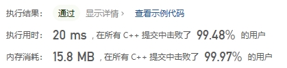

# 打卡4月LeetCode

## 2023.4.1

### 831.隐藏个人信息

#### 题干

太长。

**示例**

```
示例 1：
输入：s = "AB@qq.com"
输出："a*****b@qq.com"
```

```
示例 2：
输入：s = "1(234)567-890"
输出："***-***-7890"
```

#### 解法

基本思路：**模拟？**

这也算算法题。。吗？

#### 代码

```cpp
class Solution {
public:
    string maskPII(string s) {
        if(s[0] >= 'A'){
            int split = s.find('@');
            for(int i = split + 1; i < s.length(); ++i){
                if(s[i] <= 'Z' && s[i] >= 'A')
                    s[i] += 32;
            }
            if(s[0] <= 'Z') s[0] += 32;
            if(s[split - 1] <= 'Z') s[split - 1] += 32;
            s.replace(1, split - 2, "*****");
        }
        else{
            for(string::iterator i = s.begin(); i < s.end(); ++i){
                if(*i < '0')
                    s.erase(i--);
            }
            int len = s.length();
            if(len == 10)
                return "***-***-" + s.substr(6, 4);
            else if(len == 11)
                return "+*-***-***-" + s.substr(7, 4);
            else if(len == 12)
                return "+**-***-***-" + s.substr(8, 4);
            else if(len == 13)
                return "+***-***-***-" + s.substr(9, 4);
        }
        return s;
    }
};
```


### 54.螺旋矩阵、剑指 Offer 29. 顺时针打印矩阵

#### 题干

给你一个 `m` 行 `n` 列的矩阵 `matrix` ，请按照 **顺时针螺旋顺序** ，返回矩阵中的所有元素。

**示例**

```
示例 1：
输入：matrix = [[1,2,3],[4,5,6],[7,8,9]]
输出：[1,2,3,6,9,8,7,4,5]
```

```
示例 2：
输入：matrix = [[1,2,3,4],[5,6,7,8],[9,10,11,12]]
输出：[1,2,3,4,8,12,11,10,9,5,6,7]
```

#### 解法

基本思路：**模拟过程**

相比于 59.螺旋矩阵Ⅱ ，这题的长宽不一定相同，因此不再适用按圈缩减的方法。


1. 维护上、下、左、右四个边界的下标。
2. 第一次移动，从左到右移动一整行，移动后直接将1~4从上图中抹掉，变成了一个 4 x 2 的矩阵。如何抹掉？**维护的上边界加一**即可。因为**循环都是统一从一个边界到另一个边界的**。
3. 第二次移动，从上到下，移动后抹去8、12，相当于**右边界减一**。这样下一次移动中从右到左时从右边界开始就是从11开始的，顺序不会错乱。
4. 第三从右往左，第四次从下往上，四次组成一次大循环。
5. 每当有两个对应边界错位（**左 > 右，上 > 下**）时，就直接结束了。例如当仅剩一行时，上下边界重合，抹去这行时，无论up++还是down--，都会出现错位，以此为结束的判断依据。

思路清晰，逻辑明了。

#### 代码

```cpp
class Solution {
public:
    vector<int> spiralOrder(vector<vector<int>>& matrix) {
        vector<int> res;
        int up = 0, left = 0;
        int down = matrix.size() - 1, right = matrix[0].size() - 1;
        while(1){
            for(int i = left; i <= right; ++i) res.push_back(matrix[up][i]);
            if(++up > down) break;
            for(int i = up; i <= down; ++i) res.push_back(matrix[i][right]);
            if(--right < left) break;
            for(int i = right; i >= left; --i) res.push_back(matrix[down][i]);
            if(--down < up) break;
            for(int i = down; i >= up; --i) res.push_back(matrix[i][left]);
            if(++left > right) break;
        }
        return res;
    }
};
```


### 11.盛最多水的容器

#### 题干

给定一个长度为 **n** 的整数数组 **height** 。有 n 条垂线，第 **i** 条线的两个端点是 **(i, 0)** 和 **(i, height[i])** 。

找出其中的两条线，使得它们与 **x** 轴共同构成的容器可以容纳**最多**的水。返回容器可以储存的**最大水量**。

**示例**

```
示例 1：
输入：[1,8,6,2,5,4,8,3,7]
输出：49 
```

```
示例 2：
输入：height = [1,1]
输出：1
```

#### 解法

基本思路：**双指针**

代码很简单，这题主要在于思路上：为什么双指针按代码所示方法往中间移动时不会漏掉某种情况呢？

容量和两个因素有关：双指针的**距离**、双指针中**短的那个的高度**。

开始双指针在两端，距离是最大的，此时移动指针若想要让容量更大，就必须提高双指针中**短的那个的高度**，也就是把短的指针往中间移动找找有没有更高的位置。这样移动下来就不存在漏掉某种最大的情况了。

#### 代码

```cpp
class Solution {
public:
    int maxArea(vector<int>& height) {
        int n = height.size()， res = 0;
        int l = 0, r = n - 1;
        while(l < r){
            int area = min(height[l], height[r]) * (r - l);
            res = max(res, area);
            if(height[l] < height[r])	l++;
            else	r--;
        }
        return res;
    }
};
```


## 2023.4.3

### 1053.交换一次的先前排列

#### 题干

给你一个正整数数组 **arr**（可能存在重复的元素），请你返回可在 **一次交换**（交换两数字 arr[i] 和 arr[j] 的位置）后得到的、按**字典序**排列**小于** **arr** 的**最大排列**。

如果无法这么操作，就请返回**原数组**。

**示例**

```
示例 1：
输入：arr = [3,2,1]
输出：[3,1,2]
```

```
示例 2：
输入：arr = [1,9,4,6,7]
输出：[1,7,4,6,9]
```

#### 解法

基本思路：**贪心**

对于数组中的两元素下标 i 、j 且 **i < j**，若交换 arr[i] 和 arr[j] 得到的新数组按字典序排列比原数组小，显然有**arr[i] > arr[j]** 。因此符合题意要求的交换会使得数组  arr[i]  在下标 i 处的元素变小。那么为了得到按字典序排列小于原数组的最大新数组，尽可能地保持前面的元素不变是这一步的最优解，即让 **i 最大化**。

也就是说，从右往左遍历，找到的第一个**arr[i] > arr[i + 1]** 处，就是需要被交换的 i 。

显然，找到 i 后，j 需要在 i 右半边去找。在满足 **arr[i] > arr[j]** 的情况下，取**最大**的 **arr[j]** 是这一步的最优解，但需要注意元素可能存在重复的情况需要排除，此时把大的值换到相同数字的最左边，在小于原序列的状态下得到的序列是更大的，因此取**最大的、j 尽量小的 arr[j]** 为最优解。

#### 代码

```cpp
class Solution {
public:
    vector<int> prevPermOpt1(vector<int>& arr) {
        for(int i = arr.size() - 2; i >= 0; --i){
            if(arr[i] > arr[i + 1]){
                for(int j = arr.size() - 1; j > i; --j){
                    if(arr[j] < arr[i] && arr[j] != arr[j - 1]){
                        swap(arr[j], arr[i]);
                        return arr;
                    }
                }
            }
        }
        return arr;
    }
};
```


### 31.下一个排列

#### 题干

整数数组的一个 排列  就是将其所有成员以序列或线性顺序排列。

- 例如，arr = [1,2,3] ，以下这些都可以视作 arr 的排列：[1,2,3]、[1,3,2]、[3,1,2]、[2,3,1] 。

整数数组的 **下一个排列** 是指其整数的下一个字典序更大的排列。更正式地，如果数组的所有排列根据其字典顺序从小到大排列在一个容器中，那么数组的 下一个排列 就是在这个有序容器中排在它后面的那个排列。如果不存在下一个更大的排列，那么这个数组必须重排为字典序**最小**的排列（即其元素按升序排列）。

- 例如，arr = [1,2,3] 的下一个排列是 [1,3,2] 。

- 类似地，arr = [2,3,1] 的下一个排列是 [3,1,2] 。
- 而 arr = [3,2,1] 的下一个排列是 [1,2,3] ，因为 [3,2,1] 不存在一个字典序更大的排列。

给你一个整数数组 **nums** ，找出 **nums** 的下一个排列。必须 **原地** 修改，只允许使用**额外常数**空间。

**示例**

```
示例 1：
输入：nums = [1,2,3]
输出：[1,3,2]
```

```
示例 2：
输入：nums = [3,2,1]
输出：[1,2,3]
```

#### 解法

基本思路：**贪心？、双指针？**

这题和今天的每日一题是相同原理，是找大于原序列的最小字典序。

对于数组中的一部分，若完全的降序排列（不存在 **arr[i] < arr[i+1]** 的情况），则这段子序列是最大的。那么最优解就是从右往左找到第一个 **arr[i] > arr[i+1]** 处，就是从尾部开始的最大子序列长度再加一，i 即是要交换的位置。

显然，找到 i 后，j 需要在 i 右半边去找。在满足 **arr[i] < arr[j]** 的情况下，取**最小的** **arr[j]** 是这一步的最优解，此题不需要考虑元素重复的情况，因为换哪个都一样。

交换完成后，由于 i 增大了，要找大于原序列的最小字典序，右侧的子序列自然是要最小的，**因此升序排列即可**。

若找不到这样的 i ，说明原序列就是最大字典序，直接把整个数组升序排列即可。

#### 代码

```cpp
class Solution {
public:
    void nextPermutation(vector<int>& nums){
        for(int i = nums.size() - 2; i >= 0; --i){
        	if(nums[i] < nums[i+1]){
            	for(int j = nums.size() - 1; j > i; --j){  
            		if(nums[j] > nums[i]){
                		swap(nums[j], nums[i]);
        				sort(nums.begin()+i+1,nums.end());
                		return;
            		}
        		}
    		}
    	}
    	sort(nums.begin(),nums.end());
	}
};
```


## 2023.4.4

### 46.全排列

#### 题干

给定一个不含重复数字的数组 `nums` ，返回其 *所有可能的全排列* 。你可以 **按任意顺序** 返回答案。

**示例**

```
示例 1：
输入：nums = [1,2,3]
输出：[[1,2,3],[1,3,2],[2,1,3],[2,3,1],[3,1,2],[3,2,1]]
```

```
示例 2：
输入：nums = [1]
输出：[[1]]
```

#### 解法

基本思路：**回溯、DFS**

实际就是一个排列组合问题，每一个数字都要放到最前面，而对剩下的数字里同样是每个数字都要被放在最前（第二个）。。以此类推。这就是分布解决问题的过程。

**回溯法**采用的是试错思想：当它通过尝试发现现有的分步答案不能得到有效的正确的解答的时候，它将取消上一步甚至是上几步的计算，再通过其它的可能的分步解答再次尝试寻找问题的答案。这通常是使用递归来实现的。

而本题中不需要判断分步答案是否正确，只需记录所有分布答案即可。

**回溯与动态规划的异同：**

**1.共同点**

- 用于**求解多阶段决策**问题。即：求解一个问题分为很多步骤（阶段）；每一个步骤（阶段）可以有多种选择。

**2.不同点**

- 动态规划只需要求我们评估最优解是多少，最优解对应的具体解是什么并不要求。因此很适合应用于评估一个方案的效果；
- 回溯算法可以搜索得到所有的方案（当然包括最优解），但是本质上它是一种遍历算法，时间复杂度很高。

对于该题，示例1：


深度优先遍历有「回头」的过程，在「回头」以后， 状态变量需要设置成为和先前一样 ，因此在回到上一层结点的过程中，需要**撤销**上一次的选择，这个操作称之为「**状态重置**」

#### 代码

```cpp
class Solution {
public:
    void dfs(vector<vector<int>>& res, vector<int>& nums, int start, int end){
        if(start == end){
            res.push_back(nums);
            return;
        }
        for(int i = start; i < end; ++i){
            swap(nums[start], nums[i]);
            dfs(res, nums, start + 1, end);
            swap(nums[start], nums[i]);
        }
    }
    vector<vector<int>> permute(vector<int>& nums) {
        vector<vector<int>> res;
        dfs(res, nums, 0, nums.size());
        return res;
    }
};
```


## 2023.4.5

### 2427.公因子的数目

#### 解法

基本思路：**暴力**

公因子的最大值就是最大公约数，因此先求最大公约数（库函数 **__gcd** ），再从1开始循环判断。

#### 代码

```cpp
class Solution {
public:
    int commonFactors(int a, int b) {
        int divisor = __gcd(a, b);
        int res = 0;
        for(int i = 1; i <= divisor; ++i)
            if(a % i == 0 && b % i == 0)
                res++;
        return res;
    }
};
```


## 2023.4.6

### 1017.负二进制转换

#### 题干

给你一个整数 `n` ，以二进制字符串的形式返回该整数的 **负二进制（`base -2`）**表示。

**注意，**除非字符串就是 `"0"`，否则返回的字符串中不能含有前导零。

**示例**

```
示例 1：
输入：n = 2
输出："110"
解释：(-2)2 + (-2)1 = 2
```

```
示例 2：
输入：n = 3
输出："111"
解释：(-2)2 + (-2)1 + (-2)0 = 3
```

#### 解法

基本思路：**模拟、数学**

本题主要用到了**十进制转n进制**的方法：**除n取余，逆序排列**。代码模拟了这个过程。

注意：因为填入的结果只有0、1，而余数可能为 -1，可以通过商+1重新计算余数，不影响结果。

#### 代码

```cpp
class Solution {
public:
    string baseNeg2(int n) {
        if(n == 0)  
            return "0";
        string res = "";
        while(n){
            int quotient = n / -2;
            int remainder = n - quotient * -2;
            if(remainder < 0)
                remainder = n - ++quotient * -2;
            res += to_string(remainder);
            n = quotient;    
        }
        return string(res.rbegin(), res.rend());
    }
};
```


### 47.全排列Ⅱ

#### 题干

给定一个可包含重复数字的序列 `nums` ，***按任意顺序*** 返回所有不重复的全排列。

**示例**

```
示例 1：
输入：nums = [1,1,2]
输出：[[1,1,2],[1,2,1],[2,1,1]]
```

```
示例 2：
输入：nums = [1,2,3]
输出：[[1,2,3],[1,3,2],[2,1,3],[2,3,1],[3,1,2],[3,2,1]]
```

#### 解法

基本思路：**回溯、DFS**

相比于46.全排列，这题在输入数组中存在重复数字，这意味着按照之前的方法会导致重复数字被使用导致排列相同的情况。因此需要判断和剪枝。

首先，要先找到重复数字是哪些，最方便的方法就是先对原数组进行**排序**，那么是否重复只需和上一个数字比较即可。

其次，因为排序，不能直接在原数组上操作了，需要新开一个数组存储每次排列的结果，通过**push**和**pop**来实现**状态重置**。

接着，就需要找到要被剪枝的部分的**判断条件**——

以本题的示例1来说：


可以发现，对于一个重复数字，如果它的上一个相同数字已经被使用了（添加进了数组中），那么该数字是不影响接下来的使用的，因为是添加到上一个数字后面的。而对于未被使用（不在结果数组中）的相同数字，就会导致结果重复。1、1、2中选1和选1，剩下的都是1、2，那么结果也都是一样的，因此可以得到跳过的条件：

**遍历到的数字和上一个相同（重复了）且上一个数字未被使用。**使用一个数组进行记录使用情况，在递归前后改变状态完成状态重置。

注意：

1. i - 1 越界问题，要加上 i > 0;
2. 由于原数组被排序了，也无法得知上一个被push进数组的是哪个，因此for循环需要全部遍历一遍，对于已经被push的（状态数组为true，直接跳过即可）。
3. idx用于统计结果数组中已push的数字数量，满了就存储一个结果并开始状态重置。

#### 代码

```cpp
class Solution {
public:
    void dfs(vector<vector<int>>& res, vector<int>& sub, vector<bool>& used, vector<int>& nums, int idx){
        if(idx == nums.size()){
            res.push_back(sub);
            return;
        }
        for(int i = 0; i < nums.size(); ++i){
            if(used[i] || i > 0 && nums[i] == nums[i-1] && !used[i-1])
                continue;
            sub.push_back(nums[i]);
            used[i] = true;
            dfs(res, sub, used, nums, idx + 1);
            used[i] = false;
            sub.pop_back();
        }
    }
    vector<vector<int>> permuteUnique(vector<int>& nums) {
        vector<vector<int>> res;
        vector<int> sub;
        vector<bool> used(nums.size());
        sort(nums.begin(), nums.end());
        dfs(res, sub, used, nums, 0);
        return res;
    }
};
```


### 56.合并区间

#### 题干

以数组 **intervals** 表示若干个区间的集合，其中单个区间为 intervals[i] = [starti, endi] 。请你**合并所有重叠的区间**，并返回 **一个不重叠的区间数组**，该数组需恰好**覆盖**输入中的**所有区间** 。

**示例**

```
示例 1：
输入：intervals = [[1,3],[2,6],[8,10],[15,18]]
输出：[[1,6],[8,10],[15,18]]
```

```
示例 2：
输入：intervals = [[1,4],[0,4]]
输出：[[0,4]]
```

#### 解法

基本思路：**双指针？**

先对二维数组排序，sort默认按第一列升序排，不需要自定义比较函数（自定义的比较函数会让排序慢上很多，其中**单写函数比lambda函数要快一些**）。排完序后需要合并的区间必然是**连续**的。

双指针（这里用了一个大小为2的vector便于存储），只需要判断**左区间和上一个的右区间**即可。

- 左区间大，不用合并，则直接将当前区间加入结果，双指针替换为当前区间的左右边界；
- 左区间小，再判断**右区间和上一个的右区间**，只有当前右区间更大的时候需要替换右边界的值。

结束循环后，若最后一个区间需要合并，则值已经更新在双指针sub中；若不需要合并，则sub也已经替换为了该区间。仅需将sub再加入结果中即可。

#### 代码

```cpp
class Solution {
public:
    vector<vector<int>> merge(vector<vector<int>>& intervals) {
        sort(intervals.begin(), intervals.end());
        vector<vector<int>> res;
        vector<int> sub = intervals[0];
        for(int i = 1; i < intervals.size(); ++i){
            if(intervals[i][0] <= sub[1]){
                if(intervals[i][1] > sub[1])
                    sub[1] = intervals[i][1];
            }
            else{
                res.push_back(sub);
                sub = intervals[i];
            }
        }
        res.push_back(sub);
        return res;56
    }
};
```


### 57.插入区间

#### 题干

给你一个 **无重叠的** *，*按照区间起始端点排序的区间列表。

在列表中插入一个新的区间，你需要确保列表中的区间仍然有序且不重叠（如果有必要的话，可以合并区间）。

**示例**

```
示例 1：
输入：intervals = [[1,3],[6,9]], newInterval = [2,5]
输出：[[1,5],[6,9]]
```

```
示例 2：
输入：intervals = [[1,2],[3,5],[6,7],[8,10],[12,16]], newInterval = [4,8]
输出：[[1,2],[3,10],[12,16]]
```

#### 解法

基本思路：**模拟**

遍历一遍，每个元素判断以下三种状态：

1. 完全在插入区间左边，直接push
2. 与插入区间有重叠，求他们的并集，更新插入区间的左右边界。
3. 完全在插入区间右侧，需要判断插入区间是否push了，没push就push一下，然后push本次元素。

如果遍历完都没有push过，那么最后push插入区间。

#### 代码

```cpp
class Solution {
public:
    vector<vector<int>> insert(vector<vector<int>>& intervals, vector<int>& newInterval) {
        bool merged = false;
        vector<vector<int>> res;
        for (auto& range: intervals) {
            if (range[1] < newInterval[0])
                res.push_back(range);
            else if (range[0] > newInterval[1]) {
                if (!merged) {
                    res.push_back(newInterval);
                    merged = true;                    
                }
                res.push_back(range);
            }
            else {
                newInterval[0] = min(newInterval[0], range[0]);
                newInterval[1] = max(newInterval[1], range[1]);
            }
        }
        if (!merged) {
            res.push_back(newInterval);
        }
        return res;
    }
};
```


### 73.矩阵置0

#### 题干

给定一个 `m x n` 的矩阵，如果一个元素为 **0** ，则将其所在行和列的所有元素都设为 **0** 。请使用 **原地** 算法**。**

你能想出一个仅使用**常量空间**的解决方案吗？

**示例**

```
示例 1：
输入：matrix = [[1,1,1],[1,0,1],[1,1,1]]
输出：[[1,0,1],[0,0,0],[1,0,1]]
```

```
示例 2：
输入：matrix = [[0,1,2,0],[3,4,5,2],[1,3,1,5]]
输出：[[0,0,0,0],[0,4,5,0],[0,3,1,0]]
```

#### 解法

基本思路：**模拟**

仅用常数空间，那只能利用原数组进行操作，也就是挑一行和一列记录该行/列是否有0。于是问题转化为了如何记录这一行一列本身是否有0？

思考过程中发现，第一行是最先遍历的话，就能先知道这一行是否有0，那么这一行的值就不重要了，可以用来存储。那么对于列来说，如果是行内遍历列的话（for循环行在外面），只需要维护一个标志位，每次行内遍历时先判断的是第一列，如果是0，标志位置位，就知道了第一列是否有0。这样第一列的值也不重要了（判断过了），也可以用来存储了。

最后按照第一行和第一列的记录情况把对应行列置0。注意跟上述过程相反，为了将记录信息保存到最后，从右下角开始遍历，先向左（到第一列时，这个位置的记录就不需要了。**根据标志位对第一列单独置0**）再向上。

#### 代码

```cpp
class Solution {
public:
    void setZeroes(vector<vector<int>>& matrix) {
        bool col0 = false;
        int row = matrix.size();
        int col = matrix[0].size();
        for(int i = 0; i < row; ++i){
            if(matrix[i][0] == 0)   col0 = true;
            for(int j = 1; j < col; ++j){
                if(matrix[i][j] == 0){
                    matrix[i][0] = 0;
                    matrix[0][j] = 0;
                }
            }
        }
        for(int i = row - 1; i >= 0; --i){
            for(int j = col - 1; j >= 1; --j)
                if(matrix[i][0] == 0 || matrix[0][j] == 0)
                    matrix[i][j] = 0;
            if(col0)   matrix[i][0] = 0;
        }
    }
};
```


## 2023.4.8

### 203.移除链表元素

#### 解法

基本思路：**链表的删除**

注意：

- 创建的链表指针temp是**new**的，需要用**delete**手动释放；而tmp指向的是要删除的链表元素，因此也需要**delete**。
- cur指针不是**new**或**malloc**分配了空间的，系统会自动释放内存。
- **free**是C的API，适用于malloc和calloc；**delete**是C++的关键字，主要用于释放new分配的内存，也可用于malloc和calloc。

#### 代码

```cpp
class Solution {
public:
    ListNode* removeElements(ListNode* head, int val) {
        ListNode* temp = new ListNode(0, head);
        ListNode* cur = temp;
        while(cur->next){
            if(cur->next->val == val){
                ListNode* tmp = cur->next;
                cur->next = cur->next->next;
                delete tmp;
            }
            else
                cur = cur->next;
        }
        head = temp->next;
        delete temp;
        return head;
    }
};
```


### 707.设计链表

#### 题干

你可以选择使用单链表或者双链表，设计并实现自己的链表。

单链表中的节点应该具备两个属性：val 和 next 。val 是当前节点的值，next 是指向下一个节点的指针/引用。

如果是双向链表，则还需要属性 prev 以指示链表中的上一个节点。假设链表中的所有节点下标从 0 开始。

实现 **MyLinkedList** 类：

- **MyLinkedList()** 初始化 MyLinkedList 对象。
- int **get**(int index) 获取链表中下标为 index 的节点的值。如果下标无效，则返回 -1 。
- void **addAtHead**(int val) 将一个值为 val 的节点插入到链表中第一个元素之前。在插入完成后，新节点会成为链表的第一个节点。
- void **addAtTail**(int val) 将一个值为 val 的节点追加到链表中作为链表的最后一个元素。
- void **addAtIndex**(int index, int val) 将一个值为 val 的节点插入到链表中下标为 index 的节点之前。如果 index 等于链表的长度，那么该节点会被追加到链表的末尾。如果 index 比长度更大，该节点将 不会插入 到链表中。
- void **deleteAtIndex**(int index) 如果下标有效，则删除链表中下标为 index 的节点。

**示例**

```
示例 1：
输入：
["MyLinkedList", "addAtHead", "addAtTail", "addAtIndex", "get", "deleteAtIndex", "get"]
[[], [1], [3], [1, 2], [1], [1], [1]]
输出：[null, null, null, null, 2, null, 3]
```

#### 解法

基本思路：**链表的增删查**

#### 代码

```cpp
class MyLinkedList {
public:
    MyLinkedList() {
        dummy = new ListNode(0);
        length = 0;
    }
    int get(int index) {
        if(index >= length || index < 0)
            return -1;
        ListNode* cur = dummy->next;
        while(index--)
            cur = cur->next;
        return cur->val;
    }
    void addAtHead(int val) {
        ListNode* newNode = new ListNode(val);
        newNode->next = dummy->next;
        dummy->next = newNode;
        length++;
    }
    void addAtTail(int val) {
        ListNode* newNode = new ListNode(val);
        ListNode* cur = dummy;
        while(cur->next)
            cur = cur->next;
        cur->next = newNode;
        length++;
    }
    void addAtIndex(int index, int val) {
        if(index > length || index < 0)
            return;
        ListNode* newNode = new ListNode(val);
        ListNode* cur = dummy;
        while(index--)
            cur = cur->next;
        newNode->next = cur->next;
        cur->next = newNode;
        length++;
    }
    void deleteAtIndex(int index) {
        if(index >= length || index < 0)
            return;
        ListNode* cur = dummy;
        while(index--)
            cur = cur->next;
        ListNode* tmp = cur->next;
        cur->next = cur->next->next;
        delete tmp;
        length--;
    }
private:
    ListNode* dummy;
    int length;
};
```


### 206.反转链表

#### 解法

基本思路：**双指针**


#### 代码

```cpp
class Solution {
public:
    ListNode* reverseList(ListNode* head) {
        ListNode* tmp;
        ListNode* slow = nullptr;
        ListNode* fast = head;
        while(fast){
            tmp = fast->next;
            fast->next = slow;
            slow = fast;
            fast = tmp;
        }
        return slow;
    }
};
```

#### 优化

基本思路：**虚拟头节点、头插法**

建立一个新链表的虚拟头节点，指向nullptr。遍历原链表元素，依次插入到虚拟节点后。

速度比双指针快一些。

```cpp
class Solution {
public:
    ListNode* reverseList(ListNode* head) {
        ListNode* dummy = new ListNode(0);
        ListNode* cur = head;
        while(cur){
            ListNode* tmp = cur->next;
            cur->next = dummy->next;
            dummy->next = cur;
            cur = tmp;
        }
        cur = dummy->next;
        delete dummy;
        return cur;
    }
};
```


### 24.两两交换链表中的节点

#### 题干

给你一个链表，两两交换其中相邻的节点，并返回交换后链表的头节点。你必须在不修改节点内部的值的情况下完成本题（即，只能进行节点交换）。

**示例**

```
示例 1：
输入：head = [1,2,3,4]
输出：[2,1,4,3]
```

```
示例 2：
输入：head = [1]
输出：[1]
```

#### 解法

基本思路：**模拟**

#### 代码

```cpp
class Solution {
public:
    ListNode* swapPairs(ListNode* head) {
        ListNode* dummy = new ListNode(0, head);
        ListNode* cur = dummy;
        while(cur->next != nullptr && cur->next->next != nullptr){
            ListNode* tmp = cur->next;
            ListNode* tmp2 = cur->next->next->next;
            cur->next = cur->next->next;
            cur->next->next = tmp;
            cur->next->next->next = tmp2;
            cur = cur->next->next;
        }
        cur = dummy->next;
        delete dummy;
        return cur;
    }
};
```


## 2023.4.9

### 2399.检查相同字母间的距离

#### 解法

基本思路：**哈希表**

遍历，如果这个字符是第一次扫到（用**哈希表**存储判断），就判断与**该下标+对应distance+1处**的字符（**注意越界**）是否相同，任何一次不同就返回false。

#### 代码

```cpp
class Solution {
public:
    bool checkDistances(string s, vector<int>& distance) {
        unordered_set<char> hash;
        for(int i = 0; i < s.length(); ++i){
            if(!hash.count(s[i])){
                hash.emplace(s[i]);
                int idx = i + distance[s[i] - 'a'] + 1;
                if(idx >= s.length())
                    return false;
                if(s[i] != s[idx])
                    return false;
            }
        }
        return true;
    }
};
```


### 24.两两交换链表中的节点

#### 题干

给你一个链表，删除链表的倒数第 `n` 个结点，并且返回链表的头结点。

**示例**

```
示例 1：
输入：head = [1,2], n = 1
输出：[1]
```

```
示例 2：
输入：head = [1], n = 1
输出：[]
```

```
示例 3：
输入：head = [1,2,3,4,5], n = 2
输出：[1,2,3,5]
```

#### 解法

基本思路：**双指针、链表删除**

双指针的间距为 **n - 1**。当快指针到末尾元素时，慢指针的下一个元素就是要删的元素。

注意**删除的是末尾元素**和链表**只有一个元素**的情况。

#### 代码

```cpp
class Solution {
public:
    ListNode* removeNthFromEnd(ListNode* head, int n) {
        ListNode* slow = head;
        ListNode* fast = head;
        while(n--)
            fast = fast->next;
        if(fast != nullptr){
            while(fast->next != nullptr){
                fast = fast->next;
                slow = slow->next;
            }
            if(slow->next == fast)
                slow->next = nullptr;
            else{
                ListNode* tmp = slow->next;
                slow->next = slow->next->next;
                delete tmp;
            }
        }
        else
            head = head->next;
        return head;
    }
};
```


## 2023.4.10

### 1019.链表中的下一个更大节点

#### 题干

给定一个长度为 **n** 的链表 **head**，对于列表中的每个节点，查找下一个 **更大节点** 的值。也就是说，对于每个节点，找到它旁边的第一个节点的值，这个节点的值 **严格大于** 它的值。

返回一个整数数组 **answer** ，其中 **answer[i]** 是第 i 个节点( 从1开始 )的下一个**更大的节点的值**。如果第 i 个节点没有下一个更大的节点，设置 **answer[i] = 0** 。

**示例**

```
示例 1：
输入：head = [2,1,5]
输出：[5,5,0]
```

```
示例 2：
输入：head = [2,1,5]
输出：[5,5,0]
```

#### 解法

基本思路：**单调栈**

维护一个底大顶小的单调栈。假设前几个元素为9、7、5、3，此时没有任意一个更大的元素时，则把每个元素都压入栈。这时出现一个6，发现比栈顶的3大，那么把3出栈，更新该处的值为6。再跟栈顶的5比，还大，就继续出栈，更新。直至跟7比小了，就结束；然后把6入栈，记录该处的值为本身6。

也就是说，入栈的元素栈底的必然比上面的大，而每次来一个较大元素，都把所有比他小的元素出栈，一直遍历到链表结束。此时栈中若还有元素，说明整个链表他们右边没有更大的了，那么值就是0，依次出栈记录0即可。

用栈维护下标，值存储在数组中。

#### 代码

```cpp
class Solution {
public:
    vector<int> nextLargerNodes(ListNode* head) {
        vector<int> res;
        stack<int> bigger;
        for(ListNode* cur = head; cur; cur = cur->next){
            while(!bigger.empty() && res[bigger.top()] < cur->val){
                res[bigger.top()] = cur->val;
                bigger.pop();
            }
            bigger.emplace(res.size());
            res.push_back(cur->val);
        }
        while(!bigger.empty()){
            res[bigger.top()] = 0;
            bigger.pop();
        }
        return res;
    }
};
```


### 面试题 02.07.链表相交

#### 题干

给你两个单链表的头节点 headA 和 headB ，请你找出并返回两个单链表相交的起始节点。如果两个链表没有交点，返回 null 。

图示两个链表在节点 c1 开始相交：


题目数据 **保证** 整个链式结构中不存在环。

**注意**，函数返回结果后，链表必须 **保持其原始结构** 。

**示例**

```
示例 1：
输入：intersectVal = 8, listA = [4,1,8,4,5], listB = [5,0,1,8,4,5], skipA = 2, skipB = 3
输出：Intersected at '8'
```

```
示例 2：
输入：intersectVal = 0, listA = [2,6,4], listB = [1,5], skipA = 3, skipB = 2
输出：null
```

#### 解法

基本思路：**双指针	**

因为两个链表后半部分相同，因此只要将其末尾对齐，找有无公共节点即可。

#### 代码

```cpp
class Solution {
public:
    ListNode *getIntersectionNode(ListNode *headA, ListNode *headB) {
        ListNode* a = headA;
        ListNode* b = headB;
        int aLen = 0, bLen = 0;
        while(a){
            a = a->next;
            aLen++;
        }
        while(b){
            b = b->next;
            bLen++;
        }
        a = headA;
        b = headB;
        if(bLen > aLen){
            swap(a, b);
            swap(aLen, bLen);
        }
        int sub = aLen - bLen;
        while(sub--)
            a = a->next;
        while(a){
            if(a == b)
                return a;
            a = a->next;
            b = b->next;
        }
        return NULL;
    }
};
```

#### 优化

**天才解法**

设链表a长度为a，b长度为b，公共部分长度为c。可知a到公共节点前长度为a - c，b为 b - c。

双指针A、B指向a、b头部，A遍历完a后遍历b，B遍历完b后遍历a，当走到公共节点时，两者所走步数分别为a + b - c 和 b + a - c。

此时指针A、B重合，**a + (b - c) = b + (a - c)** 必然成立，会有两种情况：

- 有公共尾部，c ≠ 0，那么双指针肯定指向同一个节点，返回；
- 无公共尾部，c = 0，那么双指针都指向末尾NULL，也返回。

**真牛吧！**

```cpp
class Solution {
public:
    ListNode *getIntersectionNode(ListNode *headA, ListNode *headB) {
        ListNode *A = headA, *B = headB;
        while (A != B) {
            A = A != nullptr ? A->next : headB;
            B = B != nullptr ? B->next : headA;
        }
        return A;
    }
};
```


### 142.环形链表 Ⅱ

#### 题干

给定一个链表的头节点  **head** ，返回链表开始入环的第一个节点。 如果链表无环，则返回 **null**。

如果链表中有某个节点，可以通过连续跟踪 next 指针再次到达，则链表中存在环。 为了表示给定链表中的环，评测系统内部使用整数 pos 来表示链表尾连接到链表中的位置（索引从 0 开始）。如果 pos 是 -1，则在该链表中没有环。注意：pos 不作为参数进行传递，仅仅是为了标识链表的实际情况。

不允许**修改** 链表。

**示例**

```
示例 1：
输入：head = [3,2,0,-4], pos = 1
输出：返回索引为 1 的链表节点
```

```
示例 2：
输入：head = [1,2], pos = -1
输出：返回NULL
```

#### 解法

基本思路：**双指针**

第一步：**快慢指针，统计环长**

slow步长为1，fast步长为2。当第一次相遇时开始维护变量len，当第二次相遇时，len即为环长（由于双指针的速度差为1，当slow走完一圈时fast正好走完两圈相遇在同一位置，也就是slow动的次数即为环长）。

注意：fast步长为2，循环时要考虑到fast**后两个节点**是否为NULL的情况。以及循环结束时根据**len值**判断有无环。

第二步：**前后指针，找到进入环的节点**

slow与fast步长均为1，fast先走len步。于是当slow到达环入口节点时，fast多走了一个环长也到了入口处，两者相遇处即为答案。

#### 代码

```cpp
class Solution {
public:
    ListNode *detectCycle(ListNode *head) {
        ListNode* slow = head;
        ListNode* fast = head;
        int len = 0;
        int count = 0;
        while(fast && fast->next && fast->next->next){
            slow = slow->next;
            fast = fast->next->next;
            if(count)   len++;   
            if(slow == fast){
                if(count)   break;   
                count++;
            }
        }
        if(len == 0)
            return NULL;
        slow = head;
        fast = head;
        while(len--)
            fast = fast->next;
        while(slow != fast){
            fast = fast->next;
            slow = slow->next;
        }
        return slow;
    }
};
```


### 287.寻找重复数

#### 题干

给定一个包含 **n + 1** 个整数的数组 **nums** ，其数字都在 **[1, n]** 范围内（包括 1 和 n），可知至少存在一个重复的整数。

假设 **nums** 只有 **一个重复**的整数 ，返回 **这个重复的数** 。

你设计的解决方案必须 **不修改** 数组 **nums** 且只用常量级 **O(1)** 的额外空间。

**示例**

```
示例 1：
输入：nums = [1,3,4,2,2]
输出：2
```

```
示例 2：
输入：nums = [3,1,3,4,2]
输出：3
```

#### 解法

基本思路：**双指针**

思路同上题 142.环形链表 Ⅱ 。

居然把数组当成一个特殊链表来看，只有一个重复数就像只有一个环的入口。同时n+1的长度，元素在 [1，n] 范围内不存在越界问题。

#### 代码

```cpp
class Solution {
public:
    int findDuplicate(vector<int>& nums) {
        int slow = 0, fast = 0;
        int len = 0, count = 0;
        while(count != 2){
            if(count)   len++;
            if(nums[slow] == nums[fast])    count++;
            slow = nums[slow];
            fast = nums[nums[fast]];
        }
        slow = fast = 0;
        while(len--)
            fast = nums[fast];
        while(nums[slow] != nums[fast]){
            slow = nums[slow];
            fast = nums[fast];
        }
        return nums[slow];
    }
};
```


## 2023.4.11

### 1041.困于环中的机器人

#### 题干

在无限的平面上，机器人最初位于 **(0, 0)** 处，面朝**北方**。注意:

- 北方向 是y轴的正方向。

- 南方向 是y轴的负方向。
- 东方向 是x轴的正方向。
- 西方向 是x轴的负方向。

机器人可以接受下列三条指令之一：

- "G"：直走 1 个单位

- "L"：左转 90 度
- "R"：右转 90 度

机器人按顺序执行指令 **instructions**，并一直重复它们。只有在平面中存在环使得机器人永远无法离开时，返回 **true**。否则，返回 **false。**

**示例**

```
示例 1：
输入：instructions = "GGLLGG"
输出：true
```

```
示例 2：
输入：instructions = "GL"
输出：true
```

#### 解法

基本思路：**模拟**

主要就是判断走完后的状态。若回到原点了，那一定是环。

若没能回到原点，分四个方向：

- 朝北，说明回不去了，因为相当于一直在朝一个方向移动。
- 朝南，则下一次相当于原路返回原点，是环。
- 朝西、朝东，都是相当于每次移动相同形状的轨迹，转90°，也是环。

因此返回false的条件必须是**结束时不在原点且朝向北**。

#### 代码

```cpp
class Solution {
public:
    bool isRobotBounded(string instructions) {
        int x = 0, y = 0, direct = 0;
        vector<vector<int>> step = {{0, 1}, {1, 0}, {0, -1}, {-1, 0}};
        for(char c : instructions){
            if(c == 'G'){
                x += step[direct][0];
                y += step[direct][1];
            }
            else if(c == 'L'){
                direct += 3;
                direct %= 4;
            }
            else{
                direct++;
                direct %= 4;
            }
        }
        return !(direct == 0 && (x || y));
    }
};
```


## 2023.4.12

### 1147.段式回文

#### 题干

你会得到一个字符串 text 。你应该把它分成 **k** 个子字符串 (subtext1, subtext2，…， subtextk) ，要求满足:

subtexti 是 **非空** 字符串，所有子字符串的连接等于 text ( 即subtext1 + subtext2 + ... + subtextk == text )。对于所有 **i** 的**有效**值( 即 1 <= i <= k ) ，subtext**i** == subtext**k - i + 1** 均成立

返回k可能**最大值**。

**示例**

```
示例 1：
输入：text = "ghiabcdefhelloadamhelloabcdefghi"
输出：7
```

```
示例 2：
输入：text = "merchant"
输出：1
```

#### 解法

基本思路：**双指针**

双指针指向字符串头尾，用于锁定为判断字符串的范围。

因为要求最大值，因此字串长度要尽可能小。子串长度k从1开始（注意头串的尾部下标 < 尾串的头部下标），有相同的子串直接记录+2，双指针向中间移动k。

缩小判断范围后重复上述过程。如果k平分了整个字符串都没有找到，那就返回整个串作为子串，记录只能+1，并直接结束。

#### 代码

```cpp
class Solution {
public:
    int longestDecomposition(string text) {
        auto checkSame = [&](int i, int j, int k){
            while(k--)
                if(text[i++] != text[j++])
                    return false;
            return true;
        };
        int res = 0;
        for(int i = 0, j = text.length() - 1; i <= j;){
            bool flag = false;
            for(int k = 1; i + k - 1 < j - k + 1; ++k){
                if(checkSame(i, j - k + 1, k)){
                    res += 2;
                    i += k;
                    j -= k;
                    flag = true;
                    break;
                }
            }
            if(!flag){
                res++;
                break;
            }
        }
        return res;
    }
};
```

#### 匿名函数

**Lambda函数主体：**`[capture list] (params list) mutable exception-> return type { function body }`

| 捕获形式    | 说明                                                         |
| :---------- | ------------------------------------------------------------ |
| []          | 不捕获任何外部变量                                           |
| [变量名, …] | 默认以值得形式捕获指定的多个外部变量（用逗号分隔），如果引用捕获，需要显示声明（使用&说明符） |
| [this]      | 以值的形式捕获this指针                                       |
| [=]         | 以值的形式捕获所有外部变量                                   |
| [&]         | 以引用形式捕获所有外部变量                                   |
| [=, &x]     | 变量x以引用形式捕获，其余变量以传值形式捕获                  |
| [&, x]      | 变量x以值的形式捕获，其余变量以引用形式捕获                  |

- 若要**在匿名函数内**修改值引用的外部变量，可以在括号后使用 mutable 关键字（[a] () **mutable** { cout << ++a; }; 这里a在这个函数内部自加了，但是外部的a的值是**不变的**）。
- return type若不指定，编译器会根据内部返回值的类型确定该匿名函数的返回值类型。

## 2023.4.13

### 2404.出现最频繁的偶数元素

#### 题干

给你一个整数数组 `nums` ，返回出现最频繁的偶数元素。

如果存在多个满足条件的元素，只需要返回 **最小** 的一个。如果不存在这样的元素，返回 `-1` 。

**示例**

```
示例 1：
输入：nums = [0,1,2,2,4,4,1]
输出：2
```

```
示例 2：
输入：nums = [29,47,21,41,13,37,25,7]
输出：-1
```

#### 解法

基本思路：**哈希表**

用哈希表统计每个偶数元素出现的次数，然后遍历哈希表找到次数最多的元素中值最小的。

#### 代码

```cpp
class Solution {
public:
    int mostFrequentEven(vector<int>& nums) {
        unordered_map<int, int>  cnt;
        for(int n : nums){
            if(n % 2 == 0)
                cnt[n]++;
        }
        if(cnt.empty())
            return -1;
        int maxNum = 0, minVal = INT_MAX;
        for(auto c : cnt){
            if(c.second > maxNum || c.second == maxNum && c.first < minVal){
                maxNum = c.second;
                minVal = c.first;
            }   
        }
        return minVal;
    }
};
```


## 2023.4.14

### 1023.驼峰式匹配

#### 题干

如果我们可以将**小写字母**插入模式串 **pattern** 得到待查询项 query，那么待查询项与给定模式串匹配。（我们可以在**任何位置**插入每个字符，也可以插入 **0** 个字符。）

给定待查询列表 **queries**，和模式串 **pattern**，返回由布尔值组成的答案列表 answer。只有在待查项 queries[i] 与模式串 pattern 匹配时， answer[i] 才为 true，否则为 false。

**示例**

```
示例 1：
输入：queries = ["FooBar","FooBarTest","FootBall","FrameBuffer","ForceFeedBack"], pattern = "FB"
输出：[true,false,true,true,false]
```

```
示例 2：
输入：queries = ["FooBar","FooBarTest","FootBall","FrameBuffer","ForceFeedBack"], pattern = "FoBaT"
输出：[false,true,false,false,false]
```

#### 解法

基本思路：**双指针**

本质其实是字符串比较。规则是：**大写字符必须全部匹配**。

双指针i、j指向query和pattern，以pattern为循环体，字符比较

- 若不同
- ——小写字符，i++继续比较；
- ——大写字符直接false，不能有匹配不上的大写字符；
- 若相同
- ——i++、j++。

如果j没结束时i就遍历完了，说明 j 有没匹配到的，false。

如果j先遍历完了，遍历剩下的i，若有大写的false，全小写true。

#### 代码

```cpp
class Solution {
public:
    vector<bool> camelMatch(vector<string>& queries, string pattern) {
        vector<bool> res;
        auto check = [](string s, string t){
            int i = 0, j = 0;
            for(; j < t.length(); ++i, ++j){
                while(i < s.length() && s[i] != t[j] && s[i] > 96)
                    ++i;
                if(i == s.length() || s[i] != t[j])
                    return false;
            }
            while(i < s.length() && s[i] > 96)
                ++i;
            return i == s.length();
        };
        for(auto str : queries)
            res.push_back(check(str, pattern));
        return res;
    }
};
```


## 2023.4.17

### 2409.统计共同度过的日子数

#### 解法

基本思路：**模拟、数学计算**

简单的日期转换，转换为当年的第多少天，然后求交集。

#### 代码

```cpp
class Solution {
public:
    int getDays(string s){
        int days[13] = {0, 31, 28, 31, 30, 31, 30, 31, 31, 30, 31, 30, 31};
        int res = 0;
        int m = atoi(s.substr(0, 2).c_str());
        int d = atoi(s.substr(3, 2).c_str());
        for(int i = 1; i < m; ++i)
            res += days[i];
        return res + d;
    }
    int countDaysTogether(string arriveAlice, string leaveAlice, string arriveBob, string leaveBob) {
        int aa = getDays(arriveAlice);
        int la = getDays(leaveAlice);
        int ab = getDays(arriveBob);
        int lb = getDays(leaveBob);
        if(aa > lb || ab > la)
            return 0;
        return min(la, lb) - max(aa, ab) + 1;
    }
};
```


### 242.有效的字母异位词

#### 解法

基本思路：**哈希表**

#### 代码

```cpp
class Solution {
public:
    bool isAnagram(string s, string t) {
        if(s.length() != t.length())
            return false;
        vector<int> hash(26, 0);
        for(int i = 0; i < s.length(); ++i){
            hash[s[i] - 'a']++;
            hash[t[i] - 'a']--;
        }
        for(int n : hash)
            if(n)   return false;
        return true;
    }
};
```


### 383.赎金信

#### 解法

基本思路：**哈希表**

和上题242.有效的字母异位词一个思路。

#### 代码

```cpp
class Solution {
public:
    bool canConstruct(string ransomNote, string magazine) {
        vector<int> hash(26, 0);
        for(char c : magazine)
            hash[c - 'a']++;
        for(char c : ransomNote)
            hash[c - 'a']--;
        for(int n : hash)
            if(n < 0)   return false;
        return true;
    }
};
```


### 49.字母异位词分组

#### 题干

给你一个字符串数组，请你将 **字母异位词** 组合在一起。可以按**任意顺序**返回结果列表。

**字母异位词** 是由**重新排列**源单词的字母得到的一个新单词，所有源单词中的字母通常恰好只用**一次**。

**示例**

```
示例 1：
输入: strs = ["eat", "tea", "tan", "ate", "nat", "bat"]
输出: [["bat"],["nat","tan"],["ate","eat","tea"]]
```

```
示例 2：
输入: strs = [""]
输出: [[""]]
```

#### 解法

基本思路：**哈希**

因为所有的异位词在排序后都是相同的，那么就可以用哈希表存储vector保存属于同一种类的字符串。

#### 代码

```cpp
class Solution {
public:
    vector<vector<string>> groupAnagrams(vector<string>& strs) {
        vector<vector<string>> res;
        unordered_map<string, vector<string>> hash;
        auto sortStr = [](string str){
            sort(str.begin(), str.end());
            return str;
        };
        for(string s : strs)
            hash[sortStr(s)].push_back(s);
        for(auto m : hash)
            res.push_back(m.second);
        return res;
    }
};
```


### 438.找到字符串中所有字母异位词

#### 题干

给定两个字符串 s 和 p，找到 s 中所有 p 的 **异位词** 的子串，返回这些子串的起始索引。不考虑答案输出的**顺序**。

异位词 指由相同字母重排列形成的字符串（包括相同的字符串）。

**示例**

```
示例 1：
输入: s = "cbaebabacd", p = "abc"
输出: [0,6]
```

```
示例 2：
输入: s = "abab", p = "ab"
输出: [0,1,2]
```

#### 解法

基本思路：**滑动窗口、双指针、哈希**

第一想法是滑动窗口扫一遍，每次将窗口内字符排序后与排序后的p比较。实际是暴力解法，O(n^2)复杂度，其中有很多不必要的操作：

例如[i, j]和[i+1, j+1]两个子串在暴力法第二步中，需要各遍历一次，完全没必要。其实[i+1, j+1]完全可以在[i, j]的基础上做判断，也就是去掉头部的字符（i位置），加上尾部的字符（j+1位置）。这样第一步的复杂度可以降到O(1)，整体复杂度降到O(n)。

#### 代码

```cpp
class Solution {
public:
    vector<int> findAnagrams(string s, string p) {
        if(s.length() < p.length())
            return {};
        vector<int> res;
        vector<int> shash(26, 0);
        vector<int> phash(26, 0);
        for(char c : p)
            phash[c - 'a']++;
        for(int i = 0; i < p.length(); ++i)
            shash[s[i] - 'a']++;
        int i = p.length(), j = 0;
        for(; i < s.length(); ++i, ++j){
            if(shash == phash)
                res.push_back(j);
            shash[s[i] - 'a']++;
            shash[s[j] - 'a']--;
        }
        if(shash == phash)
            res.push_back(j);
        return res;
    }
};
```


## 2023.4.22

### 349.两个数组的交集

#### 解法

基本思路：**哈希表**

#### 代码

```cpp
class Solution {
public:
    vector<int> intersection(vector<int>& nums1, vector<int>& nums2) {
        unordered_set<int> hash;
        vector<int> res;
        for(int n : nums1)
            if(!hash.count(n))
                hash.emplace(n);
        for(int n : nums2){
            if(hash.count(n)){
                res.push_back(n);
                hash.erase(n);
            }
        }
        return res;
    }
};
```


### 350.两个数组的交集Ⅱ

#### 解法

基本思路：**哈希表**

#### 代码

```cpp
class Solution {
public:
    vector<int> intersect(vector<int>& nums1, vector<int>& nums2) {
        unordered_map<int, int> hash;
        vector<int> res;
        for(int n : nums1)
            ++hash[n];
        for(int n : nums2){
            if(hash.count(n) && hash[n] > 0){
                res.push_back(n);
                --hash[n];
            }
        }
        return res;
    }
};
```


### 202.快乐数

#### 解法

基本思路：**哈希表**

这题的关键在于找到什么情况下是无解的？**当某次平方和的值重复出现的时候**，那么用哈希表做个判断即可。

#### 代码

```cpp
class Solution {
public:
    bool isHappy(int n) {
        unordered_set<int> hash;
        int sum = 0, unit;
        while(1){
            unit = n % 10;
            sum += unit * unit;
            n /= 10;
            if(n == 0){
                n = sum;
                if(sum == 1)
                    return true;
                if(hash.count(sum))
                    return false;
                hash.emplace(sum);
                sum = 0;
            }
        }
        return true;
    }
};
```


### 1.两数之和

#### 解法

基本思路：**哈希表**

将数组元素依次加入哈希表，并判断target - 当前元素的值是否在哈希表中。

#### 代码

```cpp
class Solution {
public:
    vector<int> twoSum(vector<int>& nums, int target) {
        unordered_map<int, int> hashs; 
        for (int i = 0; i < nums.size(); i++) {
            auto iter = hashs.find(target - nums[i]);
            if (iter != hashs.end()) return {iter->second, i};
            hashs.insert({nums[i], i});
        }
        return {};
    }
};
```


### 454.四数相加Ⅱ

#### 题干

给你四个整数数组 nums1、nums2、nums3 和 nums4 ，数组长度都是 n ，请你计算有多少个元组 (i, j, k, l) 能满足：

- 0 <= i, j, k, l < n

- nums1[i] + nums2[j] + nums3[k] + nums4[l] == 0

**示例**

```
示例 1：
输入：nums1 = [1,2], nums2 = [-2,-1], nums3 = [-1,2], nums4 = [0,2]
输出：2
```

```
示例 2：
输入：nums1 = [0], nums2 = [0], nums3 = [0], nums4 = [0]
输出：1
```

#### 解法

基本思路：**哈希**

因为所有的异位词在排序后都是相同的，那么就可以用哈希表存储vector保存属于同一种类的字符串。

乍一看有点懵，实际就是转换一下条件，变成：**nums1[i] + nums2[j] == -(nums3[k] + nums4[l]）**

也就是先记录每一对1、2的和的数量存入哈希，然后将3、4的和放入哈希去找，若存在，直接增加记录的数量（因为和为该值的每一对1、2都能与这对3、4相匹配，所以直接加数量）。

#### 代码

```cpp
class Solution {
public:
    int fourSumCount(vector<int>& nums1, vector<int>& nums2, vector<int>& nums3, vector<int>& nums4) {
        unordered_map<int, int> hash;
        int res = 0;
        for(int i : nums1)
            for(int j : nums2)
                ++hash[i+j];
        for(int i : nums3)
            for(int j : nums4)
                if(hash.count(-i-j))
                    res += hash[-i-j];
        return res;
    }
};
```


## 2023.4.23

### 1105.填充书架

#### 题干

给定一个数组 **books** ，其中 **books[i] = [thicknessi, heighti]** 表示第 i 本书的厚度和高度。你也会得到一个整数 **shelfWidth** 。

按**顺序** 将这些书摆放到总宽度为 **shelfWidth** 的书架上。

先选几本书放在书架上（它们的**厚度**之和**小于等于**书架的宽度 shelfWidth ），然后再建一层书架。重复这个过程，直到把所有的书都放在书架上。例如，如果这里有 5 本书，那么可能的一种摆放情况是：第一和第二本书放在第一层书架上，第三本书放在第二层书架上，第四和第五本书放在最后一层书架上。

每一层所摆放的书的最大高度为这一层书架的层高，书架整体高度为各层高之和。以这种方式布置书架，返回书架整体可能的**最小高度**。

**示例**


```
示例 1：
输入：books = [[1,1],[2,3],[2,3],[1,1],[1,1],[1,1],[1,2]], shelfWidth = 4
输出：6
```

```
示例 2：
输入: books = [[1,3],[2,4],[3,2]], shelfWidth = 6
输出: 4
```

#### 解法

基本思路：**动态规划**

设前i本书摆放完成后的总高度为 **f[i]** ,答案为 **f[n]** 。那么对于第i本书的w和h：1.若单独拜访一层有  **f[i] = f[i - 1] + h** ；2.若与之前 ？本书一起放，则需要找到这些书的最大高度作为该层层高。

从第 i - 1 本书开始向前遍历，停止条件为累加书的w大于了shelfWidth。找到这些书中 的最大高度，那么可得 **f[i] = min(f[i], f[j - 1] + h)**

#### 代码

```cpp
class Solution {
public:
    int minHeightShelves(vector<vector<int>>& books, int shelfWidth) {
        int n = books.size();
        vector<int> f(n + 1, 0);
        for(int i = 1; i <= n; ++i){
            int w = books[i - 1][0], h = books[i - 1][1];
            f[i] = f[i - 1] + h;
            for(int j = i - 1; j > 0; --j){
                w += books[j - 1][0];
                if(w > shelfWidth)  break;
                h = max(h, books[j - 1][1]);
                f[i] = min(f[i], f[j - 1] + h);
            }
        }
        return f[n];
    }
};
```


### 344.反转字符串

#### 解法

基本思路：**双指针、swap**

swap的实现方法有两种：1.是通过临时变量存储交换；2.是通过位运算(异或)交换。

```cpp
a ^= b;
b ^= a;
a ^= b;
```

#### 代码

```cpp
class Solution {
public:
    void reverseString(vector<char>& s) {
        int l = 0, r = s.size() - 1;
        while(l < r)
            swap(s[l++], s[r--]);
    }
};
```


### 541.反转字符串Ⅱ

#### 解法

基本思路：**双指针、swap**

在上题344.反转字符串的基础上，判断每段要反转的部分的两端位置即可。

#### 代码

```cpp
class Solution {
public:
    string reverseStr(string s, int k) {
        auto revStr = [&s](int l, int r){
            while(l < r)
                swap(s[l++], s[r--]);
        };
        int cnt = s.length() / (2 * k);
        int unit = s.length() % (2 * k);
        for(int i = 0; i < cnt; ++i)
            revStr(i * k * 2, i * k * 2 + k - 1);
        if(unit >= k)
            revStr(cnt * k * 2, cnt * k * 2 + k - 1);
        else
            revStr(cnt * k * 2, s.length() - 1);
        return s;
    }
};
```


### 剑指offer 05.替换空格

#### 解法

基本思路：**双指针、string::resize()函数**

先统计空格数量，计算出要扩充的空间（cnt * 2）。

扩充之后使用双指针分别指向原字符串的末尾和现在的末尾，将原来的依次填入，碰到空格填入"%20"即可。

`resize(size_t n, char c)`

c为可选参数，表示扩充后的位置填入的字符。

n为扩充后的字符串长度。若n小于原长，删除 [0, n) 范围外的所有字符；若n大于原长，有c填入c，无c参数填入null。

#### 代码

```cpp
class Solution {
public:
    string replaceSpace(string s) {
        int cnt = 0;
        for(char c : s)
            cnt += c == ' ';
        int l = s.length() - 1;
        s.resize(s.length() + cnt * 2);
        int r = s.length() - 1;
        while(l >= 0){
            if(s[l] != ' ')	s[r--] = s[l];
            else{
                s[r--] = '0';
                s[r--] = '2';
                s[r--] = '%';
            }
            l--;
        }
        return s;
    }
};
```


### 151.反转字符串中的单词

#### 题干

给你一个字符串 s ，请你反转字符串中 **单词** 的顺序。**单词** 是由非空格字符组成的字符串。s 中使用至少一个空格将字符串中的 **单词** 分隔开。返回 单词 **顺序颠倒**且 单词 之间用**单个空格**连接的结果字符串。

注意：输入字符串 s中可能会存在前导空格、尾随空格或者单词间的多个空格。返回的结果字符串中，单词间应当仅用单个空格分隔，且不包含任何额外的空格。

**示例**

```
示例 1：
输入：s = "the sky is blue"
输出："blue is sky the"
```

```
示例 2：
输入：s = "a good   example"
输出："example good a"
```

#### 解法

基本思路：**双指针**

整体思路就是先处理掉多余空格，然后整体反转字符串，此时单词也是反的，再反转回来即可。

#### 代码

```cpp
class Solution {
public:
    string reverseWords(string s) {
        int cnt = 0;
        for(int i = 0; i < s.length(); ++i){
            // 只处理有字符的（每个单词的第一个字符）
            if(s[i] != ' '){	
                // 如果已经有单词填入了，那这时候进来说明找到下一个个词了，需用空格隔开
                if(cnt != 0)   s[cnt++] = ' ';			
                while(i < s.length() && s[i] != ' ')	// 双指针cnt和i，cnt是修改后的字符位置
                    s[cnt++] = s[i++];					// 把一个完整单词填入
            }
        }
        s.resize(cnt);						// 重置长度
        auto revStr = [&s](int l, int r){	// 反转函数
            while(l < r)
                swap(s[l++], s[r--]);
        };
        revStr(0, s.length() - 1);			// 先整体反转
        int start = 0;
        for(int i = 0; i <= s.length(); ++i){
            if(s[i] == ' ' || i == s.length()){			// 最后一个单词后没有空格，因此要多加一个判定条件
                revStr(start, i - 1);		// 把每个单词再单独反转回来
                start = i + 1;
            }
        }
        return s;
    }
};
```


## 2023.4.24

### 1163.按字典序排在最后的子串

#### 题干

给你一个字符串 `s` ，找出它的所有子串并按字典序排列，返回排在最后的那个子串。

**示例**

```
示例 1：
输入：s = "abab"
输出："bab"
```

```
示例 2：
输入：s = "leetcode"
输出："tcode"
```

#### 解法

基本思路：**双指针**

首先要明白如何判断是排最后的：**字母越大越靠后**、**子串末尾一定是s末尾**（假如存在非后缀的子串，那么再往后延伸一个字符一定更大）。

维护快慢指针slow和fast，slow表示当前最大的子串，fast向后遍历找有无更大的子串。

因为双指针指向两个子串的头部，因此如果判断相同位置字符相同时，往后移动判断需要另维护一个idx变量。

#### 代码

```cpp
class Solution {
public:
    string lastSubstring(string s) {
        int slow = 0, fast = 1, idx = 0;
        while(fast + idx < s.length()){
            if(s[slow + idx] == s[fast + idx]){
                ++idx;
            }
            else if(s[slow + idx] < s[fast + idx]){
                slow += idx + 1;
                idx = 0;
                if(slow >= fast)
                    fast = slow + 1;
            }
            else{
                fast += idx + 1;
                idx = 0;
            }
        }
        return s.substr(slow);
    }
};
```


## 2023.4.25

### 2418.按身高排序

#### 解法

基本思路：**排序**

#### 代码

```cpp
class Solution {
public:
    vector<string> sortPeople(vector<string>& names, vector<int>& heights) {
        int n = heights.size();
        vector<int> idx(n);
        for(int i = 0; i < n; ++i)
            idx[i] = i;
        sort(idx.begin(), idx.end(), [&heights](int i, int j){return heights[i] > heights[j];});
        vector<string> res;
        for(int i : idx)
            res.push_back(names[i]);
        return res;
    }
};
```


## 2023.4.26

### 剑指offer 58.Ⅱ 左旋转字符串

#### 解法

基本思路：**双指针**

在344.反转字符串的基础上，做多次反转。

#### 代码

```cpp
class Solution {
public:
    string reverseLeftWords(string s, int n) {
        auto revStr = [&s](int l, int r){	
            while(l < r)
                swap(s[l++], s[r--]);
        };
        revStr(0, n - 1);
        revStr(n, s.length() - 1);
        revStr(0, s.length() - 1);
        return s;
    }
};
```


### 28.找出字符串中第一个匹配项的下标

#### 题干

给你两个字符串 **haystack** 和 **needle** ，请你在 **haystack** 字符串中找出 **needle** 字符串的第一个匹配项的下标（下标从 0 开始）。如果 needle 不是 haystack 的一部分，则返回  **-1** 。

**示例**

```
示例 1：
输入：haystack = "sadbutsad", needle = "sad"
输出：0
```

```
示例 2：
输入：haystack = "leetcode", needle = "leeto"
输出：-1
```

#### 解法

基本思路：**字符串匹配、KMP**

#### 代码

```cpp
class Solution {
public:
    vector<int> getNextArr(string p){
        vector<int> next(p.length());
        next[0] = -1;
        int k = -1, j = 0;
        while(j < p.length() - 1){
            if(k == -1 || p[j] == p[k])
                next[++j] = ++k;
            else
                k = next[k];
        }
        return next;
    }

    int kmp(string pattern, string word){
        int i = 0, j = 0;
        int pLen = pattern.length(), wLen = word.length();
        vector<int> next = getNextArr(pattern);
        while(i < wLen && j < pLen){
            if(j == -1 || word[i] == pattern[j]){
                ++i;
                ++j;
            }
            else
                j = next[j];
            if(j == pLen)
                return i - pLen;
        }
        return -1;
    }

    int strStr(string haystack, string needle) {
        return kmp(needle, haystack);
    }
};
```


### 459.重复的子字符串

#### 解法

基本思路：**字符串匹配、KMP**

对于最小重复子串的理解：


**数组长度减去最长相同前后缀的长度相当于是第一个周期的长度，也就是一个周期的长度，如果这个周期可以被整除，就说明整个数组就是这个周期的循环。**

需要注意，如下的前缀表计算方式，存储的值是后移一位的，即next[2]对应的是到下标1（0~1）处的最长相同前后缀，因此在主程序中计算时做了特殊处理。

#### 代码

```cpp
class Solution {
public:
    vector<int> getNextArr(string p){
        vector<int> next(p.length());
        next[0] = -1;
        int k = -1, j = 0;
        while(j < p.length() - 1){
            if(k == -1 || p[j] == p[k])
                next[++j] = ++k;
            else
                k = next[k];
        }
        return next;
    }
    bool repeatedSubstringPattern(string s) {
        if(s.size() == 0)
            return false;
        vector<int> next = getNextArr(s+' ');
        int l = next.size();
        return next[l - 1] > 0 && (l - 1) % (l - 1 - next[l - 1]) == 0;
    }
};
```


# 打卡5月LeetCode

## 2023.5.3

### 1003.检查替换后的词是否有效

#### 题干

给你一个字符串 s ，请你判断它是否 **有效** 。
字符串 s **有效** 需要满足：假设开始有一个**空**字符串 t = "" ，你可以执行 **任意次** 下述操作将 t 转换为 s ：

- 将字符串 "**abc**" 插入到 t 中的**任意位置**。形式上，t 变为 tleft + "abc" + tright，其中 t == tleft + tright 。注意，tleft 和 tright 可能为 **空** 。

如果字符串 s 有效，则返回 true；否则，返回 false。

**示例**

```
示例 1：
输入：s = "abcabcababcc"
输出：true
```

```
示例 2：
输入：s = "abccba"
输出：false
```

#### 解法

基本思路：**模拟、栈**

用string模拟栈，出栈用erase。

将源字符串逐个入栈，直到入一个c，会同时消去上两个入的a、b。

如果前两个不是a、b，说明这个c出现的顺序是有问题的，字符串是无效的，直接false了。

如果最后栈空了，说明都消去了，字符串有效。

#### 代码

```cpp
class Solution {
public:
    bool isValid(string s) {
        if(s.length() % 3 != 0)
            return false;
        string tmp = "";
        for(int i = 0; i < s.length(); ++i){
            tmp += s[i];
            if(tmp.length() > 2 && s[i] == 'c')
                if(tmp.substr(tmp.length() - 3, 3) == "abc")
                    tmp.erase(tmp.end() - 3, tmp.end());
                else
                    return false;
        }
        return tmp.empty();
    }
};
```


## 2023.5.16

### 232.用栈实现队列

#### 解法

基本思路：**模拟、栈**

在push数据的时候，只要数据放进输入栈就好，**但在pop的时候，操作就复杂一些，输出栈如果为空，就把进栈数据全部导入进来（注意是全部导入）**，再从出栈弹出数据，如果输出栈不为空，则直接从出栈弹出数据就可以了。

#### 代码

```cpp
class MyQueue {
public:
    MyQueue() {}
    
    void push(int x) {
        In.push(x);
    }
    
    int pop() {
        if(Out.empty()){
            while(!In.empty()){
                Out.push(In.top());
                In.pop();
            }
        }
        int res = Out.top();
        Out.pop();
        return res;
    }
    
    int peek() {
        if(Out.empty()){
            while(!In.empty()){
                Out.push(In.top());
                In.pop();
            }
        }
        return Out.top();
    }
    
    bool empty() {
        return In.empty() && Out.empty();
    }
private:
    stack<int> In;
    stack<int> Out;
};
/**
 * Your MyQueue object will be instantiated and called as such:
 * MyQueue* obj = new MyQueue();
 * obj->push(x);
 * int param_2 = obj->pop();
 * int param_3 = obj->peek();
 * bool param_4 = obj->empty();
 */
```


### 225.用队列实现栈

#### 解法

基本思路：**模拟、队列**

一个队列在模拟栈弹出元素的时候只要将队列头部的元素（除了最后一个元素外） 重新添加到队列尾部，此时再去弹出元素就是栈的顺序了。

#### 代码

```cpp
class MyStack {
public:
    MyStack() { }
    
    void push(int x) {
        Q.push(x);
    }
    
    int pop() {
        int len = Q.size() - 1;
        while(len--){
            Q.push(Q.front());
            Q.pop();
        }
        int res = Q.front();
        Q.pop();
        return res;
    }
    
    int top() {
        return Q.back();
    }
    
    bool empty() {
        return Q.empty();
    }
private:
    queue<int> Q;
};
/**
 * Your MyStack object will be instantiated and called as such:
 * MyStack* obj = new MyStack();
 * obj->push(x);
 * int param_2 = obj->pop();
 * int param_3 = obj->top();
 * bool param_4 = obj->empty();
 */
```


### 20.有效的括号

#### 解法

基本思路：**栈**

因为右括号消去的必然是一组中最后出现的左括号，因此本质就是后进先出的栈。

#### 代码

```cpp
class Solution {
public:
    bool isValid(string s) {
        stack<char> st;
        for(char c : s){
            if(st.empty())	st.push(c);
            else{
                if(c - st.top() == 1 || c - st.top() == 2)	st.pop();
                else	st.push(c);
            }
        }
        return st.empty();
    }
};
```


## 2023.5.17

### 2446.判断两个事件是否存在冲突

#### 解法

基本思路：**字符串比较**

不需要转换成int值，直接字符串比较即可。

#### 代码

```cpp
class Solution {
public:
    bool haveConflict(vector<string>& event1, vector<string>& event2) {
        return !(event1[0] > event2[1] || event1[1] < event2[0]);
    }
};
```


## 2023.5.18

### 1047.删除字符串中的所有相邻重复项

#### 解法

基本思路：**模拟、栈、字符串**

依旧是模拟栈LIFO的模式，直接用字符串实现，节约空间和时间。

#### 代码

```cpp
class Solution {
public:
    string removeDuplicates(string s) {
        string res = "";
        for(char c : s){
            if(res.empty() || res.back() != c)	
                res += c;
            else
                res.pop_back();
        }
        return res;
    }
};
```


## 2023.5.19

### 150.逆波兰表达式求值

#### 题干

给你一个字符串数组 **tokens** ，表示一个根据 **逆波兰表示法** 表示的算术表达式。请你计算该表达式。返回一个表示表达式值的整数。

注意：

- 有效的算符为 '+'、'-'、'*' 和 '/' 。

- 每个操作数（运算对象）都可以是一个整数或者另一个表达式。
- 两个整数之间的除法总是 向零截断 。
- 表达式中不含除零运算。
- 输入是一个根据逆波兰表示法表示的算术表达式。
- 答案及所有中间计算结果可以用 32 位 整数表示。

**示例**

```
示例 1：
输入：tokens = ["4","13","5","/","+"]
输出：6
```

```
示例 2：
输入：tokens = ["10","6","9","3","+","-11","*","/","*","17","+","5","+"]
输出：22
```

#### 解法

基本思路：**模拟、栈**

逆波兰表达式（后缀表达式）转常用的中缀表达式，实际就是每找到一个计算符号就将其前两个字符取出来进行符号运算，体现在代码中就是从栈中连取两个数字出来。

#### 代码

```cpp
class Solution {
public:
    int evalRPN(vector<string>& tokens) {
        stack<int> st;
        for(string s : tokens){
            if(s == "+" || s == "-" || s == "*" || s == "/"){
                int sec = st.top();
                st.pop();
                int fir = st.top();
                st.pop();
                if(s == "+")    st.push(sec + fir);
                else if (s == "-")  st.push(fir - sec);
                else if (s == "*")  st.push(fir * sec);
                else if (s == "/")  st.push(fir / sec);
            }
            else
                st.push(stoi(s));
        }
        return st.top();
    }
};
```

后缀表达式对于计算机来说更友好，计算机可以利用栈来顺序处理，不需要考虑优先级、不用回退了。


## 2023.5.26

### 1091.二进制矩阵中的最短路径

#### 题干

给你一个 **n x n** 的二进制矩阵 **grid** 中，返回矩阵中**最短** **畅通路径** 的长度。如果不存在这样的路径，返回 **-1** 。

二进制矩阵中的 **畅通路径** 是一条从 **左上角** 单元格（即，(0, 0)）到 **右下角** 单元格（即，(n - 1, n - 1)）的路径，该路径同时满足下述要求：

- 路径途经的所有单元格的值都是 **0** 。
- 路径中所有相邻的单元格应当在 **8** 个方向之一 上**连通**（即，相邻两单元之间彼此不同且共享一条边或者一个角）。

**畅通路径**的**长度** 是该路径途经的**单元格总数**。

**示例**

```
示例 1：
输入：grid = [[0,0,0],[1,1,0],[1,1,0]]
输出：4
```

```
示例 2：
输入：grid = [[1,0,0],[1,1,0],[1,1,0]]
输出：-1
```

#### 解法

基本思路：**广度优先遍历、队列**

首先排除左上角是1的情况。

BFS通常使用队列和标记数组实现，本题中直接在原数组上修改值为1，那么可以同时作为已标记和路径为1 的判断处理。

首先将左上角置1并加入队列。

每轮搜索后，结果都会是路径长度+1（搜索轮数+1）。而使得路径长度+1的节点可能不止一个，也就是8邻域中有不止一个可通行节点，因此需要将这些节点均遍历一遍才能算完成一轮搜索；这些节点的数量就是本轮搜索开始时队列内的元素数。

每次取出队首节点后，若该节点为右下角，直接返回统计的轮数；若不是，则判断其8邻域：若未越界且值为0（可通行且未被标记），则将其加入队列并标记。

若循环结束仍未return，说明无法到达，返回-1。

#### 代码

```cpp
class Solution {
public:
    int shortestPathBinaryMatrix(vector<vector<int>>& grid) {
        if(grid[0][0]) return -1;
        int n = grid.size() - 1;
        queue<pair<int, int>> q;
        q.push({0, 0});
        grid[0][0] = 1;
        int res = 1;
        while(!q.empty()){
            for(int num = q.size(); num; --num){	// 这一层
                pair<int, int> item = q.front();
                int x = item.first;
                int y = item.second;
                q.pop();
                if(x == n && y == n)
                    return res;
                for(int row = x-1; row <= x+1; ++row){
                    for(int col = y-1; col <= y+1; ++col){
                        if(row < 0 || row > n || col < 0 || col > n || grid[row][col])
                            continue;
                        grid[row][col] = 1;
                        q.push({row, col});
                    }
                }
            }
            res++;
        }
        return -1;
    }
};
```


# 打卡6月LeetCode

## 2023.6.5

### 2460.对数组执行操作

#### 解法

基本思路：**模拟**

#### 代码

```cpp
class Solution {
public:
    vector<int> applyOperations(vector<int>& nums) {
        int n = nums.size();
        vector<int> res(n, 0);
        int cnt = 0;
        for(int i = 0; i < n-1; ++i){
            if(nums[i] == nums[i+1]){
                nums[i] *= 2;
                nums[i+1] = 0;
            }
            if(nums[i]) res[cnt++] = nums[i];
        }
        res[cnt] = nums[n - 1];
        return res;
    }
};
```


### 239.滑动窗口最大值

#### 题干

给你一个整数数组 **nums**，有一个大小为 **k** 的滑动窗口从数组的最左侧移动到数组的最右侧。你只可以看到在滑动窗口内的 k 个数字。滑动窗口每次只向右移动一位。

返回 滑动窗口中的**最大值** 。

**示例**

```
示例 1：
输入：nums = [1,3,-1,-3,5,3,6,7], k = 3
输出：[3,3,5,5,6,7]
```

```
示例 2：
输入：nums = [1], k = 1
输出：[1]
```

#### 解法

基本思路：**单调队列、双向队列**

维护一个单调的从大到小的双向队列（可以同时操作队首和队尾），**用于存储当次滑动窗口中可能是最大值的数的下标**。

如何维护单调：

每当窗口右移，将新加入的数与队尾下标所在元素比较，更大则将队尾下标出队，继续跟队尾比较，直至队列空或满足单调性质为止，将其入队。

如何获取最大值：

判断队首下标是否在滑动窗口区间内（存储下标而不是值的原因，值可以通过nums数组获取），若不在则出队，继续下一个队首，找到在区间内的第一个队首下标所在值，即为最大值。

#### 代码

```cpp
class Solution {
public:
    vector<int> maxSlidingWindow(vector<int>& nums, int k) {
        vector<int> res;
        deque<int> q;
        for(int i = 0; i < nums.size(); ++i){
            while(!q.empty() && nums[i] >= nums[q.back()])
                    q.pop_back();
            q.emplace_back(i);
            if(i > k - 2){
                while(q.front() <= i - k)
                    q.pop_front();
                res.push_back(nums[q.front()]);
            }
        }
        return res;
    }
};
```


### 347.前K个高频元素

#### 题干

给你一个整数数组 `nums` 和一个整数 `k` ，请你返回其中出现频率前 `k` 高的元素。你可以按 **任意顺序** 返回答案。

**示例**

```
示例 1：
输入: nums = [1,1,1,2,2,3], k = 2
输出: [1,2]
```

```
示例 2：
输入：nums = [1], k = 1
输出：[1]
```

#### 解法

基本思路：**优先队列、堆、哈希**

先用哈希表统计每个元素出现的数量，再用优先队列按照出现数从大到小排序，优先队列长度维持在 K （当有元素入队时，队首元素出队，这就要求优先队列为从小到大排序，即小顶堆），最后将队列中剩下的元素记入vector。

#### 代码

```cpp
class Solution {
public:
    vector<int> topKFrequent(vector<int>& nums, int k) {
        struct cmp{
            bool operator()(pair<int, int> a,pair<int, int> b){	return a.second > b.second;	}
        };
        priority_queue<pair<int, int>, vector<pair<int, int>>, cmp> q;
        unordered_map<int, int> cnt;
        vector<int> res;
        for(int n : nums)   cnt[n]++;
        for(pair<int, int> p : cnt){
            q.push(p);
            if(q.size() > k)    q.pop();
        }
        while(!q.empty()){
            res.push_back(q.top().first);
            q.pop();
        }
        return res;
    }
};
```


## 2023.6.7

### 2611.老鼠和奶酪

#### 题干

有两只老鼠和 **n** 块不同类型的奶酪，每块奶酪都只能被其中一只老鼠吃掉。下标为 **i** 处的奶酪被吃掉的得分为：

- 如果第一只老鼠吃掉，则得分为 **reward1[i]** 。

- 如果第二只老鼠吃掉，则得分为 **reward2[i]** 。

给你一个正整数数组 **reward1** ，一个正整数数组 **reward2** ，和一个非负整数 **k** 。请你返回**第一只**老鼠恰好吃掉 **k** 块奶酪的情况下，**最大** 得分为多少。

**示例**

```
示例 1：
输入：reward1 = [1,1,3,4], reward2 = [4,4,1,1], k = 2
输出：15
```

```
示例 2：
输入：reward1 = [1,1], reward2 = [1,1], k = 2
输出：2
```

#### 解法

基本思路：**贪心**

因为要求第一只老鼠吃的数量，那么假设先全被第二只吃了，总得分为 **sum(reward2)**。

当把第 i 块奶酪分给鼠1时，可以发现得分的变化量为 **reward1[i] - reward2[i]**。这意味着要想得到最高得分，分给鼠1的k块奶酪产生的变化量都是越大越好。那么将 **reward1[i] - reward2[i]**按照从大到小排序，数组的前 k 个值加上 sum，就是最大值了。

注：sort排序中，若使用rbegin() 、rend()逆向迭代器，则为从大到小排序。

#### 代码

```cpp
class Solution {
public:
    int miceAndCheese(vector<int>& reward1, vector<int>& reward2, int k) {
        int res = 0;
        for(int i = 0; i < reward1.size(); ++i){
            res += reward2[i];
            reward1[i] -= reward2[i];
        }
        sort(reward1.rbegin(), reward1.rend());
        for(int i = 0; i < k; ++i)
            res += reward1[i];
        return res;
    }
};
```


## 2023.6.13

### 144.二叉树的前序遍历

#### 解法

基本思路：**递归、栈**

#### 代码

**递归**：前、中、后序都差不多，无非是**push_back**的位置换了一下。

```cpp
class Solution {
public:
    void travelsal(TreeNode* cur, vector<int>& res) {
        if(cur == nullptr) return;
        res.push_back(cur->val);
        travelsal(cur->left, res);
        travelsal(cur->right, res);
    }
    vector<int> preorderTraversal(TreeNode* root) {
        vector<int> res;
        travelsal(root, res);
        return res;
    }
};
```

**迭代：**

```cpp
class Solution {
public:
    vector<int> preorderTraversal(TreeNode* root) {
        stack<TreeNode*> st;
        vector<int> res;
        if(root == nullptr) return res;
        st.push(root);
        while(!st.empty()){
            TreeNode* node = st.top();
            st.pop();
            res.push_back(node->val);
            if(node->right) st.push(node->right);
            if(node->left) st.push(node->left);
        }
        return res;
    }
};
```


### 94.二叉树的中序遍历

#### 解法

基本思路：**迭代、栈**

中序属于**访问节点（遍历节点）和处理节点（将元素放进结果集）不一致**的情况。

因为中序是左中右的顺序，所以需要先遍历到最左侧的左节点（**没下一个左节点时**），加入结果中。此时该节点为局部根节点（相当于中），然后就访问右节点。（右节点可能存在左节点和右节点，所以跟根节点的遍历一样处理）。

#### 代码

```cpp
class Solution {
public:
    vector<int> inorderTraversal(TreeNode* root) {
        vector<int> res;
        stack<TreeNode*> st;
        TreeNode* cur = root;
        if(root == nullptr) return res;
        while(!st.empty() || cur){
            if(cur){
                st.push(cur);
                cur = cur->left;
            }
            else {
                cur = st.top();
                st.pop();
                res.push_back(cur->val);
                cur = cur->right;
            }            
        }
        return res;
    }
};
```


### 145.二叉树的后序遍历

#### 解法

基本思路：**迭代、栈**

可以发现，前序是中左右，但是把前序先左后右的顺序反一下，就是中右左。后序是左右中，刚好反过来。

实现相比于中序更加简单。

#### 代码

```cpp
class Solution {
public:
    vector<int> postorderTraversal(TreeNode* root) {
        stack<TreeNode*> st;
        vector<int> res;
        if(root == nullptr) return res;
        st.push(root);
        while(!st.empty()){
            TreeNode* node = st.top();
            st.pop();
            res.push_back(node->val);
            if(node->left) st.push(node->left);
            if(node->right) st.push(node->right);
        }
        reverse(res.begin(), res.end());
        return res;
    }
};
```


### 102.二叉树的层序遍历

### 107.二叉树的层序遍历Ⅱ

#### 题干

1.给你二叉树的根节点 `root` ，返回其节点值的 **层序遍历** 。 （即逐层地，从左到右访问所有节点）。

2.给你二叉树的根节点 `root` ，返回其节点值 **自底向上的层序遍历** 。 （即按从叶子节点所在层到根节点所在的层，逐层从左向右遍历）

**示例**

```
示例 1：
输入：root = [3,9,20,null,null,15,7]
输出：[[3],[9,20],[15,7]]
```

```
示例 2：
输入：root = []
输出：[]
```

#### 解法

基本思路：**广度优先、队列**

1.如下

2.返回前反转res数组即可。

#### 代码

```cpp
class Solution {
public:
    vector<vector<int>> levelOrder(TreeNode* root) {
        vector<vector<int>> res;
        if(root == nullptr)  return res;
        queue<TreeNode*> q;
        q.push(root);
        while(!q.empty()){
            vector<int> layer;
            int n = q.size();
            for(int i = 0; i < n; ++i){
                TreeNode* node = q.front();
                q.pop();
                layer.push_back(node->val);
                if(node->left)  q.push(node->left);
                if(node->right)  q.push(node->right);
            }
            res.push_back(layer);
        }
        return res;
    }
};
```


## 2023.6.14

### 226.翻转二叉树

#### 解法

基本思路：**迭代、栈、前序**

只需要在前序的时候，先交换节点再往下压栈即可。

#### 代码

```cpp
res.push_back(node->val);	// old
swap(node->left, node->right);	// new
```


### 589.N叉树的前序遍历

### 590.N叉树的后序遍历

#### 解法

基本思路：**迭代、栈、前序**

1. 2变N，顺序一样都是前序，那就是从左到右，所以遍历vector压栈时从后往前即可。
2. 对于后序，跟二叉树一样，先把遍历顺序改为从右到左（也就是从前往后遍历vector），最后反转结果数组即可。

#### 代码

```cpp
// old
if(node->right) st.push(node->right);
if(node->left) st.push(node->left);   
// new
for(int i = nd->children.size() - 1; i >= 0; --i)
    st.push(nd->children[i]);
```


### 199.二叉树的右视图

#### 题干

给定一个二叉树的 **根节点** `root`，想象自己站在它的右侧，按照从顶部到底部的顺序，返回从右侧所能看到的节点值。

**示例**

```
示例 1：
输入: [1,2,3,null,5,null,4]
输出: [1,3,4]
```

```
示例 2：
输入: []
输出: []
```

#### 解法

基本思路：**迭代、队列、层序**

在层序遍历的过程中，只将每一层最右边的节点（**每层队列的队尾**）加入结果数组即可。

#### 代码

```cpp
layer.push_back(node->val);		// old
if(i == n - 1)  res.push_back(node->val);	// new
```


### 637.二叉树的层平均值

#### 解法

基本思路：**迭代、队列、层序**

用层序遍历，sum要注意越界问题。

#### 代码

```cpp
double sum = 0;
sum += node->val;
res.push_back(sum / n);
```


### 429.N叉树的层序遍历

#### 代码

```cpp
// old
if(node->left)  q.push(node->left);
if(node->right)  q.push(node->right);
// new
for(auto nd : node->children)
	q.push(nd);
```


### 515.在每个树行中找最大值

#### 解法

基本思路：**迭代、队列、层序**

每层维护一个最大值即可。

#### 代码

```cpp
int maxNum = INT_MIN;
if(maxNum < node->val) maxNum = node->val;
```


### 116.填充每个节点的下一个右侧节点指针

### 117.填充每个节点的下一个右侧节点指针 Ⅱ

#### 题干

给定一个 **完美二叉树** ，其所有叶子节点都在同一层，每个父节点都有两个子节点。二叉树定义如下：

```cpp
struct Node {
  int val;
  Node *left;
  Node *right;
  Node *next;
}
```

填充它的每个 **next** 指针，让这个指针指向其下一个右侧节点。如果找不到下一个右侧节点，则将 **next** 指针设置为 **NULL**。

初始状态下，所有 **next** 指针都被设置为 **NULL**。

#### 解法

基本思路：**迭代、队列、层序**

在层序遍历中，维护一个Node*指针，指向每层上一个节点，将其next指针赋为当前指针。

每层n个节点，需要设置的为 **[0, n - 2]** ，因此可以用 **[1, n - 1]** 的节点来设置上一个。

两题一样的代码。

#### 代码

```cpp
Node* pre = NULL;
if(pre) pre->next = node;
pre = node;
```


### 104.二叉树的最大深度

#### 解法

基本思路：**迭代、队列、层序**

计数层序遍历一共遍历了多少层即可。


### 111.二叉树的最小深度

#### 解法

基本思路：**迭代、队列、层序**

计数层序遍历的层数。维护一个标志位，当某层出现叶子节点时，直接break循环返回计数值即可。


### 101.对称二叉树

#### 解法

基本思路：**迭代、队列；递归**

迭代和递归的思路都是一样的，这里遍历不需要去考虑用前中后和层序哪种遍历，是独有的，但可以参考层序中队列的用法。

1.通过队列存储一对需要比较的节点（**左子树和右子树的内侧、外侧**）。因为存储的节点是对应的，那么它们的**下一层采用相同的方式存储后，取出的两个节点依旧是对应的**，这是循环的必要条件。

2.每次出队两个节点，设立判定条件：

- 若两个节点**均为空**，进入下一对节点判断
- 若只有**一个空**或都不空但**不相等**，直接return false
- 若循环**结束**了，那么就是遍历完了所有都没出问题，return true

递归也是一样的思路：

1.先**确立递归函数的参数和返回值**：左右子节点，bool。

2.确定**中止条件**：同上2

3.确定**单层递归的逻辑**：顺序也和迭代一样

- 先取一对节点（递归省略了这个过程）
- 判定条件（这里和迭代不同的点在于条件1直接返回了true，这是因为会调用多次递归函数，直接返回true表示这条路径走到头了都没有问题）
- 最后的总return要综合一对节点下的两对节点的判断情况（递归了）作为结果。

#### 代码

```cpp
// 迭代
class Solution {
public:
    bool isSymmetric(TreeNode* root) {
        queue<TreeNode*> q;
        q.push(root->left);
        q.push(root->right);
        while(!q.empty()) {
            TreeNode* ln = q.front();	q.pop();
            TreeNode* rn = q.front();	q.pop();
            if(!ln && !rn) continue;
            if(!ln || !rn || (ln->val != rn->val))  return false;
            q.push(ln->left);
            q.push(rn->right);
            q.push(ln->right);
            q.push(rn->left);
        }
        return true;
    }
};
```

```cpp
// 递归
class Solution {
public:
    bool recursion(TreeNode* left, TreeNode* right) {
        if(!left && !right) return true;
        if(!left || !right || (left->val != right->val))  return false;
        return recursion(left->left, right->right) && recursion(left->right, right->left);
    }
    bool isSymmetric(TreeNode* root) {
        return recursion(root->left, root->right);
    }
};
```

#### 相似题目

### 100.相同的树

解法和上述相同，甚至题目本身提供的函数就是一个递归函数的样子，直接写递归即可。

### 572.另一个树的子树

在100.相同的树的基础上，以自身为递归函数再实现一个dfs即可。

```cpp
class Solution {
public:
    bool isSameTree(TreeNode* p, TreeNode* q) {
        if(!p && !q)    return true;
        if(!p || !q || (p->val != q->val))  return false;
        return isSameTree(p->left, q->left) && isSameTree(p->right, q->right);
    }
    bool isSubtree(TreeNode* root, TreeNode* subRoot) {
        return root && (isSameTree(root, subRoot) || isSubtree(root->left, subRoot) || isSubtree(root->right, subRoot));
    }
};
```


### 222.完全二叉树的节点个数

#### 题干

给你一棵 **完全二叉树** 的根节点 **root** ，求出该树的**节点个数**。

**示例**

```
示例 1：
输入：root = [1,2,3,4,5,6]
输出：6
```

```
示例 2：
输入: []
输出: 0
```

#### 解法

基本思路：**后序（递归）、层序（迭代）**

1. 最容易想到的解法就是**层序遍历**，得到深度h后，前 **h - 1** 就是满二叉树直接计算节点数，再加上最后一层队列中的元素数量即可。
2. 另一种简单的写法就是**后续遍历**，用迭代的方式遍历一遍。
3. 最后就是利用完全二叉树叶子节点均靠左的特性，**仅遍历部分节点**即可：分别向左节点的左侧和右节点的右侧向下遍历，来判断当前子树是否为满二叉树，直至找到一个满二叉子树时，结束递归（依旧是方法2的思路），返回该子树的节点数（直接计算可得）。

#### 代码

**方法2**

```cpp
class Solution {
public:
    int countNodes(TreeNode* root) {
        if (root == NULL) return 0;
        // 这里求了左子树的节点数 + 右子树节点数 + 中间节点数（1），实际是一个后序遍历过程
        return 1 + countNodes(root->left) + countNodes(root->right);	
    }
};
```

**方法3**

```cpp
class Solution {
public:
    int calcDepth(TreeNode* cur, bool isLeft) {
        int cnt = 0;
        while(cur) {
            cur = isLeft ? cur->left : cur->right;
            ++cnt;
        }
        return cnt;
    }
    int countNodes(TreeNode* root) {
        if(root == nullptr) return 0;
        int lchildDep = calcDepth(root->left, true);
        int rchildDep = calcDepth(root->right, false);
        if(lchildDep == rchildDep)
            return (2 << lchildDep) - 1;
        return countNodes(root->left) + countNodes(root->right) + 1;
    }
};
```


### 110.平衡二叉树

#### 题干

**平衡二叉树**定义为：一个二叉树*每个节点* 的左右两个子树的高度差的绝对值不超过 1 。

#### 解法

基本思路：**后序（递归）**

**凡是求高度的，都是后序遍历；求深度的，都是前序遍历。**

理论上，**层序遍历**都可实现，但是效率较低，尤其涉及回溯问题，不如迭代效果好。

#### 代码

```cpp
class Solution {
public:
    int treeHeight(TreeNode* cur) {
        if(cur == nullptr)  return 0;
        int lheight = treeHeight(cur->left);
        if(lheight == -1)   return -1;
        int rheight = treeHeight(cur->right);
        if(rheight == -1)   return -1;
        return abs(lheight - rheight) > 1 ? -1 : max(lheight, rheight) + 1;
    }
    bool isBalanced(TreeNode* root) {
        return treeHeight(root) != -1;
    }
};
```


### 257.二叉树的所有路径

#### 题干

给你一个二叉树的根节点 `root` ，按 **任意顺序** ，返回所有从根节点到叶子节点的路径。

**示例**

```
示例 1：
输入：root = [1,2,3,null,5]
输出：["1->2->5","1->3"]
```

```
示例 2：
输入：root = [1]
输出：["1"]
```

#### 解法

基本思路：**前序（递归）、回溯**

从根节点到叶子节点，自然用到了**前序遍历**：中左右的顺序——递归中先判断当前节点的终止条件，再进入左右子节点递归。

递归参数：除了节点指针，最后**记录完整路径**的数组（res），还需要一个用于回溯的数组（path），记录从根节点到当前节点经过的节点（记录值方便加入res）。当到达叶子节点后，需要数组回退一位，拐入父节点的另一个子节点（如果存在）。

终止条件：遇到叶子节点（左右子节点均为空），将回溯数组中经过的节点打印为字符串，加入res。

单层逻辑：回溯数组的压入和弹出。

#### 代码

```cpp
class Solution {
public:
    void traversal(TreeNode* cur, vector<int>& path, vector<string>& res) {
        path.push_back(cur->val);
        if(!cur->left && !cur->right) {
            string pth = "";
            for(int i = 0; i < path.size() - 1; ++i)
                pth += to_string(path[i]) + "->";
            pth += to_string(path[path.size() - 1]);
            res.push_back(pth);
            return;
        }
        if(cur->left) {
            traversal(cur->left, path, res);
            path.pop_back();
        }
        if(cur->right) {
            traversal(cur->right, path, res);
            path.pop_back();
        }
    }
    vector<string> binaryTreePaths(TreeNode* root) {
        vector<string> res;
        vector<int> path;
        traversal(root, path, res);
        return res;
    }
};
```


## 2023.6.15

### 404.左叶子之和

#### 解法

基本思路：**后序（递归）**

因为遍历的是叶子节点，所以用后序。终止条件为左叶子节点（判定条件需要在父节点上进行）。

#### 代码

```cpp
class Solution {
public:
    int sumOfLeftLeaves(TreeNode* root) {
        if(!root || !root->left && !root->right)  return 0;			// 终止条件
        int lLeaf = sumOfLeftLeaves(root->left);					// 左
        if(root->left && !root->left->left && !root->left->right)	// 返回值是0不能直接递归，要把值取出来
            lLeaf = root->left->val;
        return lLeaf + sumOfLeftLeaves(root->right);				// 右 -> 中
    }
};
```


### 513.找树左下角的值

#### 题干

给定一个二叉树的 **根节点** `root`，请找出该二叉树的 **最底层 最左边** 节点的值。

#### 解法

基本思路：**层序（迭代）**

在计算深度的同时，找最左侧的节点，很容易想到层序的队列，更加方便。

#### 代码

```cpp
res = q.front()->val;	// 在每次进入下一层时取队首值即可
```


### 112.路径总和

#### 题干

给你二叉树的根节点 **root** 和一个表示目标和的整数 **targetSum** 。判断该树中是否存在 **根节点到叶子节点** 的路径，这条路径上所有节点值相加等于目标和 **targetSum** 。如果存在，返回 **true** ；否则，返回 **false** 。

**示例**

```
示例 1：
输入：root = [5,4,8,11,null,13,4,7,2,null,null,null,1], targetSum = 22
输出：true
```

```
示例 2：
输入：root = [], targetSum = 0
输出：false
```

#### 解法

基本思路：**前序（递归）、回溯**

参考**257.二叉树的所有路径**，在其基础上计算一个和。不同的是，用于回溯的数组可以直接用这个和来代替。

递归参数：节点指针，**去掉当前节点后**的目标和（计算求和并不好处理，需要额外开辟变量，可以用当前和减去当前值，直接利用输入参数处理）

终止条件：遇到叶子节点（左右子节点均为空），且 **当前剩余目标和被减到0** 时，返回 true

单层逻辑：分别向左右子节点递归，有一个返回true就是true。

**回溯：**

代码中的回溯表现不明显，实际上当我们使用 **去掉当前节点后**的目标和 时，回溯表现在：当前叶子节点不是正确路径时，需要退回父节点进入其另一个子节点，此时 **targetSum**需要回溯至上一个状态（加回当前节点值）。

而这里直接将 **targetSum - root->val** 输入递归函数，省去了这一加减过程，从一个节点退出来可以直接进入另一个。d熬制在递归中不能直接减去当前值  **targetSum - root->val** 后判断是否等于0，而是直接判断两者是否相等，更加省事儿。

#### 代码

```cpp
class Solution {
public:
    bool hasPathSum(TreeNode* root, int targetSum) {
        if(root == nullptr) return false;
        if(!root->left && !root->right && targetSum == root->val)
            return true;
        return hasPathSum(root->left, targetSum - root->val) || hasPathSum(root->right, targetSum - root->val);
    }
};
```


### 113.路径总和 Ⅱ

#### 题干

给你二叉树的根节点 `root` 和一个整数目标和 `targetSum` ，找出所有 **从根节点到叶子节点** 路径总和等于给定目标和的路径。

**示例**

```
示例 1：
输入：root = [5,4,8,11,null,13,4,7,2,null,null,5,1], targetSum = 22
输出：[[5,4,11,2],[5,8,4,5]]
```

```
示例 2：
输入：root = [], targetSum = 1
输出：[]
```

#### 解法

基本思路：**前序（递归）、回溯**

这题纯是**257.二叉树的所有路径** 和**112.路径总和**的结合体，因为要找到所有的路径而不是判断有没有，就不能只用sum作为回溯条件了，需要开数组存路径。

#### 代码

```cpp
class Solution {
public:
    void traversal(TreeNode* cur, int targetSum, vector<vector<int>>& res, vector<int>& path) {
        path.push_back(cur->val);
        if(!cur->left && !cur->right && cur->val == targetSum) {
            res.push_back(path);
            return;
        }
        if(cur->left) {
            traversal(cur->left, targetSum - cur->val, res, path);
            path.pop_back();		// 回溯
        }
        if(cur->right) {
            traversal(cur->right, targetSum - cur->val, res, path);
            path.pop_back();
        }
    }
    vector<vector<int>> pathSum(TreeNode* root, int targetSum) {
        vector<vector<int>> res;
        if(root == nullptr) return res;
        vector<int> path;
        traversal(root, targetSum, res, path);
        return res;
    }
};
```


### 106.从中序和后序遍历序列构造二叉树

#### 题干

给定两个整数数组 **inorder** 和 **postorder** ，其中 **inorder** 是二叉树的**中序**遍历， **postorder** 是同一棵树的**后序**遍历，请你构造并返回这颗 **二叉树** 。

**示例**

```
示例 1：
输入：inorder = [9,3,15,20,7], postorder = [9,15,7,20,3]
输出：[3,9,20,null,null,15,7]
```

```
示例 2：
输入：inorder = [-1], postorder = [-1]
输出：[-1]
```

#### 解法

基本思路：**递归**

根据中序和后序来构造二叉树，分为如下几步：

- 第一步：如果数组大小为零的话，说明是空节点
- 第二步：如果不为空，那么取后序数组最后一个元素作为节点元素
- 第三步：找到后序数组最后一个元素在中序数组的位置，作为切割点
- 第四步：切割中序数组，切成中序左数组和中序右数组 
- 第五步：切割后序数组，切成后序左数组和后序右数组（切割后的两个数组长度依旧和中序的相等）
- 第六步：递归处理左区间和右区间

确定参数：在代码随想录中，切割数组后新开辟了数组来存储子数组，但这样较为浪费空间，实际只需要传入原数组和每次分割时的下标即可。又因为任意子树的中序和后序数组长度均相等，最后仅需五个参数用于递归即可（后序采用**尾部下标**是为了便于取当前子树根节点的值）

终止条件：传入的数组长度为0（**len == 0**）说明节点为空；为1表示该节点是叶子节点，没有子节点了，直接返回。

单层逻辑：计算当前节点在中序数组中的位置，以此为凭分割中序数组（分割为两个子树），再分割后序数组，分别传入数组下标构造子树，开始递归。

在分割数组时，始终遵从**左闭右开**原则。

#### 代码

```cpp
class Solution {
public:
    TreeNode* buildChild(vector<int>& inorder, vector<int>& postorder, int inHead, int postTail, int len) {
        if(len == 0)    return nullptr;
        TreeNode* node = new TreeNode(postorder[postTail]);
        if(len == 1)    return node;
        int seg;
        for(seg = inHead; seg < inHead + len; ++seg) 
            if(inorder[seg] == node->val)
                break;
        int rightLen = inHead + len - seg - 1;
        node->left = buildChild(inorder, postorder, inHead, postTail - rightLen - 1, seg - inHead);
        node->right = buildChild(inorder, postorder, seg + 1, postTail - 1, rightLen);
        return node;
    }
    TreeNode* buildTree(vector<int>& inorder, vector<int>& postorder) {
        return buildChild(inorder, postorder, 0, postorder.size() - 1, postorder.size());
    }
};
```

#### 相关题目

### 105.从前序与中序遍历序列构造二叉树

#### 解法

基本思路：**递归**

和106一样的，就是前序是从序列头部取值作为当前节点值。

### 654.最大二叉树

#### 题干

给定一个**不重复**的整数数组 **nums** 。 **最大二叉树** 可以用下面的算法从 **nums** 递归地构建:

- 创建一个根节点，其值为 **nums** 中的最大值。

- 递归地在最大值 **左边** 的 **子数组前缀上** 构建左子树。
- 递归地在最大值 **右边** 的 **子数组后缀上** 构建右子树。

返回 **nums** 构建的 **最大**二叉树 。

**示例**

```
示例 1：
输入：nums = [3,2,1,6,0,5]
输出：[6,3,5,null,2,0,null,null,1]
```

```
示例 2：
输入：nums = [3,2,1]
输出：[3,null,2,null,1]
```

#### 解法

基本思路：**递归**

递归思路同上，但是简化了操作，仅从一个数组中构建，也就少了一个参数。

#### 代码

```cpp
class Solution {
public:
    TreeNode* buildChild(vector<int>& nums, int head, int len) {
        if(len == 0)    return nullptr;
        int idx = head + 1, maxIdx = head;
        for(; idx < head + len; ++idx) 
            if(nums[idx] > nums[maxIdx])
                maxIdx = idx;
        TreeNode* node = new TreeNode(nums[maxIdx]);
        node->left = buildChild(nums, head, maxIdx - head);
        node->right = buildChild(nums, maxIdx + 1, len - (maxIdx - head) - 1);
        return node;
    }
    TreeNode* constructMaximumBinaryTree(vector<int>& nums) {
        return buildChild(nums, 0, nums.size());
    }
};
```


## 2023.6.18

### 617.合并二叉树

#### 解法

基本思路：**前序（递归）**

遍历两棵树和一棵树都一样，哪种遍历应该都可以，例如前序就遵从中左右的方式。

确立终止条件：**两个节点有一个为空就直接返回另一个**（另一个也空正好返回nullptr）。

#### 代码

```cpp
class Solution {
public:
    TreeNode* mergeTrees(TreeNode* root1, TreeNode* root2) {
        if(root1 == nullptr)    return root2;
        if(root2 == nullptr)    return root1;
        root1->val += root2->val;
        root1->left = mergeTrees(root1->left, root2->left);
        root1->right = mergeTrees(root1->right, root2->right);
        return root1;
    }
};
```


### 700.二叉搜索树中的搜索

#### 解法

基本思路：**递归、BST**

类似二分查找，做一个递归即可。

#### 代码

```cpp
class Solution {
public:
    TreeNode* searchBST(TreeNode* root, int val) {
        if(root == nullptr || root->val == val)    
            return root;
        else if(root->val < val)     
            return searchBST(root->right, val);
        else
            return searchBST(root->left, val);
        return nullptr;
    }
};
```


### 98.验证二叉搜索树

#### 题干

给你一个二叉树的根节点 `root` ，判断其是否是一个**有效**的二叉搜索树。

#### 解法

基本思路：**中序、递归、BST**

在BST中，通过中序遍历得到的数组必然是有序的，可以以此来判断。递归时记录上一个节点的指针，用于比较。

#### 代码

```cpp
class Solution {
private:
    TreeNode* pre = nullptr;
public:
    bool isValidBST(TreeNode* root) {
        if(root == nullptr) return true;
        bool left = isValidBST(root->left);
        if(pre && pre->val >= root->val)    
            return false;
        pre = root;
        bool right = isValidBST(root->right);
        return left && right;
    }
};
```


### 530.二叉搜索树的最小绝对差

#### 题干

给你一个二叉搜索树的根节点 `root` ，返回 **树中任意两不同节点值之间的最小绝对差值** 。

#### 解法

基本思路：**中序、递归、BST**

思路和上题98一致，只是比较大小改为了计算差值。

这里需要注意递归的第一步是确定递归参数，因为主函数要返回int，和void简单递归相比较为麻烦，因此不直接用主函数递归。

#### 代码

```cpp
class Solution {
private:
    int minSub = INT_MAX; 
    TreeNode* pre = nullptr;
public:
    void traversal(TreeNode* cur) {
        if(cur == nullptr)  return;
        traversal(cur->left);
        if(pre) minSub = min(minSub, cur->val - pre->val);
        pre = cur;
        traversal(cur->right);
    }
    int getMinimumDifference(TreeNode* root) {
        traversal(root);
        return minSub;
    }
};
```


### 501.二叉搜索树中的众数

#### 题干

给你一个**含重复值**的二叉搜索树（BST）的根节点 **root** ，找出并返回 BST 中的所有 **众数**（即，**出现频率最高的元素**）。

如果树中有不止一个众数，可以按 **任意顺序** 返回。

#### 解法

基本思路：**中序、递归、BST**

依旧承接上两题98、530的思路，中间操作改为了维护众数数组。

#### 代码

```cpp
class Solution {
private:
    TreeNode* pre = nullptr;
    int cnt = 0, maxNum = 0;
public:
    void traversal(TreeNode* cur, vector<int>& res) {
        if(cur == nullptr)  return;
        traversal(cur->left, res);
        if(pre == nullptr)  cnt = 1;
        else if(pre->val == cur->val)   ++cnt;
        else    cnt = 1;
        pre = cur;
        if(cnt == maxNum)   res.push_back(cur->val);
        else if (cnt > maxNum) {
            maxNum = cnt;
            res.clear();
            res.push_back(cur->val);
        }
        traversal(cur->right, res);
    }
    vector<int> findMode(TreeNode* root) {
        vector<int> res;
        traversal(root, res);
        return res;
    }
};
```


### 236.二叉树的最近公共祖先

#### 题干

最近公共祖先定义为：**对于有根树 T 的两个节点 p、q，最近公共祖先表示为一个节点 x，满足 x 是 p、q 的祖先且 x 的深度尽可能大**（一个节点也可以是它自己的祖先）。

#### 解法

基本思路：**后序、递归**

最大深度——>高度尽可能低——>从下往上（后序）。

**确定递归参数**：可以直接使用主函数。

**确定终止条件**：这里需要和单层逻辑一起思考，遇到p、q就返回的作用是什么？

**单层递归逻辑**：

回溯的最开始就是深入到了最左叶子节点，此时**递归往下时左右均为空，返回NULL**（状态1）；那么该叶节点的父节点得到的左节点递归返回值就是NULL；同理右节点也是如此；也就是父节点也处于状态1，返回NULL；也就是说一路向上回溯时，只有找到p、q，返回值才不为空。

假设找到了 **q**，此时 **q**的父节点接到的其中一个子节点不为NULL了，又延伸出了两种情况：

1. 另一个子节点是 **p**，那么最近公共祖先就是该节点，单层逻辑的第一步：左右都不空，直接返回当前递归中的root节点。
2. **p**还在上面，此时为单层逻辑的另一步：有一个子节点不空，就返回这个不空的节点。

注意这里返回只是传递给了上层递归的left和right。那么接着往下走，还是两种情况：

1. 对于1，公共祖先已经找到了，那么对于整棵树的根节点，也就是第一层递归来说，拿到的必然是一个子节点空一个不空的递归结果，最后顺利返回不空的那个节点，就是一路传上来的root。
2. 对于2，在往上的过程中，找到了 **p**，那么p的父节点此时得到了两个非空返回值，那么就等同于情况1了，返回当前这个root，也就是最近公共祖先了。

上述情况均为p、q在不同分支上时。若p、q在同一分支时，应取两者高度高的为最近公共祖先。这也是要把 **当前节点 == p、q**设为终止条件的原因：若处于同一分支，在找到的一开始可以跳过再往这个分支下遍历的动作，因为已经找到了祖先。那么回到第一层递归时，也**只有一个分支**返回非空，也就返回了正确的公共祖先。

#### 代码

```cpp
class Solution {
public:
    TreeNode* lowestCommonAncestor(TreeNode* root, TreeNode* p, TreeNode* q) {
        if(root == p || root == q || root == NULL)    return root;
        TreeNode* left = lowestCommonAncestor(root->left, p, q);
        TreeNode* right = lowestCommonAncestor(root->right, p, q);
        if(left && right)   return root;
        if(left == NULL)    return right;
        return left;
    }
};
```


## 2023.6.19

### 235.二叉搜索树的公共祖先

#### 解法

基本思路：**LCA（Lowest Common Ancestor）、BST**

根据BST的性质，对于任意节点x，其左子树中的所有节点值都小于x的值，右子树中的所有节点值都大于x的值。因此，如果两个目标节点分别位于x的左右子树中，那么x就是它们的LCA。

#### 代码

```cpp
class Solution {
public:
    TreeNode* lowestCommonAncestor(TreeNode* root, TreeNode* p, TreeNode* q) {
        if(root->val > p->val && root->val > q->val)
            return lowestCommonAncestor(root->left, p, q);
        else if(root->val < p->val && root->val < q->val)
            return lowestCommonAncestor(root->right, p, q);
        else
            return root;
    }
};
```


### 701.二叉搜索树的插入操作

#### 解法

基本思路：**递归、迭代、BST**

根据BST性质，一直比较要插入节点的值与当前节点的值的大小，大了往右小了往左，直至碰到空节点，那就是该呆的地方了。

这里用递归的返回值实现父子节点赋值操作，正常情况，在进入分支时，该分支的返回值都是root，即子节点本身，不影响树结构，直至空节点时，才构建要插入的节点连上。

迭代则需要记录父节点的指针，才能完成插入操作。

#### 代码

```cpp
class Solution {
public:
    TreeNode* insertIntoBST(TreeNode* root, int val) {
        if(root ==nullptr)  return new TreeNode(val);
        if(root->val > val) root->left = insertIntoBST(root->left, val);
        else  				root->right = insertIntoBST(root->right, val);
        return 				root;
    }
};
```

```cpp
class Solution {
public:
    TreeNode* insertIntoBST(TreeNode* root, int val) {
        if(root == nullptr) return new TreeNode(val);
        TreeNode* cur = root;
        TreeNode* parent = root;
        while(cur) {
            parent = cur;
            if(cur->val > val)  cur = cur->left;
            else    cur = cur->right;
        }
        if(parent->val > val)  parent->left = new TreeNode(val);
        else    parent->right = new TreeNode(val);
        return root;
    }
};
```


### 450.删除二叉搜索树的节点

#### 解法

基本思路：**递归、迭代、BST**

递归思路和上题701相同，只是插入节点变为删除，涉及到了结构调整，情况复杂一些。

#### 代码

```cpp
class Solution {
public:
    TreeNode* deleteNode(TreeNode* root, int key) {
        if(root == nullptr) return root;
        if(root->val > key)
            root->left = deleteNode(root->left, key);
        else if(root->val < key)
            root->right = deleteNode(root->right, key);
        else {
            if(!root->left && !root->right) {	// 全空，叶子节点不用调整结构
                delete root;
                return nullptr;
            }
            if(!root->left) {					// 只有右子树，把右子树挪上来
                TreeNode* tmp = root->right;
                delete root;
                return tmp;
            }
            if(!root->right) {					// 只有左子树，把左子树挪上来
                TreeNode* tmp = root->left;
                delete root;
                return tmp;
            }
            else {								// 左右子树均有，左子树归入右子树的最左侧叶子节点下，右子树上挪
                TreeNode* cur = root->right;
                while(cur->left)
                    cur = cur->left;
                cur->left = root->left;
                TreeNode* tmp = root->right;
                delete root;
                return tmp;
            }
        }
        return root;
    }
};
```


### 669.修剪二叉搜索树

#### 题干

给你二叉搜索树的根节点 **root** ，同时给定最小边界**low** 和最大边界 **high**。通过修剪二叉搜索树，使得所有节点的值在**[low, high]**中。修剪树 **不应该** 改变保留在树中的元素的**相对结构** (即如果没有被移除，原有的父代子代关系都应当保留)。可以证明，存在**唯一的答案** 。

所以结果应当返回修剪好的二叉搜索树的**新的根节点**。注意，根节点可能会根据给定的边界发生改变。

#### 解法

基本思路：**递归、迭代、BST**

思路还是上两题701和450的思路，但其实比450操作要少很多，因为只保留范围内，意味着左边某个小于low的节点开始，只保留它的右子树，右边同理。那么只需**把子树接到原本节点的位置**即可。

迭代也是相同的思路，但是比递归要多处理一步，即**先确定root节点在范围内**。

#### 代码

```cpp
class Solution {
public:
    TreeNode* trimBST(TreeNode* root, int low, int high) {
        if(root == nullptr) return root;
        if(root->val < low) return trimBST(root->right, low, high);
        if(root->val > high)    return trimBST(root->left, low, high);
        root->left = trimBST(root->left, low, high);
        root->right = trimBST(root->right, low, high);
        return root;
    }
};
```

```cpp
class Solution {
public:
    TreeNode* trimBST(TreeNode* root, int low, int high) {
        if(root == nullptr) return nullptr;
        while(root && (root->val < low || root->val > high)) {
            if(root->val < low) root = root->right;
            else root = root->left;
        }
        TreeNode* cur = root;
        while(cur) {
            while(cur->left && cur->left->val < low) {
                cur->left = cur->left->right;
            }
            cur = cur->left;
        }
        cur = root;
        while(cur) {
            while(cur->right && cur->right->val > high) {
                cur->right = cur->right->left;
            }
            cur = cur->right;
        }
        return root;
    }
};
```


### 108.将有序数组转化为二叉搜索树

#### 题干

给你一个整数数组 `nums` ，其中元素已经按 **升序** 排列，请你将其转换为一棵 **高度平衡** 二叉搜索树。

#### 解法

基本思路：**递归、BST**

类似于二分查找的递归的反向操作。取中间值为节点，然后分为两个子数组，继续在子数组中取中间值为子节点......直至为空。

这题用迭代法会较为麻烦，因为需要开辟多个队列存储数组下标和节点信息。

#### 代码

```cpp
class Solution {
public:
    TreeNode* sortedArrayToSubBST(vector<int>& nums, int l, int r) {
        if(l > r)   return nullptr;
        int mid = l + (r - l) / 2;
        TreeNode* nd = new TreeNode(nums[mid]);
        nd->left = sortedArrayToSubBST(nums, l, mid - 1);
        nd->right = sortedArrayToSubBST(nums, mid + 1, r);
        return nd;
    }
    TreeNode* sortedArrayToBST(vector<int>& nums) {
        return sortedArrayToSubBST(nums, 0, nums.size() - 1);
    }
};
```


### 538.把二叉搜索树转换为累加树

#### 题干

给出二叉搜索树的根节点，该树的节点值**各不相同**，请你将其转换为**累加树**（Greater Sum Tree），使每个节点 **node** 的新值等于原树中**大于或等于 node.val 的值之和**。

#### 解法

基本思路：**递归、BST、反中序**

需要理解累加的顺序，BST是有序的，也就是最大的值（右下角）不用累加，之后是其父节点，再后是父节点的左子树的最右节点，都是在前面和的基础上加上自身值。可以发现遍历顺序为**右——>中——>左**，也就是中序的反过来，在递归中很好写，换下处理顺序即可。

迭代也是类似于中序的迭代写法，更换左右顺序，替换处理方式即可。

#### 代码

```cpp
class Solution {
private:
    int preSum = 0;
public:
    void traversal(TreeNode* cur) {
        if(cur == nullptr)  return;
        traversal(cur->right);
        preSum += cur->val;
        cur->val = preSum; 
        traversal(cur->left);
    }
    TreeNode* convertBST(TreeNode* root) {
        preSum = 0;
        traversal(root);
        return root;
    }
};
```


## 2023.6.20

### 77.组合

#### 题干

给定两个整数 `n` 和 `k`，返回范围 `[1, n]` 中所有可能的 `k` 个数的组合。你可以按 **任何顺序** 返回答案。

#### 解法

基本思路：**回溯、Lambda**

组合问题，常用回溯算法解决，即递归暴力枚举。这里用的是Lambda函数的递归写法，注意这里的 `++idx` 和普通函数中传参 `idx + 1` 的区别。

#### 代码

```cpp
class Solution {
public:
    vector<vector<int>> combine(int n, int k) {
        vector<vector<int>> res;
        vector<int> path;
        auto backTracking = [
            circle = [&](auto&& self, int idx) -> void {
                if(path.size() == k) {
                    res.push_back(path);
                    return;
                }
                for(int i = idx; i <= n; ++i) {
                    path.push_back(i);
                    self(self, ++idx);
                    path.pop_back();
                }
            }
        ]() { circle(circle, 1); };
        backTracking();
        return res;
    }
};
```

#### 相关题目

### 216.组合总和 Ⅲ

#### 解法

基本思路：**回溯、Lambda**

跟77思路一样，无非是递归的终止条件改为： **path** 元素数为k时，该数组和为n。循环改为固定9。


### 17.电话号码的字母组合

#### 解法

基本思路：**回溯、Lambda**

相比于上两题77和216，这题稍微复杂一些，因为是一个双层的循环，这里注意的是 `idx++` 的位置，因为控制的是外层循环的下标（即递归函数看作外层循环），因此要加在for循环前。

#### 代码

```cpp
class Solution {
public:
    const string numMap[8] = {
        "abc", "def", "ghi", "jkl", "mno", "pqrs","tuv","wxyz"
    };
    vector<string> letterCombinations(string digits) {
        if(digits.length() == 0)    return {};
        vector<string> res;
        string path;
        auto backTrack = [
            circle = [&](auto&& self, int idx) -> void {
                if(path.length() == digits.length()) {
                    res.push_back(path);
                    return;
                }
                string str = numMap[digits[idx++] - '2'];
                for(int i = 0; i < str.length(); ++i) {
                    path.push_back(str[i]);
                    self(self, idx);
                    path.pop_back();
                }
            }
        ]() { circle(circle, 0); };
        backTrack();
        return res;
    }
};
```


### 39.组合总和

#### 题干

给你一个 **无重复元素** 的整数数组 **candidates** 和一个目标整数 **target** ，找出 **candidates** 中可以使数字**和**为目标数 **target** 的 **所有** 不同组合 ，并以列表形式返回。你可以按 **任意顺序** 返回这些组合。

candidates 中的 **同一个** 数字可以 **无限制重复被选取** 。如果至少一个数字的被选数量不同，则两种组合是不同的。 

#### 解法

基本思路：**回溯、Lambda**

跟上面三题同样思路，区别仅在于递归参数的传入上，因为可以重复选取，就不用自加idx了。但是依旧要注意，当最外层使用第二个数时，后面的也只能从第二个开始往后找，因为第一个数的组合已经列完了，再列是重复的，所以以for循环的 **i** 作为 **idx**的输入来控制搜索范围。

若觉得 **accumulate**计算和会慢，也可以将 **target**加入回溯中，在 **self**前后自减自加即可，终止条件就只需要比较 `== 0` 和 ` < 0` 了。

#### 代码

```cpp
class Solution {
public:
    vector<vector<int>> combinationSum(vector<int>& candidates, int target) {
        vector<vector<int> > res;
        vector<int> path;
        auto backTrack = [
            circle = [&](auto&& self, int idx) -> void {
                if(accumulate(path.begin(), path.end(), 0) > target)
                    return;
                if(accumulate(path.begin(), path.end(), 0) == target) {
                    res.push_back(path);
                    return;
                }
                for(int i = idx; i < candidates.size(); ++i) {
                    path.push_back(candidates[i]);
                    self(self, i);
                    path.pop_back();
                }
            }
        ]() { circle(circle, 0); };
        backTrack();
        return res;
    }
};
```


### 40.组合总和 Ⅱ

#### 题干

给定一个候选人编号的集合 **candidates** 和一个目标数 **target** ，找出 **candidates** 中所有可以使数字**和为 target** 的组合。**candidates** 中的每个数字在每个组合中只能使用 一次 。

注意：**解集不能包含重复的组合。** 

**示例**

```
示例 1：
输入: candidates = [10,1,2,7,6,1,5], target = 8,
输出:
[ [1,1,6], [1,2,5], [1,7], [2,6] ]
```

```
示例 2：
输入: candidates = [2,5,2,1,2], target = 5,
输出:
[ [1,2,2], [5] ]
```

#### 解法

基本思路：**回溯、Lambda**

这题有些绕，数组中有重复的数字，不同位置数字相同的元素是可以在一个组合内使用的，但是解集中不能有重复的组合。如示例1，有俩1，按照正常只往后遍历，可以有116，125，但也会出现215这种重复情况。因此需要去重。

针对乱序数组，又要下标又要数值判断过于麻烦，可以先对原数组排序。那么在只往后遍历的原则下，组合必然也是有序的，那么如果存在相同数字，在该数字开头的组合已经列完的情况下，后面相同的都直接跳过： `candidates[i] == candidates[i - 1]` 。但如果只有这一个条件，会发现，116这样的情况会被舍去，因此还需要加上限定条件，表明为**同层使用**（组合的同一个位置）而非同枝（即递归的深度中相同），也就是 `i > idx`，说明是同一层的循环改变里跳过的。

但是一提交还是超时的，那就需要继续剪枝：

可以发现，当数组很大，但是和很小时，如果不在很早的地方结束递归，会出现非常多次无效递归，因此在循环中用 `target > 0` 中止掉。

#### 代码

```cpp
class Solution {
public:
    vector<vector<int>> combinationSum2(vector<int>& candidates, int target) {
        vector<vector<int>> res;
        vector<int> path;
        sort(candidates.begin(), candidates.end());
        auto backTracking = [
            circle = [&](auto&& self, int idx) -> void {
                if(0 == target) {
                    res.push_back(path);
                    return;
                }
                for(int i = idx; i < candidates.size() && target > 0; ++i) {
                    if(i > idx && candidates[i] == candidates[i - 1])
                        continue;
                    path.push_back(candidates[i]);
                    target -= candidates[i];
                    self(self, i + 1);
                    target += candidates[i];
                    path.pop_back();
                }
            }
        ]() { circle(circle, 0); };
        backTracking();
        return res;
    }
};
```


## 2023.6.21

### 131.分割回文串

#### 题干

给你一个字符串 `s`，请你将 `s` 分割成一些子串，使每个子串都是 **回文串** 。返回 `s` 所有可能的分割方案。

**回文串** 是正着读和反着读都一样的字符串。

#### 解法

基本思路：**分割、回溯、Lambda**

分割问题和组合问题其实是一样的：对字符串aab，先分a出来，然后在ab中继续分；然后分ab出来，在a中继续分。。。相当于之前思路中的for循环对应第一层分割，即先分a、ab、aab，用idx控制，递归用于深层遍历。

判断回文串用双指针法，如果不是回文串直接跳过当层遍历，实现剪枝。

#### 代码

```cpp
class Solution {
public:
    vector<vector<string>> partition(string s) {
        vector<vector<string>> res;
        vector<string> path;
        auto isPalStr = [](string str, int l, int r) -> bool {
            for(int i = l, j = r; i < j; ++i, --j)
                if(str[i] != str[j]) 
                    return false;
            return true;
        };
        auto backTrack = [
            circle = [&](auto&& self, int idx) -> void {
                if(idx >= s.size()) {
                    res.push_back(path);
                    return;
                }
                for(int i = idx; i < s.size(); ++i) {
                    if(isPalStr(s, idx, i)) 
                        path.push_back(s.substr(idx, i - idx + 1));
                    else continue;
                    self(self, i + 1);
                    path.pop_back();
                }
            }
        ]() { circle(circle, 0); };
        backTrack();
        return res;
    }
};
```


### 93.复原IP地址

#### 题干

有效 IP 地址 正好由四个整数（每个整数位于 0 到 255 之间组成，且不能含有前导 0），整数之间用 '.' 分隔。

给定一个只包含数字的字符串 **s** ，用以表示一个 IP 地址，返回**所有可能**的**有效** IP 地址，这些地址可以通过**在 s 中插入 '.'** 来形成。你 **不能 重新排序或删除 s 中的任何数字**。你可以按 **任何** 顺序返回答案。

#### 解法

基本思路：**分割、回溯、Lambda**

for循环用于控制层中遍历，即在字符串上遍历；维护一个计数器cnt，用于计算深度，作为终止条件（到第四层就应该结束了，此时 `cnt == 3`）。

每次选取子串时，都需要判断有效性，若当前子串无效，那么同层遍历当前子串和递归后续子串就都没必要了，直接break，继续遍历上一个子串。

判断有效性时，要对字符串首的0做出判断（长度不为1时）；以及当前三个子串就将字符串中的数字占满时，第四个子串为空，按照递归的传参来说，会出现 `l == r + 1`的情况，也需要排除避免越界。

最开头排除长度在4-12之外的字符串，算作剪枝。

#### 代码

```cpp
class Solution {
public:
    vector<string> restoreIpAddresses(string s) {
        if(s.size() < 4 || s.size() > 12)   return {};
        vector<string> res;
        auto isValid = [](string str, int l, int r) -> bool {
            if(l > r)   return false;
            if(str[l] == '0' && l != r)
                return false;
            int num = stoi(str.substr(l, r - l + 1));
            return num >= 0 && num < 256;
        };
        auto backTrack = [
            circle = [&](auto&& self, int idx, int cnt) -> void {
                if(cnt == 3) {
                    if(isValid(s, idx, s.size() - 1))
                        res.push_back(s);
                    return;
                }
                for(int i = idx; i < s.size(); ++i) {
                    if(isValid(s, idx, i)) {
                        s.insert(s.begin() + i + 1, '.');
                        ++cnt;
                        self(self, i + 2, cnt);
                        --cnt;
                        s.erase(s.begin() + i + 1);
                    }
                    else break;
                }
            }
        ]() { circle(circle, 0, 0); };
        backTrack();
        return res;
    }
};
```


## 2023.6.22

### 78.子集

#### 题干

给你一个整数数组 `nums` ，数组中的元素 **互不相同** 。返回该数组所有可能的子集（幂集）。

解集 **不能** 包含重复的子集。你可以按 **任意顺序** 返回解集。

#### 解法

基本思路：**子集、回溯、Lambda**

子集问题本质和组合分割是差不多的，都是for循环横向控制层中遍历，递归纵向控制深度遍历。

区别就在于子集不再是递归到叶子节点终止了才要将结果加入数组，而是合适的都要加，也就是处理部分放在for循环和终止条件外执行。

#### 代码

```cpp
class Solution {
public:
    vector<vector<int>> subsets(vector<int>& nums) {
        vector<vector<int>> res;
        vector<int> path;
        auto backTrack = [
            circle = [&](auto&& self, int idx) -> void {
                res.push_back(path);
                if(idx > nums.size())   return;
                for(int i = idx; i < nums.size(); ++i) {
                    path.push_back(nums[i]);
                    self(self, i + 1);
                    path.pop_back();
                }
            }
        ]() { circle(circle, 0); };
        backTrack();
        return res;
    }
};
```

#### 相关题目

### 90.子集 Ⅱ

#### 题干

给你一个整数数组 `nums` ，其中可能包含**重复**元素 。返回该数组所有可能的子集（幂集）。

解集 **不能** 包含重复的子集。你可以按 **任意顺序** 返回解集。

#### 解法

基本思路：**子集、回溯、Lambda**

这题类似于之前的40.组合 Ⅱ，都需要对重复数字去重。因此先对数组排序，之后在for循环中加入判断即可。

#### 代码

```cpp
sort(nums.begin(), nums.end());
if(i > idx && nums[i] == nums[i - 1])	continue;
```


### 491.递增子序列

#### 题干

给你一个整数数组 **nums** ，找出并返回所有该数组中不同的**递增子序列**，递增子序列中 **至少有两个元素** 。你可以按 **任意顺序** 返回答案。

数组中可能含有**重复**元素，如出现两个整数相等，也可以视作递增序列的一种特殊情况。

#### 解法

基本思路：**子集、回溯、Lambda**

因为要找递增子序列，所以不能对原数组直接排序了，需要采用其他方式去重：

可以在递归开始前先做预处理——找到 **nums[i]**上一次出现的位置，记为 **pre[i]**。

那么在同层遍历中，只需要判断 **nums[i]** 是否在当前位置 **i** 和本层的起始位置 **idx** 之间出现过，即 `idx <= pre[i] && pre[i] < i`。

#### 代码



```cpp
class Solution {
public:
    vector<vector<int>> findSubsequences(vector<int>& nums) {
        vector<vector<int>> res;
        vector<int> path;
        int pre[15];
        for(int i = 0; i < nums.size(); ++i) {
            pre[i] = -1;
            for(int j = i - 1; j >= 0; --j) {
                if(nums[i] == nums[j]) {
                    pre[i] = j;
                    break;
                }
            }
        }
        auto isRepeat = [pre](int l, int r) -> bool {
            return l <= pre[r] && pre[r] < r;
        };
        auto backTrack = [
            circle = [&](auto&& self, int idx) -> void {
                if(path.size() > 1)
                    res.push_back(path);
                for(int i = idx; i < nums.size(); ++i) {
                    if(!path.empty() && nums[i] < path.back() || isRepeat(idx, i))
                        continue;
                    path.push_back(nums[i]);
                    self(self, i + 1);
                    path.pop_back();
                }
            }
        ]() { circle(circle, 0); };
        backTrack();
        return res;
    }
};
```


### 46.全排列

#### 题干

给定一个不含重复数字的数组 `nums` ，返回其 *所有可能的全排列* 。你可以 **按任意顺序** 返回答案。

#### 解法

基本思路：**排列、回溯、Lambda**

排列会用到数组中所有元素，因此直到递归到最后一层才会得到返回结果——**由此可以确立终止条件**。

在同层遍历时，数组中位置在当前元素之前的元素同样会被用到——**for循环从0开始**，而不是维护idx。

在纵向递归时，上层已经加入结果的元素**需要被标记**，从而可以在当前层的for循环中被跳过。

#### 代码

```cpp
class Solution {
public:
    vector<vector<int>> permute(vector<int>& nums) {
        vector<vector<int>> res;
        vector<int> path;
        vector<bool> used(nums.size(), false);
        auto backTrack = [
            circle = [&](auto&& self) -> void {
                if(path.size() == nums.size()) {
                    res.push_back(path);
                    return;
                }
                for(int i = 0; i < nums.size(); ++i) {
                    if(used[i]) continue;
                    used[i] = true;
                    path.push_back(nums[i]);
                    self(self);
                    path.pop_back();
                    used[i] = false;
                }
            }
        ]() { circle(circle); };
        backTrack();
        return res;
    }
};
```

#### 相关题目

### 47.全排列 Ⅱ

#### 题干

给定一个可包含重复数字的序列 `nums` ，***按任意顺序*** 返回所有不重复的全排列。

#### 解法

基本思路：**排列、回溯、Lambda**

在包含重复数字的情况下，都需要**去重**。在46.全排列的基础上，先对数组排序以便于去重。

然后增加判定条件，注意在判断相同元素之外，前提是**上一个元素是没被使用**的情况下。

#### 代码

```cpp
sort(nums.begin(), nums.end());
if(used[i] || i > 0 && !used[i - 1] && nums[i] == nums[i - 1]) continue;
```


### 332.重新安排行程

#### 题干

给你一份航线列表 `tickets` ，其中 `tickets[i] = [fromi, toi]` 表示飞机出发和降落的机场地点。请你对该行程进行重新规划排序。

所有这些机票都属于一个从 `JFK`（肯尼迪国际机场）出发的先生，所以该行程必须从 `JFK` 开始。如果存在多种有效的行程，请你按字典排序返回最小的行程组合。

- 例如，行程 `["JFK", "LGA"]` 与 `["JFK", "LGB"]` 相比就更小，排序更靠前。

假定所有机票至少存在一种合理的行程。且所有的机票 必须都用一次 且 只能用一次。

**示例**

```
// 示例1：
输入：tickets = [["MUC","LHR"],["JFK","MUC"],["SFO","SJC"],["LHR","SFO"]]
输出：["JFK","MUC","LHR","SFO","SJC"]
```

```
// 示例2：
输入：tickets = [["JFK","SFO"],["JFK","ATL"],["SFO","ATL"],["ATL","JFK"],["ATL","SFO"]]
输出：["JFK","ATL","JFK","SFO","ATL","SFO"]
解释：另一种有效的行程是 ["JFK","SFO","ATL","JFK","ATL","SFO"] ，但是它字典排序更大更靠后。
```

#### 解法

基本思路：**排列、回溯、Lambda**

代码随想录中，使用了 `unordered_map` 来记录映射关系，其中包含 `map`自动实现排序。但实际上可以更节省空间——直接按照目的地大小对输入数组进行排序，之后的操作可以看作是一个**全排列**过程，并且只需要找到第一个结果就一定是最佳结果，直接return就行。

首先将起始地 **“JKF”** 加入路径，之后遍历每张票，跳过已经使用过的或是出发地和路径末尾地点不符的，之后就是回溯流程了，路径直接添加目的地即可。直至找到第一个叶节点，就结束了。

**终止条件：**因为每张票都需要使用，因此一共 **n** 条路径，必然连接了 **n + 1** 个城市，因此 `path.size() == tickets.size() + 1` 。

#### 代码

```cpp
class Solution {
public:
    vector<string> findItinerary(vector<vector<string>>& tickets) {
        sort(tickets.begin(), tickets.end(),
            [](vector<string>& a, vector<string>& b) { return a[1] < b[1]; }  
        );
        vector<string> path;
        vector<bool> used(tickets.size(), false);
        path.push_back("JFK");
        auto backTrack = [
            circle = [&](auto&& self) -> bool {
                if(path.size() == tickets.size() + 1) 
                    return true;
                for(int i = 0; i < tickets.size(); ++i) {
                    if(used[i] || tickets[i][0] != path.back()) continue;
                    used[i] = true;
                    path.push_back(tickets[i][1]);
                    if(self(self))  return true;
                    path.pop_back();
                    used[i] = false;
                }
                return false;
            }
        ]() { circle(circle); };
        backTrack();
        return path;
    }
};
```


### 51.N皇后

#### 题干

按照国际象棋的规则，皇后可以攻击与之处在同一行或同一列或同一斜线上的棋子。**n 皇后问题** 研究的是如何将 `n` 个皇后放置在 `n×n` 的棋盘上，并且使皇后彼此之间不能相互攻击。

给你一个整数 `n` ，返回所有不同的 **n 皇后问题** 的解决方案。每一种解法包含一个不同的 **n 皇后问题** 的棋子放置方案，该方案中 `'Q'` 和 `'.'` 分别代表了皇后和空位。

**示例**

```
// 示例1：
输入：n = 4
输出：[[".Q..","...Q","Q...","..Q."],["..Q.","Q...","...Q",".Q.."]]
解释：如上图所示，4 皇后问题存在两个不同的解法。
```

```
// 示例2：
输入：n = 1
输出：[["Q"]]
```

#### 解法

基本思路：**排列、回溯、Lambda**

依旧是排列的思想——for循环控制横向遍历，递归控制纵向递归。

因为每到下一行，四个位置都需要判断可能性，因此是排列，for循环 0 - n 。递归需要一个额外参数 `row`记录当前所在行。那么**终止条件**显然是n行都遍历完—— `row == n`（row从0开始，便于下标取值）。

每次都先进行有效判断（对正上方和左右45°上方判断有无q即可），有效才能进入下层递归。

#### 代码

```cpp
class Solution {
public:
    vector<vector<string>> solveNQueens(int n) {
        vector<vector<string>> res;
        vector<string> path(n, string(n, '.'));
        auto isValid = [&path, n](int row, int col) -> bool {
            for(int i = 0; i < row; ++i)
                if(path[i][col] == 'Q') return false;
            for(int i = row - 1, j = col - 1; i >= 0 && j >= 0; --i, --j)
                if(path[i][j] == 'Q') return false;
            for(int i = row - 1, j = col + 1; i >= 0 && j < n; --i, ++j)
                if(path[i][j] == 'Q') return false;
            return true;
        };
        auto backTrack = [
            circle = [&](auto&& self, int row) -> void {
                if(row == n) {
                    res.push_back(path);
                    return;
                }
                for(int i = 0; i < n; ++i) {
                    if(isValid(row, i)) {
                        path[row][i] = 'Q';
                        self(self, row+1);
                        path[row][i] = '.';
                    }
                }
            }
        ]() { circle(circle, 0); };
        backTrack();
        return res;
    }
};
```


### 37.解数独

#### 题干

编写一个程序，通过填充空格来解决数独问题。数独部分空格内已填入了数字，空白格用 `'.'` 表示。

**示例**


```
// 示例1：
输入：board = [["5","3",".",".","7",".",".",".","."],["6",".",".","1","9","5",".",".","."],[".","9","8",".",".",".",".","6","."],["8",".",".",".","6",".",".",".","3"],["4",".",".","8",".","3",".",".","1"],["7",".",".",".","2",".",".",".","6"],[".","6",".",".",".",".","2","8","."],[".",".",".","4","1","9",".",".","5"],[".",".",".",".","8",".",".","7","9"]]
输出：[["5","3","4","6","7","8","9","1","2"],["6","7","2","1","9","5","3","4","8"],["1","9","8","3","4","2","5","6","7"],["8","5","9","7","6","1","4","2","3"],["4","2","6","8","5","3","7","9","1"],["7","1","3","9","2","4","8","5","6"],["9","6","1","5","3","7","2","8","4"],["2","8","7","4","1","9","6","3","5"],["3","4","5","2","8","6","1","7","9"]]
```

#### 解法

基本思路：**二维递归、回溯、Lambda**

这题是回溯合集中最抽象的一题，跟之前的全都不在一个模式。之前的问题都是在**一维**数组上进行二维操作，在横向选择的基础上向纵向推进。例如排列，可以看作是从一维数组中选取一个数，放在一个**相同长度的一维数组**的第一位，然后再从剩下数中选取一个放在新数组第二位......以此类推，最后填满表示产生一个结果，然后回溯去生成其他结果。

本题实则为一种另类的二维操作：从 **[1, 9]** 的一维数组中选取一个数，放在一个**二维数组**的第一位，然后再九个数中选取一个放在二维数组第二位......以此类推，最后填满表示产生一个结果。

但因为在遍历过程中是会对填入数字进行有效判断的，因此产生的结果必然是正确的，就不需要接着回溯，直接return即可（最外层循环外的 `return true`），因此递归函数需要有 **bool** 返回值，用于一层层向上中断递归过程（递归函数判断的 `return true`）。因此本题递归也不需要终止条件，这就是终止条件了。

显然还存在一个问题，**当某个格子9个数字都不是有效数字时**，说明作为判断条件之一的前面某一格的数字填错了，需要回去改，那么直接 `return false` ，回溯修改之前的数字。

#### 代码

```cpp
class Solution {
public:
    void solveSudoku(vector<vector<char>>& board) {
        auto isValid = [&](int row, int col, char num) -> bool {
            for(char c : board[row])    
                if(c == num)    
                    return false;
            for(int i = 0; i < 9; ++i)    
                if(board[i][col] == num)    
                    return false;
            int idy = row / 3 * 3, idx = col / 3 * 3;
            for(int i = idy; i < idy + 3; ++i)
                for(int j = idx; j < idx + 3; ++j)
                    if(board[i][j] == num)
                        return false;
            return true;
        };
        auto backTrack = [
            circle = [&](auto&& self) -> bool {
                for(int i = 0; i < 9; ++i) {
                    for(int j = 0; j < 9; ++j) {
                        if(board[i][j] != '.') continue;
                        for(char k = '1'; k <= '9'; ++k) {
                            if(isValid(i, j, k)) {
                                board[i][j] = k;
                                if(self(self)) return true;
                                board[i][j] = '.';
                            }
                        }
                        return false;	// 核心
                    }
                }
                return true;
            }
        ]() { circle(circle); };
        backTrack();
    }
};
```


