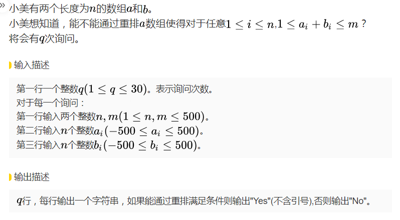
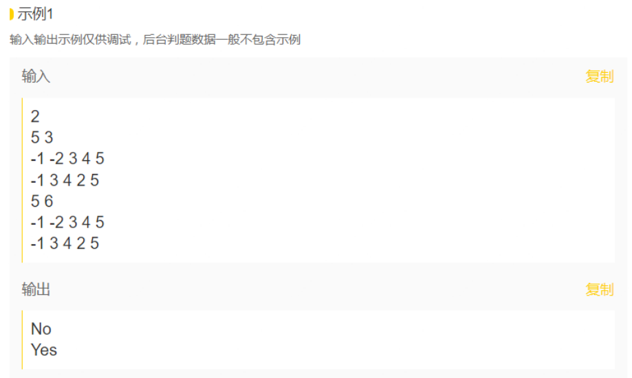
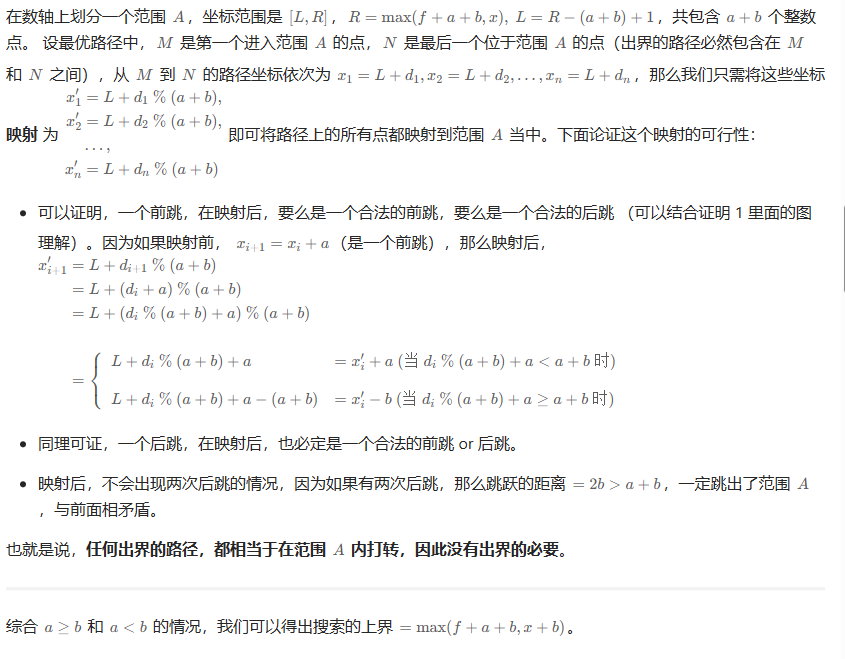
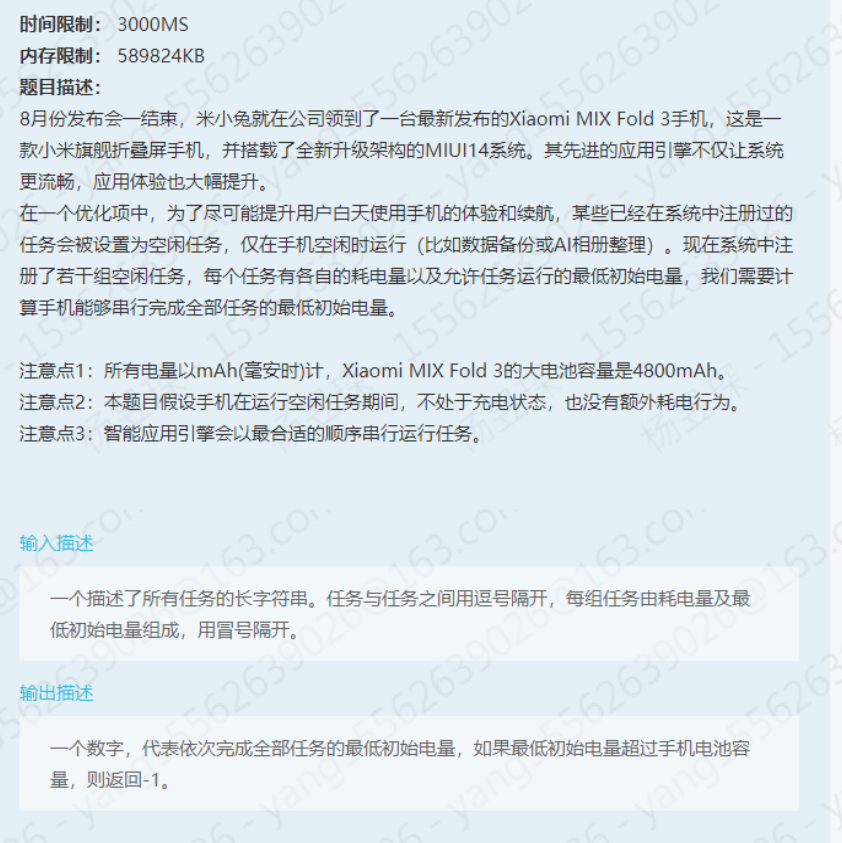
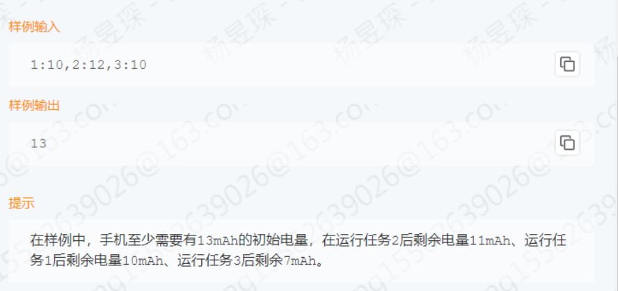

# 打卡7月LeetCode

## 2023.7.1

### 198.打家劫舍

**题干**

你是一个专业的小偷，计划偷窃沿街的房屋。每间房内都藏有一定的现金，影响你偷窃的唯一制约因素就是相邻的房屋装有相互连通的防盗系统，**如果两间相邻的房屋在同一晚上被小偷闯入，系统会自动报警**。

给定一个代表每个房屋存放金额的非负整数数组，计算你 **不触动警报装置的情况下** ，一夜之内能够偷窃到的最高金额。

**解法**

基本思路：**动态规划**

- **dp含义：**偷到第 i 家为止能得到的最大金额。
- **递推公式：**dp[i] = max(dp[i - 2] + nums[i], dp[i - 1]) 。在第 i 家，如果选择偷，就是不考虑 i-1，那就是在 i-2的基础上拿 i 的；如果不偷，就考虑是 i-1 的金额。
- **初始化：**很明显考虑到 i-2，需要初始化0，1。其中1需要取0、1中的较大值。

***Code***

```cpp
class Solution {
public:
    int rob(vector<int>& nums) {
        if(nums.size() == 0)    return 0;
        if(nums.size() == 1)    return nums[0];
        int one = nums[0], two = max(nums[0], nums[1]), cur = two;
        for(int i = 2; i < nums.size(); ++i) {
            cur = max(one + nums[i], two);
            one = two;
            two = cur;
        }
        return cur;
    }
};
```

#### 相关题目

### 213.打家劫舍 Ⅱ

**题干**

在198的基础上，房屋连成了环，其余不变。

**解法**

基本思路：**动态规划**

这题主要是思路的转换，即怎么处理首尾相邻的情况。

首尾不能同时存在，那么**去掉其中一个**，剩余的就是198的逻辑了：即在 **[0, size)** 和 **[1, size - 1)** 区间内各自计算一遍最大金额，然后取两者中的最大值即可。

***Code***

```cpp
class Solution {
public:
    int rob(vector<int>& nums) {
        if(nums.size() == 1)    return nums[0];
        auto maxCoins = [&](int l, int r) {
            if(l + 1 == r)  return nums[l];
            int one = nums[l], two = max(nums[l], nums[l+1]), cur = two;
            for(int i = l+2; i < r; ++i) {
                cur = max(one + nums[i], two);
                one = two;
                two = cur;
            }
            return cur;
        };
        return max(maxCoins(0, nums.size() - 1), maxCoins(1, nums.size()));
    }
};
```

### 337.打家劫舍 Ⅲ

**题干**

小偷又发现了一个新的可行窃的地区。这个地区只有一个入口，我们称之为 `root` 。

除了 `root` 之外，每栋房子有且只有一个“父“房子与之相连。一番侦察之后，聪明的小偷意识到“这个地方的所有房屋的排列类似于一棵二叉树”。 如果 **两个直接相连的房子在同一天晚上被打劫** ，房屋将自动报警。

给定二叉树的 `root` 。返回 ***在不触动警报的情况下** ，小偷能够盗取的最高金额* 。

**解法**

基本思路：**动态规划、树形DP**

这题的思路和前两题完全不同，算是二叉树遍历和动态规划的结合（树形DP）。首先很容易想到，在遍历的时候，必须**至少**隔一层才能偷一次，那么从叶节点开始遍历是相对更好的选择，可以将状态递推至根节点输出。因此遍历顺序选择**后序遍历**。

那么如何来设计dp数组呢，这里dp数组实际需要保存两个值（**当前节点偷、不偷的最高金额**），相当于两个dp了。于是原本的 dp[i] 需要修改为一组。在代码随想录中使用 **vector**来存储，相对消耗时空更多，这里选择用 **pair**来存储两个值，结构体相对更省时空。

为了得到每一层偷与不偷的递归状态，不能用同一个全局变量来存储，设置为递归返回值是较为方便的处理。

接下来确定递推公式，作为递归中的单层处理逻辑使用，置于左右子树递归的后面：

- **偷：**那么应该是两个子节点不偷时的最大金额加上当前节点值，即 **cur->val + no_robL + no_robR**
- **不偷：**那么应该是两个子节点返回的一对中更大的值的和，即 **max(robL, no_robL) + max(robR, no_robR)**为什么不是直接取子节点偷的和，是因为可能存在当前子节点偷了之后不一定就比没偷的金额更多（例：**[4,1,null,2,null,3]**）

最后遍历到空节点如何处理？也就是确定了终止条件：空节点什么都偷不到当然是返回 {0, 0} 。

最后遍历到根节点得到整棵树偷与不偷的状态，取最大值。

***Code***

```cpp
class Solution {
public:
    int rob(TreeNode* root) {
        auto track = [ &,
            circle = [](auto&& self, TreeNode* cur) -> pair<int, int> {
                if(cur == nullptr)  return {0, 0};
                auto [robL, no_robL] = self(self, cur->left);
                auto [robR, no_robR] = self(self, cur->right);
                return {cur->val + no_robL + no_robR, max(robL, no_robL) + max(robR, no_robR)};
            }
        ]() { return circle(circle, root); };
        auto [rob, no_rob] = track();
        return max(rob, no_rob);
    }
};
```


### 714.买卖股票的最佳时机含手续费

**题干**

给定一个整数数组 `prices`，其中 `prices[i]`表示第 `i` 天的股票价格 ；整数 `fee` 代表了交易股票的手续费用。

你可以无限次地完成交易，但是你每笔交易都需要付手续费。如果你已经购买了一个股票，在卖出它之前你就不能再继续购买股票了。返回获得**利润的最大值**。

**注意：**这里的一笔交易指买入持有并卖出股票的整个过程，每笔交易你只需要为支付一次手续费。

**解法**

基本思路：**动态规划、树形DP**

这题的dp同样得分成两部分：第 i 天持有（dp[i] [0]）或不持有（dp[i] [1]）股票时所得最大现金。

**递推公式：**

- **dp[i] [0] = max(dp[i-1] [0], dp[i-1] [1] - prices[i])** ：前一天持有的现金和前一天不持有当天买入的最大值。
- **dp[i] [1] = max(dp[i-1] [1], dp[i-1] [0] + prices[i] - fee)** ：前一天不持有的现金和前一天持有当天卖出的最大值。

这里可以发现两个值都仅由上一天的状态推出，那就可以用常量替代二维数组节省空间，存在交叉使用的问题可以设置一个temp保存先被修改的那个变量之前的状态即可。最后输出的一定是不持有，因为卖出会得到更多钱。

***Code***

```cpp
class Solution {
public:
    int maxProfit(vector<int>& prices, int fee) {
        int have = -prices[0], no = 0;
        for(int i = 1; i < prices.size(); ++i) {
            int temp = have;
            have = max(have, no - prices[i]);
            no = max(no, temp + prices[i] - fee);
        }
        return no;
    }
};
```


## 2023.7.2

### 121.买卖股票的最佳时机

**题干**

给定一个数组 `prices` ，它的第 `i` 个元素 `prices[i]` 表示一支给定股票第 `i` 天的价格。你只能选择 **某一天** 买入这只股票，并选择在 **未来的某一个不同的日子** 卖出该股票。返回你可以从这笔交易中获取的**最大利润**。如果你不能获取任何利润，返回 `0` 。

**解法**

基本思路：**动态规划**

因为只会买入和卖出一次，那么状态就比较好判断。dp：第 i 天持有（dp[i] [0]）或不持有（dp[i] [1]）股票时所得最大现金。可以用常量节省空间。

**递推公式：**

- **dp[i] [0] = max(dp[i-1] [0],  - prices[i])** 
- **dp[i] [1] = max(dp[i-1] [1], dp[i-1] [0] + prices[i])** 

***Code***

```cpp
class Solution {
public:
    int maxProfit(vector<int>& prices) {
        int have = -prices[0], no = 0;
        for(int i = 1; i < prices.size(); ++i) {
            no = max(no, prices[i] + have);
            have = max(have, -prices[i]);
        }
        return no;
    }
};
```

#### 相关题目

### 122.买卖股票的最佳时机 Ⅱ

**题干**

给你一个整数数组 `prices` ，其中 `prices[i]` 表示某支股票第 `i` 天的价格。在每一天，你可以决定是否购买和/或出售股票。你在任何时候 **最多** 只能持有 **一股** 股票。你也可以先购买，然后在 **同一天** 出售。返回 **最大** 利润 。

**解法**

基本思路：**动态规划**

因为会多次买入卖出，相对于上题121，买入的判断应为上一天就买入和上一天为买入-当天价格作比较。

**递推公式：**

- **dp[i] [0] = max(dp[i-1] [0], dp[i-1] [1] - prices[i])** 
- **dp[i] [1] = max(dp[i-1] [1], dp[i-1] [0] + prices[i])** 

***Code***

```cpp
class Solution {
public:
    int maxProfit(vector<int>& prices) {
        int have = -prices[0], no = 0;
        for(int i = 1; i < prices.size(); ++i) {
            int temp = have;
            have = max(have, no - prices[i]);
            no = max(no, prices[i] + temp);
        }
        return no;
    }
};
```

### 123.买卖股票的最佳时机 Ⅲ

**题干**

给定一个数组，它的第 `i` 个元素是一支给定的股票在第 `i` 天的价格。计算你所能获取的最大利润。你最多可以完成 **两笔** 交易。**注意：**你不能同时参与多笔交易（你必须在再次购买前出售掉之前的股票）。

**解法**

基本思路：**动态规划**

因为只买入两次，每一天的状态就不是两种而是四种：第一次持有、不持有和第二次的持有、不持有。

**递推公式：**要搞清楚每个状态和前一天的哪个状态相关。

- **dp[i] [0] = max(dp[i-1] [0], -prices[i])** 
- **dp[i] [1] = max(dp[i-1] [1], dp[i-1] [0] + prices[i])** 
- **dp[i] [2] = max(dp[i-1] [2], dp[i-1] [1] - prices[i])** 
- **dp[i] [3] = max(dp[i-1] [3], dp[i-1] [2] + prices[i])** 

***Code***

```cpp
class Solution {
public:
    int maxProfit(vector<int>& prices) {
        int have1 = -prices[0], have2 = -prices[0];
        int no1 = 0, no2 = 0;
        for(int i = 1; i < prices.size(); ++i) {
            int temp = have1;
            have1 = max(have1, -prices[i]);
            no2 = max(no2, have2 + prices[i]);
            have2 = max(have2, no1 - prices[i]);
            no1 = max(no1, temp + prices[i]);
        }
        return no2;
    }
};
```

### 188.买卖股票的最佳时机 Ⅳ

**题干**

给定一个整数数组 `prices` ，它的第 `i` 个元素 `prices[i]` 是一支给定的股票在第 `i` 天的价格，和一个整型 `k` 。计算你所能获取的最大利润。最多可以买 `k` 次，卖 `k` 次。**注意：**你不能同时参与多笔交易（你必须在再次购买前出售掉之前的股票）。

**解法**

基本思路：**动态规划**

在上题123的基础上进一步拓展，由两次改为不定次，那就通过循环解决，递推中，每次都是取**前一天的当前状态值**与**前一天的上一状态值（+ / -）prices[i]** 中的最大值。

***Code***

```cpp
class Solution {
public:
    int maxProfit(int k, vector<int>& prices) {
        vector<int> dp(k * 2, 0);
        for(int i = 0; i < k; ++i)
            dp[i * 2] = -prices[0];
        for(int i = 0; i < prices.size(); ++i) {
            for(int j = k * 2 - 1; j > 0; --j) 
                dp[j] = max(dp[j], dp[j - 1] + prices[i] * (j % 2 ? 1 : -1));
            dp[0] = max(dp[0], -prices[i]);
        }
        return dp[k * 2 - 1];
    }
};
```

### 309.买卖股票最佳时机含冷冻期

**题干**

给定一个整数数组`prices`，其中第 `prices[i]` 表示第 `i` 天的股票价格 。计算出最大利润。在满足以下约束条件下，你可以尽可能地完成更多的交易（多次买卖一支股票）:卖出股票后，你无法在第二天买入股票 (即冷冻期为 1 天)。

**注意：**你不能同时参与多笔交易（你必须在再次购买前出售掉之前的股票）。

**解法**

基本思路：**动态规划**

代码随想录中的方法是增加状态，即**达到买入股票状态**、**达到保持卖出股票状态**、**达到今天就卖出股票状态**、**达到冷冻期状态**四种状态。

但个人认为不需要考虑过于复杂，实际上冷冻期一天，在递推中也就是买入时的计算由 i - 1 变成了 i - 2。类似于122题的递推：

- **dp[i] [0] = max(dp[i-1] [0], dp[i-2] [1] - prices[i])** 
- **dp[i] [1] = max(dp[i-1] [1], dp[i-1] [0] + prices[i])** 

***Code***

```cpp
class Solution {
public:
    int maxProfit(vector<int>& prices) {
        int have = -prices[0], no = 0, no2 = 0;
        for(int i = 1; i < prices.size(); ++i) {
            int temp = have;
            have = max(have, no2 - prices[i]);
            no2 = no;
            no = max(no, prices[i] + temp);
        }
        return no;
    }
};
```


### 300.最长递增子序列

**题干**

给你一个整数数组 `nums` ，找到其中最长严格递增子序列的长度。

**子序列** 是由数组派生而来的序列，删除（或不删除）数组中的元素而不改变其余元素的顺序。例如，`[3,6,2,7]` 是数组 `[0,3,1,6,2,2,7]` 的子序列。

**解法**1

基本思路：**动态规划**

dp[i] 表示 [0, i] 区间内的子串的最长递增子序列长度。

在思考递推公式前需要先想清楚如何遍历？在数组遍历中，如果上升数组在 i 中断了（比前一个小），后序的最长子序列应该从何处累加才是正确的？因此需要二层循环，对于每一个 [0, i] 区间，都需要遍历一次，找到 **dp[i]** 真正的最大值。由此可以确定**递推公式：**

**dp[i] = max(dp[i], dp[j] + 1)**  ( 在 **nums[i] > nums[j]** 的条件下 ) 

***Code***

```cpp
class Solution {
public:
    int lengthOfLIS(vector<int>& nums) {
        if(nums.size() == 1) return nums.size();
        vector<int> dp(nums.size(), 1);
        int res = 0;
        for(int i = 0; i < nums.size(); ++i) {
            for(int j = 0; j < i; ++j)
                if(nums[i] > nums[j])
                    dp[i] = max(dp[i], dp[j] + 1);
            if(dp[i] > res) res = dp[i];
        }
        return res;
    }
};
```

**解法**2

基本思路：**贪心 + 二分查找**

解法1中的动态规划方法显然是需要双层遍历的，时间复杂度一看就是 O(n^2) ，不符合进阶的 **O(n*logn)** 要求。看到这个复杂度很明显是在一层循环中嵌套一个 **O(logn)** 的算法，涉及到递增，那么二分查找是一个好选择。那么如何只用单层遍历呢，要求最大值，可以考虑用贪心：局部最大到全局最大。

**看到的一个生动的解释：**[杀手也不会再冷了](https://leetcode.cn/problems/longest-increasing-subsequence/solutions/1407147/by-zigo_get-ctqu/)

对于一个原序列nums[i],视为nums.size()块大小不同的砖头。要求： 

1.将较小的砖头放在下方，它上面的每一块砖头都比它大 

2.砌起来的砖塔尽可能的高

创建一个数组**tower[]**，且先令 tower[0] = nums[0]，即第一块砖，并用参数**pos**标记塔顶位置。 遍历nums中每一块砖： 

1).若当前遍历到的砖nums[i]，比塔顶的砖大，则将其加至塔顶，即tower[pos] = nums[i]; 

2).若遍历到的砖nums[i]不大于塔顶的砖，则将与下层进行对比，找到tower[]中**最靠下**的**大于**该砖nums[i]的砖，并替换之。

这么做的目的有以下几个原因： 

1.由于上述的1)，已建成的塔是严格有序的（下小上大）。

2.为了使塔尽可能的高，则每一块砖应当**尽可能小**（贪心），因为越小的砖，它头上能容纳的砖的范围更大

3.需要注意的是，我们此处的tower[]并不一定是我们所找到的最高的塔，也即并不一定是我们最终需要的最长单调递增子序列。只有当从某一层开始，往上的每一层都发生了这种替换，最后才是我们需要的最长子序列。

举个栗子： 对于一个nums为{**100,90,1,20,30,40,80,2,3,4,5,6**} 按照以上思路 tower[]为 {100} {90}(100->90,替换) {1}(90->1,替换) {1,20}(添加20) {1,20,30}(添加30) {1,20,30,40}(添加40) {1,20,30,40,80}(添加80) {1,2,30,40,80}(20->2,替换) {1,2,3,40,80}(30->3,替换) {1,2,3,4,80}(40->4,替换) {1,2,3,4,5}(80->5,替换) {1,2,3,4,5,6}(添加6) 。

可以看到，该示例中比较高的塔有甲：{1,20,30,40,80}和乙：{1,2,3,4,5,6}两条。由于甲在nums[]中先出现，因此它修了5层，然后遇到了乙塔中的2这块砖。因此2找到塔中最靠下的大于2的砖20进行替换。但是这并不意味着我们的塔就变成了{1，2，30，40，80}，实际上2和20在此处是**并列关系**，并且它代表着一种**可能性**，即从2继续砌高的可能性。（这里是重点：**如果乙塔的实际长度（假设4，即把原数组中的5、6去掉）小于甲，那么序列是{1，2，30，40，80}，但数组中的值已经被替换为了{1，2，3，4，80}，数组并不表示真实序列，仅表示在这个位置后，能加入递增序列的最小要求，这就是贪心的地方**）后面的事实也证明确实是在2的基础上继续砌高（3，4，5，6都只能加在2的上面，而不能加在80的上面）因此，当1，2，3，4，5，6这个乙序列比甲序列长的时候，长度就会更新，并且继续在乙塔上延伸，而乙塔高度不足甲塔高度时，塔的高度不会更新。

进一步缩减空间复杂度：**直接在原数组上操作**。

***Code***

```cpp
class Solution {
public:
    int lengthOfLIS(vector<int>& nums) {
        auto end = nums.begin();
        for(int n : nums) {
            auto iter = lower_bound(nums.begin(), end, n);
            *iter = n;
            if(iter == end) end++;
        }
        return end - nums.begin();
    }
};
```


## 2023.7.3

### 674.最长连续递增序列

**解法**

基本思路：**动态规划**

相比于上题300，这题要求连续子序列就简单多了，只需在遇到递减时将状态重置为1即可。

***Code***

```cpp
class Solution {
public:
    int findLengthOfLCIS(vector<int>& nums) {
        int res = 1, dp = 1;
        for(int i = 1; i < nums.size(); ++i) {
            if(nums[i] > nums[i - 1])   ++dp;
            else    dp = 1;
            res = max(res, dp);
        }
        return res;
    }
};
```


### 718.最长重复子数组

**题干**

给两个整数数组 `nums1` 和 `nums2` ，返回 *两个数组中 **公共的** 、长度最长的子数组的长度* 。

**解法**

基本思路：**动态规划**

记住动态规划的本质就是**填表**，全遍历。这里 **dp[i]** 表示 **nums1 [0, i - 1] 和 nums2 [0, j - 1]范围内的最长公共子数组**，是为了方便遍历，类似于一个向左边和上边的**padding**操作。若是表示 [0, i] ，会发现遍历时dp第一行第一列中若出现相同数字，要初始化为1。

***Code***

```cpp
class Solution {
public:
    int findLength(vector<int>& nums1, vector<int>& nums2) {
        vector<vector<int> > dp(nums1.size() + 1, vector<int>(nums2.size() + 1, 0));
        int res = 0;
        for(int i = 1; i <= nums1.size(); ++i) {
            for(int j = 1; j <= nums2.size(); ++j) {
                if(nums1[i - 1] == nums2[j - 1])
                    dp[i][j] = dp[i - 1][j - 1] + 1;
                res = max(res, dp[i][j]);
            }
        }        
        return res;
    }
};
```

#### 空间优化

```cpp
class Solution {
public:
    int findLength(vector<int>& nums1, vector<int>& nums2) {
        vector<int> dp(nums2.size() + 1, 0);
        int res = 0;
        for(int i = 1; i <= nums1.size(); ++i) {
            for(int j = nums2.size(); j > 0; --j) {
                if(nums1[i - 1] == nums2[j - 1])
                    dp[j] = dp[j - 1] + 1;
                else
                    dp[j] = 0;
                res = max(res, dp[j]);
            }
        }        
        return res;
    }
};
```


### 1143.最长公共子序列（LCS）

**题干**

给定字符串 `text1` 和 `text2`，返回两个字符串的最长 **公共子序列** 的长度。如果不存在 **公共子序列** ，返回 `0` 。

一个字符串的 **子序列** 是指这样一个新的字符串：它是由原字符串在不改变字符的相对顺序的情况下删除某些字符（也可以不删除任何字符）后组成的新字符串。

**解法**

基本思路：**动态规划**

这题主要难点在推导出**递推公式**。有两种情况：

1.**text1[i - 1] == text2[j - 1]** : 此时有 **dp[i] [j] = dp[i - 1] [j - 1] + 1**，很好理解：代表必然使用 **text1[i - 1] **和**text2[j - 1] **时LCS的长度。

2.**text1[i - 1] != text2[j - 1] : **此时 **dp[i] [j] = max(dp[i - 1] [j], dp[i] [j - 1])**，因为不相等，因此必然不会同时用到这两个字符，但存在用到其中一个字符的情况，依次取两者中的最大值。

***Code***

```cpp
class Solution {
public:
    int longestCommonSubsequence(string text1, string text2) {
        vector<vector<int> > dp(text1.size() + 1, vector<int>(text2.size() + 1, 0));
        for(int i = 1; i <= text1.size(); ++i) {
            for(int j = 1; j <= text2.size(); ++j) {
                if(text1[i - 1] == text2[j - 1])
                    dp[i][j] = dp[i - 1][j - 1] + 1;
                else
                    dp[i][j] = max(dp[i - 1][j], dp[i][j - 1]);
            }
        }        
        return dp[text1.size()][text2.size()];
    }
};
```

#### 空间优化

一定要注意**遍历顺序！！**

在上一题718中，dp[i] [j] 只与 左上角 dp[i-1] [j-1] 有关，体现在一维数组中就是只与它前一个值有关，因此可以反序遍历，解决覆盖问题。

但本题中，dp[i] [j] 同时与 dp[i-1] [j-1] 、dp[i] [j-1] 、dp[i-1] [j] 有关，尤其是 **dp[i] [j-1]** ，若反序遍历，则**dp[i] [j-1] 的状态是无法更新到 dp[i] [j] 的**。因此必须正序遍历，用常量存储前一个值修改前的内容来避免覆盖问题。

```cpp
class Solution {
public:
    int longestCommonSubsequence(string text1, string text2) {
        vector<int> dp(text2.size() + 1, 0);
        for(int i = 1; i <= text1.size(); ++i) {
            int pre = 0;
            for(int j = 1; j <= text2.size(); ++j) {
                int temp = dp[j];
                if(text1[i - 1] == text2[j - 1])
                    dp[j] = pre + 1;
                else
                    dp[j] = max(dp[j], dp[j - 1]);
                pre = temp;
            }
        }        
        return dp[text2.size()];
    }
};
```

#### 相关题目

### 1035.不相交的线

按照题意理解一下，要在线不相交的情况下数量最多，那么线尽可能靠近垂直，并且不同线之间的相对顺序是固定的，也就是说本质就是**求最长公共子序列**。那么代码就和上题1143一模一样了。


### 53.最大子数组和

**题干**

给你一个整数数组 `nums` ，请你找出一个具有最大和的连续子数组（子数组最少包含一个元素），返回其最大和。**子数组** 是数组中的一个连续部分。

**解法**

基本思路：**动态规划**

以前用贪心解过，只保留和为正数的子数组，取最大。

动态规划其实也是类似的思路：有两种状态，1是**之前和为非负数，那么直接加上当前值**；2是**之前和是负数，那么从当前数重新开始计算和**。过程中记录最大和即可。

***Code***

```cpp
class Solution {
public:
    int maxSubArray(vector<int>& nums) {
        int pre = 0, res = INT_MIN;
        for(int i = 0; i < nums.size(); ++i) {
            pre = max(nums[i], pre + nums[i]);
            res = max(res, pre);
        }
        return res;
    }
};
```


### 392.判断子序列

**题干**

给定字符串 **s** 和 **t** ，判断 **s** 是否为 **t** 的子序列。

**解法**

基本思路：**动态规划**

类似1143题的思路，将待确认子串作为外循环，在母串中：每找到一对匹配的字符，就取左上角（i-1，j-1）+1；没找到就延续前一格（i，j-1）记录的值（因为没找到新的匹配，所以长度暂时不变）。

最终目的实际依旧是求**最长公共子序列**，之后判断公共子序列长度是否和待确认子串相同即可。

TODO：为什么无法压缩成一维数组。。

***Code***

```cpp
class Solution {
public:
    bool isSubsequence(string s, string t) {
        vector<vector<int> > dp(s.size() + 1, vector<int>(t.size() + 1, 0));
        for(int i = 1; i <= s.size(); ++i) {
            for(int j = 1; j <= t.size(); ++j) {
                if(s[i - 1] == t[j - 1])	dp[i][j] = dp[i - 1][j - 1] + 1;
                else	dp[i][j] = dp[i][j - 1];
            }
        }        
        return dp[s.size()][t.size()] == s.size();
    }
};
```


## 2023.7.6

### 115.不同的子序列

**题干**

给你两个字符串 `s` 和 `t` ，统计并返回在 `s` 的 **子序列** 中 `t` 出现的个数。答案符合 32 位带符号整数范围。

**解法**

基本思路：**动态规划**

对于两个**字符串匹配**，一个非常**通用的状态**定义如下：

定义 **dp[i] [j]** 为考虑 s 中 **[0，i]** 个字符，t 中 **[0，j]** 个字符的**匹配个数**。那么显然对于某个 dp[i] [j] 而言，从「最后一步」的匹配进行分析，包含两类决策：

-  **s[i]** 不参与匹配，需要让 s 中 **[0，i-1]** 个字符去匹配 t 中的  **[0，j]** 字符。此时匹配值为 **dp[i-1] [j]**
-  **s[i]** 参与匹配，这时只需让 s 中 **[0，i-1]** 个字符去匹配 t 中的  **[0，j-1]** 字符即可，同时满足 `s[i] = t[j]`。此时匹配值为 **dp[i-1] [j-1]**

显然，当出现 `s[i] = t[j]`时，dp值为以上两者之和，若不相等，则仅满足 s[i] 不参与匹配的情况。

***Code***

```cpp
class Solution {
public:
    int numDistinct(string s, string t) {
        vector<uint64_t> dp(t.size() + 1, 0);
        dp[0] = 1;
        for(char c : s) {
            uint64_t pre = 1;
            for(int j = 1; j <= t.size(); ++j) {
                uint64_t temp = dp[j];
                if(c == t[j - 1])   dp[j] += pre;
                pre = temp;
            }
        }        
        return dp[t.size()];
    }
};
```


### 583.两个字符串的删除操作

**题干**

给定两个单词 `word1` 和 `word2` ，返回使得 `word1` 和 `word2` **相同**所需的**最小步数**。**每步** 可以删除任意一个字符串中的一个字符。

**解法**1

基本思路：**动态规划**

对于两个**字符串匹配**，一个非常**通用的状态**定义如下：

 **dp[i] [j]** 为使 s 中 **[0，i]** ，t 中 **[0，j]** 个字符相同所需的**最少操作步数**。那么对于 dp[i] [j] ，包含两类决策：

- `s[i] = t[j]`，此时不需要新增操作 **dp[i] [j] = dp[i-1] [j-1]**
- `s[i] ≠ t[j]`，此时有两种情况：删除 s[i - 1] 或删除 t[j - 1] 。于是可得 **dp[i] [j] = min(dp[i-1] [j] + 1, dp[i] [j - 1] + 1)** 。实际还有第三种情况即同时删除 s[i - 1] 和 t[j - 1] ，但是该情况（ **dp[i] [j] = dp[i-1] [j-1] + 2**）和删除 s[i-1]是一样的（TODO：why？）

这里需要注意的是dp数组的初始化：**dp[0] [j] = j ，dp[i] [0] = i** 。当 t 为空时，s显然需要删除全部的字符才能相同，因此必然有 **dp[i] [0] = i** 。反之同理。

下面代码为压缩空间后的一维数组解法，要注意**外循环中 dp[0] = i 相当于对二维数组中第一列的初始化，而pre保存的是左上角的值（i-1，j-1），因此初始化时应为上一层的 dp[0]，那也就是 i - 1。**

***Code***

```cpp
class Solution {
public:
    int minDistance(string word1, string word2) {
        vector<int> dp(word2.size() + 1);
        for(int i = 0; i < dp.size(); ++i)  dp[i] = i;
        for(int i = 1; i <= word1.size(); ++i) {
            int pre = i - 1;
            dp[0] = i;
            for(int j = 1; j <= word2.size(); ++j) {
                int temp = dp[j];
                if(word1[i - 1] == word2[j - 1])   
                    dp[j] = pre;
                else
                    dp[j] = min(dp[j] + 1, dp[j - 1] + 1);
                pre = temp;
            }
        }        
        return dp[word2.size()];
    }
};
```

**解法**2

将问题转化为[LCS问题](#1143.最长公共子序列（LCS）)，最少删除多少次后两个字符串相等，相当于求公共子串与俩字符串的长度差值的和。

```cpp
return word1.size() + word2.size() - dp[word2.size()] * 2;
```


## 2023.7.7

### 72.编辑距离

**题干**

给你两个单词 `word1` 和 `word2`， *请返回将 `word1` 转换成 `word2` 所使用的最少操作数* 。

你可以对一个单词进行如下三种操作：**插入**一个字符、**删除**一个字符、**替换**一个字符。

**解法**

基本思路：**动态规划**

动态规划题还是要冷静思考，找到递推关系。

显然如果两个字符相同，那么就不需要任何操作，**dp[i] [j] = dp[i-1] [j-1]**

如果不同，则有三种操作方法：

- 替换，最容易想到——增加了一步操作 **dp[i-1] [j-1] + 1**
- 删除，假设删除 `word1`的第 i 个字符，那么问题就变成了 dp[i-1] [j] 的最小操作数，加上删除 i 这一步。也就是 **dp[i-1] [j] + 1**；删除 `word2`，也是同理：**dp[i] [j-1] + 1**
- 插入和删除实际是同理：`word1`删除一个字符，相当于在`word2`加入一个和`word1[i]`相同的字符。

***Code***

```cpp
class Solution {
public:
    int minDistance(string word1, string word2) {
        vector<int> dp(word2.size() + 1, 0);
        for(int i = 0; i < dp.size(); ++i)  dp[i] = i;
        for(int j = 1; j <= word1.size(); ++j) {
            int pre = j - 1;
            dp[0] = j;
            for(int i = 1; i <= word2.size(); ++i) {
                int temp = dp[i];
                if(word1[j - 1] == word2[i - 1])   dp[i] = pre;
                else    dp[i] = min({dp[i], dp[i - 1], pre}) + 1;
                pre = temp;
            }
        }
        return dp[word2.size()];
    }
};
```


### 647.回文子串

**题干**

给你一个字符串 `s` ，请你统计并返回这个字符串中 **回文子串** 的数目。

具有不同开始位置或结束位置的子串，即使是由相同的字符组成，也会被视作不同的子串。

**解法**1

基本思路：**动态规划、双指针**

这题没法直接按题意定义dp数组，因为无法找到递推关系。要考虑到回文子串的特点：**回文串（len > 2）去掉左右两边的字符后依旧是一个回文串**。这就是递推关系：字符串是不是回文串是由去掉两边后的字符串来决定的。

因此dp定义：dp[i] [j] 表示 s 在 **[i, j]** 范围内的子串**是否**为回文串，类型为bool，通过变量统计`true`的数量。

递推关系：当遍历到的两个字符不同时，`显然为false`；当相同时，会出现两种情况：

- 如果子串长度为1或2，字符相同则必然是回文串
- 如果长度大于2，则根据递推，由 **dp[i+1] [j-1]** 来决定

根据上述第二种情况，在遍历时要优先遍历到（i，j）的左下角，那么**先下后上，从左至右**的顺序就确定了。同时因为是 **[i, j]** 范围内，那么 **j 的遍历必然是从 i 开始的**。

这个动规数组的设计中其实也包含着双指针的思想。

***Code***

```cpp
class Solution {
public:
    int countSubstrings(string s) {
        vector<vector<bool> > dp(s.size(), vector<bool>(s.size(), false));
        int res = 0;
        for(int i = s.size() - 1; i >= 0; --i) {
            for(int j = i; j < s.size(); ++j) {
                if(s[i] == s[j] && (j - i <= 1 || dp[i + 1][j - 1])) {
                    ++res;
                    dp[i][j] = true;
                }
            }
        }
        return res;
    }
};
```

**解法**2

基本思路：**双指针**

上述dp的递推中实际已经体现了双指针实现回文串的核心思想：**回文串的基础是长度为1或2的子串**。

通过遍历整个字符串，以每个字符、该字符与后一位字符为基础计算可以形成的回文子串数。

```cpp
class Solution {
public:
    int countSubstrings(string s) {
        auto countSub = [&s](int i, int j) {
            int res = 0;
            while(i >= 0 && j < s.size() && s[i--] == s[j++])   ++res;
            return res;
        };
        int res = 0;
        for(int i = 0; i < s.size(); ++i) {
            res += countSub(i, i);
            res += countSub(i, i+1);
        }
        return res;
    }
};
```


## 2023.7.8

### 516.最长回文子序列

**题干**

给你一个字符串 `s` ，找出其中**最长**的回文子序列，并返回该序列的长度。**子序列**定义为：不改变剩余字符顺序的情况下，删除某些字符或者不删除任何字符形成的一个序列。

**解法**

基本思路：**动态规划**

子序列相对于子串的处理要更简单。思路类似于 [647.回文子串](#647.回文子串)，不过求的是最大长度，因此递推公式：

- 相等，在（i+1，j-1）的基础上+2
- 不等，即无法同时添加两个字符，那么选择添加其中一个，取最大值。

***Code***

```cpp
class Solution {
public:
    int longestPalindromeSubseq(string s) {
        vector<vector<int> > dp(s.length(), vector<int>(s.length(), 0));
        for(int i = 0; i < s.length(); ++i) dp[i][i] = 1;
        for(int i = s.length() - 2; i >= 0; --i) {
            for(int j = i+1; j < s.length(); ++j) {
                if(s[i] == s[j])    dp[i][j] = dp[i+1][j-1] + 2;
                else    dp[i][j] = max(dp[i][j-1], dp[i+1][j]);
            }
        }
        return dp[0][s.length()-1];
    }
};
```

**空间优化**

```cpp
class Solution {
public:
    int longestPalindromeSubseq(string s) {
        vector<int> dp(s.length(), 0);
        for(int i = s.length() - 1; i >= 0; --i) {
            dp[i] = 1;
            int pre = 0;
            for(int j = i+1; j < s.length(); ++j) {
                int tmp = dp[j];
                if(s[i] == s[j])    dp[j] = pre + 2;
                else    dp[j] = max(dp[j-1], dp[j]);
                pre = tmp;
            }
        }
        return dp[s.length()-1];
    }
};
```


## 2023.7.10

### 739.每日温度

**题干**

给定一个整数数组 `temperatures` ，表示每天的温度，返回一个数组 `answer` ，其中 `answer[i]` 是指对于第 `i` 天，下一个更高温度出现在几天后。如果气温在这之后都不会升高，请在该位置用 `0` 来代替。

**解法**

基本思路：**单调栈**

因为是找右边第一个比自己大的元素，因此应手动维护栈为递减（栈底——>栈顶）。即每当遍历到一个元素时，将栈中比这个元素小的元素全部出栈，并记录结果即可。

***Code***

```cpp
class Solution {
public:
    vector<int> dailyTemperatures(vector<int>& temperatures) {
        vector<int> res(temperatures.size());
        stack<int> st;
        for(int i = 0; i < temperatures.size(); ++i) {
            while(!st.empty() && temperatures[i] > temperatures[st.top()]) {
                res[st.top()] = i - st.top();
                st.pop();
            }
            st.push(i);
        }
        return res;
    }
};
```


### 496.下一个更大元素

**题干**

`nums1` 中 x 的 **下一个更大元素** 是指 `x` 在 `nums2` 中对应位置 **右侧** 的 **第一个** 比 `x` 大的元素，若不存在返回**-1**。

给你两个 **没有重复元素** 的数组 `nums1` 和 `nums2` ，下标从 **0** 开始计数，其中`nums1` 是 `nums2` 的子集。

返回一个长度为 `nums1.length` 的数组 `ans` 作为答案，满足 `ans[i]` 是如上所述的 **下一个更大元素** 。

**解法**

基本思路：**单调栈**

思路同上，相当于找到 `nums2`中每个元素的下一个更大元素的值，记录为键值对，之后遍历 `nums1`，取出这些元素对应的值，加入vector中。本质是一种空间换时间的解法。

第二种是正常解法。

***Code***

```cpp
class Solution {
public:
    vector<int> nextGreaterElement(vector<int>& nums1, vector<int>& nums2) {
        vector<int> res;
        unordered_map<int, int> hash;
        stack<int> st;
        for(int i = nums2.size() - 1; i >= 0; --i) {
            while(!st.empty() && nums2[i] > st.top())   st.pop();
            hash[nums2[i]] = st.empty() ? -1 : st.top();
            st.push(nums2[i]);
        }
        for(int& n : nums1) res.emplace_back(hash[n]);
        return res;
    }
};
```

```cpp
class Solution {
public:
    vector<int> nextGreaterElement(vector<int>& nums1, vector<int>& nums2) {
        vector<int> res(nums1.size(), -1);
        for(int i = 0; i < nums1.size(); ++i) {
            vector<int>::iterator iter = find(nums2.begin(), nums2.end(), nums1[i]);
            while(iter != nums2.end() && nums1[i] >= *iter)    ++iter;
            if(iter != nums2.end()) res[i] = *iter;
        }
        return res;
    }
};
```

#### 相关题目

### 503.下一个更大元素 Ⅱ

**题干**

给定一个循环数组 `nums` （ `nums[nums.length - 1]` 的下一个元素是 `nums[0]` ），返回 *`nums` 中每个元素的 **下一个更大元素*** 。如果不存在，则输出 `-1` 。

**解法**

基本思路：**单调栈**

思路还是一样的，区别就是最后一个元素不是直接返回-1，而是需要再遍历一遍数组。

***Code***

```cpp
class Solution {
public:
    vector<int> nextGreaterElements(vector<int>& nums) {
        int n = nums.size();
        vector<int> res(n, -1);
        stack<int> st;
        for(int i = 0; i < n * 2; ++i) {
            while(!st.empty() && nums[i % n] > nums[st.top()]) {
                res[st.top()] = nums[i % n];
                st.pop();
            }
            st.push(i % n);
        }
        return res;
    }
};
```


### 42.接雨水

**题干**

给定 `n` 个非负整数表示每个宽度为 `1` 的柱子的高度图，计算按此排列的柱子，下雨之后能接多少雨水。


```
输入：height = [0,1,0,2,1,0,1,3,2,1,2,1]
输出：6
```

**解法**

基本思路：**单调栈**

凹槽才能接雨水，因此当遍历到的元素比栈顶元素更大时说明找到了一个凹槽，因此应维护单调栈为**递减**。

第二步需要思考的是应该按行计算容量还是按列？如图中第二个凹槽，实际为两行三列，而单调递减栈在碰到更大的元素时就会处理，不确定是否是右侧最高的，因此按列计算无法找到列高，需**按行计算**。

按行计算需要得到两个数据：**行高**和**列宽**。

- 行高：以栈顶元素为底，取其左右两边（栈顶下一个元素和当前遍历元素）的较小值为顶，计算插值，得到**未计算部分中最底下一层**的行高。
- 列宽：左右两边的下标差值 - 1。

因为维护的是单调递减栈，说明凹槽左侧有多个不同高度的柱子，当前遍历高度要依次与栈中元素比较，每出栈一个小元素 x，就代表计算了这块凹槽中的一层（高度为**栈顶元素高度 - x**）；直到遍历的元素加入栈后，说明**该元素左侧以该元素为最高高度的部分容量**已经计算完成了。此时就形成了这个大元素遍历之前的情况：栈中只有递减排列的元素。重复这一过程直至遍历结束，就能找到所有的凹槽。

***Code***

```cpp
class Solution {
public:
    int trap(vector<int>& height) {
        int res = 0;
        stack<int> st;
        st.push(0);
        for(int i = 1; i < height.size(); ++i) {
            while(!st.empty() && height[i] > height[st.top()]) {
                int mid = st.top();
                st.pop();
                if(!st.empty()) {
                    int h = min(height[i], height[st.top()]) - height[mid];
                    int w = i - st.top() - 1;
                    res += h * w;
                }
            }
            st.push(i);
        }
        return res;
    }
};
```

#### 相关题目

### 84.柱状图中最大的矩形

**题干**

给定 *n* 个非负整数，表示柱状图中柱子的高度。每个柱子彼此相邻，且宽度为 1 。求在该柱状图中，能够勾勒出来的矩形的最大面积。


```
输入：heights = [2,1,5,6,2,3]
输出：10
```

**解法**1

基本思路：**单调栈**

这题的思路和上题 [42.接雨水](#42.接雨水)相似，区别在于找的是两边第一个小于该元素的位置，因此维护为**递增**栈。

需要注意边界问题，对于左右两侧的柱子，其外层均应设置为**高度为0**的柱子，才能保证计算面积时没有遗漏。

找到小于元素的值，是为了找到面积计算的左右边界，因此应取每次的**栈顶元素值为面积的高**，宽度为当前元素与栈顶元素位置的差值。遍历是为了找到右边界，而左边界就是栈底元素。

***Code***

```cpp
class Solution {
public:
    int largestRectangleArea(vector<int>& heights) {
        int res = 0;
        heights.emplace(heights.begin(), 0);
        heights.emplace_back(0);
        stack<int> st;
        st.push(0);
        for(int i = 1; i < heights.size(); ++i) {
            while(heights[i] < heights[st.top()]) {
                int h = heights[st.top()];
                st.pop();
                int w = i - st.top() - 1;
                res = max(res, h * w);
            }
            st.push(i);
        }
        return res;
    }
};
```

**解法**2

基本思路：**双指针**

这题和上题都可以用双指针的思路解决，相对于单调栈，需要用两个数组分别存储左右边界的信息，因此属于是空间换时间。

***Code***

```cpp
class Solution {
public:
    int largestRectangleArea(vector<int>& heights) {
        int n = heights.size();
        vector<int> l(n, -1);
        vector<int> r(n, n);
        for(int i = 1; i < n; ++i) {
            int idx = i - 1;
            while(idx >= 0 && heights[idx] >= heights[i])   idx = l[idx];
            l[i] = idx;
        }
        for(int i = n - 2; i >= 0; --i) {
            int idx = i + 1;
            while(idx < n && heights[idx] >= heights[i])   idx = r[idx];
            r[i] = idx;
        }
        int res = 0;
        for(int i = 0; i < n; ++i) 
            res = max(res, heights[i] * (r[i] - l[i] - 1));
        return res;
    }
};
```


## 2023.7.11

### 1911.最大子序列交替和

**题干**

一个下标从 **0** 开始的数组的 **交替和** 定义为 **偶数** 下标处元素之 **和** 减去 **奇数** 下标处元素之 **和** 。

- 比方说，数组 `[4,2,5,3]` 的交替和为 `(4 + 5) - (2 + 3) = 4` 。

给你一个数组 `nums` ，请你返回 `nums` 中**任意子序列**的 **最大交替和** （子序列的下标 **重新** 从 0 开始编号）。

**解法**

基本思路：**动态规划**

这种求最大的题很容易想到动态规划。类似于 [122.买卖股票的最佳时机 Ⅱ](#122.买卖股票的最佳时机 Ⅱ) 那么分析递推情况：

在构造子序列时，每个元素 `nums[i]`都面临两个选择：

1. 不选择这个元素构造子序列，那么最大交替和和前一状态是**相同**的。
2. 选择这个元素。 此时又有两种情况：

- 这个元素**作为偶数下标**加入子序列，即此时子序列的长度为奇数。
- 这个元素**作为奇数下标**加入子序列，即此时子序列的长度为偶数。

可以发现，当一个元素作为**偶数下标**加入子序列后长度变为**奇数**，说明加入前长度为偶数，并在这一状态下**加上**该元素。反之，则是从长度为奇数的上一状态减去该元素。两者的状态是相关的。

因此需要设定两个dp数组：even表示长度为偶数的子序列的最大交替和，odd表示长度为奇数的。递推公式：

- even[i] = max(even[i-1], odd[i-1] **-** nums[i])
- odd[i] = max(odd[i-1], even[i-1] **+** nums[i])

***Code***

```cpp
class Solution {
public:
    long long maxAlternatingSum(vector<int>& nums) {
        long long even = 0, odd = 0;
        for(int& n : nums) {
            long long tmp = odd;
            odd = max(odd, even + n);
            even = max(even, tmp - n);
        }
        return odd;
    }
};
```

**解法**2

基本思路：**贪心**

求最大交替和，偶数下标 + ，奇数下标 - 。那么很明显最大交替和的子序列长度一定为奇数。那我们先排除原数组中的第一个元素，在后续元素中挑选组成子序列的成员，那么就是 -、+、-、+的顺序。

当两个数是递增状态时，添加这两个数是有益于增加交替和的，为**局部最优**；当两个数为递减时，和小于0，需要舍去。由此局部可以推至全局最优，贪心贪的是两个数的和都为正数。

那对于数组中第一个元素如何处理？可以在数组最开始假定有一个0，不会影响和的结果，这样即可从头遍历数组，**每次取两个元素间大于0的差值**计算累加和，求得最终结果。

***Code***

```cpp
class Solution {
public:
    long long maxAlternatingSum(vector<int>& nums) {
        int pre = 0;
        long long res = 0;
        for(int& n : nums) {
            res += max(n - pre, 0);
            pre = n;
        }
        return res;
    }
};
```


### 1365.有多少小于当前数字的数字

**题干**

给你一个数组 `nums`，对于其中每个元素 `nums[i]`，请你统计数组中比它小的所有数字的数目。

```
输入：nums = [8,1,2,2,3]
输出：[4,0,1,1,3]
```

**解法**

基本思路：**排序、哈希**

首先是统计更小数字的数目，对数组排序后，下标的值就是正确答案。

其次要以按原数组的顺序返回数目，因此需要快速查找到值，选择**哈希表**存储答案。注意对于相同的数字，应按照排序后数组中的第一个数字的下标为答案，因此在使用哈希表记录时，可以从后向前遍历，这样相同数字的答案最后就会被第一个值覆盖。

***Code***

```cpp
class Solution {
public:
    vector<int> smallerNumbersThanCurrent(vector<int>& nums) {
        vector<int> add = nums;
        sort(add.begin(), add.end());
        int hash[101] = {0};
        for(int i = add.size() - 1; i >= 0; --i)
            hash[add[i]] = i;
        for(int& n : nums)
            n = hash[n];
        return nums;
    }
};
```


### 941.有效的山脉数组

**题干**

给定一个整数数组 `arr`，如果它是有效的山脉数组就返回 `true`，否则返回 `false`。

让我们回顾一下，如果 `arr` 满足下述条件，那么它是一个山脉数组：

1. `arr.length >= 3`
2. 在 0 < i < arr.length - 1 条件下，存在 i 使得：

- `arr[0] < arr[1] < ... arr[i-1] < arr[i] `
- `arr[i] > arr[i+1] > ... > arr[arr.length - 1]`

```
输入：arr = [4,3,2,1]
输出：false
```

**解法**

基本思路：**双指针**

最朴素的方式就是记录第一个下降点，将标志位置位，之后若再有上升点则返回false。

双指针的方法更好理解一些，从两头向中间遍历，都应是从大到小的顺序，如果有不符时就停止移动。最后**双指针重合且不在两端（两端，存在整个数组都是顺序的情况）**则说明是山脉。

***Code***

```cpp
class Solution {
public:
    bool validMountainArray(vector<int>& arr) {
        if(arr.size() < 3)  return false;
        int n = arr.size() - 1;
        int l = 0, r = n;
        while(l < n && arr[l] < arr[l+1])   ++l;
        while(l > 0 && arr[r] < arr[r-1])   --r;
        return l == r && l != 0 && r != n;
    }
};
```


### 1207.有效的山脉数组

**题干**

整数数组 `arr`，统计数组中每个数的出现次数。如果出现次数都是独一无二的，返回 `true`；否则返回 `false`。

```
输入：arr = [1,2,2,1,1,3]
输出：true
```

**解法**

基本思路：**哈希**

两个哈希，一个 统计数量，一个统计是否出现过

***Code***

```cpp
class Solution {
public:
    bool uniqueOccurrences(vector<int>& arr) {
        unordered_map<int, int> hash;
        bool exist[1001] = {false};
        for(int& n : arr)   hash[n]++;
        for(auto& p : hash) {
            if(exist[p.second]) return false;
            exist[p.second] = true;
        }
        return true;
    }
};
```


## 2023.7.12

### 2544.交替数字和

**解法**

基本思路：**模拟**

数学计算，从低往高每次取一位数字乘以符号位累加，最后结果 * -sign。符号位假设末位是正，若最高位也是正，则最后sign为-1，乘以-sign相对于不动；反之则是 * -1。

***Code***

```cpp
class Solution {
public:
    int alternateDigitSum(int n) {
        int res = 0, sign = 1;
        while(n > 0) {
            res += n % 10 * sign;
            sign = -sign;
            n /= 10;
        }
        return -sign * res;
    }
};
```


### 283.移动零

**解法**

基本思路：**双指针**

一个用于遍历，一个指向下一个非零数字的位置。

***Code***

```cpp
class Solution {
public:
    void moveZeroes(vector<int>& nums) {
        for(int i = 0, idx = 0; i < nums.size(); ++i)
            if(nums[i])
                swap(nums[i], nums[idx++]);
    }
};
```


### 189.轮转数组

**题干**

给定一个整数数组 `nums`，将数组中的元素向右轮转 `k` 个位置，其中 `k` 是非负数。

**解法**

基本思路：**字符串反转**

整体反转，然后再局部分别反转，就能实现轮转的效果。

***Code***

```cpp
class Solution {
public:
    void rotate(vector<int>& nums, int k) {
        k = k % nums.size();
        reverse(nums.begin(), nums.end());
        reverse(nums.begin(), nums.begin() + k);
        reverse(nums.begin() + k, nums.end());
    }
};
```


### 724.寻找数组的中心下标

**解法**

基本思路：**前缀和**

代码随想录里的写法有问题，顺序反了，应该先判断再累加。因为遍历的当前元素是不应该在左侧累加和中的。

***Code***

```cpp
class Solution {
public:
    int pivotIndex(vector<int>& nums) {
        int sum = 0;
        for(int& n : nums)  sum += n;
        int l = 0;
        for(int i = 0; i < nums.size(); ++i) {
            if(sum == 2 * l + nums[i])  return i;
            l += nums[i];
        }
        return -1;
    }
};
```


### 34.在排序数组中查找元素的第一个和最后一个位置

**解法**

基本思路：**二分查找**

有序数组查找、O(logn) ，第一反应就是二分查找。这里的注意点在于二分查找找到的第一个元素可能是任意位置的，不一定是边界。因此在**找到时不能直接return，而是继续压缩边界**。如果想找左边界，就压缩右边界，每次找到都更新下标值，直至双指针交错，就能得到边界值了。

***Code***

```cpp
class Solution {
public:
    vector<int> searchRange(vector<int>& nums, int target) {
        if(nums.size() == 0)    return {-1, -1};
        auto binarySearch = [&](bool left) -> int {
            int low = 0, high = nums.size() - 1, res = -1;
            while(low <= high) {
                int mid = (low + high) / 2;
                if(nums[mid] < target)  low = mid + 1;
                else if(nums[mid] > target) high = mid - 1;
                else {
                    res = mid;
                    if(left)    high = mid - 1;
                    else        low = mid + 1;
                }
            }
            return res;
        };
        return {binarySearch(true), binarySearch(false)};
    }
};
```


### 922.按奇偶排序数组 Ⅱ

**解法**

基本思路：**双指针**

双指针一个指向偶数位，一个指向奇数位。当在偶数位遇到奇数时，就向后遍历奇数位，找到第一个奇数位上的偶数位，两者交换即可。

***Code***

```cpp
class Solution {
public:
    vector<int> sortArrayByParityII(vector<int>& nums) {
        for(int i = 0, odd = 1; i < nums.size(); i += 2) {
            if(nums[i] % 2) {
                while(nums[odd] % 2) odd += 2;
                swap(nums[i], nums[odd]);
            }
        }
        return nums;
    }
};
```


### 35.搜索插入位置

**解法**

基本思路：**二分查找**

在二分查找的基础上，理解插入的位置。在闭区间的前提下，应为**左指针**的位置或**右指针位置 + 1**。

***Code***

```cpp
class Solution {
public:
    int searchInsert(vector<int>& nums, int target) {
        int l = 0, r = nums.size() - 1;
        while(l <= r) {
            int mid = (l + r) / 2;
            if(nums[mid] < target)  l = mid + 1;
            else if(nums[mid] > target) r = mid - 1;
            else    return mid;
        }
        return l;
    }
};
```


## 2023.7.13

### 931.下降路径最小和

**解法**

基本思路：**动态规划**

一看就是动规。dp[i] [j] 表示到坐标为（i，j-1）位置的下降路径最小和。这里 [j] 长度为 n + 2 是因为便于计算。

**递推**就是**上一行左上角正上方和右上角的dp值**的**最小值**加上**当前值**。空间优化后如下：

***Code***

```cpp
class Solution {
public:
    int minFallingPathSum(vector<vector<int>>& matrix) {
        int n = matrix.size();
        vector<int> dp(n+2);
        for(int i = 1; i <= n; ++i) dp[i] = matrix[0][i-1];
        dp[0] = dp[n+1] = INT_MAX;
        for(int i = 1; i < n; ++i) {
            int pre = INT_MAX;
            for(int j = 1; j <= n; ++j) {
                int tmp = dp[j];                
                dp[j] = min({pre, dp[j], dp[j+1]}) + matrix[i][j-1];
                pre = tmp;
            }
        }
        return *min_element(dp.begin(), dp.end());
    }
};
```


## 2023.7.15

### 234.回文链表

**解法**

基本思路：**翻转链表**

基础想法就是遍历链表将值都取出来存入数组，然后用双指针判断数组是否是回文即可。

**空间优化：**O(1) 空间复杂度就需要直接在链表上判断回文，但是单链表是无法向前遍历的。可以思考，如果将链表的后半段翻转过来，那是不是就是两段链表都从头开始遍历了。

因此先通过快慢指针，找到链表的中间节点，之后将链表分割为两部分，翻转后半部分，最后判断相同。

***Code***

```cpp
class Solution {
public:
    bool isPalindrome(ListNode* head) {
        if(head->next == nullptr)    return true;
        ListNode* pre;
        ListNode* fast = head;
        ListNode* slow = head;
        while(fast && fast->next) {
            pre = slow;
            slow = slow->next;
            fast = fast->next->next;
        }
        pre->next = nullptr;
        pre = head;
        auto revNodes = [](ListNode* root) {
            ListNode* tmp;
            ListNode* cur = root;
            ListNode* pre = nullptr;
            while(cur) {
                tmp = cur->next;
                cur->next = pre;
                pre = cur;
                cur = tmp;
            }
            return pre;
        };
        fast = revNodes(slow);
        while(pre) {
            if(pre->val != fast->val)   return false;
            pre = pre->next;
            fast = fast->next;
        }
        return true;
    }
};
```

#### 相关题目

### 143.重排链表

**解法**

基本思路：**翻转链表**

思路和上题[234.回文链表](#234.回文链表)类似，同样是取到后半段的翻转链表，然后遍历插入前半段。

细节注意：上题中求回文 ，因此对于**奇数**长度的**链表中点**是放在后半段的，但本题是需要**放在前半段**的，因此要调一下头指针的位置。

***Code***

```cpp
// ......
if(fast) {		// 细节
    slow = slow->next;
    pre = pre->next;
}
pre->next = nullptr;
pre = head;
fast = revNodes(slow);
while(fast) {
    ListNode* tmp = pre->next;
    pre->next = fast;
    fast = fast->next;
    pre->next->next = tmp;
    pre = pre->next->next;
}
```


### 141.环形链表

**解法**

基本思路：**双指针**

快慢指针，若无环，快指针直接到终点，返回false。若有环，则快慢指针一直在环内遍历，快指针必然会套慢指针一圈，此时两个指针相等，说明存在环。

***Code***

```cpp
class Solution {
public:
    bool hasCycle(ListNode *head) {
        ListNode* slow = head;
        ListNode* fast = head;
        while(fast && fast->next) {
            fast = fast->next->next;
            slow = slow->next;
            if(fast == slow)    return true;
        }
        return false;
    }
};
```


## 2023.7.16

### 205.同构字符串

**解法**

基本思路：**哈希表**

记录从 s 到 t 和 从 t 到 s 的字符映射。因为同构是互为对方的唯一映射，因此需要两个方向，也就是两个哈希。

***Code***

```cpp
class Solution {
public:
    bool isIsomorphic(string s, string t) {
        unordered_map<char, char> hash1, hash2;
        for(int i = 0; i < s.length(); ++i) {
            if(hash1.count(s[i]) == 0)  hash1[s[i]] = t[i];
            if(hash2.count(t[i]) == 0)  hash2[t[i]] = s[i];
            if(hash1[s[i]] != t[i] || hash2[t[i]] != s[i])  return false;
        }
        return true;
    }
};
```


### 1002.查找共用字符

**解法**

基本思路：**哈希表**

很容易想到哈希，难点在于统计字符在每个字符串中出现的次数：取所有字符串中该字符出现数量的**最小值**。

使用一个全局哈希表，维护每个字符在各个字符串中出现的最小数量，初始化为第一个字符串。

使用一个临时哈希表，遍历保存剩余的每个字符串所有字符的出现数量，并每次都和全局哈希的值中取最小值来更新全局哈希。最后得到的哈希表记录的就是公共字符出现的数量了。卡哥nb。

***Code***

```cpp
class Solution {
public:
    vector<string> commonChars(vector<string>& words) {
        int hash[26] = {0};
        for(char& c : words[0]) ++hash[c - 'a'];
        for(int i = 1; i < words.size(); ++i) {
            int otherHash[26] = {0};
            for(char& c : words[i]) ++otherHash[c - 'a'];
            for(int i = 0; i < 26; ++i) hash[i] = min(hash[i], otherHash[i]);
        }
        vector<string> res;
        for(int i = 0; i < 26; ++i)
            while(hash[i]--)
                res.push_back(string(1, i + 'a'));
        return res;
    }
};
```


## 2023.7.17

### 415.字符串相加

**解法**

基本思路：**双指针**

分别指向两个字符串的末尾，同步向前遍历，计算字符和的末位和进位。

***Code***

```cpp
class Solution {
public:
    string addStrings(string num1, string num2) {
        int i = num1.length() - 1, j = num2.length() - 1;
        int carry = 0;
        string res = "";
        for(; i >= 0 || j >= 0 || carry; --i, --j) {
            int n1 = i >= 0 ? num1[i] - '0' : 0;
            int n2 = j >= 0 ? num2[j] - '0' : 0;
            carry += n1 + n2;
            res.push_back(carry % 10 + '0');
            carry = carry / 10;
        }
        reverse(res.begin(), res.end());
        return res;
    }
};
```


### 925.字符串相加

**解法**

基本思路：**双指针、模拟**

双指针遍历时，若两个字符不同，存在两种情况：1.第一个就不同，直接return；2.后面不同时，若typed和前一个字符相同，则指针 j 右移，若 j 移完了还不同，直接return。

结束循环后判断哪个字符串没有匹配完，若是name，直接return；若是typed，判断剩余字符是否都相同。

***Code***

```cpp
class Solution {
public:
    bool isLongPressedName(string name, string typed) {
        int i = 0, j = 0;
        for(; i < name.size() && j < typed.size(); ++i, ++j) {
            if(name[i] != typed[j]) {
                if(j == 0)  return false;
                while(j < typed.size() && typed[j] == typed[j - 1]) ++j;
                if(name[i] != typed[j]) return false;
            }
        }
        if(i < name.size()) return false;
        while(j < typed.size() && typed[j] == typed[j - 1]) ++j;
        return j >= typed.size();
    }
};
```


### 844.比较含退格的字符串

**解法**

基本思路：**双指针**

最简单不动脑的就是用栈来模拟删除了。如果不用，就得用一个变量维护退格的数量，记录在退格过程中再次遇到的退格符。

***Code***

```cpp
class Solution {
public:
    bool backspaceCompare(string s, string t) {
        int i = s.length()-1, j = t.length()-1;
        for(; i >= 0 || j >= 0; --i, --j) {
            int back = 0;
            while(i >= 0) {
                if(s[i] == '#') ++back;
                else if(!back--) break;
                --i;
            }
            back = 0;
            while(j >= 0) {
                if(t[j] == '#') ++back;
                else if(!back--) break;
                --j;
            }
            if(i >= 0 && j >= 0 && s[i] != t[j])    return false;
        }
        return i == j;
    }
};
```


### 129.求根节点到叶节点数字之和

**解法**

基本思路：**回溯**

可以发现本题只需要找到根节点到所有叶节点的路径即可，不需要处理中间节点，因此无所谓前中后序。

确定**终止条件**：到达叶节点，累加该路径生成的数字。

确定**单层逻辑**：如果子节点存在，添加一位数字，进入下一层递归，然后回溯。

***Code***

```cpp
class Solution {
public:
    int sumNumbers(TreeNode* root) {
        int sum = 0;
        string path = "";
        path += root->val + '0';
        auto backTrack = [&,
            circle = [&](auto&& self, TreeNode* cur) -> void {
                if(!cur->left && ! cur->right) {
                    sum += stoi(path);
                    return;
                }
                if(cur->left) {
                    path += cur->left->val + '0';
                    self(self, cur->left);
                    path.pop_back();
                }
                if(cur->right) {
                    path += cur->right->val + '0';
                    self(self, cur->right);
                    path.pop_back();
                }
            }
        ]() { circle(circle, root); };
        backTrack();
        return sum;
    }
};
```


## 2023.7.18

### 1851.包含每个查询的最小区间

**题干**

给你一个二维整数数组 `intervals` ，其中 `intervals[i] = [lefti, righti]` 表示第 `i` 个区间开始于 `lefti` 、结束于 `righti`（包含两侧取值，**闭区间**）。区间的 **长度** 的表达是 `righti - lefti + 1` 。

再给你一个整数数组 `queries` 。第 `j` 个查询的答案是满足 `lefti <= queries[j] <= righti` 的 **长度最小区间 `i` 的长度** 。如果不存在这样的区间，那么答案是 `-1` 。

```
输入：intervals = [[2,3],[2,5],[1,8],[20,25]], queries = [2,19,5,22]
输出：[2,-1,4,6]
```

**解法**

基本思路：**排序、离线查询、小根堆（优先队列）**

简单的暴力双层循环取最小长度，会超时，因此需要优化遍历方式。

如果把`queries`也排序并记录下标，好处在于内层循环不需要从`intervals` 头开始遍历了，而是可以从上一个下标`idx`处开始遍历，这是优化，但是存在问题，即**两个查询值符合的区间有重叠的情况**下，很难去处理 `idx`。

由此引入了小根堆，维护区间的长度由小到大存储。放宽**存储条件**，凡是查询值 ≥ 区间左边界的**区间长度和区间右边界**均可加入小根堆。之后将小根堆顶 区间右边界 < 查询值 的元素剔除，那么之后的堆顶元素就是答案。

进入下一个查询值时，因为必然大于上一个，那么之前加入小根堆的元素必然也是符合**存储条件**的，而上一轮被剔除的元素也是符合**剔除条件**的，此时**两个查询值符合的区间有重叠的情况**已经存入小根堆中了，因此就可以接着使用 `idx++` 向后遍历了。

***Code***

```cpp
class Solution {
public:
    vector<int> minInterval(vector<vector<int>>& intervals, vector<int>& queries) {
        sort(intervals.begin(), intervals.end());
        using pii = pair<int, int>;
        vector<pii> query;
        for(int i = 0; i < queries.size(); ++i) query.emplace_back(queries[i], i);
        sort(query.begin(), query.end());
        priority_queue<pii, vector<pii>, greater<pii>> que;
        int idx = 0;
        for(auto& [n, i] : query) {
            while(idx < intervals.size() && intervals[idx][0] <= n) {
                que.emplace(intervals[idx][1] - intervals[idx][0] + 1, intervals[idx][1]);
                ++idx;
            }
            while(!que.empty() && que.top().second < n)    que.pop();
            queries[i] = que.empty() ? -1 : que.top().first;
        }
        return queries;
    }
};
```


### 1382.将二叉搜索树变平衡

**题干**

给你一棵二叉搜索树，请你返回一棵 **平衡后** 的二叉搜索树，新生成的树应该与原来的树有着相同的节点值。如果有多种构造方法，请你返回任意一种。

如果一棵二叉搜索树中，每个节点的两棵子树高度差不超过 `1` ，我们就称这棵二叉搜索树是 **平衡的** 。

**解法**

基本思路：**BST、平衡**

先用中序遍历将BST转化为有序数组，再将**有序数组**构造为平衡BST。

***Code***

```cpp
class Solution {
public:
    TreeNode* balanceBST(TreeNode* root) {
        vector<int> nums;
        auto tree2SortedArray = [&nums,
            circle = [&](auto&& self, TreeNode* cur) -> void {
                if(cur == nullptr)  return;
                self(self, cur->left);
                nums.emplace_back(cur->val);
                self(self, cur->right);
                return;
            }
        ](TreeNode* root) { circle(circle, root); };
        auto SortedArray2BBST = [&nums,
            circle = [&](auto&& self, int l, int r) -> TreeNode* {
                if(l > r)   return nullptr;
                int mid = (l + r) / 2;
                TreeNode* node = new TreeNode(nums[mid]);
                node->left = self(self, l, mid - 1);
                node->right = self(self, mid + 1, r);
                return node;
            }
        ]() { return circle(circle, 0, nums.size() - 1); };
        tree2SortedArray(root);
        return SortedArray2BBST();
    }
};
```


## 2023.7.19

### 874.模拟行走机器人

**解法**

基本思路：**哈希、模拟、自定义类**

很明显题意需要判断走过的每一步是否存在障碍物，可以通过 `unordered_set` 用哈希快速判断。整体就是模拟转向和前进两种情况。

由于数组坐标的形式判断哈希略显麻烦，刚好昨天看了运算符重载相关，就自定义了一个 `Point` 类，重载了 `==`、`+`、`-`三个运算符。要注意的是，`unordered_set` 使用的是 `std::hash` 来计算哈希的key，但是没有针对自定义类的计算方式的，因此在初始化哈希表时要**自定义哈希函数**。

***Code***

```cpp
class Solution {
public:
    class Point {
    public:
        int x;
        int y;
        Point(int x, int y) {
            this->x = x;
            this->y = y;
        }
        int empow() { return x * x + y * y; }
        bool operator==(const Point& p) const { return x == p.x && y == p.y; }
        Point operator+(const Point& p) const {
            Point tmp(x, y);
            tmp.x = x + p.x;
            tmp.y = y + p.y;
            return tmp;
        }
        Point operator-(const Point& p) const {
            Point tmp(x, y);
            tmp.x = x - p.x;
            tmp.y = y - p.y;
            return tmp;
        }
    };
    struct myhash {
        size_t operator() (const Point& p) const { return hash<int>()(p.x) ^ hash<int>()(p.y); }
    };
    int robotSim(vector<int>& commands, vector<vector<int>>& obstacles) {
        vector<Point> dirs = {Point(0,1), Point(1,0), Point(0,-1), Point(-1,0)};
        unordered_set<Point, myhash> barrier;
        for(auto& vec : obstacles)  barrier.emplace(Point(vec[0], vec[1]));
        Point p(0, 0);
        int dir = 0;
        int res = 0;
        for(int c : commands) {
            if(c < 0)   dir = (dir + (c == -2 ? 3 : 1)) % 4; 
            else {
                while(c--) {
                    p = p + dirs[dir];
                    if(barrier.count(p)) {
                        p = p - dirs[dir];
                        break;
                    }
                }
                res = max(res, p.empow());
            }
        }
        return res;
    }
};
```


### 52.N皇后 Ⅱ

**解法**

基本思路：**贪心**

和51.N皇后思路一样，只是保存方案改为了计数。本质依旧是，外层遍历行，内层遍历列，依次尝试一行中的每一列放置皇后的效果，迭代出所有结果。

***Code***

```cpp
class Solution {
public:
    int totalNQueens(int n) {
        int res = 0;
        vector<string> path(n, string(n, '.'));
        auto isValid = [&path, n](int row, int col) -> bool {
            for(int i = 0; i < row; ++i)
                if(path[i][col] == 'Q') return false;
            for(int i = row-1, j = col-1; i >= 0 && j >= 0; --i, --j)
                if(path[i][j] == 'Q') return false;
            for(int i = row-1, j = col+1; i >= 0 && j < n; --i, ++j)
                if(path[i][j] == 'Q') return false;
            return true;
        };
        auto backTrack = [
            circle = [&](auto&& self, int row) -> void {
                if(row == n) {
                    ++res;
                    return;
                }   
                for(int i = 0; i < n; ++i) {
                    if(isValid(row, i)) {
                        path[row][i] = 'Q';
                        self(self, row + 1);
                        path[row][i] = '.';
                    }
                }
            }
        ]() { circle(circle, 0); };
        backTrack();
        return res;
    }
};
```


## 2023.7.20

### 918.环形子数组的最大和

**解法**

基本思路：**前缀和、动态规划**

本题是在53.最大子数组和的基础上增加了一种情况，因为存在环形数组，子数组可能是两端各一部分中间断开的情况，这种情况是不易计算的，可以进行转化：求这种子数组的最大和，相当于**求其余部分数组的最小和**。

这种方法需要处理一种特殊情况：例如{-3，-2，-3}，其余部分的最小和即为整个数组，那么子数组变为了长度为0和为0，而第一种情况下的最大和为-2，应该输出的正确值是第一种情况的-2。

***Code***

```cpp
class Solution {
public:
    int maxSubarraySumCircular(vector<int>& nums) {
        int pre = 0, res = INT_MIN;
        int pre2 = 0, res2 = INT_MAX;
        int sum = accumulate(nums.begin(), nums.end(), 0);
        for(int& n : nums) {
            pre = max(n, pre + n);
            res = max(res, pre);
            pre2 = min(n, pre2 + n);
            res2 = min(res2, pre2);
        }
        return sum == res2 ? res : max(res, sum - res2);
    }
};
```


### 649.Dota2 参议院

**解法**

基本思路：**队列**

简单粗暴的出队和重新排队，直到一个队列为空。

***Code***

```cpp
class Solution {
public:
    string predictPartyVictory(string senate) {
        int n = senate.size();
         queue<int> qd, qr;
         for(int i = 0; i < n; ++i) {
             if(senate[i] == 'R')   qr.push(i);
             else   qd.push(i);
         }
         while(!qd.empty() && !qr.empty()) {
             if(qd.front() > qr.front()) {
                 qd.pop();
                 int idx = qr.front() + n;
                 qr.pop();
                 qr.push(idx);
             }
             else {
                 qr.pop();
                 int idx = qd.front() + n;
                 qd.pop();
                 qd.push(idx);
             }
         }
         return qd.empty() ? "Radiant" : "Dire";
    }
};
```


### 1221.分割平衡字符串

**解法**

基本思路：**贪心**

分割的尽可能多，也就是子串都尽可能小，那么只要在遍历过程中，遇到一个平衡字串就计数+1即可。

***Code***

```cpp
class Solution {
public:
    int balancedStringSplit(string s) {
        int l = 0, r = 0;
        int res = 0;
        for(char& c : s) {
            if(c == 'R')    ++r;
            else    ++l;
            if(l == r)  ++res;
        }
        return res;
    }
};
```


## 2023.7.21

### 1499.满足不等式的最大值

**解法**

基本思路：**优先队列、单调队列**

显然暴力双循环是会超时的，似乎又没看到可以剪枝的地方，那么就需要用空间换时间。

绝对值的计算是相对麻烦的，最好去掉：变为求 **yj + xj + (yi - xi)** 的最大值。由于 i < j，那么就需要先在数组的前半段找到 **（yi - xi）**的最大值，然后在后半段中取（xj，yj），计算总的最大值。

涉及最大值，那么很显然可以用单调队列或大根堆存储 **（yi - xi）**，将其最大值始终保持在队首，便于计算。

***Code***

```cpp
class Solution {
public:
    int findMaxValueOfEquation(vector<vector<int>>& points, int k) {
        int res = INT_MIN;
        deque<pair<int, int>> q;
        for(auto& vec : points) {
            while(!q.empty() && q.front().second < vec[0] - k)    q.pop_front();
            if(!q.empty())  res = max(res, q.front().first + vec[0] + vec[1]);
            while(!q.empty() && q.back().first < vec[1] - vec[0])   q.pop_back();
            q.push_back({vec[1] - vec[0], vec[0]});
        }
        return res;
    }
};
```


## 2023.7.23

### 5.最大回文子串

**解法**

基本思路：**动态规划、中心扩散**

看到回文子串，就要想到中心扩散，回文串最中心的一个或两个字符一定也是回文串，在此基础上，每次向两边添加一个相同字符，即为回文串的中心扩散。

动态规划，首先**定义**dp[i] [j]：（i，j）区间的子串是否为回文串。其次思考**递推**：上述中心扩散说明中可以发现，当**i、j下标的两个字符相等**时，回文子串是分为两种情况的——1.只有1或2个字符，则直接置为true；2.超过两个字符时，都是由更基础的一层决定，也就是去掉边缘的两个字符后的子串是否为回文串，即 dp[i+1] [j-1] 。因此递推需要考虑以上两个条件（或）。最后思考**初始化和循环方向**：显然初始化为false，循环方向根据（i+1，j-1）可知，需要由下而上，从左往右。

由于循环只记录每个子串是否为回文串，而不统计最大长度，因此在循环中需要维护最大长度的子串长度和下标位置，用于获取最终结果。

**空间优化：**根据递推公式可知二维数组可以优化为一维，只需要记录前一格dp修改前的状态即可。需要注意的是，dp当前值若**不符合条件**时，记录的仍是上一轮的状态，因此需要**手动置为false**。

***Code***

```cpp

class Solution {
public:
    string longestPalindrome(string s) {
        vector<bool> dp(s.size(), false);
        int maxLen = 0, start;
        for(int i = s.size() - 1; i >= 0; --i) {
            bool pre;
            for(int j = i; j < s.size(); ++j) {
                bool tmp = dp[j];
                if(s[i] == s[j] && (j - i < 2 || pre))  dp[j] = true;
                else    dp[j] = false;
                if(dp[j] && j - i + 1 > maxLen) {
                    maxLen = j - i + 1;
                    start = i;
                }
                pre = tmp;
            }
        }
        return s.substr(start, maxLen);
    }
};
```


## 2023.7.24

### 771.宝石与石头

**解法**

基本思路：**哈希表**

***Code***

```cpp
class Solution {
public:
    int numJewelsInStones(string jewels, string stones) {
        unordered_set<char> hash;
        for(char& c : jewels)   if(hash.count(c) == 0)  hash.emplace(c);
        int res = 0;
        for(char& c : stones)   if(hash.count(c))   ++res;
        return res;
    }
};
```


## 2023.7.25

### 132.分割回文串 Ⅱ

**解法**

基本思路：**动态规划**

dp[i] 定义为 （0，i）的子串的**最少**分割次数。分析递推公式：一遍for循环肯定是不够的（例abab，再加个a，结果就从1变为了0，即存在加或减的情况），求的又是最少，那么很明显需要**二层循环取最小值**。

因此在（0，i）间遍历取 j ，来得到 dp[i] 的最小值。那么 dp[i] 和 dp[j] 的关系：如果（j+1，i）是回文串，那么**dp[i] = min( dp[j] + 1，dp[i] )** 。注意**剪枝**：在遍历前可以先判断子串本身是否为回文串，若是则记为0，直接跳过当前层循环。

在上述过程中，还需要得到每个子串是否为回文串的信息，若是简单写个判断函数，对于长字符串存在超时情况，因此需要**再用一个dp[i] [j]存储每个子串的情况**。方法即为 [5.最大回文子串](#5.最大回文子串) 的方法。

***Code***

```cpp
class Solution {
public:
    int minCut(string s) {
        vector<vector<bool> > isTrue(s.size(), vector<bool>(s.size(), false));
        for(int i = s.size() - 1; i >= 0; --i)
            for(int j = i; j < s.size(); ++j)
                if(s[i] == s[j] && (j-i < 2 || isTrue[i+1][j-1]))   
                    isTrue[i][j] = true;
        vector<int> dp(s.size(), INT_MAX);
        dp[0] = 0;
        for(int i = 1; i < s.size(); ++i) {
            if(isTrue[0][i]) {
                dp[i] = 0;
                continue;
            }
            for(int j = 0; j < i; ++j)
                if(isTrue[j+1][i])
                    dp[i] = min(dp[i], dp[j] + 1);
        }
        return dp[s.size() - 1];
    }
};
```


### 2208.将数组和减半的最少操作次数

**解法**

基本思路：**贪心、优先队列（大根堆）**

求和减半的最少次数，那么就需要每次减半的值尽可能大，所以贪心：**每次取数组中最大的值减半直至符合要求。**用大根堆作为容器，每次只需将堆顶元素减半后重新加入堆即可。

***Code***

```cpp
class Solution {
public:
    int halveArray(vector<int>& nums) {
        priority_queue<double> q;
        double sum = 0;
        for(int& n : nums) {
            q.push(n);
            sum += n;
        }
        double target = sum / 2.0;
        int res = 0;
        while(sum > target) {
            double n = q.top() / 2;
            q.pop(); 
            q.push(n);
            sum -= n;
            res++;
        }
        return res;
    }
};
```


## 2023.7.26

### 673.最长递增子序列的个数

**解法**

基本思路：**动态规划**

本题是 [300.最长递增子序列](#300.最长递增子序列) 的进阶。光凭一个dp很难直接推出答案，因此需要在计算最长长度`Len`的基础上，再设置一个记录个数的数组`dp`。考虑如何计算 dp :

在用 j 遍历（0，i）子序列时，当满足 `nums[j] < nums[i]`时，考虑  `len[i]`和 `len[j] + 1`的关系，如果前者更大，那么显然此时 j 还没能达到最长的位置，不用处理；当两者相等，说明该处是该子序列的**其中一个最长子序列的倒数第二个元素**，那么 dp[i] 就需要加上 dp[j] （如果有多个最长子序列，一定是在这种情况下计算的）；当后者更大时，则直接更新 dp[i] 为 dp[j] 。

***Code***

```cpp
class Solution {
public:
    int findNumberOfLIS(vector<int>& nums) {
        vector<int> len(nums.size(), 1);
        vector<int> dp(nums.size(), 1);
        int maxLen = 1;
        for(int i = 0; i < nums.size(); ++i) {
            for(int j = 0; j < i; ++j) {
                if(nums[j] < nums[i]) {
                    if(len[i] < len[j] + 1) dp[i] = dp[j];
                    else if(len[i] == len[j] + 1) dp[i] += dp[j];
                    len[i] = max(len[i], len[j] + 1);
                }
            }
            maxLen = max(maxLen, len[i]);
        }
        int res = 0;
        for(int i = 0; i < nums.size(); ++i)    if(len[i] == maxLen)    res += dp[i];
        return res;
    }
};
```


## 2023.7.27

### 2500.删除每行中的最大值

**解法**

基本思路：**排序**

***Code***

```cpp
class Solution {
public:
    int deleteGreatestValue(vector<vector<int>>& grid) {
        for(auto& vec : grid)   sort(vec.begin(), vec.end());
        int res = 0;
        for(int i = 0; i < grid[0].size(); ++i) {
            int tmp = 0;
            for(int j = 0; j < grid.size(); ++j)
                tmp = max(tmp, grid[j][i]);
            res += tmp;
        }
        return res;
    }
};
```


### 841.钥匙和房间

**解法**

基本思路：**DFS、有向图**

有向图只能通过dfs或bfs来搜索全路径。DFS想明白递归三部曲：**递归参数、终止条件、单层逻辑**分别是什么。

***Code***

```cpp
class Solution {
public:
    bool canVisitAllRooms(vector<vector<int>>& rooms) {
        vector<bool> visited(rooms.size(), false);
        int res = 0;
        auto dfs = [&,
            circle = [&](auto&& self, int key) -> void {
                if(visited[key])  return;
                visited[key] = true;
                ++res;
                for(int& n : rooms[key])    self(self, n);
            }
        ]() { circle(circle, 0); };
        dfs();
        return res == rooms.size();
    }
};
```


### 127.单词接龙

**题干**

字典 `wordList` 中从单词 `beginWord` 和 `endWord` 的 **转换序列** 是一个按下述规格形成的序列 `beginWord -> s1 -> s2 -> ... -> sk`：

- 每一对相邻的单词只差一个字母。
-  对于 `1 <= i <= k` 时，每个 `si` 都在 `wordList` 中。注意， `beginWord` 不需要在 `wordList` 中。
- `sk == endWord`

给你两个单词 `beginWord` 和 `endWord` 和一个字典 `wordList` ，返回 *从 `beginWord` 到 `endWord` 的 **最短转换序列** 中的 **单词数目*** 。如果不存在这样的转换序列，返回 `0` 。

```
示例1：
输入：beginWord = "hit", endWord = "cog", wordList = ["hot","dot","dog","lot","log","cog"]
输出：5

示例2：
输入：beginWord = "hit", endWord = "cog", wordList = ["hot","dot","dog","lot","log"]
输出：0
```

**解法**

基本思路：**BFS、无向图**

首先要有无向图的概念，这里list中的字符串能推到差一个字符的另一个字符串，另一个自然也能推回来，因此图是**无向**的。**无向图求最短路径，广搜最为合适。BFS只要搜到了终点，那么一定是最短的路径**。

确定了算法主体，那么接下来我们需要一个队列存储每一层要搜索的单词和一个标记集合存储已搜索过的单词**避免重复搜索出现闭环现象**。之后便是循环出队、入队流程了。在代码随想录中，采用的是遍历字符 a - z；相比于遍历列表降低了时间复杂度（从**O(单词长度 X 数量（上限5000）)** 减少为**O(单词长度 X 26)** ）。

**优化：**

1.**查找速度**：用哈希表存储单词，查找只需要O（1）复杂度。因此用 `unordered_set` 替换 `vector` 和 `queue`。

2.**剪枝**：采用**双向BFS**，即设立头尾两个哈希表，从两端进行BFS遍历，每次取**数量更少的那个表进行一层遍历**。

***Code***

```cpp
class Solution {
public:
    int ladderLength(string beginWord, string endWord, vector<string>& wordList) {
        unordered_set<string> dict(wordList.begin(), wordList.end());
        if(dict.count(endWord) == 0) return 0;
        unordered_set<string> s, e, visited;
        s.emplace(beginWord);
        e.emplace(endWord);
        int res = 2;
        while(!s.empty()) {
            unordered_set<string> next;
            for(auto& str : s) {
                for(string& word : wordList) {
                    int cnt = 0;
                    for(int i = 0; i < beginWord.size(); ++i) {
                        if(str[i] != word[i])   ++cnt;
                        if(cnt > 1) break;
                    }
                    if(cnt == 1) {
                        if(e.count(word))   return res;
                        if(visited.count(word) == 0) {
                            next.emplace(word);
                            visited.emplace(word);
                        }
                    }
                }
            }
            ++res;
            s = next;
            if(s.size() > e.size()) swap(s, e);
        }
        return 0;
    }
};
```

#### 相关题目

### 433.最小基因变化

**解法**

基本思路：**BFS、无向图**

和上题相同的思路，这里尝试了Carl哥的**固定字符遍历**而不是遍历列表，节约时间成本。

注意：本题求的是最短转换次数，上题求的是最短转换序列的单词数（是包含begin的），因此res的初始化为1。

注意2：`set`和`unordered_set`都有**只读**键。如果键值发生变化，数据结构会将其归档到错误的位置，您将无法再找到它。因此无论是**for循环或迭代器遍历，返回的都是常量值，无法修改**。

***Code***

```cpp
class Solution {
public:
    int minMutation(string startGene, string endGene, vector<string>& bank) {
        unordered_set<string> dict(bank.begin(), bank.end());
        if(dict.count(endGene) == 0)    return -1;
        unordered_set<string> s, e, visited;
        const char gene[4] = {'A', 'C', 'G', 'T'};
        s.emplace(startGene);
        e.emplace(endGene);
        int res = 1;
        while(!s.empty()) {
            unordered_set<string> next;
            for(auto& str : s) {
                string newwd = str;
                for(char& c : newwd) {
                    char old = c;
                    for(const char& g : gene) {
                        if(c == g)  continue;
                        c = g;
                        if(e.count(newwd))    return res;
                        if(visited.count(newwd) == 0 && dict.count(newwd)) {
                            visited.emplace(newwd);
                            next.emplace(newwd);
                        }
                    }
                    c = old;
                }
            }
            ++res;
            s = next;
            if(s.size() > e.size()) swap(s, e);
        }
        return -1;
    }
};
```

### 126.单词接龙 Ⅱ

**解法**

基本思路：**BFS、无向图**

太复杂了，逻辑对了但是超时。**TODO**


## 2023.7.30

### 684.冗余连接

**解法**

基本思路：**并查集**

题意中，若有多个答案，返回数组中最后出现的那个。那么遍历顺序就为从前往后，优先将数组前面的一对节点都连接在同一个集合中。

直到碰到某条边，两个元素已经在同一集合中了，那么加上这条边就一定会出现环，因此直接返回即可。

***Code***

```cpp
class Solution {
public:
    class DisjointSet {
        private:
            vector<int> father;
        public:
            DisjointSet(int size) : father(vector<int>(size)) {
                for(int i = 0; i < size; ++i)
                    father[i] = i;
            }
            int find(int u) {
                return u == father[u] ? u : father[u] = find(father[u]);
            }
            bool isSame(int u, int v) {
                u = find(u);
                v = find(v);
                return u == v;
            }
            void join(int u, int v) {
                u = find(u);
                v = find(v);
                if (u == v) return ; 
                father[v] = u;
            }
    };
    vector<int> findRedundantConnection(vector<vector<int>>& edges) {
        DisjointSet ds(1002);
        for(auto& vec : edges) {
            if(ds.isSame(vec[0], vec[1]))   return vec;
            else    ds.join(vec[0], vec[1]);
        }
        return {};
    }
};
```


## 2023.7.31

### 685.冗余连接 Ⅱ

**解法**

基本思路：**并查集、有向图**

根据题意，***每一个节点都有且只有一个父节点，而根节点没有父节点。***而在此基础上多添加一条有向边，可能导致两种情况：

1. 有向边指向**非根**节点，此时指向的节点**入度为2**（唯一）
2. 有向边指向**根**节点，此时节点入度均为1但存在**环**。

首先统计所有节点的入度，之后记录入度为2的节点（如果有）相关联的两条有向边。再根据以上情况分别处理：

对于1，模拟从两条边中删除一条，那么将剩下的边都加入并查集，如果出现环了，说明删错了，返回另一条边。

对于2，将所有边都加入并查集，如果出现环，那么那条边就是指向根节点的有向边，除去。

***Code***

```cpp
class Solution {
public:
    vector<int> findRedundantDirectedConnection(vector<vector<int>>& edges) {
        int n = edges.size();
        vector<int> indeg(n + 1, 0);
        vector<int> candi;
        for(auto& vec : edges)  indeg[vec[1]]++;
        for(int i = n-1; i >= 0; --i) 	// 这里注意返回最后的值，因此倒序遍历，这样可以先处理
            if(indeg[edges[i][1]] == 2)
                candi.emplace_back(i);
        auto isTree = [&edges, n](int delEdge) -> bool {
            DisjointSet ds(n + 1);
            for(int i = 0; i < n; ++i) {
                if(i == delEdge)    continue;
                if(ds.isSame(edges[i][0], edges[i][1])) return false;
                ds.join(edges[i][0], edges[i][1]);
            }
            return true;
        };
        auto removeLoop = [&edges, n]() -> vector<int> {
            DisjointSet ds(n + 1);
            for(auto& vec : edges) {
                if(ds.isSame(vec[0], vec[1]))   return vec;
                ds.join(vec[0], vec[1]);
            }
            return {};
        };
        if(!candi.empty())  return isTree(candi[0]) ? edges[candi[0]] : edges[candi[1]];
        return removeLoop();
    }
};
```


### 721.账户合并

**解法**

基本思路：**并查集、哈希表**

题意实际就是**根据邮箱判断是否属于同一个账户 **——> 判断两个账户是否在同一集合：并查集。

字符串很多，但统计可以简化：并查集记录**每个账户的下标**即可。

因为是根据邮箱判断，所以建立**邮箱到账户下标的映射**，之后遍历所有邮箱，将重复出现的邮箱所在账户下标加入并查集。这样就建立起了相同账户之间的连通性。

根据并查集和哈希表，再次建立一个**账户下标到邮箱列表的映射**（便于给邮箱列表排序），将格式整理为**合并后的账户下标对应的邮箱列表**。最后将每个账户的邮箱排序后加入结果集。

***Code***

```cpp
class Solution {
public:
    vector<vector<string>> accountsMerge(vector<vector<string>>& accounts) {
        int n = accounts.size();
        unordered_map<string, int> hash;
        DisjointSet ds(n);
        for(int i = 0; i < n; ++i) {
            for(int j = 1; j < accounts[i].size(); ++j) {
                if(hash.count(accounts[i][j])) ds.join(i, hash[accounts[i][j]]);
                else    hash[accounts[i][j]] = i;
            }
        }
        vector<vector<string> > res;
        unordered_map<int, vector<string> > accs;
        for(auto& [str, n] : hash) accs[ds.find(n)].emplace_back(str);
        for(auto& [n, vec] : accs) {
            sort(vec.begin(), vec.end());
            vector<string> tmp = {accounts[n][0]};
            tmp.insert(tmp.end(), vec.begin(), vec.end());
            res.emplace_back(tmp);
        }
        return res;
    }
};
```


### 657.机器人能否回到原点

**解法**

基本思路：**模拟、哈希**

判断能否回到原点，第一反应就是记录四个方向移动的次数，最后判断左右、上下是否相等。再简化一下，只需维护两个变量，用加减来记录，判断最后是否为0即可。

**剪枝：**如果字符串长度为奇数，必然是false。

***Code***

```cpp
class Solution {
public:
    bool judgeCircle(string moves) {
        if(moves.size() % 2)    return false;
        int hash[2] = {0};
        for(char& c : moves) {
            if(c == 'U')    hash[0]++;
            else if(c == 'D')   hash[0]--;
            else if(c == 'L')   hash[1]++;
            else   hash[1]--;
        }
        return hash[0] == 0 && hash[1] == 0;
    }
};
```


### 463.岛屿的周长

**解法**

基本思路：**模拟**

一块土地可以带来4个单位的周长，但是每当土地周围存在一个接壤，周长就会少1。

因此答案为：**土地数 X 4 - 接壤数 X 2。**统计这两个值即可。

***Code***

```cpp
class Solution {
public:
    int islandPerimeter(vector<vector<int>>& grid) {
        int land = 0, border = 0;
        for(int i = 0; i < grid.size(); ++i) {
            for(int j = 0; j < grid[0].size(); ++j) {
                if(grid[i][j]) {
                    ++land;
                    if(i > 0 && grid[i-1][j])   ++border;
                    if(j > 0 && grid[i][j-1])   ++border;
                }
            }
        }
        return 4 * land - 2 * border;
    }
};
```


### 1356.根据数字二进制下1的数目排序

**解法**

基本思路：**二进制**

本题的重点在于如何统计二进制数中1的数目。暴力解法就是遍历每一位是否为1。

`n &= (n - 1)` 可以**去除 n 最低位的1**。

***Code***

```cpp
class Solution {
public:
    vector<int> sortByBits(vector<int>& arr) {
        auto clearBack = [](int n) -> int {
            int cnt = 0;
            while(n) {
                n &= (n - 1);
                ++cnt;
            }
            return cnt;
        };
        sort(arr.begin(), arr.end(), [&](const int& a, const int& b){
            int ba = clearBack(a);
            int bb = clearBack(b);
            return ba == bb ? a < b : ba < bb;
        });
        return arr;
    }
};
```


# 打卡8月LeetCode

## 2023.8.1

### 83.删除排序链表中的重复元素

**解法**

基本思路：**删除链表**

***Code***

```cpp
class Solution {
public:
    ListNode* deleteDuplicates(ListNode* head) {
        if(head == nullptr) return head;
        ListNode* dummy = head;
        while(dummy->next) {
            if(dummy->val == dummy->next->val) 
                dummy->next = dummy->next->next;
            else
                dummy = dummy->next;
        }
        return head;
    }
};
```


### 25.K个一组翻转链表

**题干**

给你链表的头节点 `head` ，每 `k` 个节点一组进行翻转，请你返回修改后的链表。

`k` 是正整数，它的值小于或等于链表的长度。如果节点总数不是 `k` 的整数倍，最后剩余的节点保持原有顺序。

**解法**

基本思路：**翻转链表**

不能死套模板方法，写一个翻转函数然后再每一段调用，会发现首尾节点的链接变得很复杂不好处理。

要理解翻转的本质：在首节点后的遍历过程中，1.将节点**删除**，2.**插入**到头节点后。（例：dummy --> 1 --> 2 --> 3，先把2从链表中摘出来，然后插入到dummy后，3同理，就这么两步走就行）。

而要翻转的**起始位置**取决于**头节点的位置**，要翻转的**长度**取决于**循环的次数+1**。

***Code***

```cpp
class Solution {
public:
    ListNode* reverseKGroup(ListNode* head, int k) {
        if(head == nullptr || k == 1)   return head;
        ListNode* dummy = new ListNode(0, head);
        int cnt = 0;
        while(head) {
            head = head->next;
            ++cnt;
        }
        ListNode* pre = dummy, *cur = dummy->next;
        while(cnt >= k) {
            for(int i = 1; i < k; ++i) {
                ListNode* tmp = cur->next;
                cur->next = tmp->next;
                tmp->next = pre->next;
                pre->next = tmp;
            }
            pre = cur;
            cur = cur->next;
            cnt -= k;
        }
        return dummy->next;
    }
};
```


### 160.相交链表

**解法**

基本思路：**双指针**

本质就是统计两个链表的长度后计算差值sub，让长的链表先走sub步，之后一起移动，判断有无相同节点。

写法上可以更简洁：短的先走完后，重新指向长的首节点，等长的走完指向短的首节点时，快慢指针就形成了。

***Code***

```cpp
class Solution {
public:
    ListNode *getIntersectionNode(ListNode *headA, ListNode *headB) {
        ListNode* a = headA, *b = headB;
        while(a || b) {
            if(a == NULL)   a = headB;
            if(b == NULL)   b = headA;
            if(a == b)  return a;
            a = a->next;
            b = b->next;
        }
        return NULL;
    }
};
```


### 21.合并两个有序链表

**解法**

基本思路：**双指针**

注意循环结束后的接上。

***Code***

```cpp
class Solution {
public:
    ListNode* mergeTwoLists(ListNode* list1, ListNode* list2) {
        ListNode* a = list1, *b = list2;
        ListNode* dummy = new ListNode();
        ListNode* cur = dummy;
        while(a && b) {
            if(a->val > b->val) {
                cur->next = b;
                b = b->next;
            }
            else {
                cur->next = a;
                a = a->next;
            }
            cur = cur->next;
        }
        cur->next = a ? a : b;
        return dummy->next;
    }
};
```


### 148.排序链表

**题干**

给你链表的头结点 `head` ，请将其按 **升序** 排列并返回 **排序后的链表** 。

**解法**

基本思路：**归并排序、切链、合并有序链表**

常用的数组排序有快排，堆排，归并排序三种，其中前两种都需要通过数组下标访问元素，并不适合链表排序，因此**归并**是最好的选择，且符合 **O(nlogn)** 的时间复杂度要求。

归并分为两个步骤：分和治。

分就是不断将链表均分为两段，直至链表长度为1。注意 `getMid()` 中，while的判断条件，如果设为 `fast && fast->next`，在切链时会复杂一些，需要维护一个pre指针指向slow前面一格才能切断。

治就是合并，将两段有序链表不断合并为一段有序链表，直至全部合并结束。下面代码中是一种简写的方式，逻辑更清晰的代码可见 [21.合并两个有序链表](#21.合并两个有序链表) 。

***Code***

```cpp
class Solution {
public:
    ListNode* getMid(ListNode* cur) {
        ListNode* slow = cur;
        ListNode* fast = cur;
        while(fast->next && fast->next->next) {
            slow = slow->next;
            fast = fast->next->next;
        }
        fast = slow->next;
        slow->next = nullptr;
        return fast;
    }
    ListNode* mergeList(ListNode* a, ListNode* b) {
        ListNode* dummy = new ListNode();
        ListNode* cur = dummy;
        while(a && b) {
            ListNode* &tmp = a->val > b->val ? b : a;
            cur = cur->next = tmp;
            tmp = tmp->next;
        }
        cur->next = a ? a : b;
        return dummy->next;
    }
    ListNode* sortList(ListNode* head) {
        if(head == nullptr || head->next == nullptr)    return head;
        ListNode* mid = getMid(head);
        return mergeList(sortList(head), sortList(mid));
    }
};
```


## 2023.8.2

### 822.翻转卡片游戏

**解法**

基本思路：**哈希表**

阅读理解题。。首先正反相同的数字必不可能是答案，加入哈希表。之后在两个数组中找到不在哈希表中的最小数字即可。

***Code***

```cpp
class Solution {
public:
    int flipgame(vector<int>& fronts, vector<int>& backs) {
        unordered_set<int> hash;
        for(int i = 0; i < fronts.size(); ++i) 
            if(fronts[i] == backs[i])
                hash.emplace(fronts[i]);
        int res = INT_MAX;
        for(int& n : fronts)    if(hash.count(n) == 0)  res = min(res, n);        
        for(int& n : backs)    if(hash.count(n) == 0)  res = min(res, n);        
        return res == INT_MAX ? 0 : res;
    }
};
```


### 23.合并K个升序链表

**解法**

基本思路：**合并有序链表**

合并方法见 [148.排序链表](#148.排序链表)，这里注意合并方式：for循环一个个合并过去时间复杂度为 O(K)，而两两合并可以降低到 O(logK) 。

***Code***

```cpp
class Solution {
public:
    ListNode* mergeKLists(vector<ListNode*>& lists) {
        if(lists.size() == 0)   return nullptr;
        auto merge = [](ListNode* a, ListNode* b) -> ListNode* {
            ListNode* dummy = new ListNode();
            ListNode* cur = dummy;
            while(a && b) {
                ListNode* &tmp = a->val > b->val ? b : a;
                cur = cur->next = tmp;
                tmp = tmp->next;
            }
            cur->next = a ? a : b;
            return dummy->next;
        };
        int num = lists.size();
        while(num > 1) {
            int idx = 0;
            for(int i = 0; i < num; i += 2) {
                if(i == num - 1)    lists[idx++] = lists[i];
                else    lists[idx++] = merge(lists[i], lists[i+1]);
            }
            num = idx;
        }
        return lists[0];
    }
};
```


### 2.两数相加

***Code***

```cpp
class Solution {
public:
    ListNode* addTwoNumbers(ListNode* l1, ListNode* l2) {
        ListNode* dummy = new ListNode();
        ListNode* res = dummy;
        int carry = 0;
        while(l1 || l2 || carry) {
            if(l1) {
                carry += l1->val;
                l1 = l1->next;
            }
            if(l2) {
                carry += l2->val;
                l2 = l2->next;
            }
            dummy = dummy->next = new ListNode(carry % 10);
            carry /= 10;
        }
        return res->next;
    }
};
```


### 92.反转链表 Ⅱ

**解法**

基本思路：**翻转链表**

思路同 [25.K个一组翻转链表](#25.K个一组翻转链表)

***Code***

```cpp
class Solution {
public:
    ListNode* reverseBetween(ListNode* head, int left, int right) {
        ListNode* dummy = new ListNode(-1, head);
        ListNode* pre = dummy, *cur = dummy;
        while(left-- && right--) {
            pre = cur;
            cur = cur->next;
        }
        while(right--) {
            ListNode* tmp = cur->next;
            cur->next = tmp->next;
            tmp->next = pre->next;
            pre->next = tmp;
        }
        return dummy->next;
    }
};
```


### 82.删除排序链表中的重复元素 II

**解法**

基本思路：**删除链表**

如果存在多个相同值的节点，一个一个删并不好处理，因为删除次数 = 比较次数 + 1。换一种思路，维护一个pre指向虚拟头节点，cur指向head，当 `cur->val == cur->next->val` 时，就后移cur，直至遍历完相同节点。通过比较 pre的下一个节点和 cur是否相同来判断有无相同值，没有就正常双指针后移，若有则直接后移cur并将pre的下一个节点修改为cur（**跳过所有相同值的节点**）。

***Code***

```cpp
class Solution {
public:
    ListNode* deleteDuplicates(ListNode* head) {
        ListNode* dummy = new ListNode(-1, head);
        ListNode* pre = dummy, *cur = head;
        while(cur) {
            while(cur->next && cur->val == cur->next->val)  cur = cur->next;
            if(pre->next != cur)    pre->next = cur->next;
            else    pre = cur;
            cur = cur->next;
        }
        return dummy->next;
    }
};
```


### 445.两数相加 II

**解法**

基本思路：**栈**

正常思路是翻转两个链表，使用 [2.两数相加](#2.两数相加) 的方法求和后再翻转结果链表。

若不允许翻转，可以用栈来模拟这一过程，在计算位数和创建节点时，采用**头插法**可以一步到位。

***Code***

```cpp
class Solution {
public:
    ListNode* addTwoNumbers(ListNode* l1, ListNode* l2) {
        stack<int> st1, st2;
        for (; l1; l1 = l1->next) st1.push(l1->val);
        for (; l2; l2 = l2->next) st2.push(l2->val);
        ListNode* dummy = new ListNode();
        int carry = 0;
        while(!st1.empty() || !st2.empty() || carry) {
            if(!st1.empty()) {
                carry += st1.top();
                st1.pop();
            }
            if(!st2.empty()) {
                carry += st2.top();
                st2.pop();
            }
            dummy->next = new ListNode(carry % 10, dummy->next);
            carry /= 10;
        }
        return dummy->next;
    }
};
```


### 61.旋转链表

**解法**

基本思路：**轮转链表**

首先统计链表长（因为k可能大于链表长度，需要取余），并将链表结尾链接至head。

其次计算需要切链的位置，并将指针移动过去，完成切链，返回切链后的头节点。

***Code***

```cpp
class Solution {
public:
    ListNode* rotateRight(ListNode* head, int k) {
        if(head == nullptr || head->next == nullptr) return head;
        ListNode* dummy = new ListNode(-1, head);
        ListNode* cur = dummy;
        int len = 0;
        for(; cur->next; cur = cur->next) ++len;
        cur->next = head;
        len = len - k % len;
        while(len--)    dummy = dummy->next;
        cur = dummy->next;
        dummy->next = nullptr;
        return cur;
    }
};
```


### 328.奇偶链表

**解法**

基本思路：**链表拼接**

分别创建奇偶子链的指针，和一个指向偶链头节点的指针用于最后拼接。

因为 `head->next` 可能为空指针，因此while选择 `even` 和 `even->next` 作为判断条件，防止野指针。

遍历时每次移动两格拼接，注意顺序，先奇数，不然链表会断。

***Code***

```cpp
class Solution {
public:
    ListNode* oddEvenList(ListNode* head) {
        if(head == nullptr) return head;
        ListNode* odd = head, *even = head->next, *node = head->next;
        while(even && even->next) {
            odd = odd->next = odd->next->next;
            even = even->next = even->next->next;
        }
        odd->next = node;
        return head;
    }
};
```


### 138.复制带随机指针的链表

**解法**

基本思路：**复制链表**

因为随机指针的缘故，没有办法一边创建一边链接，因此需要保存原链的连接信息，用于复制。

第一遍遍历保存原链到新链**相同位置**节点的映射；第二遍时，将新节点的指针链接至正确位置。

***Code***

```cpp
class Solution {
public:
    Node* copyRandomList(Node* head) {
        unordered_map<Node*, Node*> hash;
        Node* cur = head;
        while(cur) {
            hash[cur] = new Node(cur->val);
            cur = cur->next;
        }
        cur = head;
        while(cur) {
            hash[cur]->next = hash[cur->next];
            hash[cur]->random = hash[cur->random];
            cur = cur->next;
        }
        return hash[head];
    }
};
```


## 2023.8.3

### 722.删除注释

**解法**

基本思路：**模拟**

用一个string存储每行剩余内容，若字符串**不为空**且**不处于块注释**中，则加入结果集。


### 662.二叉树最大宽度

**解法**

基本思路：**层序、二叉树节点序号**

求最大宽度，要找到每层的最左最右节点，很容易想到层序遍历。如何求宽度？可以给节点标序号，最后计算首尾节点序号的差值即可。

因此在队列存储时还要存储序号信息，注意序号越界问题（每个节点都只有右子树，3000层序号超过int了）。

初始序号为1，左子节点为 **2 * 父节点序号**；初始为0，左子节点为 **2 * 父节点序号 + 1** 。

***Code***

```cpp
class Solution {
public:
    int widthOfBinaryTree(TreeNode* root) {
        using pti = pair<TreeNode*, unsigned long long>;
        queue<pti> q;
        q.push({root, 1});
        int maxWid = INT_MIN;
        while(!q.empty()){
            int n = q.size();
            unsigned long long l = q.front().second, r = l;
            for(int i = 0; i < n; ++i){
                pti nd = q.front();
                q.pop();
                r = nd.second;
                if(nd.first->left)  q.push({nd.first->left, 2 * r});
                if(nd.first->right)  q.push({nd.first->right, 2 * r + 1});
            }
            maxWid = max(maxWid, (int)(r - l + 1));
        }
        return maxWid;
    }
};
```


### 剑指Offer 54.二叉搜索树的第k大节点

**解法**

基本思路：**中序、BST**

利用好BST的特性，用中序遍历。求第k大，那么按照**右中左**的顺序，就是从大到小的顺序了。

递归时注意k要传引用进去，才能全局计数。终止条件可以对结果变量做一个判断，找到了直接结束，实现剪枝。

***Code***

```cpp
class Solution {
public:
    int res = 0;
    void dfs(TreeNode* root, int& k) {
        if(!root || res)   return;
        dfs(root->right, k);
        if(--k == 0)    res = root->val;
        dfs(root->left, k);
    }
    int kthLargest(TreeNode* root, int k) {
        dfs(root, k);
        return res;
    }
};
```

#### 相关题目

### 230. 二叉搜索树中第K小的元素

**解法**

同上，遍历顺序左右换一下即可。


### 958.二叉树的完全性检验

**解法**

基本思路：**层序**

层序遍历，记录上一个节点的指针，若上个指针是null但当前不是，则不完全。遍历完成则是完全的。

巧妙的方法是层序将节点放入队列的同时判断出队的节点有无null，有则结束入队操作。遍历队列中剩余节点，若存在非空值，则返回false。实现剪枝。

***Code***

```cpp
class Solution {
public:
    bool isCompleteTree(TreeNode* root) {
        queue<TreeNode*> q;
        q.push(root);
        while(!q.empty()) {
            TreeNode* nd = q.front();
            q.pop();
            if(!nd) break;
            q.push(nd->left);
            q.push(nd->right);
        }
        while(!q.empty()) {
            TreeNode* nd = q.front();
            q.pop();
            if(nd) return false;
        }
        return true;
    }
};
```


### 剑指Offer 26.树的子结构

**解法**

基本思路：**递归**

相比于 [572.另一个树的子树](http://hanhan0223.cn/%E5%8E%9F%E7%90%86/LeetCode--2023Q2/#572.另一个树的子树) ，本题是**子结构**，意味着子结构可能在树的中间，即树本身在子结构下还有节点。

因此 `check()` 函数中的判断条件需稍作修改。

***Code***

```cpp
class Solution {
public:
    bool check(TreeNode* root, TreeNode* sub) {
        if(!sub)   return true;	
        if(!root || root->val != sub->val)   return false;
        return check(root->left, sub->left) && check(root->right, sub->right);
    }
    bool isSubStructure(TreeNode* A, TreeNode* B) {
        if(!A || !B)    return false;
        return check(A, B) || isSubStructure(A->left, B) || isSubStructure(A->right, B);
    }
};
```


### 103.二叉树的锯齿形层序遍历

**解法**

基本思路：**层序遍历**

层序的基础上维护一个bool变量，每层取反，true时翻转单层数组即可。


## 2023.8.4

### 980.不同路径 Ⅲ

**解法**

基本思路：**回溯、DFS**

1.确定递归参数和返回值：

因为要求走过每个可通行格子，因此四个方向都需要走走看。那么递归的就是前往的格子坐标**（x，y）**。显然会有一种情况：递归走到了终点，但是没走完全部可通行格子，此时是不能算作路径的，因此还需维护一个`cnt`值**记录剩余的步数**。返回值就是**0**或**1**或**累加和**，即每次递归若不符合走的条件返回0，否则都会得到向四周走一格的结果，求和返回，顺利走到终点且步数走完了返回1。

2.确定终止条件：

终止条件显然就是1.**终点** 2.**格子坐标不对**。对于1，判断格子是否==2且步数`cnt`归0。对于2，由于向四周递归，需防止x、y越界；格子的值小于0：-1为不可通行，-2为已走过的格子不能再走。

3.单层逻辑

显然中间是累加四个dfs函数，分别输入坐标，并且令`cnt-1`。

那么回溯什么状态呢？路径。在本题中表示为本格是否被标记：先标记为-2，结束递归后恢复为0。

***Code***

```cpp
class Solution {
public:
    int dfs(vector<vector<int>>& grid, int x, int y, int cnt) {
        if(x < 0 || x >= grid.size() || y < 0 || y >= grid[0].size() || grid[x][y] < 0)    
            return 0;
        if(grid[x][y] == 2) return cnt == 0 ? 1 : 0;
        grid[x][y] = -2;
        int res = dfs(grid, x-1, y, cnt-1) + dfs(grid, x+1, y, cnt-1) + \
                  dfs(grid, x, y-1, cnt-1) + dfs(grid, x, y+1, cnt-1);
        grid[x][y] = 0;
        return res;
    }
    int uniquePathsIII(vector<vector<int>>& grid) {
        int cnt = 0, sx, sy;
        for(int i = 0; i < grid.size(); ++i) {
            for(int j = 0; j < grid[0].size(); ++j) {
                if(grid[i][j] == 0) ++cnt;
                else if(grid[i][j] == 1) sx = i, sy = j;
            }
        }
        return dfs(grid, sx , sy, cnt+1);
    }
};
```


### 124.二叉树的最大路径和

**解法**

基本思路：**动态规划、DFS**

```
	a
  /   \
 b     c
```

上面是一个最基础的二叉树**子结构**。这个子结构可以得到两种情况：

1. 若a为根节点或a不联络父节点，此时的最大路径和就是 a + b + c
2. a联络父节点，此时只能在子节点中选一条路：a + b  或  a + c （取最大值）

但要注意求最大路径和，就需要**避免负数的累加**，因此对于所有的b、c，都要取和 0 之间的最大值。但 a 作为承上启下的联络节点，是不可能被舍弃的，因此不需要判断（实际是在返回到更上一层中被判断）。

**最重要的：** **全局最大路径和与节点返回的最大路径和是不一样的**。因为dfs是需要将整个树递推一遍的，但全局的最大和可能只出现在某个子结构中。那么显然需要额外维护一个max值，记录递推过程中的最大值，而节点的最大路径和作为返回值，用于**计算上一层的返回值和全局最大值**。

全局最大值意味着所在的子结构的根节点一定是上述a的情况1，即根节点或不联络父节点，因此只有上述的情况1可能为全局最大值，而情况2是用于递推最大路径和的。

这一个子结构放在遍历的任意过程中都是成立的，这就是递推关系。

1.确定递归参数和返回值：一个节点指针、传入节点开始往下的最大路径和。

2.终止条件：节点为空。

3.单层逻辑：因为计算路径和需要从下往上递推，因此先左右递归，再处理计算。

记录左右子节点的最大路径和，根据情况1求取更新全局最大和，根据情况2返回节点的最大路径和。

***Code***

```cpp
class Solution {
public:
    int maxPathSum(TreeNode* root) {
        int res = INT_MIN;
        function<int(TreeNode*)> dfs = [&](TreeNode* nd) -> int {
            if(nd == nullptr)   return 0;
            int l = dfs(nd->left);
            int r = dfs(nd->right);
            int maxNum = nd->val + max(l, 0) + max(r, 0);
            res = max(res, maxNum);
            return nd->val + max({l, r, 0});
        };
        dfs(root);
        return res;
    }
};
```


### 543.二叉树的直径

**解法**

基本思路：**动态规划、DFS**

本题的模式和上题是一样的，即：最终要求的结果可能出现在递归过程中，而非递归的最后返回值。

	    a
	  /   \
	 b     c
对于同样这么一个子结构，存在两种情况：

1. 直径所在路径经过a，此时最大值为 b为根的子树高度 + c子树高度 。
2. 不经过a，此时最大值为 所有子树中的最大直径长度。

那么递推返回的就是子树的高度，而在递推过程中统计全局的最大直径长度。

***Code***

```cpp
class Solution {
public:
    int diameterOfBinaryTree(TreeNode* root) {
        int res = INT_MIN;
        function<int(TreeNode*)> dfs = [&](TreeNode* nd) -> int {
            if(nd == nullptr)   return 0;
            int l = dfs(nd->left), r = dfs(nd->right);
            res = max(l + r, res);		// 两种情况的选择
            return max(l, r) + 1;
        };
        dfs(root);
        return res;
    }
};
```


### 297.二叉树的序列化与反序列化

**解法**

基本思路：**层序遍历、字符流**

思路选择最简单的层序遍历。

序列化很简单，正常层序遍历即可。while中不用for循环，每次把左右节点都push进去即可：因为空节点也需要存进去（最后其实会将叶节点下面的一层空节点全存进去）。

反序列化用到了C++的`istringstream`类，将字符串转化为流输出时，每次遇到空格、制表、换行等字符即停止遍历并输出。因此可以很方便的获取每个节点值的字符串表示。之后也是利用队列不断添加子节点即可。

***Code***

```cpp
TreeNode* deserialize(string data) {
    if(data.empty())   return NULL;
    istringstream iss(data);
    string str;
    iss >> str; 
    TreeNode* root = new TreeNode(stoi(str));
    queue<TreeNode*> q;
    q.push(root);
    while(!q.empty()) {
        TreeNode* nd = q.front();
        q.pop();
        iss >> str;
        if(str != "-") {
            nd->left = new TreeNode(stoi(str));
            q.push(nd->left);
        }
        iss >> str;
        if(str != "-") {
            nd->right = new TreeNode(stoi(str));
            q.push(nd->right);
        }
    }
    return root;
}
```


### 114.二叉树展开为链表

**解法**

基本思路：**先序遍历、DFS**

右子节点会被接到左子节点的最右侧节点下方，但是正常写太慢了，遍历太多，很容易考虑到递归。

要求与先序顺序相同 ，那就按照先序的方式递归（从上往下，当父节点及以上的位置关系被改变时，子节点及以下的位置仍是原来的）。因此每次先保存 `root->left` 和  `root->right` 。因为递归下去之后，这个子节点的指向是会变的。

需要维护一个全局的烧饼指针，指向上一个被移动过的节点。这样就方便将当前节点连接至其右节点处。

***Code***

```cpp
class Solution {
public:
    TreeNode* pre = new TreeNode(-1);
    void flatten(TreeNode* root) {
        if(!root)   return;
        TreeNode* l = root->left, *r = root->right;
        pre->left = nullptr;
        pre->right = root;
        pre = root;
        flatten(l);
        flatten(r);
    }
};
```


### 剑指Offer 36.二叉搜索树与双向链表

**解法**

基本思路：**BST、DFS、中序遍历**

维护一个烧饼指针指向前一个结点，一个头指针指向链表最小的元素（也就是第一次处理单层逻辑时赋值）。中序遍历，每次链接：1.前一个节点的右指针——>当前节点 2.当前节点的左指针——>前个节点，这样最为高效。最后补充头尾之间的连接。

***Code***

```cpp
class Solution {
public:
    Node* pre = NULL;
    Node* head = pre;
    Node* treeToDoublyList(Node* root) {
        if(!root)   return NULL;
        function<void(Node*)> dfs = [&](Node* nd) -> void {
            if(!nd) return;
            dfs(nd->left);
            if(!pre)    head = nd;
            else {
                pre->right = nd;
                nd->left = pre;
            }
            pre = nd;
            dfs(nd->right);
        };
        dfs(root);
        pre->right = head;
        head->left = pre;
        return head
        ;
    }
};
```


## 2023.8.5

### 155.最小栈

**解法**

基本思路：**辅助栈**

一个栈正常存值，一个栈每次保存栈中的最小值。为什么要每次保存？例如：1，3，3。每次栈顶元素出栈后，最小值都是1，相当于辅助栈要存储三个1，才能实现每次都能检索到最小值。因此入栈时将**入栈值与辅助栈顶值中较小的加入辅助栈**。

实现只定义了一个栈，不过存的是元组形式，本质依旧是辅助栈，可能节省点空间？

***Code***

```cpp
class MinStack {
public:
    MinStack() {}
    
    void push(int val) {
        if(st.empty())  st.push({val, val});
        else    st.push({val, min(val, getMin())});
    }
private:
    stack<pair<int, int>> st;
};
```


### 224.基本计算器

**题干**

给你一个字符串表达式 `s` ，请你实现一个基本计算器来计算并返回它的值。

- `s` 由数字、`'+'`、`'-'`、`'('`、`')'`、和 `' '` 组成
- `s` 表示一个有效的表达式
- '+' 不能用作一元运算(例如， "+1" 和 `"+(2 + 3)"` 无效)
- '-' 可以用作一元运算(即 "-1" 和 `"-(2 + 3)"` 是有效的)
- 输入中不存在两个连续的操作符

**解法**

基本思路：**栈、模拟**

策略是，**把所有括号拆掉，所有减号转化为加负值**。栈是针对括号需要的数据结构，表明**当前层的基础符号**。

维护一个符号变量 `sign`表示**当前项的基础符号**，一个全局数值 `num` 和一个结果数值 `res`。我们假定运算表达式的最外层有一层括号，且基础符号为 + ，初始化时将 `sign = 1` 入栈。**括号内的所有数字的符号都要在本身的基础上针对括号前的符号再作一次变化**。于是后续所有操作都符合如下逻辑：

- 如果是数字字符，累加至全局数值中，用于计算表达式的一个项。
- 如果非数字字符，说明一个项的值（`num`）已经拿到了，根据当前符号位情况累加至结果 `res` 中。并针对特殊符号作如下处理：
  - 若是 + ，即保持当前层的基础符号不变，即 `sign = st.top()` 。
  - 若是 - ，需要取反基础符号（正变负、负变正），即 `sign = -st.top()` 。
  - 若是 ( ，则前一个必然是加减运算符，已经改变了当前项（整个括号的基础符号）的符号，此时将 `sign` 入栈，栈顶的符号就是拆掉全部括号后的该括号内的项的**实际符号**。
  - 若是 ) ，则这一层内的计算结束，要恢复到上一层的基础符号，即将栈顶元素出栈即可。

注意的是，如下写法中，若表达式以数值结尾，循环结束时最后一项是没有累加至结果中的，需要额外处理。

***Code***

```cpp
class Solution {
public:
    int calculate(string s) {
        stack<char> st;
        st.push(1);
        int sign = 1, res = 0; 
        long num = 0;
        for(char& c : s) {
            if(c < '0') {
                res += sign * num;
                num = 0;
                if(c == '(')    st.push(sign);
                else if(c == ')')    st.pop();
                else if(c == '+')    sign = st.top();
                else if(c == '-')    sign = -st.top();
            } 
            else    num = num * 10 + c - '0';
        }
        res += sign * num;
        return res;
    }
};
```


### 227.基本计算器 Ⅱ

**解法**

基本思路：**栈、模拟**

 本题跟 [224.基本计算器](#224.基本计算器) 类似，都是双层优先级（上题是括号内外，本题是加减和乘除）。

策略是，**去掉所有的乘除减**，将剩下的项都加入栈，最后计算结果。

维护运算符 `sign`，记录**上一个从字符串中取出的项与栈顶元素的运算关系**，且因为都是非负整数，因此直接初始化为 + ，这样第一项就可以直接入栈。维护全局数值 `num` 存储字符串中的每一项。维护结果数值 `res`。

由于对最后一项的处理原因（上题中的注意事项），代码写法稍作改变，先计算每一项的实际值，再处理符号，并且由于 `sign` 存储的是运算符而非正负，因此要滤除空格（不作任何处理）。通常逻辑是在遇到运算符时处理 `num` ，但最后一项没有符号了，得直接计算，因此加入判断条件。运算符处理如下：

- 若是 + ，符合要求直接`num`入栈。
- 若是 - ， 最重要累加，所以`-num`入栈。
- 若是 * 或 / ，取出栈顶值，与 `num`相乘 / 除后入栈。

并更新符号位。最后累加栈中所有值即可。

***Code***

```cpp
class Solution {
public:
    int calculate(string s) {
        stack<int> st;
        long num = 0;
        int res = 0;
        char sign = '+';
        for(int i = 0; i < s.size(); ++i) {
            if(s[i] >= '0')    num = num * 10 + s[i] - '0';
            if(s[i] < '0' && s[i] != ' ' || i == s.size() - 1){
                if(sign == '+') st.push(num);
                else if(sign == '-')    st.push(-num);
                else if(sign == '*') {
                    int val = st.top() * num;
                    st.pop();
                    st.push(val);
                }
                else if(sign == '/') {
                    int val = st.top() / num;
                    st.pop();
                    st.push(val);
                }
                sign = s[i];
                num = 0;
            }
        }
        while(!st.empty()) {
            res += st.top(); 
            st.pop();
        }
        return res;
    }
};
```


### 402.移掉K位数字

**解法**

基本思路：**模拟单调栈**

使得剩余数字最小，就意味着让高位的字符越小越好（优先删除前面的更大字符）。因此很容易想到维护一个**局部递增栈**，局部是因为只能在前K次移走时保持递增。确定**可移除**后的字符后，还需要1.遍历开头**去除前导0**。

2.需要考虑到一种情况，上述为可移除，意味着对于*例如：1234567，k=3* 这种情况，单调栈是不起任何作用的，单调栈只是让字符串组成的数字尽可能小，因此最终还是要在**拼接回字符串时限定范围**。

对于上述1、2这种对栈底部分数据进行操作的情况，用 `stack` 并不理想。用 `vector` 来模拟入栈出栈更好。

***Code***

```cpp
class Solution {
public:
    string removeKdigits(string num, int k) {
        vector<char> st;
        for(char& c : num) {
            while(!st.empty() && c < st.back() && k) {
                st.pop_back();
                --k;
            }
            st.emplace_back(c);
        }
        int cnt = 0;
        for(char& c : st) {
            if(c != '0')    break;
            ++cnt;
        }
        string res = "";
        for(int i = cnt; i < st.size() - k; ++i)    res.push_back(st[i]);
        return res.empty() ? "0" : res;
    }
};
```


## 2023.8.6

### 3.无重复字符的最长字串

**解法**

基本思路：**哈希、滑动窗口双指针**

设置双指针作为滑动窗口，内部维护的是不重复的子串。for循环遍历时右指针移动，每次将字符所在下标记录至哈希表中。若遇到重复字符，则需要将左指针移至重复字符所在下标的右侧，同时删除哈希表中这段移动范围内的所有字符的键值对（因为要**维护滑动窗口内的唯一性**）。在过程中记录最大值。

***Code***

```cpp
class Solution {
public:
    int lengthOfLongestSubstring(string s) {
        int res = 0;
        unordered_map<char, int> hash;
        int left = 0;
        for(int i = 0; i < s.size(); ++i) {
            if(hash.count(s[i])) {
                int idx = hash[s[i]];
                for(int j = left; j <= idx; ++j)    hash.erase(s[j]);
                left = idx + 1;
            }
            hash[s[i]] = i;
            res = max(res, i - left + 1);
        }
        return res;
    }
};
```


### 394.字符串解码

**解法**

基本思路：**栈**

类似于 [224.基本计算器](#224.基本计算器) 的思路，也是两层，要**拆括号**，不过操作更少一些。

拆括号从里往外拆，即先把里面的最小单元（括号内只有字符的）拆开，然后依次类推展开，最后拼接。

***Code***

```cpp
class Solution {
public:
    string decodeString(string s) {
        string res = "";
        stack<char> st;
        for(char& c : s) {
            if(c == ']') {
                string str = "";
                while(!st.empty() && st.top() != '[') {
                    str.insert(0, 1, st.top());
                    st.pop();
                }
                st.pop();
                int num = 0, ratio = 1;
                while(!st.empty() && st.top() <= '9' && st.top() >= '0') {
                    num += (st.top() - '0') * ratio;
                    st.pop();
                    ratio *= 10;
                }
                string tmp = "";
                while(num--)    tmp.append(str);
                for(char t : tmp)   st.push(t);
            }
            else    st.push(c);
        }
        while(!st.empty()) {
            res.insert(0, 1, st.top());
            st.pop();
        }
        return res;
    }
};
```


### 14.最长公共前缀

**解法**

基本思路：**暴力、字典树（TODO）**

暴力循环，每次取第一个字符串的一个字符，依次判断剩余字符串相同位置的字符是否相同，有不同或越界就直接终止返回。

***Code***

```cpp
class Solution {
public:
    string longestCommonPrefix(vector<string>& strs) {
        string res = "";
        for(int i = 0; i < strs[0].size(); ++i) {
            for(int j = 1; j < strs.size(); ++j)
                if(i >= strs[j].size() || strs[0][i] != strs[j][i]) 
                    return res;
            res.push_back(strs[0][i]);
        }
        return res;
    }
};
```


## 2023.8.7

### 8.字符串转换整数(atoi)

**解法**

基本思路：**字符串**

去除先导0、正负判断和终止遍历没啥好说的，重点在于判断字符串数是否越界上。

因为会越界不能直接*10判断，而是要除法判断`INT_MIN/10`。而除法因为是取整，实际上还需要补判，即本次循环中累加的**个位数的负值是否比取余的结果更小**。

这里为什么用个位数的负值累加和，并且取INT_MIN而非INT_MAX，是因为 INT_MAX 的负值，是要比 INT_MIN 还要大1的，也就是没达到边界条件，这样处理会出现缺失。

***Code***

```cpp
class Solution {
public:
    int myAtoi(string s) {
        int sign = 1, idx = 0;
        while(idx < s.size() && s[idx] == ' ')  ++idx;
        if(s[idx] == '-') {
            sign = 0;
            ++idx;
        } 
        else if(s[idx] == '+')  ++idx;
        int res = 0;
        while(idx < s.size() && s[idx] >= '0' && s[idx] <= '9') {
            int digit = '0' - s[idx];
            if(res < INT_MIN/10 || (res == INT_MIN/10 && digit < INT_MIN%10)) {
                res = INT_MIN;
                break;
            }
            res = res * 10 + digit;
            ++idx;
        }
        if(res == INT_MIN && sign)  return INT_MAX;
        if(sign)    res = -res;
        return res;
    }
};
```


### 165.比较版本号

**解法1**

基本思路：**字符串、双指针**

常规思路，双指针遍历两个串，累加得到一个数遇到 '.' 停止，然后比较大小，直至都遍历完了返回0。

***Code***

```cpp
class Solution {
public:
    int compareVersion(string v1, string v2) {
        int i = 0, j = 0;
        while(i < v1.size() || j < v2.size())
        {
            long long num1 = 0, num2 = 0;   
            while(i < v1.size() && v1[i] != '.') num1 = num1 * 10 + v1[i++] - '0';
            while(j < v2.size() && v2[j] != '.') num2 = num2 * 10 + v2[j++] - '0';
            if(num1 > num2) return 1;
            else if( num1 < num2) return -1;
            i++,j++;
        }
        return 0;
    }
};
```

**解法2**

基本思路：**字符串分割split、双指针**

这样写思路都是一样的，但是更耗空间。主要是实现了一种**split**。

第三个参数 `const char& c` 也可以是 `const string& c`。start和end 都是 `string::size_type` 类型的。

***Code***

```cpp
class Solution {
public:
    int compareVersion(string version1, string version2) {
        auto split = [](const string& str, vector<string>& res, const char& c) -> void {
            auto start = str.find_first_not_of(c, 0);
            auto end = str.find_first_of(c, start);
            while(start != string::npos || end != string::npos) {
                res.emplace_back(str.substr(start, end - start));
                start = str.find_first_not_of(c, end);
                end = str.find_first_of(c, start);
            }
        };
        vector<string> arr1, arr2;
        split(version1, arr1, '.');
        split(version2, arr2, '.');
        int i = 0, j = 0;
        while(i < arr1.size() || j < arr2.size()) {
            int a = 0, b = 0;
            if(i < arr1.size()) a = stoi(arr1[i++]);
            if(j < arr2.size()) b = stoi(arr2[j++]);
            if(a != b)  return a > b ? 1 : -1;
        }
        return 0;
    }
};
```


## 2023.8.8

### 1749.任意子数组和的绝对值的最大值

**解法**

基本思路：**动态规划**

一眼动规。考虑到子数组是连续的，那么dp应该是一维的：dp[i] 表示**以 nums[i] 结尾的子数组的和的最大值**。

题中要求的是绝对值的最大值，我们可以再定一个dp表示 **子数组和的最小值** 。最后取 **负的最小值**和**最大值**之间的最大值即可。优化为常数级。

***Code***

```cpp
class Solution {
public:
    int maxAbsoluteSum(vector<int>& nums) {
        int min_dp = 0, max_dp = 0, res = 0;
        for(int n : nums) {
            max_dp = max(max_dp, 0) + n;
            min_dp = min(min_dp, 0) + n;
            res = max(res, max(max_dp, -min_dp));
        }
        return res;
    }
};
```


## 2023.8.9

### 1281.整数的各位积和之差

**解法**

基本思路：**数学计算**

***Code***

```cpp
class Solution {
public:
    int subtractProductAndSum(int n) {
        int pro = 1, sum = 0;
        while(n) {
            int digit = n % 10;
            pro *= digit;
            sum += digit;
            n /= 10;
        }
        return pro - sum;
    }
};
```


## 2023.8.10

### 1289.下降路径最小和 Ⅱ

**解法**

基本思路：**动态规划**

一眼动态规划。dp[i] [j] 定义为到达（i，j）处的最小和，显然是由**上一层除同一列外的所有最小和中的最小值推出来的**。因此双循环中还需要再加一个循环遍历上一层dp中的最小值。最后在最后一层dp中遍历出最小值即可。

***Code***

```cpp
class Solution {
public:
    int minFallingPathSum(vector<vector<int>>& grid) {
        int n = grid.size();
        if(n == 1)  return grid[0][0];
        vector<vector<int >> dp(n+1, vector<int>(n, 0));
        for(int i = 1; i <= n; ++i) {
            for(int j = 0; j < n; ++j) {
                int minLast = INT_MAX;
                for(int k = 0; k < n; ++k)  
                    if(k != j)  
                        minLast = min(minLast, dp[i-1][k]);
                dp[i][j] = minLast + grid[i-1][j];
            }
        }
        int res = INT_MAX;
        for(int n : dp[n])  res = min(res, n);
        return res;
    }
};
```

**空间优化**

可以发现，递推操作就是找到上一层的最小值，然后加上当前节点的值。那么可以维护**上一层的最小值**来替代二维数组dp。但当遍历到跟上层最小值同一列时，是不能直接相加的。可以维护**上一层的第二小值**，用于这种情况的计算，同时维护**上一层最小值所在的列**用于判断。计算完成后更新这三个值为本层的即可。

```cpp
class Solution {
public:
    int minFallingPathSum(vector<vector<int>>& grid) {
        int n = grid.size();
        int minLast = 0, min2Last = 0, minIdx = -1;
        for(vector<int>& vec : grid) {
            int tml = INT_MAX, tm2l = INT_MAX, tmi = -1;
            for(int i = 0; i < n; ++i) {
                int sum = (i == minIdx ? min2Last : minLast) + vec[i];
                if(sum < tml) {
                    tm2l = tml;
                    tml = sum;
                    tmi = i;
                } 
                else if(sum < tm2l) tm2l = sum;
            }
            minLast = tml; min2Last = tm2l; minIdx = tmi;
        }
        return minLast;
    }
};
```


## 2023.8.11

### 1572.矩阵对角线元素的和

**解法**

基本思路：**普通遍历**

***Code***

```cpp
class Solution {
public:
    int diagonalSum(vector<vector<int>>& mat) {
        int res = 0, row = 0;
        for(int i = 0, j = mat.size()-1; j >= 0; ++i, --j) {
            if(i != j)	res += mat[row][j];
            res += mat[row++][i];
        } 
        return res;
    }
};
```


## 2023.8.12

### 美团笔.5

**题干**

小美拿到了一棵树，每个节点有一个权值，初始每个节点都白色。小美有若干次操作，每次操作可以选择两个相邻的节点，如果它们都是白色且权值的乘积是完全平方数，小美就可以把这两个节点同时染红。小美想知道，自己最多可以染红多少个节点？

***输入描述***

第一行输入一个正整数n，代表节点的数量。

第二行输入n个正整数ai，代表每个节点的权值。

接下来的n一1行，每行输入两个正整数u、v，代表节点u和节点v有一条边连接。

1 ≤ n ≤ 10^5

1 ≤ ai ≤ 10^9

1 ≤ u，v ≤ n

***输出描述***

输出一个整数，表示最多可以染红的节点数量。

**示例**

*输入*：

```
3
3 3 12
1 2
2 3
```

*输出*：2

**解法**

基本思路：**无向图、DFS**

相比于LC，笔试题还需要额外处理输入数据，也就是需要你考虑存储的数据结构。

本题写的是树，但在存储时其实可以按照无向图来理解，那么可以用二维数组存储每个节点的连通信息（包括父节点也存下来了）。用一维数组存储权值。

按照题意要染红尽可能多的节点，那么从叶节点向上染我认为是最佳策略，因此选择dfs后序的顺序，从叶节点向上递归。返回值设为以该节点为根的子树的最大染红节点数量。

***Code***

```cpp
int main() {
    int n;  // 节点的数量
    cin >> n;
    
    vector<vector<int> > tree(n+1);     // 邻接表表示无向图
    vector<int> weights(n+1);           // 节点的权值
    vector<bool> iswhite(n+1, true);    // 标记节点颜色

    for(int i = 1; i <= n; ++i)
        cin >> weights[i];
    for(int i = 1; i < n; ++i) {
        int u, v;
        cin >> u >> v;
        tree[u].push_back(v);
        tree[v].push_back(u);
    }

    auto isSqr = [](int n) -> bool {
        int res = sqrt(n);
        return res * res == n;
    };
    
    function<int(int, int)> dfs = [&](int node, int parent)-> int {
        int redNodes = 0;
        for(int child : tree[node]) 
            if(child != parent)
                redNodes += dfs(child, node);

        if (parent > 0 && iswhite[parent] && iswhite[node] && isSqr(weights[node] * weights[parent])) {
            redNodes += 2;
            iswhite[node] = false;
            iswhite[parent] = false;
        }
        return redNodes;
    };
    cout << dfs(1,0) << endl;
    return 0;
}
```


## 2023.8.13

### 88.合并两个有序数组

**解法**

基本思路：**双指针**

因为是要存在nums1里，从前往后不好操作，但后面都是0，可以考虑从大到小填入nums1后面。

***Code***

```cpp
class Solution {
public:
    void merge(vector<int>& nums1, int m, vector<int>& nums2, int n) {
        int ptr = m + n - 1;
        --m;--n;
        while(n >= 0) {
            if(m >= 0 && nums1[m] > nums2[n]) 
                swap(nums1[ptr--], nums1[m--]);
            else
                nums1[ptr--] = nums2[n--];
        }
    }
};
```


## 2023.8.15

### 833.字符串中的查找与替换

**解法**

基本思路：**哈希？模拟**

这题排序的话要三个数组一起排，python好写，CPP不太行。

边判断边修改会导致字符串长度变化从而使得下标失效，每次都需要重新计算。省力的方法就是先遍历找到需要修改的部分的下标和对应的操作下标保存下来，然后再遍历修改。

***Code***

```cpp
class Solution {
public:
    string findReplaceString(string s, vector<int>& indices, vector<string>& sources, vector<string>& targets) {
        vector<int> keys(s.size(), -1);
        for(int i = 0; i < indices.size(); ++i) {
            int idx = indices[i];
            bool isDif = false;
            for(char c : sources[i]) {
                if(c != s[idx++]) {
                    isDif = true;
                    break;
                }
            }
            if(isDif)   continue;
            keys[indices[i]] = i;
        }
        string res = "";
        for(int i = 0; i < s.size();) {
            if(keys[i] != -1) {
                res += targets[keys[i]];
                i += sources[keys[i]].size();
            }
            else    res += s[i++];
        }
        return res;
    }
};
```


## 2023.8.16

### 2682.找出转圈游戏输家

**解法**

基本思路：**哈希**

***Code***

```cpp
class Solution {
public:
    vector<int> circularGameLosers(int n, int k) {
        vector<bool> hash(n, false);
        int idx = 0, time = 1;
        while(!hash[idx]) {  
            hash[idx] = true;
            idx = (idx + k * time) % n;
            ++time;
        }
        vector<int> res;
        for(int i = 0; i < n; ++i)  if(!hash[i])    res.emplace_back(i+1);
        return res;
    }
};
```


## 2023.8.18

### 1388.3n块披萨

**解法**

基本思路：**贪心**

最容易想到的贪心策略就是每次自己取最大的，但会存在问题。如示例2，[8,9,8,6,1,1]，第一次取9，第二次就只能取6，实际是不如取两次8的。这种情况主要体现在两侧的值和中间接近并且加起来的期望会更高。

首先确定一个前提，只要自己取的位置两两不相邻就肯定可以全部取到。那么继续上面的推理，选最优是 8 + 8，贪最大是 9 + 6，如何判断哪个更大？**两边值的和 - 中间值**。8 + 8 - 9 = 7 > 6。因此选两边而不是中间和剩下的最大值。因为求的是最大和，那么8+8本质和9+7是一样的。由此可以继续贪心策略：每次依旧取最大的，并且删除三个，但是添加一个差值进入中间值所在位置，这样第二次取最大时，有三种情况：

1. 最大是加入的差值，说明第一次是两边更优。因为加入差值时保留了相对位置，所以第二次删除时，差值相邻的两个元素是第一次中的两边各自相邻的元素。
2. 最大是差值边上的元素，此时差值会被删除。那么加入元素的影响就被消除了，累加和依旧是两次的最大值。
3. 最大不是以上两种情况，此时选择暂时和这一部分选中间还是两边无关，等到遍历到某一次最大值属于前两种情况时，再去处理这次的选择。

由于每次遍历都加入元素，最后会多出来一部分元素，不需要管。只要取完指定次数的最大值就可以了。

***Code***

```cpp
class Solution {
public:
    int maxSizeSlices(vector<int>& slices) {
        int res = 0;
        int n = slices.size() / 3;
        for(int i = 0; i < n; ++i) {
            int maxPos = max_element(slices.begin(), slices.end()) - slices.begin();
            int l = (maxPos + slices.size() - 1) % slices.size();
            int r = (maxPos + slices.size() + 1) % slices.size();
            res += slices[maxPos];
            slices[maxPos] = slices[l] + slices[r] - slices[maxPos];
            if(r < l)   swap(l, r);
            slices.erase(slices.begin() + r);
            slices.erase(slices.begin() + l);
        }
        return res;
    }
};
```


## 2023.8.21

### 2337.移动片段得到字符串

**解法**

基本思路：**双指针**

L只能左移，R只能右移，同时字符之间无法跨越。那也就是说只需要比较两个字符串之间的相对位置即可。

使用两个数组，存储下两个字符串中的字符位置。之后遍历，针对上述三点进行判断：1.如果两个字符串的字符**数量不一致**或**顺序不一致**，直接false。2.如果start中的 L 在target相同顺序 L 的**左侧**，同样直接false，因为L无法右移。3.同理start中的 R 在target相同顺序 R 的**右侧**，同样直接false。

***Code***

```cpp
class Solution {
public:
    bool canChange(string start, string target) {
        vector<int> schar, tchar;
        for(int i = 0; i < start.size(); ++i) {
            if(start[i] != '_') schar.emplace_back(i);
            if(target[i] != '_') tchar.emplace_back(i);
        }
        if(schar.size() != tchar.size())    return false;
        for(int i = 0; i < schar.size(); ++i) {
            if(start[schar[i]] != target[tchar[i]])	return false;
            if(start[schar[i]] == 'L' && schar[i] < tchar[i])	return false;
            if(start[schar[i]] == 'R' && schar[i] > tchar[i])	return false;
        }
        return true;
    }
};
```


## 2023.8.22

### 849.到最近的人的最大距离

**解法**

基本思路：**数组**

就是对题意的转化。离最近的人的最大距离，分两种情况：

1. 如果是在两个人之间的，那么只能是**已就坐的人中距离最大的两个人的中间位置**（即最大值除以2）
2. 如果最左/右边人的左/右边还有空位，那么还可能是**最边的人到两端的距离中的更大值**

***Code***

```cpp
class Solution {
public:
    int maxDistToClosest(vector<int>& seats) {
        int l = -1, mid = 0, r = -1;
        for(int i = 0; i < seats.size(); ++i) {
            if(seats[i]) {
                if(l >= 0)  mid = max(mid, i - r);
                else        l = i;
                r = i;
            }
        }
        r = seats.size() - r - 1;
        return max({l, r, mid / 2});
    }
};
```


## 2023.8.25

### 1448.统计二叉树中好节点的数目

**解法**

基本思路：**DFS**

因为判断条件为父节点和当前节点的值大小，因此用前序遍历。**维护该条路径上的最大值**即可。

***Code***

```cpp
class Solution {
public:
    int goodNodes(TreeNode* root) {
        int res = 0;
        function<void(TreeNode*, int)> dfs = [&](TreeNode* cur, int preVal) {
            if(!cur)    return;
            if(cur->val >= preVal) {
                ++res;
                preVal = cur->val;
            }  
            dfs(cur->left, preVal);
            dfs(cur->right, preVal);
        };
        dfs(root, INT_MIN);
        return res;
    }
};
```


## 2023.8.26

### 228.汇总区间

**解法**

基本思路：**双指针**

***Code***

```cpp
class Solution {
public:
    vector<string> summaryRanges(vector<int>& nums) {
        vector<string> res;
        for(int i = 0, j = 0; j < nums.size(); ++j) {
            if(j == nums.size()-1 || nums[j+1] != nums[j]+1) {
                string str = to_string(nums[i]);
                if(i != j)  str += ("->" + to_string(nums[j]));
                res.emplace_back(str);
                i = j + 1;
            }
        }
        return res;
    }
};
```


### 美团笔3.汇总区间 - AC

**题干**





**解法**

基本思路：**排序**

虽然题目中说只能移动a数组，但实则在算法中可以随便移（因为只要a、b每个元素都匹配上了符合要求就必然是true，之后把b数组移回原样就相当于没移）。

之后要考虑的就是对于每个a的元素，看能不能在b中找到对应元素使得 **1 - a[i] ≤ b[i] ≤ m- a[i]** 。这里用的二分查找（ `upper_bound`和 `lower_bound`函数，要求数组是已排序的）。

***Code***

```cpp
int main() {
    int q, n, m;
    cin >> q;
    while(q--) {
        cin >> n >> m;
        vector<int> a(n), b(n);
        for(int i = 0; i < n; ++i)
            cin >> a[i];
        for(int i = 0; i < n; ++i)
            cin >> b[i];
        sort(a.begin(), a.end());
        sort(b.begin(), b.end());

        bool possible = true;
        for (int i = 0; i < n; ++i) {
            int target = m - a[i];
            auto iter = upper_bound(b.begin(), b.end()-i, target);
            auto iterMin = lower_bound(b.begin(), b.end()-i, 1 - a[i]);
            if (iter != b.end()-i || iterMin == b.end()-i) {
                possible = false;
                break;
            }
        }
        cout << (possible ? "Yes" : "No") << endl;
    }
}
```


## 2023.8.30

### 1654.到家的最少跳跃次数

**解法**

基本思路：**BFS**

本题计算步数，且每一步有多种选择，因此可以考虑BFS来解，本质其实是枚举。

用队列存储下一步的所有选项，直至走到x。1.因为不能连续后跳，以及为了标记，队列中应存储两个数据：**下一步的位置和到达下一步的方向**（0为后退1为前进）。2.对于BFS来说，走过的路径需要标记，否则会陷入死循环，用**bool二维数组标记**。3.排除forbidden数组中的位置，需要转化为**哈希集合**进行查找。4.范围问题；需要设置前进和后退的极限位置，否则同样会陷入死循环。后退题中给出是0，前进的最大值为6000，证明如下：

题中已给出 *f* , *a* , *b* , *x* ≤ 2000，如果 a ≥ b，当到达大于 x+b 的位置时，最多只能后跳一次，无法到达 x。此后最 保守的跳法也是前跳一次，后跳一次，无法更加接近 x。此时的**最大值是 x+b**。

如果 a < b，最大值为 **max⁡(f+a+b,x)**



***Code***

```cpp
class Solution {
public:
    int minimumJumps(vector<int>& forbidden, int a, int b, int x) {
        unordered_set<int> hash(forbidden.begin(), forbidden.end());
        using pii = pair<int, int>;
        queue<pii> q;
        q.push({0, -1});
        bool mark[6000][2] = {false};
        int res = 0;
        while(!q.empty()) {
            int n = q.size();
            for(int i = 0; i < n; ++i) {
                if(q.front().first == x)    return res;
                int frt = q.front().first + a;
                int bck = q.front().first - b;
                if(frt < 6000 && !mark[frt][1] && !hash.count(frt)) {
                    q.push({frt, 1});
                    mark[frt][1] = true;
                }
                if(bck >= 0 && !mark[bck][0] && q.front().second && !hash.count(bck)) {
                    q.push({bck, 0});
                    mark[bck][0] = true;
                }
                q.pop();
            }
            ++res;
        }
        return -1;
    }
};
```


# 打卡9月LeetCode

## 2023.9.2

### 2511.最多可以摧毁的敌人城堡数目

**解法**

基本思路：**双指针**

不需要先找到1，再找-1，只需要找到距离最远的一对即可（**和为0**）。

因此先找到第一个非0值，作为慢指针，记录下标和值，快指针向右遍历找到可以和慢指针组成一对的位置，更新最大杀敌数（**距离 - 1**）。由于每次只会从一个1到遇到的第一个 -1，因此只要快指针为非0值，都需要更新慢指针的下标和值（因为找的是一对，不是单纯的1找-1）。

***Code***

```cpp
class Solution {
public:
    int captureForts(vector<int>& forts) {
        int i = 0, j;
        int res = 0, headi = -1, headv;
        for(; i < forts.size(); ++i) {
            if(forts[i]) {
                headi = i;
                headv = forts[i];
                break;
            }
        }
        if(headi < 0)   return 0;
        for(j = headi + 1; j < forts.size(); ++j) {
            if(!forts[j])   continue;
            if(forts[j] + headv == 0)	res = max(res, j - headi - 1);
            headi = j;
            headv = forts[j];
        }
        return res;
    }
};
```


### 小米.笔1 - AC

同**LeetCode.1665 hard**

**题干**





**解法**

基本思路：**排序**

先处理输入，将数据存入`vector<pair<int, int>>`。之后按照差值从大到小的顺序排列（因为需要让最低要求电量满足尽可能多的任务）。

设置当前剩余电量`batt`和最低电量`res`，之后遍历数组，将当前剩余电量减去当前任务要耗费的电量。在**减去之前**如果`batt`比任务要求的最低电量小，就需要把差值补上，即 增加`batt`和`res`，使之符合当前任务的要求。

遍历结束后的值就是答案，注意有最大值4800，超过要输出-1。

***Code***

```cpp
int main() {
    string input;
    getline(cin, input);
    istringstream iss(input);

    vector<pair<int, int>> taskList;
    string task;
    while (getline(iss, task, ',')) {
        int cost, req;
        sscanf(task.c_str(), "%d:%d", &cost, &req);
        taskList.push_back({cost, req});
    }
    sort(taskList.begin(), taskList.end(), [](const pair<int, int>& a, const pair<int, int>& b) {
        return (a.first - a.second) < (b.first - b.second);
    });

    int batt = taskList[0].first;
    int res = batt;
    for (const pair<int, int>& item : taskList) {
        if (batt < item.second) {
            int diff = item.second - batt;
            batt += diff;
            res += diff;
        }
        batt -= item.first;
    }
    cout << (res > 4800 ? -1 : res) << endl;

    return 0;
}
```


## 2023.9.3

### 1921.消灭怪物的最大数量

**解法**

基本思路：**贪心**

先计算每个怪物到达城市前允许的开炮数量，并排序。

贪心策略就是**尽可能先消灭最靠近城市的**（允许的开炮数量最少的）。

***Code***

```cpp
class Solution {
public:
    int eliminateMaximum(vector<int>& dist, vector<int>& speed) {
        for(int i = 0; i < speed.size(); ++i)
            dist[i] = ceil(static_cast<float>(dist[i]) / speed[i]);
        sort(dist.begin(), dist.end());
        int cnt = 0;
        for(int n : dist) {
            if(cnt < n) ++cnt;
            else break;
        }
        return cnt;
    }
};
```


## 2023.9.4

### 449.序列化和反序列化二叉搜索树

**解法**

基本思路：**BST、前序**

序列化就是简单的前序存储。

反序列化：

普通二叉树可以通过层序将每个节点的情况都记录在队列中，包括所有空节点，以此保证空间结构。

BST由于有序的特性，可以通过对值的范围判断来确定空间结构。因此采用前序存储后，取头节点即为原本的根节点，反序列化时同样按照先序的顺序，先构造当前节点，之后递归左右子节点。通过传入父节点限制的左右边界，来判断该节点属于哪个子节点。

***Code***

```cpp
class Codec {
public:
    string serialize(TreeNode* root) {
        if(!root)   return "";
        string res = "";
        function<void(TreeNode*)> dfs = [&](TreeNode* root) {
            if(!root)   return;
            res += to_string(root->val) + " ";
            dfs(root->left);
            dfs(root->right);
        };
        dfs(root);
        res.pop_back();
        return res;
    }
    TreeNode* deserialize(string data) {
        if(data.empty())    return NULL;
        vector<int> nums;
        stringstream ss(data);
        string tmp;
        while(getline(ss, tmp, ' '))    nums.emplace_back(stoi(tmp));
        int idx = 0;
        function<TreeNode*(int, int)> dfs = [&](int l, int r) -> TreeNode* {
            if(idx == nums.size() || nums[idx] < l || nums[idx] > r)
                return NULL;
            int x = nums[idx++];
            TreeNode* root = new TreeNode(x);
            root->left = dfs(l, x);
            root->right = dfs(x, r);
            return root;
        };
        return dfs(INT_MIN, INT_MAX);
    }
};
```

