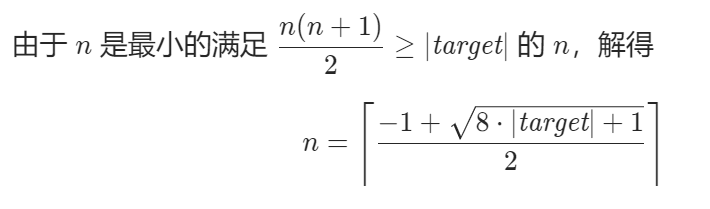
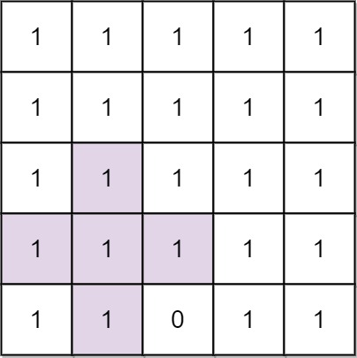

# 记录每日一题

## 2022.11.4

### 754.到达终点数字

#### 题干

在一根无限长的数轴上，你站在**0**的位置，终点在**target**的位置。

你可以做一些数量的移动 **numMoves** :

- 每次你可以选择向左或向右移动。
- 第 **i** 次移动（从  i == **1** 开始，到 i == **numMoves** ），在选择的方向上走 **i** 步。

给定整数 **target** ，返回：到达目标所需的最小移动次数(即最小 **numMoves**）

**示例**

```
输入: target = 2
输出: 3
解释:
第一次移动，从 0 到 1; 第二次移动，从 1 到 -1; 第三次移动，从 -1 到 2 。
```

```
输入: target = 3
输出: 2
解释:
第一次移动，从 0 到 1; 第二次移动，从 1 到 3 。
```

#### 解法

本题主要偏向于数学计算，代码性不强。

首先target关于0对称，因此正负与**numMoves**无关，为便于计算，将**target**统一为正数。

分析从最简单的情况开始：

- **向右走numMoves步**

1. 未达到**target**。那就继续走。
2. 正好达到**target**。此时**numMoves**为最小值，return。
3. 越过了**target**。

- **越过target后，到达dist。同有三种情况**

1. **dist**与**target**差值为偶数，最好解决，只需要将某些步的方向变为左，一加变一减，就可以弥补差值，正好到达target。此时返回值不变，仍为 **numMoves** 。
2. 差值为奇数，此时需要 **numMoves++** ，多走一步，若差值变为偶数（**此时差值为奇数，走的步长也为奇数，和就是偶数**），则问题转化为上1，返回值为 **numMoves + 1** 。
3. 多走一步，差值仍为奇数，此时再走一步，差值必然变为偶数（同上，**走两步的步长必然是一奇一偶，奇数+奇数必是偶数**），转化为上1，返回值为**numMoves + 2**。

以上，代码转化为判断**numMoves**当前的步长和是否越过了target，以及越过后与target的差值的奇偶。

#### 代码

```c++
int reachNumber(int target) {
    target = abs(target);
    int dist = 0, numMoves = 0;
    while(dist < target || (dist - target) % 2){
        numMoves++;
        dist += numMoves;
    }
    return numMoves;
}
```

#### 优化



```c++
int reachNumber(int target) {
    target = abs(target);
    int n = ceil((-1 + sqrt(8L * target + 1)) / 2); // 注意 8*target 会超过 int 范围
    return (n * (n + 1) / 2 - target) % 2 == 0 ? n : n + 1 + n % 2;
}
```


## 2022.11.7

### 816.模糊坐标

#### 题干

我们有一些二维坐标，如 **"(1, 3)"** 或 "(2, 0.5)"，然后我们移除所有逗号，小数点和空格，得到一个字符串S。返回所有可能的原始字符串到一个列表中。

原始的坐标表示法不会存在多余的零，所以不会出现类似于**"00", "0.0", "0.00", "1.0", "001", "00.01"**或一些其他更小的数来表示坐标。此外，一个小数点前至少存在一个数，所以也不会出现**“.1”**形式的数字。

最后返回的列表可以是任意顺序的。而且注意返回的两个数字中间（逗号之后）都有一个空格。

**示例**

```
示例 1:
输入: "(123)"
输出: ["(1, 23)", "(12, 3)", "(1.2, 3)", "(1, 2.3)"]
```

```
示例 2:
输入: "(00011)"
输出:  ["(0.001, 1)", "(0, 0.011)"]
解释: 0.0, 00, 0001 或 00.01 是不被允许的。
```

```
示例 3:
输入: "(100)"
输出: [(10, 0)]
解释: 1.0 是不被允许的
```

#### 解法

本题实际是两次二分，先将字符串用 **“, ”** 分为两部分，再用 **“.”** 分别插入到这两部分中的每个位置，判断是否为一个符合要求的字符串。

最简单的暴力解法：

1. for循环从每个位置将字符串分为A、B两部分；
2. 对每个A、B，再次for循环从每个位置插入  **“.”** ，将符合要求的字符串分别存入vector；
3. 最后用双for循环从两个vector中取值排列组合，存入返回值的vector中。

仅在插入 **“.”** 时，需要考虑以下异常情况：

- 若A、B为 **“0”** 或**首位非0**，则其整体为一个有效字符串存储。
- for循环插入小数点时，若遇到**首位为0**时，仅允许在0后插入。
- for循环插入小数点时，若遇到**末位为0**时，不允许插入。

**有限状态机：**


#### 代码

```c++
class Solution {
public:
    vector<string> classifyNumber(string s){
        vector<string> rst;
        if(s == "0" || s[0] != '0') rst.push_back(s);
        for(int i = 1; i < s.size(); ++i){
            if(i != 1 && s[0] == '0' || s.back() == '0') continue;
            rst.push_back(s.substr(0, i) + "." + s.substr(i));
        }
        return rst; 
    }
    vector<string> ambiguousCoordinates(string s) {
        vector<string> rst;
        s = s.substr(1, s.size() - 2);
        for(int i = 1; i < s.size(); ++i){
            vector<string> lnum = classifyNumber(s.substr(0, i));
            if(lnum.empty())    continue;
            vector<string> rnum = classifyNumber(s.substr(i));
            if(rnum.empty())    continue;
            for(int i = 0; i < lnum.size(); i++){
                for(int j = 0; j < rnum.size(); j++){
                    rst.push_back("(" + lnum[i] + ", " + rnum[j] + ")");
                }
            }
        }
        return rst;
    }
};
```

for循环中，相比于**++i**，**i++**需要多开辟一个**临时变量来存储i自加后的值**，因此前者性能更好。


## 2022.11.8

### 1684.统一一致字符串的数目

#### 题干

给你一个由不同字符组成的字符串 **allowed** 和一个字符串数组 **words 。如果**一个字符串的每一个字符都在 **allowed** 中，就称这个字符串是 一致字符串 。

请你返回 **words** 数组中 **一致字符串** 的数目。

**示例**

```
示例 1:
输入：allowed = "ab", words = ["ad","bd","aaab","baa","badab"]
输出：2
解释：字符串 "aaab" 和 "baa" 都是一致字符串，因为它们只包含字符 'a' 和 'b' 。
```

```
示例 2:
输入：allowed = "abc", words = ["a","b","c","ab","ac","bc","abc"]
输出：7
解释：所有字符串都是一致的。
```

```
示例 3:
输入：allowed = "cad", words = ["cc","acd","b","ba","bac","bad","ac","d"]
输出：4
解释：字符串 "cc"，"acd"，"ac" 和 "d" 是一致字符串。
```

#### 解法

本题实际是如何判断一个字符串中的每个字符是否都在另一个字符串中出现过的问题。

最简单的暴力解法就是循环words中字符串的每个字符与allowed中的每个字符进行比较，看是否都能匹配上，全匹配上了计数加一。有无法匹配到的跳出循环，判断该字符串为不一致。

**解法2：位运算**

定义一个32位的int变量，26个字符，各占一位，占据低26位；通过将字符与 **'a'** 作差计算相应字符需要向左移位多少。某一位为1，表示该位对应的字符存在。

计算出**allowed**字符串对应的int值**standard**，和**words**中的每个字符串对应的值作或运算，若仍为**standard**原值，说明该字符串的字符均在**allowed**中，计数num++。

**相比于暴力循环，在内存消耗差不多的情况下，提高了1/3速度。**

#### 代码

```c++
class Solution {
public:
    int countConsistentStrings(string allowed, vector<string>& words) {
        int num = 0;
        auto convert = [](string& str){
            int rst = 0;
            for(int i = 0; i < str.length(); ++i){
                rst |= 1 << (str[i] - 'a');
            }
            return rst;
        };
        int standard = convert(allowed);
        for(int i = 0; i < words.size(); ++i){
            if (standard == (standard | convert(words[i])))
                num++;
        }
        return num;
    }
};
```

这里使用了匿名函数的方式来封装统一的转换方法。好处是可以免去函数的声明和定义。这样匿名函数**仅在调用函数的时候才会创建函数对象，而调用结束后立即释放**，所以匿名函数比非匿名函数**更节省空间**。


## 2022.11.9

### 764.最大加号标志

#### 题干

在一个 **n x n** 的矩阵 **grid** 中，除了在数组 **mines** 中给出的元素为 0，其他每个元素都为 1。**mines[i] = [xi, yi]**表示 **grid\[xi][yi] == 0**

返回  **grid** 中包含 1 的**最大的 轴对齐 加号标志**的阶数 。如果未找到加号标志，则返回 0 。

一个 **k** 阶由 1 组成的 “轴对称”加号标志 具有中心网格 **grid\[r][c] == 1** ，以及4个从中心向上、向下、向左、向右延伸，长度为 **k-1**，由 1 组成的臂。注意，只有加号标志的所有网格要求为 1 ，别的网格可能为 0 也可能为 1 。

**示例**



```
示例 1:
输入: n = 5, mines = [[4, 2]]
输出: 2
解释: 在上面的网格中，最大加号标志的阶只能是2。一个标志已在图中标出。
```


```
示例 2:
输入: n = 1, mines = [[0, 0]]
输出: 0
解释: 没有加号标志，返回 0 。
```

#### 解法

本题实际是一个动态规划问题。动态规划的核心思想就是——**拆分子问题，记住过往，减少重复计算**

题中要求十字的最大阶数，但实际上**最大阶数是由中心到四个方向上的连续1数量中的最小值决定的。**那么问题转变为了：先求每个点为中心到四个方向上的连续1数量中的最小值，再从中取最大值。

如何求四个方向的最小值？假设简化一下，只求左方向的值怎么求？只需要计算每个点左边最长的连续1的格子数，那么十字就是上述的四次重复。初始化时先假设每个点连续1的数量均为网格的宽度n（即最大值），维护一个**自加变量left**记录连续1的数量。当在一行中从左向右遍历时，如果**遇到0，自加变量清零，否则left++。**每次自加后与原先该点记录的值取最小值，更新该点的值。

在重复时，同一个点都会经过四个方向的遍历，但只会保留到四个方向里面的最小值了。遍历结束后，得到一个二维的记录每个点最大十字阶数的向量，取里面的最大值即可。

#### 代码

```c++
class Solution {
public:
    int orderOfLargestPlusSign(int n, vector<vector<int>>& mines) {
        // 初始化矩阵
        vector<vector<int> > grid(n, vector<int>(n, n));
        for(int i = 0; i < mines.size(); ++i)
            grid[mines[i][0]][mines[i][1]] = 0;
        // 遍历
        int left, right, top, bottom;
        for(int i = 0; i < n; ++i){
            left = 0; right = 0; top = 0; bottom = 0;
            for(int j = 0, k = n - 1; j < n; ++j, --k){
                left = grid[i][j] ? left + 1 : 0;
                right = grid[i][k] ? right + 1 : 0;
                top = grid[j][i] ? top + 1 : 0;
                bottom = grid[k][i] ? bottom + 1 : 0;
                grid[i][j] = left < grid[i][j] ? left : grid[i][j];
                grid[i][k] = right < grid[i][k] ? right : grid[i][k];
                grid[j][i] = top < grid[j][i] ? top : grid[j][i];
                grid[k][i] = bottom < grid[k][i] ? bottom : grid[k][i];
            }
        }
        int max = 0;
        for(int i = 0; i < n; ++i){
            for(int j = 0; j < n; ++j){
                if (max < grid[i][j])   max = grid[i][j];
            }
        }
        return max;
    }
};
```

注：vector的初始化方式。

vector采用

```c++
for(auto& item : vector)
```

的形式遍历较为方便，但是速度较普通for循环更慢，但是不用担心越界问题。


## 2022.11.11

### 1704.判断字符串的两半是否相似

#### 题干

给你一个偶数长度的字符串 **s** 。将其拆分成长度相同的两半，前一半为 **a** ，后一半为 **b** 。

两个字符串 **相似** 的前提是它们都含有**相同数目的元音**（**'a'，'e'，'i'，'o'，'u'，'A'，'E'，'I'，'O'，'U'**）。注意，**s** 可能同时含有大写和小写字母。

如果 **a** 和 **b** 相似，返回 **true** ；否则，返回 **false** 。

**示例**

```
示例 1:
输入：s = "book"
输出：true
解释：a = "bo" 且 b = "ok" 。a 中有 1 个元音，b 也有 1 个元音。所以，a 和 b 相似。
```

```
示例 2:
输入：s = "textbook"
输出：false
解释：a = "text" 且 b = "book" 。a 中有 1 个元音，b 中有 2 个元音。因此，a 和 b 不相似。
```

#### 解法

本题实际就是一次for循环，对字符串s的每个字符判断一次是否为元音即可，中间记录下前后半的元音个数。

可优化的点在于

1.不必for循环整个字符串，由于a、b长度相同，可以只**for循环前一半**（类似双指针？）。

2.只需**维护一个变量**记录元音数量即可，左加右减，节约内存。

#### 代码

```c++
class Solution {
public:
    bool halvesAreAlike(string s) {
        auto isVowel = [](char c){
            int val = c - 'A';
            if (val == 0 || val == 4 || val == 8 || val == 14 || val == 20 
             || val == 32 || val == 36 || val == 40 || val == 46 || val == 52 )
                return true;
            else
                return false;
        };
        int cnt = 0;
        int len = s.length() / 2;
        for(int i = 0; i < len; ++i){
            cnt += isVowel(s[i]) ? 1 : 0;
            cnt -= isVowel(s[i + len]) ? 1 : 0;
        }
        return cnt == 0;
    }
};
```

我这里直接写了个匿名函数通过ASCII的差值判断是否为元音，还可以用**集合**。

```c++
unordered_set<char> vowels = {'a', 'e', 'i', 'o', 'u', 'A', 'E', 'I', 'O', 'U'};
cnt += vowels.count(s[i]);
```


## 2022.12.6

### 1805.字符串中不同整数的数目

#### 题干

给你一个字符串 **word** ，该字符串由**数字**和**小写英文字母**组成。

请你用空格替换每个不是数字的字符。例如，**"a123bc34d8ef34"** 将会变成 **" 123  34 8  34"** 。注意，剩下的这些整数为（相邻彼此至少有一个空格隔开）：**"123"、"34"、"8"** 和 **"34"** 。

返回对 **word** 完成替换后形成的 **不同** 整数的数目。

只有当两个整数的 **不含前导零** 的十进制表示不同， 才认为这两个整数也不同。

**示例**

```
示例 1:
输入：word = "a123bc34d8ef34"
输出：3
解释：不同的整数有 "123"、"34" 和 "8" 。注意，"34" 只计数一次。
```

```
示例 2:
输入：word = "leet1234code234"
输出：2
```

```
示例 3:
输入：word = "a1b01c001"
输出：1
解释："1"、"01" 和 "001" 视为同一个整数的十进制表示，因为在比较十进制值时会忽略前导零的存在。
```

#### 解法

本题解法就是双指针和C++集合不能有重复项特点的应用。

先用一个头指针 **i** ，for循环遍历字符串的每一项，判断是否为数字（ASCII码值小于58，0~9是48~57），如果为数字，进行三步操作：

1.使用另一个指针 **j** ，从 **i** 处开始向后扫，直到扫到非数字字符。

2.移动 **i** ，从该串数字的最高位开始判断有无0，有前导0的位全部去掉。

3.将过滤后的字符串加入集合Set中。

#### 代码

```c++
class Solution {
public:
    int numDifferentIntegers(string word) {
        set<string> nums;
        int j, len = word.length();
        for(int i = 0; i < len; i++){
            if(word[i] < 58){
                j = i;
                while(word[j] < 58 && j < len)  j++;
                while(word[i] == 48 && j - i > 1)  i++;
                nums.insert(word.substr(i, j - i));
                i = j;
            }
        }
        return nums.size();
    }
};
```


## 2022.12.7

### 1775.通过最少操作次数使数组的和相等

#### 题干

给你两个长度可能不等的整数数组 **nums1** 和 **nums2** 。两个数组中的所有值都在 **1** 到 **6** 之间（**包含 1 和 6**）。

每次操作中，你可以选择 **任意** 数组中的**任意一个整数**，将它变成 **1** 到 **6** 之间 **任意** 的值（**包含 1 和 6**）。

请你返回使 **nums1** 中所有数的和与 **nums2** 中所有数的和**相等的最少操作次数**。如果无法使两个数组的和相等，请返回 **-1** 。

**示例**

```
示例 1:
输入：nums1 = [1,2,3,4,5,6], nums2 = [1,1,2,2,2,2]
输出：3
解释：你可以通过 3 次操作使 nums1 中所有数的和与 nums2 中所有数的和相等。以下数组下标都从 0 开始。
- 将 nums2[0] 变为 6 。 nums1 = [1,2,3,4,5,6], nums2 = [6,1,2,2,2,2] 。
- 将 nums1[5] 变为 1 。 nums1 = [1,2,3,4,5,1], nums2 = [6,1,2,2,2,2] 。
- 将 nums1[2] 变为 2 。 nums1 = [1,2,2,4,5,1], nums2 = [6,1,2,2,2,2] 。
```

```
示例 2:
输入：nums1 = [1,1,1,1,1,1,1], nums2 = [6]
输出：-1
解释：没有办法减少 nums1 的和或者增加 nums2 的和使二者相等。
```

```
示例 3:
输入：nums1 = [6,6], nums2 = [1]
输出：3
解释：你可以通过 3 次操作使 nums1 中所有数的和与 nums2 中所有数的和相等。以下数组下标都从 0 开始。
- 将 nums1[0] 变为 2 。 nums1 = [2,6], nums2 = [1] 。
- 将 nums1[1] 变为 2 。 nums1 = [2,2], nums2 = [1] 。
- 将 nums2[0] 变为 4 。 nums1 = [2,2], nums2 = [4] 。
```

#### 解法

本题用到了贪心思想，即**一个问题拆解成多个步骤，每个步骤采用最优的解法。**

在本题中，要让两个数组以最少步骤达到和相同，就代表每一步缩小的差距越大越好，也就是**优先把和小的数组里的 1 变成 6 ，把和大的数组中的 6 变成 1.**以此类推，接下来是5、2；4、3······当走到其中一步时差距缩小为非正数时，说明该步就是最后一步了。

并且1变6和6变1的意义是相同的，都是缩小了5的差距，因此从节约空间的角度考虑，可以只维护一个长度为6的1维数组，记录操作的分布情况（缩小543210的差距）。

#### 代码

```c++
class Solution {
public:
    int minOperations(vector<int>& nums1, vector<int>& nums2) {
        int diff = accumulate(nums1.begin(), nums1.end(), 0) - accumulate(nums2.begin(), nums2.end(), 0);
        if (diff < 0)    return minOperations(nums2, nums1);
        if (diff == 0)   return 0;
        int cnt[6] = {0};
        int i = 0, count = 0;
        for(;i < nums1.size();++i) ++cnt[nums1[i] - 1];
        for(i = 0;i < nums2.size();++i) ++cnt[6 - nums2[i]];
        for(i = 5;i > 0; --i){
            while(cnt[i] > 0 && diff > 0){
                diff -= i;
                --cnt[i];
                count++;
            }
        }
        return diff > 0 ? -1 : count;
    }
};
```

accumulate属于numeric头文件，作用是计算数组或C++容器指定地址范围内的成员的和。

参数1、2分别为 **容器 / 数组 指向要计算的第一个元素和最后一个元素的 迭代器 / 首地址** ，参数3为**累加的初始值**。

这里为了下面for循环存储操作的分布情况，固定了nums1的和要大于nums2；若是小于，就**调换输入顺序重新执行函数**（这里测试过，相比于swap调换两个vector，这种方式要快一些）。这里心机的把 **diff == 0** 的情况放在了 **diff < 0** 下面，大部分情况下应该都是不相等的，这样可以少点计算量（dog）。


## 2022.12.9

### 1780.判断一个数字是否可以表示成三的幂的和

#### 题干

给你一个整数 **n** ，如果你可以将 **n** 表示成若干个**不同的三的幂之和**，请你返回 **true** ，否则请返回 **false** 。

对于一个整数 **y** ，如果存在整数 **x** 满足 **y == 3^x** ，我们称这个整数 **y** 是三的**幂**。

**示例**

```
示例 1:
输入：n = 12
输出：true
解释：12 = 3^1 + 3^2
```

```
示例 2:
输入：n = 91
输出：true
解释：91 = 3^0 + 3^2 + 3^4
```

```
示例 3:
输入：n = 21
输出：false 
```

#### 解法

基本思路：

看示例1可知，满足条件的数为3的不同次幂的和，那么必然**能被3整除**，看示例2可知另一情况，**3^0为1**，也就是**除以3余数为1**，但是也满足条件。**当示例1中除以3，得到4，又变成了示例2的情况，即3^0 + 3的幂。**

于是得到满足条件的整数一定具有以下性质：

1. 除以3以后余数必为1或0；
2. 性质1得到的商依旧满足性质1，直至商为0。

#### 代码

```c++
class Solution {
public:
    bool checkPowersOfThree(int n) {
        while(n){
            if (n % 3 == 2) return false;
            n /= 3;
        }
        return true;
    }
};
```


## 2023.2.8

### 1233.删除子文件夹（未完结）

#### 题干

你是一位系统管理员，手里有一份文件夹列表 **folder**，你的任务是要删除该列表中的所有 **子文件夹**，并以 **任意顺序** 返回剩下的文件夹。

如果文件夹 **folder[i]** 位于另一个文件夹 **folder[j]** 下，那么 **folder[i]** 就是 **folder[j]** 的 子文件夹 。

文件夹的**「路径」**是由一个或多个按以下格式串联形成的字符串：**'/'** 后跟**一个或者多个小写英文字母**。

例如，"**/leetcode**" 和 "**/leetcode/problems**" 都是有效的路径，而**空字符串和 "/" 不是**。

**示例**

```
示例 1:
输入：folder = ["/a","/a/b","/c/d","/c/d/e","/c/f"]
输出：["/a","/c/d","/c/f"]
解释："/a/b" 是 "/a" 的子文件夹，而 "/c/d/e" 是 "/c/d" 的子文件夹。
```

```
示例 2:
输入：folder = ["/a","/a/b/c","/a/b/d"]
输出：["/a"]
解释：文件夹 "/a/b/c" 和 "/a/b/d" 都会被删除，因为它们都是 "/a" 的子文件夹。
```

```
示例 3:
输入: folder = ["/a/b/c","/a/b/ca","/a/b/d"]
输出: ["/a/b/c","/a/b/ca","/a/b/d"]
```

#### 解法

基本思路：

先按照字典序排序（/a，/a/b，/a/b/c，/b），这样在遍历时只需要和上一个被加入的非子文件夹比较（因为相同根文件夹情况下先短后长排序），便于排除。

将第一个文件夹加入输出，遍历**folder**中的剩余文件夹，作如下判断：

1.当前字符串长度比上一个被加入的字符串**短**的，必然是根文件夹名改变了，是非子文件夹，**加入**。

2.当前字符串的前n个字符与上一个被加入的字符串完全相同且**第n+1个字符为 ‘/’ 的**，必然是子文件夹，**排除**。

**解法2：字典树**


#### 代码

```c++
class Solution {
public:
    vector<string> removeSubfolders(vector<string>& folder) {
        sort(folder.begin(), folder.end());
        vector<string> rst = {folder[0]};
        for(int i = 1; i < folder.size(); ++i){
            int ori_len = rst.back().size();
            int cur_len = folder[i].size();
            if (ori_len >= cur_len || !(rst.back() == folder[i].substr(0, ori_len) && folder[i][ori_len] == '/'))
                rst.push_back(folder[i]);
        }
        return rst;
    }
};
```


## 2023.2.9

### 1797.设计一个验证系统

#### 题干

你需要设计一个包含验证码的验证系统。每一次验证中，用户会收到一个新的验证码，这个验证码在 **currentTime** 时刻之后 **timeToLive** 秒过期。如果验证码被更新了，那么它会在 **currentTime** （可能与之前的 currentTime 不同）时刻延长 **timeToLive** 秒。

请你实现 **AuthenticationManager 类**：

- AuthenticationManager(int timeToLive) 构造 AuthenticationManager 并设置 timeToLive 参数。
- generate(string tokenId, int currentTime) 给定 tokenId ，在当前时间 currentTime 生成一个新的验证码。
- renew(string tokenId, int currentTime) 将给定 tokenId 且 未过期 的验证码在 currentTime 时刻更新。如果给定 tokenId 对应的验证码不存在或已过期，请你忽略该操作，不会有任何更新操作发生。
- countUnexpiredTokens(int currentTime) 请返回在给定 currentTime 时刻，未过期 的验证码数目。
- 如果一个验证码在时刻 t 过期，且另一个操作恰好在时刻 t 发生（renew 或者 countUnexpiredTokens 操作），过期事件 优先于 其他操作。
- 所有 `generate` 函数的调用都会包含独一无二的 `tokenId` 值。
- 所有函数调用中，`currentTime` 的值 **严格递增** 。
- 所有函数的调用次数总共不超过 `2000` 次。

**示例**

```
输入：
["AuthenticationManager", "renew", "generate", "countUnexpiredTokens", "generate", "renew", "renew", "countUnexpiredTokens"]
[[5], ["aaa", 1], ["aaa", 2], [6], ["bbb", 7], ["aaa", 8], ["bbb", 10], [15]]
输出：
[null, null, null, 1, null, null, null, 0]

解释：
AuthenticationManager authenticationManager = new AuthenticationManager(5); // 构造 AuthenticationManager ，设置 timeToLive = 5 秒。
authenticationManager.renew("aaa", 1); // 时刻 1 时，没有验证码的 tokenId 为 "aaa" ，没有验证码被更新。
authenticationManager.generate("aaa", 2); // 时刻 2 时，生成一个 tokenId 为 "aaa" 的新验证码。
authenticationManager.countUnexpiredTokens(6); // 时刻 6 时，只有 tokenId 为 "aaa" 的验证码未过期，所以返回 1 。
authenticationManager.generate("bbb", 7); // 时刻 7 时，生成一个 tokenId 为 "bbb" 的新验证码。
authenticationManager.renew("aaa", 8); // tokenId 为 "aaa" 的验证码在时刻 7 过期，且 8 >= 7 ，所以时刻 8 的renew 操作被忽略，没有验证码被更新。
authenticationManager.renew("bbb", 10); // tokenId 为 "bbb" 的验证码在时刻 10 没有过期，所以 renew 操作会执行，该 token 将在时刻 15 过期。
authenticationManager.countUnexpiredTokens(15); // tokenId 为 "bbb" 的验证码在时刻 15 过期，tokenId 为 "aaa" 的验证码在时刻 7 过期，所有验证码均已过期，所以返回 0 。
```

#### 解法

基本思路：

采用**哈希表**存储 [tokenId，过期时间点] 这一键值对，保存信息。

因为提到了currentTime是严格递增的，因此在存储id时可以不用队列，直接用顺序表存储。

因为函数总调用次数不超过2000次，因此甚至不需要对表进行维护（即删除过期id）。

#### 代码

```c++
class AuthenticationManager {
public:
    AuthenticationManager(int timeToLive) {
        liveTime = timeToLive;
    }
    
    void generate(string tokenId, int currentTime) {
        liveIds[tokenId] = currentTime + liveTime;
    }
    
    void renew(string tokenId, int currentTime) {
        if (liveIds[tokenId] > currentTime)
            generate(tokenId, currentTime);
    }
    
    int countUnexpiredTokens(int currentTime) {
        int cnt = 0;
        for (auto iter = liveIds.begin(); iter != liveIds.end(); ++iter) {
            if (iter->second > currentTime)
                cnt++;
        }
        return cnt;
    }
private:
    int liveTime;
    unordered_map<string, int> liveIds;
};

/**
 * Your AuthenticationManager object will be instantiated and called as such:
 * AuthenticationManager* obj = new AuthenticationManager(timeToLive);
 * obj->generate(tokenId,currentTime);
 * obj->renew(tokenId,currentTime);
 * int param_3 = obj->countUnexpiredTokens(currentTime);
 */
```


## 2023.2.11

### 2335.装满杯子所需的最短总时长

#### 题干

现有一台饮水机，可以制备冷水、温水和热水。每秒钟，可以装满 2 杯 **不同** 类型的水或者 1 杯**任意类型**的水。

给你一个**下标从 0 开始、长度为 3** 的整数数组 **amount** ，其中 **amount[0]、amount[1] 和 amount[2]** 分别表示需要装满冷水、温水和热水的杯子数量。返回装满所有杯子所需的 **最少** 秒数。

**示例**

```
示例 1:
输入：amount = [1,4,2]
输出：4
解释：下面给出一种方案：
第 1 秒：装满一杯冷水和一杯温水。
第 2 秒：装满一杯温水和一杯热水。
第 3 秒：装满一杯温水和一杯热水。
第 4 秒：装满一杯温水。
可以证明最少需要 4 秒才能装满所有杯子。
```

```
示例 2:
输入：amount = [5,4,4]
输出：7
```

```
示例 3:
输入：amount = [5,0,0]
输出：5
```

#### 解法

基本思路：

简单的贪心算法。每次循环先排序，取较大的两个各减一，直至全为0.


#### 代码

```c++
class Solution {
public:
    int fillCups(vector<int>& amount) {
        int turns = 0;
        while(amount[0] + amount[1] + amount[2]) {
            sort(amount.begin(), amount.end());
            turns++;
            amount[2]--;
            if (amount[1] > 0)
                amount[1]--;
        }
        return turns;
    }
};
```

