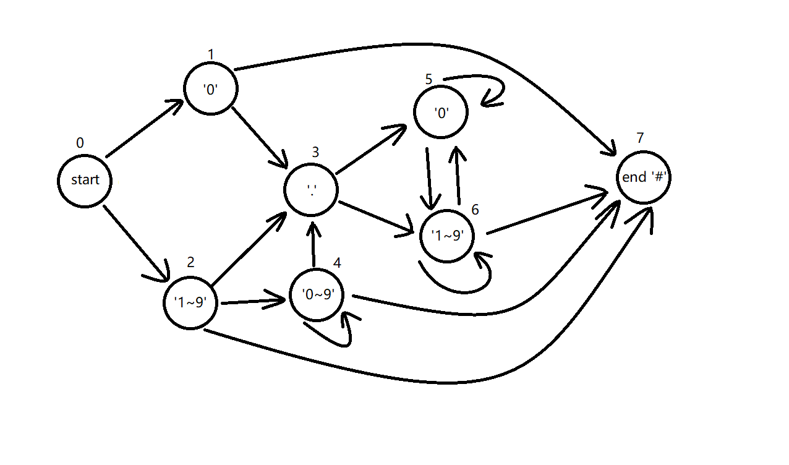
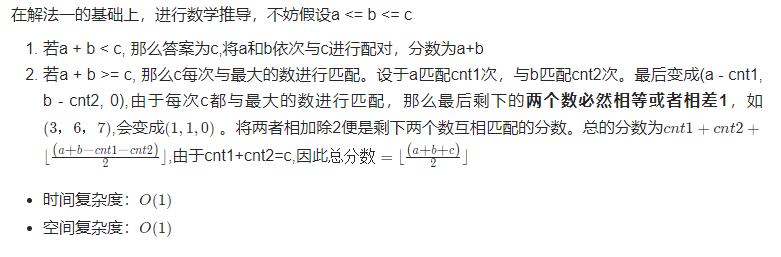
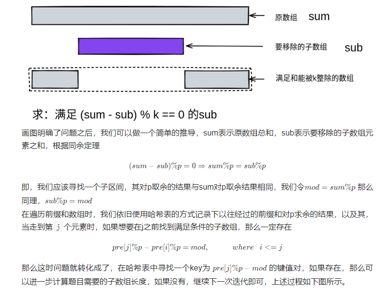

# 记录每日一题

## 2022.11.4

### 754.到达终点数字

#### 题干

在一根无限长的数轴上，你站在**0**的位置，终点在**target**的位置。

你可以做一些数量的移动 **numMoves** :

- 每次你可以选择向左或向右移动。
- 第 **i** 次移动（从  i == **1** 开始，到 i == **numMoves** ），在选择的方向上走 **i** 步。

给定整数 **target** ，返回：到达目标所需的最小移动次数(即最小 **numMoves**）

**示例**

```
输入: target = 2
输出: 3
解释:
第一次移动，从 0 到 1; 第二次移动，从 1 到 -1; 第三次移动，从 -1 到 2 。
```

```
输入: target = 3
输出: 2
解释:
第一次移动，从 0 到 1; 第二次移动，从 1 到 3 。
```

#### 解法

本题主要偏向于数学计算，代码性不强。

首先target关于0对称，因此正负与**numMoves**无关，为便于计算，将**target**统一为正数。

分析从最简单的情况开始：

- **向右走numMoves步**

1. 未达到**target**。那就继续走。
2. 正好达到**target**。此时**numMoves**为最小值，return。
3. 越过了**target**。

- **越过target后，到达dist。同有三种情况**

1. **dist**与**target**差值为偶数，最好解决，只需要将某些步的方向变为左，一加变一减，就可以弥补差值，正好到达target。此时返回值不变，仍为 **numMoves** 。
2. 差值为奇数，此时需要 **numMoves++** ，多走一步，若差值变为偶数（**此时差值为奇数，走的步长也为奇数，和就是偶数**），则问题转化为上1，返回值为 **numMoves + 1** 。
3. 多走一步，差值仍为奇数，此时再走一步，差值必然变为偶数（同上，**走两步的步长必然是一奇一偶，奇数+奇数必是偶数**），转化为上1，返回值为**numMoves + 2**。

以上，代码转化为判断**numMoves**当前的步长和是否越过了target，以及越过后与target的差值的奇偶。

#### 代码

```c++
int reachNumber(int target) {
    target = abs(target);
    int dist = 0, numMoves = 0;
    while(dist < target || (dist - target) % 2){
        numMoves++;
        dist += numMoves;
    }
    return numMoves;
}
```

#### 优化


```c++
int reachNumber(int target) {
    target = abs(target);
    int n = ceil((-1 + sqrt(8L * target + 1)) / 2); // 注意 8*target 会超过 int 范围
    return (n * (n + 1) / 2 - target) % 2 == 0 ? n : n + 1 + n % 2;
}
```


## 2022.11.7

### 816.模糊坐标

#### 题干

我们有一些二维坐标，如 **"(1, 3)"** 或 "(2, 0.5)"，然后我们移除所有逗号，小数点和空格，得到一个字符串S。返回所有可能的原始字符串到一个列表中。

原始的坐标表示法不会存在多余的零，所以不会出现类似于**"00", "0.0", "0.00", "1.0", "001", "00.01"**或一些其他更小的数来表示坐标。此外，一个小数点前至少存在一个数，所以也不会出现**“.1”**形式的数字。

最后返回的列表可以是任意顺序的。而且注意返回的两个数字中间（逗号之后）都有一个空格。

**示例**

```
示例 1:
输入: "(123)"
输出: ["(1, 23)", "(12, 3)", "(1.2, 3)", "(1, 2.3)"]
```

```
示例 2:
输入: "(00011)"
输出:  ["(0.001, 1)", "(0, 0.011)"]
解释: 0.0, 00, 0001 或 00.01 是不被允许的。
```

```
示例 3:
输入: "(100)"
输出: [(10, 0)]
解释: 1.0 是不被允许的
```

#### 解法

本题实际是两次二分，先将字符串用 **“, ”** 分为两部分，再用 **“.”** 分别插入到这两部分中的每个位置，判断是否为一个符合要求的字符串。

最简单的暴力解法：

1. for循环从每个位置将字符串分为A、B两部分；
2. 对每个A、B，再次for循环从每个位置插入  **“.”** ，将符合要求的字符串分别存入vector；
3. 最后用双for循环从两个vector中取值排列组合，存入返回值的vector中。

仅在插入 **“.”** 时，需要考虑以下异常情况：

- 若A、B为 **“0”** 或**首位非0**，则其整体为一个有效字符串存储。
- for循环插入小数点时，若遇到**首位为0**时，仅允许在0后插入。
- for循环插入小数点时，若遇到**末位为0**时，不允许插入。

**有限状态机：**



#### 代码

```c++
class Solution {
public:
    vector<string> classifyNumber(string s){
        vector<string> rst;
        if(s == "0" || s[0] != '0') rst.push_back(s);
        for(int i = 1; i < s.size(); ++i){
            if(i != 1 && s[0] == '0' || s.back() == '0') continue;
            rst.push_back(s.substr(0, i) + "." + s.substr(i));
        }
        return rst; 
    }
    vector<string> ambiguousCoordinates(string s) {
        vector<string> rst;
        s = s.substr(1, s.size() - 2);
        for(int i = 1; i < s.size(); ++i){
            vector<string> lnum = classifyNumber(s.substr(0, i));
            if(lnum.empty())    continue;
            vector<string> rnum = classifyNumber(s.substr(i));
            if(rnum.empty())    continue;
            for(int i = 0; i < lnum.size(); i++){
                for(int j = 0; j < rnum.size(); j++){
                    rst.push_back("(" + lnum[i] + ", " + rnum[j] + ")");
                }
            }
        }
        return rst;
    }
};
```

for循环中，相比于**++i**，**i++**需要多开辟一个**临时变量来存储i自加后的值**，因此前者性能更好。


## 2022.11.8

### 1684.统一一致字符串的数目

#### 题干

给你一个由不同字符组成的字符串 **allowed** 和一个字符串数组 **words 。如果**一个字符串的每一个字符都在 **allowed** 中，就称这个字符串是 一致字符串 。

请你返回 **words** 数组中 **一致字符串** 的数目。

**示例**

```
示例 1:
输入：allowed = "ab", words = ["ad","bd","aaab","baa","badab"]
输出：2
解释：字符串 "aaab" 和 "baa" 都是一致字符串，因为它们只包含字符 'a' 和 'b' 。
```

```
示例 2:
输入：allowed = "abc", words = ["a","b","c","ab","ac","bc","abc"]
输出：7
解释：所有字符串都是一致的。
```

```
示例 3:
输入：allowed = "cad", words = ["cc","acd","b","ba","bac","bad","ac","d"]
输出：4
解释：字符串 "cc"，"acd"，"ac" 和 "d" 是一致字符串。
```

#### 解法

本题实际是如何判断一个字符串中的每个字符是否都在另一个字符串中出现过的问题。

最简单的暴力解法就是循环words中字符串的每个字符与allowed中的每个字符进行比较，看是否都能匹配上，全匹配上了计数加一。有无法匹配到的跳出循环，判断该字符串为不一致。

**解法2：位运算**

定义一个32位的int变量，26个字符，各占一位，占据低26位；通过将字符与 **'a'** 作差计算相应字符需要向左移位多少。某一位为1，表示该位对应的字符存在。

计算出**allowed**字符串对应的int值**standard**，和**words**中的每个字符串对应的值作或运算，若仍为**standard**原值，说明该字符串的字符均在**allowed**中，计数num++。

**相比于暴力循环，在内存消耗差不多的情况下，提高了1/3速度。**

#### 代码

```c++
class Solution {
public:
    int countConsistentStrings(string allowed, vector<string>& words) {
        int num = 0;
        auto convert = [](string& str){
            int rst = 0;
            for(int i = 0; i < str.length(); ++i){
                rst |= 1 << (str[i] - 'a');
            }
            return rst;
        };
        int standard = convert(allowed);
        for(int i = 0; i < words.size(); ++i){
            if (standard == (standard | convert(words[i])))
                num++;
        }
        return num;
    }
};
```

这里使用了匿名函数的方式来封装统一的转换方法。好处是可以免去函数的声明和定义。这样匿名函数**仅在调用函数的时候才会创建函数对象，而调用结束后立即释放**，所以匿名函数比非匿名函数**更节省空间**。


## 2022.11.9

### 764.最大加号标志

#### 题干

在一个 **n x n** 的矩阵 **grid** 中，除了在数组 **mines** 中给出的元素为 0，其他每个元素都为 1。**mines[i] = [xi, yi]**表示 **grid\[xi][yi] == 0**

返回  **grid** 中包含 1 的**最大的 轴对齐 加号标志**的阶数 。如果未找到加号标志，则返回 0 。

一个 **k** 阶由 1 组成的 “轴对称”加号标志 具有中心网格 **grid\[r][c] == 1** ，以及4个从中心向上、向下、向左、向右延伸，长度为 **k-1**，由 1 组成的臂。注意，只有加号标志的所有网格要求为 1 ，别的网格可能为 0 也可能为 1 。

**示例**


```
示例 1:
输入: n = 5, mines = [[4, 2]]
输出: 2
解释: 在上面的网格中，最大加号标志的阶只能是2。一个标志已在图中标出。
```


```
示例 2:
输入: n = 1, mines = [[0, 0]]
输出: 0
解释: 没有加号标志，返回 0 。
```

#### 解法

本题实际是一个动态规划问题。动态规划的核心思想就是——**拆分子问题，记住过往，减少重复计算**

题中要求十字的最大阶数，但实际上**最大阶数是由中心到四个方向上的连续1数量中的最小值决定的。**那么问题转变为了：先求每个点为中心到四个方向上的连续1数量中的最小值，再从中取最大值。

如何求四个方向的最小值？假设简化一下，只求左方向的值怎么求？只需要计算每个点左边最长的连续1的格子数，那么十字就是上述的四次重复。初始化时先假设每个点连续1的数量均为网格的宽度n（即最大值），维护一个**自加变量left**记录连续1的数量。当在一行中从左向右遍历时，如果**遇到0，自加变量清零，否则left++。**每次自加后与原先该点记录的值取最小值，更新该点的值。

在重复时，同一个点都会经过四个方向的遍历，但只会保留到四个方向里面的最小值了。遍历结束后，得到一个二维的记录每个点最大十字阶数的向量，取里面的最大值即可。

#### 代码

```c++
class Solution {
public:
    int orderOfLargestPlusSign(int n, vector<vector<int>>& mines) {
        // 初始化矩阵
        vector<vector<int> > grid(n, vector<int>(n, n));
        for(int i = 0; i < mines.size(); ++i)
            grid[mines[i][0]][mines[i][1]] = 0;
        // 遍历
        int left, right, top, bottom;
        for(int i = 0; i < n; ++i){
            left = 0; right = 0; top = 0; bottom = 0;
            for(int j = 0, k = n - 1; j < n; ++j, --k){
                left = grid[i][j] ? left + 1 : 0;
                right = grid[i][k] ? right + 1 : 0;
                top = grid[j][i] ? top + 1 : 0;
                bottom = grid[k][i] ? bottom + 1 : 0;
                grid[i][j] = left < grid[i][j] ? left : grid[i][j];
                grid[i][k] = right < grid[i][k] ? right : grid[i][k];
                grid[j][i] = top < grid[j][i] ? top : grid[j][i];
                grid[k][i] = bottom < grid[k][i] ? bottom : grid[k][i];
            }
        }
        int max = 0;
        for(int i = 0; i < n; ++i){
            for(int j = 0; j < n; ++j){
                if (max < grid[i][j])   max = grid[i][j];
            }
        }
        return max;
    }
};
```

注：vector的初始化方式。

vector采用

```c++
for(auto& item : vector)
```

的形式遍历较为方便，但是速度较普通for循环更慢，但是不用担心越界问题。


## 2022.11.11

### 1704.判断字符串的两半是否相似

#### 题干

给你一个偶数长度的字符串 **s** 。将其拆分成长度相同的两半，前一半为 **a** ，后一半为 **b** 。

两个字符串 **相似** 的前提是它们都含有**相同数目的元音**（**'a'，'e'，'i'，'o'，'u'，'A'，'E'，'I'，'O'，'U'**）。注意，**s** 可能同时含有大写和小写字母。

如果 **a** 和 **b** 相似，返回 **true** ；否则，返回 **false** 。

**示例**

```
示例 1:
输入：s = "book"
输出：true
解释：a = "bo" 且 b = "ok" 。a 中有 1 个元音，b 也有 1 个元音。所以，a 和 b 相似。
```

```
示例 2:
输入：s = "textbook"
输出：false
解释：a = "text" 且 b = "book" 。a 中有 1 个元音，b 中有 2 个元音。因此，a 和 b 不相似。
```

#### 解法

本题实际就是一次for循环，对字符串s的每个字符判断一次是否为元音即可，中间记录下前后半的元音个数。

可优化的点在于

1.不必for循环整个字符串，由于a、b长度相同，可以只**for循环前一半**（类似双指针？）。

2.只需**维护一个变量**记录元音数量即可，左加右减，节约内存。

#### 代码

```c++
class Solution {
public:
    bool halvesAreAlike(string s) {
        auto isVowel = [](char c){
            int val = c - 'A';
            if (val == 0 || val == 4 || val == 8 || val == 14 || val == 20 
             || val == 32 || val == 36 || val == 40 || val == 46 || val == 52 )
                return true;
            else
                return false;
        };
        int cnt = 0;
        int len = s.length() / 2;
        for(int i = 0; i < len; ++i){
            cnt += isVowel(s[i]) ? 1 : 0;
            cnt -= isVowel(s[i + len]) ? 1 : 0;
        }
        return cnt == 0;
    }
};
```

我这里直接写了个匿名函数通过ASCII的差值判断是否为元音，还可以用**集合**。

```c++
unordered_set<char> vowels = {'a', 'e', 'i', 'o', 'u', 'A', 'E', 'I', 'O', 'U'};
cnt += vowels.count(s[i]);
```


## 2022.12.6

### 1805.字符串中不同整数的数目

#### 题干

给你一个字符串 **word** ，该字符串由**数字**和**小写英文字母**组成。

请你用空格替换每个不是数字的字符。例如，**"a123bc34d8ef34"** 将会变成 **" 123  34 8  34"** 。注意，剩下的这些整数为（相邻彼此至少有一个空格隔开）：**"123"、"34"、"8"** 和 **"34"** 。

返回对 **word** 完成替换后形成的 **不同** 整数的数目。

只有当两个整数的 **不含前导零** 的十进制表示不同， 才认为这两个整数也不同。

**示例**

```
示例 1:
输入：word = "a123bc34d8ef34"
输出：3
解释：不同的整数有 "123"、"34" 和 "8" 。注意，"34" 只计数一次。
```

```
示例 2:
输入：word = "leet1234code234"
输出：2
```

```
示例 3:
输入：word = "a1b01c001"
输出：1
解释："1"、"01" 和 "001" 视为同一个整数的十进制表示，因为在比较十进制值时会忽略前导零的存在。
```

#### 解法

本题解法就是双指针和C++集合不能有重复项特点的应用。

先用一个头指针 **i** ，for循环遍历字符串的每一项，判断是否为数字（ASCII码值小于58，0~9是48~57），如果为数字，进行三步操作：

1.使用另一个指针 **j** ，从 **i** 处开始向后扫，直到扫到非数字字符。

2.移动 **i** ，从该串数字的最高位开始判断有无0，有前导0的位全部去掉。

3.将过滤后的字符串加入集合Set中。

#### 代码

```c++
class Solution {
public:
    int numDifferentIntegers(string word) {
        set<string> nums;
        int j, len = word.length();
        for(int i = 0; i < len; i++){
            if(word[i] < 58){
                j = i;
                while(word[j] < 58 && j < len)  j++;
                while(word[i] == 48 && j - i > 1)  i++;
                nums.insert(word.substr(i, j - i));
                i = j;
            }
        }
        return nums.size();
    }
};
```


## 2022.12.7

### 1775.通过最少操作次数使数组的和相等

#### 题干

给你两个长度可能不等的整数数组 **nums1** 和 **nums2** 。两个数组中的所有值都在 **1** 到 **6** 之间（**包含 1 和 6**）。

每次操作中，你可以选择 **任意** 数组中的**任意一个整数**，将它变成 **1** 到 **6** 之间 **任意** 的值（**包含 1 和 6**）。

请你返回使 **nums1** 中所有数的和与 **nums2** 中所有数的和**相等的最少操作次数**。如果无法使两个数组的和相等，请返回 **-1** 。

**示例**

```
示例 1:
输入：nums1 = [1,2,3,4,5,6], nums2 = [1,1,2,2,2,2]
输出：3
解释：你可以通过 3 次操作使 nums1 中所有数的和与 nums2 中所有数的和相等。以下数组下标都从 0 开始。
- 将 nums2[0] 变为 6 。 nums1 = [1,2,3,4,5,6], nums2 = [6,1,2,2,2,2] 。
- 将 nums1[5] 变为 1 。 nums1 = [1,2,3,4,5,1], nums2 = [6,1,2,2,2,2] 。
- 将 nums1[2] 变为 2 。 nums1 = [1,2,2,4,5,1], nums2 = [6,1,2,2,2,2] 。
```

```
示例 2:
输入：nums1 = [1,1,1,1,1,1,1], nums2 = [6]
输出：-1
解释：没有办法减少 nums1 的和或者增加 nums2 的和使二者相等。
```

```
示例 3:
输入：nums1 = [6,6], nums2 = [1]
输出：3
解释：你可以通过 3 次操作使 nums1 中所有数的和与 nums2 中所有数的和相等。以下数组下标都从 0 开始。
- 将 nums1[0] 变为 2 。 nums1 = [2,6], nums2 = [1] 。
- 将 nums1[1] 变为 2 。 nums1 = [2,2], nums2 = [1] 。
- 将 nums2[0] 变为 4 。 nums1 = [2,2], nums2 = [4] 。
```

#### 解法

本题用到了贪心思想，即**一个问题拆解成多个步骤，每个步骤采用最优的解法。**

在本题中，要让两个数组以最少步骤达到和相同，就代表每一步缩小的差距越大越好，也就是**优先把和小的数组里的 1 变成 6 ，把和大的数组中的 6 变成 1.**以此类推，接下来是5、2；4、3······当走到其中一步时差距缩小为非正数时，说明该步就是最后一步了。

并且1变6和6变1的意义是相同的，都是缩小了5的差距，因此从节约空间的角度考虑，可以只维护一个长度为6的1维数组，记录操作的分布情况（缩小543210的差距）。

#### 代码

```c++
class Solution {
public:
    int minOperations(vector<int>& nums1, vector<int>& nums2) {
        int diff = accumulate(nums1.begin(), nums1.end(), 0) - accumulate(nums2.begin(), nums2.end(), 0);
        if (diff < 0)    return minOperations(nums2, nums1);
        if (diff == 0)   return 0;
        int cnt[6] = {0};
        int i = 0, count = 0;
        for(;i < nums1.size();++i) ++cnt[nums1[i] - 1];
        for(i = 0;i < nums2.size();++i) ++cnt[6 - nums2[i]];
        for(i = 5;i > 0; --i){
            while(cnt[i] > 0 && diff > 0){
                diff -= i;
                --cnt[i];
                count++;
            }
        }
        return diff > 0 ? -1 : count;
    }
};
```

accumulate属于numeric头文件，作用是计算数组或C++容器指定地址范围内的成员的和。

参数1、2分别为 **容器 / 数组 指向要计算的第一个元素和最后一个元素的 迭代器 / 首地址** ，参数3为**累加的初始值**。

这里为了下面for循环存储操作的分布情况，固定了nums1的和要大于nums2；若是小于，就**调换输入顺序重新执行函数**（这里测试过，相比于swap调换两个vector，这种方式要快一些）。这里心机的把 **diff == 0** 的情况放在了 **diff < 0** 下面，大部分情况下应该都是不相等的，这样可以少点计算量（dog）。


## 2022.12.9

### 1780.判断一个数字是否可以表示成三的幂的和

#### 题干

给你一个整数 **n** ，如果你可以将 **n** 表示成若干个**不同的三的幂之和**，请你返回 **true** ，否则请返回 **false** 。

对于一个整数 **y** ，如果存在整数 **x** 满足 **y == 3^x** ，我们称这个整数 **y** 是三的**幂**。

**示例**

```
示例 1:
输入：n = 12
输出：true
解释：12 = 3^1 + 3^2
```

```
示例 2:
输入：n = 91
输出：true
解释：91 = 3^0 + 3^2 + 3^4
```

```
示例 3:
输入：n = 21
输出：false 
```

#### 解法

基本思路：

看示例1可知，满足条件的数为3的不同次幂的和，那么必然**能被3整除**，看示例2可知另一情况，**3^0为1**，也就是**除以3余数为1**，但是也满足条件。**当示例1中除以3，得到4，又变成了示例2的情况，即3^0 + 3的幂。**

于是得到满足条件的整数一定具有以下性质：

1. 除以3以后余数必为1或0；
2. 性质1得到的商依旧满足性质1，直至商为0。

#### 代码

```c++
class Solution {
public:
    bool checkPowersOfThree(int n) {
        while(n){
            if (n % 3 == 2) return false;
            n /= 3;
        }
        return true;
    }
};
```


## 2023.2.8

### 1233.删除子文件夹（未完结）

#### 题干

你是一位系统管理员，手里有一份文件夹列表 **folder**，你的任务是要删除该列表中的所有 **子文件夹**，并以 **任意顺序** 返回剩下的文件夹。

如果文件夹 **folder[i]** 位于另一个文件夹 **folder[j]** 下，那么 **folder[i]** 就是 **folder[j]** 的 子文件夹 。

文件夹的**「路径」**是由一个或多个按以下格式串联形成的字符串：**'/'** 后跟**一个或者多个小写英文字母**。

例如，"**/leetcode**" 和 "**/leetcode/problems**" 都是有效的路径，而**空字符串和 "/" 不是**。

**示例**

```
示例 1:
输入：folder = ["/a","/a/b","/c/d","/c/d/e","/c/f"]
输出：["/a","/c/d","/c/f"]
解释："/a/b" 是 "/a" 的子文件夹，而 "/c/d/e" 是 "/c/d" 的子文件夹。
```

```
示例 2:
输入：folder = ["/a","/a/b/c","/a/b/d"]
输出：["/a"]
解释：文件夹 "/a/b/c" 和 "/a/b/d" 都会被删除，因为它们都是 "/a" 的子文件夹。
```

```
示例 3:
输入: folder = ["/a/b/c","/a/b/ca","/a/b/d"]
输出: ["/a/b/c","/a/b/ca","/a/b/d"]
```

#### 解法

基本思路：

先按照字典序排序（/a，/a/b，/a/b/c，/b），这样在遍历时只需要和上一个被加入的非子文件夹比较（因为相同根文件夹情况下先短后长排序），便于排除。

将第一个文件夹加入输出，遍历**folder**中的剩余文件夹，作如下判断：

1.当前字符串长度比上一个被加入的字符串**短**的，必然是根文件夹名改变了，是非子文件夹，**加入**。

2.当前字符串的前n个字符与上一个被加入的字符串完全相同且**第n+1个字符为 ‘/’ 的**，必然是子文件夹，**排除**。

**解法2：字典树**


#### 代码

```c++
class Solution {
public:
    vector<string> removeSubfolders(vector<string>& folder) {
        sort(folder.begin(), folder.end());
        vector<string> rst = {folder[0]};
        for(int i = 1; i < folder.size(); ++i){
            int ori_len = rst.back().size();
            int cur_len = folder[i].size();
            if (ori_len >= cur_len || !(rst.back() == folder[i].substr(0, ori_len) && folder[i][ori_len] == '/'))
                rst.push_back(folder[i]);
        }
        return rst;
    }
};
```


## 2023.2.9

### 1797.设计一个验证系统

#### 题干

你需要设计一个包含验证码的验证系统。每一次验证中，用户会收到一个新的验证码，这个验证码在 **currentTime** 时刻之后 **timeToLive** 秒过期。如果验证码被更新了，那么它会在 **currentTime** （可能与之前的 currentTime 不同）时刻延长 **timeToLive** 秒。

请你实现 **AuthenticationManager 类**：

- AuthenticationManager(int timeToLive) 构造 AuthenticationManager 并设置 timeToLive 参数。
- generate(string tokenId, int currentTime) 给定 tokenId ，在当前时间 currentTime 生成一个新的验证码。
- renew(string tokenId, int currentTime) 将给定 tokenId 且 未过期 的验证码在 currentTime 时刻更新。如果给定 tokenId 对应的验证码不存在或已过期，请你忽略该操作，不会有任何更新操作发生。
- countUnexpiredTokens(int currentTime) 请返回在给定 currentTime 时刻，未过期 的验证码数目。
- 如果一个验证码在时刻 t 过期，且另一个操作恰好在时刻 t 发生（renew 或者 countUnexpiredTokens 操作），过期事件 优先于 其他操作。
- 所有 `generate` 函数的调用都会包含独一无二的 `tokenId` 值。
- 所有函数调用中，`currentTime` 的值 **严格递增** 。
- 所有函数的调用次数总共不超过 `2000` 次。

**示例**

```
输入：
["AuthenticationManager", "renew", "generate", "countUnexpiredTokens", "generate", "renew", "renew", "countUnexpiredTokens"]
[[5], ["aaa", 1], ["aaa", 2], [6], ["bbb", 7], ["aaa", 8], ["bbb", 10], [15]]
输出：
[null, null, null, 1, null, null, null, 0]

解释：
AuthenticationManager authenticationManager = new AuthenticationManager(5); // 构造 AuthenticationManager ，设置 timeToLive = 5 秒。
authenticationManager.renew("aaa", 1); // 时刻 1 时，没有验证码的 tokenId 为 "aaa" ，没有验证码被更新。
authenticationManager.generate("aaa", 2); // 时刻 2 时，生成一个 tokenId 为 "aaa" 的新验证码。
authenticationManager.countUnexpiredTokens(6); // 时刻 6 时，只有 tokenId 为 "aaa" 的验证码未过期，所以返回 1 。
authenticationManager.generate("bbb", 7); // 时刻 7 时，生成一个 tokenId 为 "bbb" 的新验证码。
authenticationManager.renew("aaa", 8); // tokenId 为 "aaa" 的验证码在时刻 7 过期，且 8 >= 7 ，所以时刻 8 的renew 操作被忽略，没有验证码被更新。
authenticationManager.renew("bbb", 10); // tokenId 为 "bbb" 的验证码在时刻 10 没有过期，所以 renew 操作会执行，该 token 将在时刻 15 过期。
authenticationManager.countUnexpiredTokens(15); // tokenId 为 "bbb" 的验证码在时刻 15 过期，tokenId 为 "aaa" 的验证码在时刻 7 过期，所有验证码均已过期，所以返回 0 。
```

#### 解法

基本思路：

采用**哈希表**存储 [tokenId，过期时间点] 这一键值对，保存信息。

因为提到了currentTime是严格递增的，因此在存储id时可以不用队列，直接用顺序表存储。

因为函数总调用次数不超过2000次，因此甚至不需要对表进行维护（即删除过期id）。

#### 代码

```c++
class AuthenticationManager {
public:
    AuthenticationManager(int timeToLive) {
        liveTime = timeToLive;
    }
    
    void generate(string tokenId, int currentTime) {
        liveIds[tokenId] = currentTime + liveTime;
    }
    
    void renew(string tokenId, int currentTime) {
        if (liveIds[tokenId] > currentTime)
            generate(tokenId, currentTime);
    }
    
    int countUnexpiredTokens(int currentTime) {
        int cnt = 0;
        for (auto iter = liveIds.begin(); iter != liveIds.end(); ++iter) {
            if (iter->second > currentTime)
                cnt++;
        }
        return cnt;
    }
private:
    int liveTime;
    unordered_map<string, int> liveIds;
};

/**
 * Your AuthenticationManager object will be instantiated and called as such:
 * AuthenticationManager* obj = new AuthenticationManager(timeToLive);
 * obj->generate(tokenId,currentTime);
 * obj->renew(tokenId,currentTime);
 * int param_3 = obj->countUnexpiredTokens(currentTime);
 */
```


## 2023.2.11

### 2335.装满杯子所需的最短总时长

#### 题干

现有一台饮水机，可以制备冷水、温水和热水。每秒钟，可以装满 2 杯 **不同** 类型的水或者 1 杯**任意类型**的水。

给你一个**下标从 0 开始、长度为 3** 的整数数组 **amount** ，其中 **amount[0]、amount[1] 和 amount[2]** 分别表示需要装满冷水、温水和热水的杯子数量。返回装满所有杯子所需的 **最少** 秒数。

**示例**

```
示例 1:
输入：amount = [1,4,2]
输出：4
解释：下面给出一种方案：
第 1 秒：装满一杯冷水和一杯温水。
第 2 秒：装满一杯温水和一杯热水。
第 3 秒：装满一杯温水和一杯热水。
第 4 秒：装满一杯温水。
可以证明最少需要 4 秒才能装满所有杯子。
```

```
示例 2:
输入：amount = [5,4,4]
输出：7
```

```
示例 3:
输入：amount = [5,0,0]
输出：5
```

#### 解法

基本思路：

简单的贪心算法。每次循环先排序，取较大的两个各减一，直至全为0.

#### 代码

```c++
class Solution {
public:
    int fillCups(vector<int>& amount) {
        int turns = 0;
        while(amount[0] + amount[1] + amount[2]) {
            sort(amount.begin(), amount.end());
            turns++;
            amount[2]--;
            if (amount[1] > 0)
                amount[1]--;
        }
        return turns;
    }
};
```


## 2023.2.13

### 1234.替换子串得到平衡字符串

#### 题干

有一个只含有 **'Q', 'W', 'E', 'R'** 四种字符，且长度为 **n** 的字符串。

假如在该字符串中，这四个字符都恰好出现 **n/4** 次，那么它就是一个**「平衡字符串」**。

给你一个这样的字符串 **s**，请通过**「替换一个子串」**的方式，使原字符串 **s** 变成一个**「平衡字符串」**。

你可以用和**「待替换子串」**长度相同的 **任何** 其他字符串来完成替换。

请返回待替换子串的**最小可能长度**。

如果原字符串自身就是一个平衡字符串，则返回 **0**。

**示例**

```
示例 1:
输入：s = "QWER"
输出：0
解释：s 已经是平衡的了。
```

```
示例 2:
输入：s = "QQWE"
输出：1
解释：我们需要把一个 'Q' 替换成 'R'，这样得到的 "RQWE" (或 "QRWE") 是平衡的。
```

```
示例 3:
输入：s = "QQQQ"
输出：3
解释：我们可以替换后 3 个 'Q'，使 s = "QWER"。
```

#### 解法

基本思路：

最终目标是四个字符的数量都达到 **n/4** 个时，改动字符串的长度怎么取最短。很容易想到双指针来控制应该改动的部分的首尾。

因为替换字符串内的字符都可以任选，那么只要保证该子串外的字符数达标即可。那么判断条件就是子串外的四个字符数均小于等于 **n/4** 个。

先统计一遍原字符串中的四个字符数。

移动右指针时将子串外对应字符数-1，移动左指针+1。

以右指针为基准进行for循环，通过左指针右移压缩改动字符串的长度，找出符合标准的最小值即可。

#### 代码

```c++
class Solution {
public:
    int balancedString(string s) {
        int len = s.length();
        int num = len / 4, cnt['X'] = {0};
        for (char& c : s) {
            cnt[c]++;
        }
        if (cnt['Q'] == num && cnt['W'] == num && cnt['E'] == num && cnt['R'] == num)
            return 0;
        int res = len, left = 0;
        for (int right = 0; right < len; ++right) {
            cnt[s[right]]--;
            while (left <= right && cnt['Q'] <= num && cnt['W'] <= num && cnt['E'] <= num && cnt['R'] <= num) {
                res = min(res, right - left + 1);
                cnt[s[left++]]++;
            }
        }
        return res;
    }
};
```


## 2023.2.18

### 1237.找出给定方程的正整数解

#### 题干

给你一个函数  **f(x, y)** 和一个目标结果 **z**，函数公式未知，请你计算方程 **f(x,y) == z** 所有可能的**正整数** **数对 x 和 y**。满足条件的结果数对可以按任意顺序返回。

尽管函数的具体式子未知，但它是**单调递增**函数，也就是说：

**f(x, y) < f(x + 1, y)**
**f(x, y) < f(x, y + 1)**

函数接口定义如下：

```c++
interface CustomFunction {
public:
  // Returns some positive integer f(x, y) for two positive integers x and y based on a formula.
  int f(int x, int y);
};
```

你的解决方案将按如下规则进行评判：

1. 判题程序有一个由 CustomFunction 的 9 种实现组成的列表，以及一种为特定的 z 生成所有有效数对的答案的方法。
2. 判题程序接受两个输入：function_id（决定使用哪种实现测试你的代码）以及目标结果 z 。
3. 判题程序将会调用你实现的 findSolution 并将你的结果与答案进行比较。
4. 如果你的结果与答案相符，那么解决方案将被视作正确答案，即 Accepted 。

**示例**

```
示例 1:
输入：function_id = 1, z = 5
输出：[[1,4],[2,3],[3,2],[4,1]]
解释：function_id = 1 暗含的函数式子为 f(x, y) = x + y
以下 x 和 y 满足 f(x, y) 等于 5：
x=1, y=4 -> f(1, 4) = 1 + 4 = 5
x=2, y=3 -> f(2, 3) = 2 + 3 = 5
x=3, y=2 -> f(3, 2) = 3 + 2 = 5
x=4, y=1 -> f(4, 1) = 4 + 1 = 5
```

```
示例 2:
输入：function_id = 2, z = 5
输出：[[1,5],[5,1]]
解释：function_id = 2 暗含的函数式子为 f(x, y) = x * y
以下 x 和 y 满足 f(x, y) 等于 5：
x=1, y=5 -> f(1, 5) = 1 * 5 = 5
x=5, y=1 -> f(5, 1) = 5 * 1 = 5
```

**提示：**

- 1 <= function_id <= 9
- 1 <= z <= 100
- 题目保证 f(x, y) == z 的解处于 1 <= x, y <= 1000 的范围内。
- 在 1 <= x, y <= 1000 的前提下，题目保证 f(x, y) 是一个 32 位有符号整数。

#### 解法

基本思路：

这个题目我觉得题干有非常多的无效信息，因为f（x，y）是具体实现不可见的函数。

实际有效的信息只有两条：

1. **f（x，y）是单调递增函数**
2. **x，y的取值范围均为 [1, 1000]**

那么我们可以采用枚举的方式（遍历），分别将x，y的值设为区间的两端（原因后面可以体会到）

**x初始为1最小，y初始为1000最大（即x只能递增，y只能递减）**，计算f（x，y）有三种结果

- 当f（x，y）< z 时，由单调性可知，f（x，y-1）同样小于z，而我们的目标是等于z，此时唯一的动作就是x++；
- 当f（x，y）> z 时，同理，只能y--；
- 当f（x，y）== z 时，存储这一对x，y，同时x++，y--（两个同时增减，因为只变动一个没有意义，必然不可能等于z）。

#### 代码

```c++
/*
 * // This is the custom function interface.
 * // You should not implement it, or speculate about its implementation
 * class CustomFunction {
 * public:
 *     // Returns f(x, y) for any given positive integers x and y.
 *     // Note that f(x, y) is increasing with respect to both x and y.
 *     // i.e. f(x, y) < f(x + 1, y), f(x, y) < f(x, y + 1)
 *     int f(int x, int y);
 * };
 */

class Solution {
public:
    vector<vector<int>> findSolution(CustomFunction& customfunction, int z) {
        vector<vector<int>> res;
        int x = 1, y = 1000;
        while(x <= 1000 && y) {
            int rst = customfunction.f(x, y);
            if (rst < z) 
                x++;
            else if (rst > z)
                y--;
            else
                res.push_back({x++, y--});
        }
        return res;
    }
};
```


## 2023.2.20

### 2347.最好的扑克手牌

#### 题干

给你一个整数数组 **ranks** 和一个字符数组 **suit** 。你有 **5** 张扑克牌，第 **i** 张牌大小为 **ranks[i]** ，花色为 **suits[i]** 。

下述是**从好到坏**你可能持有的 手牌类型 ：

- "**Flush**"：同花，五张相同花色的扑克牌。
- "**Three of a Kind**"：三条，有 3 张大小相同的扑克牌。
- "**Pair**"：对子，两张大小一样的扑克牌。
- "**High Card**"：高牌，五张大小互不相同的扑克牌。

请你返回一个字符串，表示给定的 5 张牌中，你能组成的 **最好**手牌类型 。

**示例**

```
示例 1:
输入：ranks = [13,2,3,1,9], suits = ["a","a","a","a","a"]
输出："Flush"
```

```
示例 2:
输入：ranks = [4,4,2,4,4], suits = ["d","a","a","b","c"]
输出："Three of a Kind"
```

```
示例 3:
输入：ranks = [10,10,2,12,9], suits = ["a","b","c","a","d"]
输出："Pair"
```

#### 解法

基本思路：

简单题，没啥说的，翻译一下就是：

1. 先判断suits里的元素是否均相同；
2. 再判断ranks里是否存在三个/两个/不存在相同的元素；

#### 代码

```c++
class Solution {
public:
    string bestHand(vector<int>& ranks, vector<char>& suits) {
        if (equal(suits.begin()+1, suits.end(), suits.begin()))
            return "Flush";
        int cnt[14] = {0};
        bool isPair = false;
        for(int i = 0; i < ranks.size(); ++i){
            if(++cnt[ranks[i]] == 3)
                return "Three of a Kind";
            isPair |= cnt[ranks[i]] == 2;
        }
        return isPair ? "Pair" : "High Card";
    }
};
```


## 2023.2.24

### 2357.使数组中所有元素都等于0

#### 题干

给你一个非负整数数组 **nums** 。在一步操作中，你必须：

- 选出一个正整数 **x** ，**x** 需要**小于或等于** **nums** 中 **最小** 的 **非零** 元素。
- **nums** 中的每个**正整数**都减去 **x**。

返回使 **nums** 中所有元素都等于 **0** 需要的 **最少** 操作数。

**示例**

```
示例 1:
输入：nums = [1,5,0,3,5]
输出：3
解释：
第一步操作：选出 x = 1 ，之后 nums = [0,4,0,2,4] 。
第二步操作：选出 x = 2 ，之后 nums = [0,2,0,0,2] 。
第三步操作：选出 x = 2 ，之后 nums = [0,0,0,0,0] 。
```

```
示例 2:
输入：nums = [0]
输出：0
```

#### 解法

基本思路：

简单题，没啥说的，每一步都找一个最小的正整数减掉，直到全为0。

不必要真去减，如示例1，第一步减1后3变成2，正好是第二步减的数，也就是说只需要记录之前减的总数（上一个需要被减的数本身）就行。

#### 代码

```c++
class Solution {
public:
    int minimumOperations(vector<int>& nums) {
        sort(nums.begin(), nums.end());
        int lastNum = 0, cnt = 0;
        for(int i = 0; i < nums.size(); ++i){
            if (nums[i] - lastNum > 0) {
                lastNum = nums[i];
                cnt++;
            }
        }
        return cnt;
    }
};
```


## 2023.2.25

### 1247.交换字符使得字符串相同

#### 题干

有两个长度相同的字符串 **s1** 和 **s2**，且它们其中 只含有 字符 "**x**" 和 "**y**"，你需要通过「**交换字符**」的方式使这两个字符串相同。

每次「**交换字符**」的时候，你都可以在两个字符串中各选一个字符进行交换。

交换只能发生在**两个不同的字符串之间**，绝对不能发生在同一个字符串内部。也就是说，我们可以交换 **s1[i] 和 s2[j]**，但不能交换 **s1[i] 和 s1[j]**。

最后，请你返回使 s1 和 s2 相同的**最小**交换次数，如果没有方法能够使得这两个字符串相同，则返回 **-1** 。

**示例**

```
示例 1:
输入：s1 = "xx", s2 = "yy"
输出：1
解释：交换 s1[0] 和 s2[1]，得到 s1 = "yx"，s2 = "yx"。
```

```
示例 2:
输入：s1 = "xy", s2 = "yx"
输出：2
解释：
交换 s1[0] 和 s2[0]，得到 s1 = "yy"，s2 = "xx" 。
交换 s1[0] 和 s2[1]，得到 s1 = "xy"，s2 = "xy" 。
```

```
示例 3:
输入：s1 = "xx", s2 = "xy"
输出：-1
```

#### 解法

基本思路：

首先统计两个字符串同一位置下的字符不同的数量，因为交换只会发生在不同处。

不同有两种情况，xy和yx。

根据上述三个示例可以得出结论，对于每**2对**不同的字符：

- 若为同一形式（均为xy），只需要对角交换1次即可相同；
- 若为不同形式（xy和yx），需要先同位置交换1次变为示例1，再对角交换一次；
- 若仅有一对不同，无法交换至相同。

可以得出结论：

1. xy、yx和为奇数，无法相同，返回-1；
2. 若和为偶数，分为两种情况，xy、yx均为偶数或奇数；
3. 若均为偶数，按照每两对1次的情况，只需要 **xy / 2 + yx / 2** 次
4. 若均为奇数，则在除去每两对一次的情况下，会留存一对示例2情况；
5. 结合3、4可得共 **xy / 2 + yx / 2 + xy % 2 + yx % 2** 次。

#### 代码

```c++
class Solution {
public:
    int minimumSwap(string s1, string s2) {
        int xy = 0, yx = 0;
        for(int i = 0; i < s1.length(); ++i){
            xy += s1[i] < s2[i];
            yx += s1[i] > s2[i];
        }
        if ((xy + yx) % 2)
            return -1;
        return xy / 2 + yx / 2 + xy % 2 + yx % 2;
    }
};
```


## 2023.2.27

### 1144.递减元素使数组成锯齿状

#### 题干

给你一个整数数组 **nums**，每次操作会从中**选择一个元素**并**将该元素的值减少 1**。

如果符合下列情况**之一**，则数组 **A** 就是 **锯齿数组**：

- 每个偶数索引对应的元素都大于相邻的元素，即 **A[0] > A[1] < A[2] > A[3] < A[4] > ...**
- 每个奇数索引对应的元素都大于相邻的元素，即 **A[0] < A[1] > A[2] < A[3] > A[4] < ...**

返回将数组 **nums** 转换为锯齿数组所需的**最小**操作次数。

**示例**

```
示例 1:
输入：nums = [1,2,3]
输出：2
解释：我们可以把 2 递减到 0，或把 3 递减到 1。
```

```
示例 2:
输入：nums = [9,6,1,6,2]
输出：4
```

#### 解法

基本思路：

枚举呗。

奇数和偶数下标各遍历一遍，每次都判断和两边的差值，记录最大值求和即可。

排除掉当元素处于数组边界时越界的问题，最后比较两种哪种小。

#### 代码

```c++
class Solution {
public:
    int movesToMakeZigzag(vector<int>& nums) {
        int cnt[2] = {0};
        for(int i = 0; i < 2; ++i){
            for(int j = i; j < nums.size(); ++j, ++j){
                int step = 0;
                if(j)   step = max(step, nums[j] - nums[j - 1] + 1);
                if(j < nums.size()-1)   step = max(step, nums[j] - nums[j + 1] + 1);
                cnt[i] += step;
            }
        }
        return min(cnt[0], cnt[1]);
    }
};
```


### 面试题16.07.最大数值

#### 题干

编写一个方法，找出两个数字 **a** 和 **b** 中**最大**的那一个。**不得使用if-else或其他比较运算符**。

**示例**

```
示例 1:
输入： a = 1, b = 2
输出： 2
```

#### 解法

基本思路：

首先考虑到的就是不用比较符号如何出现控制输出a还是b呢？

想到了类似门电路，用0和1控制就行，也就是 **a * (condition ^ 1) + b * condition** ;

那么什么运算结果是0和1呢，很容易想到通过位运算获取符号位。

于是得到以下代码：

```c++
class Solution {
public:
    int maximum(int a, int b) {
        // 注意当值为负数时，右移高位是会补1的，因此需要把计算结果转为无符号
        int signSub = static_cast<unsigned>(a - b) >> 31;
        return a * (signSub ^ 1) + b * signSub;
    }
};
```

提交时出现了问题  <font color='red'>`signed integer overflow: 2147483647 - -2147483648 cannot be represented in type 'int'`</font>

忘记考虑了溢出的问题，在 a - b 时就溢出了。当a和b同号时，不存在溢出问题，可以直接用上述方法，只有当ab异号时需要考虑溢出问题。

可以发现，当a和b异号时，若a为负数，符号位1，需要输出b，也就是signSub = 1；a为正数，符号位0，输出a，signSub = 0.

可以得到此时的处理方法，**signSub = a符号位  ^ b符号位 ^ b符号位**。	

在不使用比较运算符的情况下，可以用 && 作为if判断使用。

代码

```c++
class Solution {
public:
    int maximum(int a, int b) {
        int signA = static_cast<unsigned>(a) >> 31;
        int signB = static_cast<unsigned>(b) >> 31;

        int signSub = signA ^ signB ^ signB;
        int temp = (signA ^ signB ^ 1) && (signSub = static_cast<unsigned>(a - b) >> 31);

        return a * (signSub ^ 1) + b * signSub;
    }
};
```


## 2023.2.28

### 2363.合并相似的物品

#### 题干

给你两个二维整数数组 **items1** 和 **items2** ，表示两个物品集合。每个数组 **items** 有以下特质：

- **items[i] = [valuei, weighti]** 其中 **valuei** 表示第 **i** 件物品的 **价值** ，**weighti** 表示第 **i** 件物品的 **重量** 。
- items 中每件物品的价值都是 **唯一** 的 。

请你返回一个二维数组 **ret**，其中 **ret[i] = [valuei, weighti]**， **weighti** 是所有价值为 **valuei** 物品的 **重量之和** 。

注意：

- **ret** 应该按**价值** **升序** 排序后返回。

- `1 <= valuei, weighti <= 1000`

**示例**

```
示例 1:
输入：items1 = [[1,1],[4,5],[3,8]], items2 = [[3,1],[1,5]]
输出：[[1,6],[3,9],[4,5]]
```

```
示例 2:
输入：items1 = [[1,1],[3,2],[2,3]], items2 = [[2,1],[3,2],[1,3]]
输出：[[1,4],[2,4],[3,4]]
```

```
示例 3:
输入：items1 = [[1,3],[2,2]], items2 = [[7,1],[2,2],[1,4]]
输出：[[1,7],[2,4],[7,1]]
```

#### 解法

基本思路：

就是求出现过的每种价值的总重量，价值不重复，自然想到了哈希，开一个 **cnt[1001]** ，下标表示价值。

刚好，需要按照价值升序排序，从小到大遍历cnt即可。

#### 代码

```c++
class Solution {
public:
    vector<vector<int>> mergeSimilarItems(vector<vector<int>>& items1, vector<vector<int>>& items2) {
        vector<vector<int>> ret;
        int cnt[1001] = {0};
        for(int i = 0; i < items1.size(); ++i){
            cnt[items1[i][0]] += items1[i][1];
        }
        for(int i = 0; i < items2.size(); ++i){
            cnt[items2[i][0]] += items2[i][1];
        }
        for(int i = 0; i < 1001; ++i){
            if(cnt[i])
                ret.push_back({i, cnt[i]});
        }
        return ret;
    }
};
```


### 191.位1的个数

#### 题干

编写一个函数，输入是一个无符号整数（以二进制串的形式），返回其二进制表达式中数字位数为 '1' 的个数（也被称为汉明重量）。

**提示：**输入必须是长度为 **`32`** 的 **二进制串** 。

**示例**

```
示例 1:
输入：n = 00000000000000000000000000001011
输出：3
```

```
示例 2:
输入：n = 11111111111111111111111111111101
输出：31
```

#### 解法

基本思路：

位运算，每位都和1与一下就行。

尝试了一下发现，1移位和n与 ，比 n移位和1与 速度快。

#### 代码

```c++
class Solution {
public:
    int hammingWeight(uint32_t n) {
        int cnt = 0;
        for(int i = 0; i < 32; ++i){
            if ((n & (1 << i)) > 0)
                cnt++;
        }
        return cnt;
    }
};
```


## 2023.3.1

### 2373.矩阵中的局部最大值

#### 题干

给你一个大小为 **n x n** 的整数矩阵 **grid** 。

生成一个大小为 **(n - 2) x (n - 2)** 的整数矩阵  **maxLocal** ，并满足：

**maxLocal[i] [j]** 等于 **grid** 中以 **i + 1** 行和 **j + 1** 列为中心的 **3 x 3 矩阵**中的 **最大值** 。
换句话说，我们希望找出 grid 中每个 3 x 3 矩阵中的最大值。

返回生成的矩阵

**示例**

```
示例 1:
输入：grid = [[9,9,8,1],[5,6,2,6],[8,2,6,4],[6,2,2,2]]
输出：[[9,9],[8,6]]
```

```
示例 2:
输入：grid = [[1,1,1,1,1],[1,1,1,1,1],[1,1,2,1,1],[1,1,1,1,1],[1,1,1,1,1]]
输出：[[2,2,2],[2,2,2],[2,2,2]]
```

#### 解法

基本思路：

暴力for循环。。

#### 代码

```c++
class Solution {
public:
    vector<vector<int>> largestLocal(vector<vector<int>>& grid) {
        int size = grid.size();
        vector<vector<int>> res(size - 2, vector<int>(size - 2));
        for(int i = 0; i < size - 2; ++i){
            for(int j = 0; j < size - 2; ++j){
                for(int x = i; x < i + 3; ++x){
                    for(int y = j; y < j + 3; ++y){
                        res[i][j] = max(res[i][j], grid[x][y]);
                    }
                }
            }
        }
        return res;
    }
};
```


## 2023.3.2

### 面试题05.02.二进制数转字符串

#### 题干

二进制数转字符串。给定一个介于**0和1之间**的**实数**（如0.72），类型为**double**，打印它的二进制表达式。

如果该数字无法精确地用**32位以内**的二进制表示，则打印“**ERROR**”。

**提示：**

- 32位包括输出中的 `"0."` 这两位。

- 题目保证输入用例的小数位数最多只有 `6` 位

**示例**

```
示例 1:
 输入：0.625
 输出："0.101"
```

```
示例 2:
 输入：0.1
 输出："ERROR"
 提示：0.1无法被二进制准确表示
```

#### 解法

基本思路：

double小数的二进制转化方法，以**0.625**为例：

1.  0.625 * 2 = 1.25，取整数位1作为小数点后第一位；
2. （1.25 - 1）* 2 = 0.5，取整数位0作为小数点后第二位；
3.  0.5 * 2 = 1，取整数位1作为小数点后第三位；
4. 此时剩余数1 - 1 = 0，不再继续。

**解法2：**

一种数学证明过程。


#### 代码

```c++
class Solution {
public:
    string printBin(double num) {
        string res = "0.";
        while(res.size() < 32 && num){
            num *= 2;
            if (num < 1)
                res += "0";
            else {
                res += "1";
                --num;
            }
        }
        return num ? "ERROR" : res;
    }
};
```


## 2023.3.3

### 1487.保证文件名唯一

#### 题干

给你一个长度为 **n** 的字符串数组 **names** 。你将会在文件系统中创建 **n** 个文件夹：在第 i 分钟，新建名为 names[i] 的文件夹。

由于两个文件**不能共享相同的文件名**，因此如果新建文件夹使用的文件名已经被占用，系统会以 **(k)** 的形式为新文件夹的文件名添加后缀，其中 **k** 是能保证文件名唯一的 **最小正整数** 。

返回长度为 **n** 的字符串数组，其中 ans[i] 是创建第 i 个文件夹时系统分配给该文件夹的**实际名称**。

**示例**

```
示例 1:
输入：names = ["gta","gta(1)","gta","avalon"]
输出：["gta","gta(1)","gta(2)","avalon"]
```

```
示例 2:
输入：names = ["wano","wano","wano","wano"]
输出：["wano","wano(1)","wano(2)","wano(3)"]
```

```
示例 3:
输入：names = ["kaido","kaido(1)","kaido","kaido(1)"]
输出：["kaido","kaido(1)","kaido(2)","kaido(1)(1)"]
解释：注意，如果含后缀文件名被占用，那么系统也会按规则在名称后添加新的后缀 (k) 。
```

#### 解法

基本思路：

看到 “ 唯一 ” ，马上就想到了哈希表。key为实际文件名，value记录当前文件名加上后缀时当前存在的最大值。

直接使用输入的names，用哈希表判断是否有重名，只对重名的元素进行修改并记录在哈希表中，节约空间。

执行用时只击败了18%用户，，，不知时间上还可以怎么缩减。

#### 代码

```c++
class Solution {
public:
    vector<string> getFolderNames(vector<string>& names) {
        unordered_map<string, int> hash;
        for(int i = 0; i < names.size(); ++i){
            if(hash[names[i]]){
                int cnt = hash[names[i]] - 1;
                while(hash[names[i] + "(" + to_string(++cnt) + ")"]);
                hash[names[i]] = cnt;
                names[i] += "(" + to_string(cnt) + ")";
            }
            hash[names[i]] = 1;
        }
        return names;
    }
};
```


### 1967.作为子字符串出现在单词中的字符串数目

#### 题干

给你一个字符串数组 **patterns** 和一个字符串 **word** ，统计 **patterns** 中有多少个字符串是 **word** 的**子字符串**。返回字符串**数目**。

**子字符串** 是字符串中的一个连续字符序列。

**示例**

```
示例 1:
输入：patterns = ["a","abc","bc","d"], word = "abc"
输出：3
```

```
示例 2:
输入：patterns = ["a","b","c"], word = "aaaaabbbbb"
输出：2
```

```
示例 3:
输入：patterns = ["a","a","a"], word = "ab"
输出：3
```

#### 解法

一开始看到字符串匹配，第一反应就是经典的[KMP算法](https://blog.csdn.net/weixin_52622200/article/details/110563434)。(印象深刻，考研那会儿在k = next[k];上卡了好久hhh)

然而在实际场景中，需要匹配的字符串都是较短且无序随机的，初始化的时间开销、额外的空间开销反而会更消耗资源，在字符串搜索中并不实用。因此提交代码后发现执行用时和内存消耗都不低。

查询了一下，在例如Java的String.indexOf中，使用的是暴力方法进行字符串匹配。在glibc中的strstr函数，则采用的是Two-Way算法。

这些库函数均未使用KMP算法，原因在于：

1. KMP需要对字符串预处理，这个需要花时间，如果做多次查找的话，这部分预处理的时间可以分摊到多次查找里面，平摊后时间较短，但是如果只做一次查找，这部分时间是不能忽略的。
2. KMP的核心思想是跳跃遍历(而不是逐个字节遍历)但是跳跃遍历破坏了CPU对内存的预取且不能进行SIMD优化。

#### 代码

```c++
class Solution {
public:
    vector<int> getNextArr(string p){
        vector<int> next(p.length());
        next[0] = -1;
        int k = -1, j = 0;
        while(j < p.length() - 1){
            if(k == -1 || p[j] == p[k])
                next[++j] = ++k;
            else
                k = next[k];
        }
        return next;
    }

    int kmp(string pattern, string word){
        int i = 0, j = 0;
        int pLen = pattern.length(), wLen = word.length();
        vector<int> next = getNextArr(pattern);
        while(i < wLen && j < pLen){
            if(j == -1 || word[i] == pattern[j]){
                ++i;
                ++j;
            }
            else{
                j = next[j];
            }
        }
        return j == pattern.length() ? 1 : 0;
    }

    int numOfStrings(vector<string>& patterns, string word) {
        int cnt = 0;
        for(int i = 0; i < patterns.size(); ++i)
            cnt += kmp(patterns[i], word);
        return cnt;
    }
};
```


## 2023.3.5

### 1599.经营摩天轮的最大利润

#### 题干

你正在经营一座摩天轮，该摩天轮共有 **4** 个座舱 ，每个座舱 最多可以容纳 **4** 位游客 。你可以 逆时针 轮转座舱，但每次轮转都需要支付一定的运行成本 **runningCost** 。摩天轮每次轮转都恰好转动 1 / 4 周。

给你一个长度为 **n** 的数组 **customers** ， **customers[i]** 是在第 **i** 次轮转（下标从 **0** 开始）之前到达的**新游客的数量**。这也意味着你必须在新游客到来前轮转 i 次。每位游客在登上离地面最近的座舱前都会支付登舱成本 **boardingCost** ，一旦该座舱再次抵达地面，他们就会离开座舱结束游玩。

你可以随时停下摩天轮，即便是 在服务所有游客之前 。如果你决定停止运营摩天轮，为了保证所有游客安全着陆，将**免费进行所有后续轮转** 。注意，如果有超过 4 位游客在等摩天轮，那么只有 4 位游客可以登上摩天轮，其余的需要等待 下一次轮转 。

返回**最大化利润**所需执行的 **最小轮转次数** 。 如果不存在利润为正的方案，则返回 **-1** 。

**示例**

```
示例 1:
输入：customers = [8,3], boardingCost = 5, runningCost = 6
输出：3
解释：座舱上标注的数字是该座舱的当前游客数。
1. 8 位游客抵达，4 位登舱，4 位等待下一舱，摩天轮轮转。当前利润为 4 * $5 - 1 * $6 = $14 。
2. 3 位游客抵达，4 位在等待的游客登舱，其他 3 位等待，摩天轮轮转。当前利润为 8 * $5 - 2 * $6 = $28 。
3. 最后 3 位游客登舱，摩天轮轮转。当前利润为 11 * $5 - 3 * $6 = $37 。
轮转 3 次得到最大利润，最大利润为 $37 。
```

```
示例 2:
输入：customers = [10,9,6], boardingCost = 6, runningCost = 4
输出：7
解释：
1. 10 位游客抵达，4 位登舱，6 位等待下一舱，摩天轮轮转。当前利润为 4 * $6 - 1 * $4 = $20 。
2. 9 位游客抵达，4 位登舱，11 位等待（2 位是先前就在等待的，9 位新加入等待的），摩天轮轮转。当前利润为 8 * $6 - 2 * $4 = $40 。
3. 最后 6 位游客抵达，4 位登舱，13 位等待，摩天轮轮转。当前利润为 12 * $6 - 3 * $4 = $60 。
4. 4 位登舱，9 位等待，摩天轮轮转。当前利润为 * $6 - 4 * $4 = $80 。
5. 4 位登舱，5 位等待，摩天轮轮转。当前利润为 20 * $6 - 5 * $4 = $100 。
6. 4 位登舱，1 位等待，摩天轮轮转。当前利润为 24 * $6 - 6 * $4 = $120 。
7. 1 位登舱，摩天轮轮转。当前利润为 25 * $6 - 7 * $4 = $122 。
轮转 7 次得到最大利润，最大利润为$122 。
```

```
示例 3:
输入：customers = [3,4,0,5,1], boardingCost = 1, runningCost = 92
输出：-1
解释：
1. 3 位游客抵达，3 位登舱，0 位等待，摩天轮轮转。当前利润为 3 * $1 - 1 * $92 = -$89 。
2. 4 位游客抵达，4 位登舱，0 位等待，摩天轮轮转。当前利润为 is 7 * $1 - 2 * $92 = -$177 。
3. 0 位游客抵达，0 位登舱，0 位等待，摩天轮轮转。当前利润为 7 * $1 - 3 * $92 = -$269 。
4. 5 位游客抵达，4 位登舱，1 位等待，摩天轮轮转。当前利润为 12 * $1 - 4 * $92 = -$356 。
5. 1 位游客抵达，2 位登舱，0 位等待，摩天轮轮转。当前利润为 13 * $1 - 5 * $92 = -$447 。
利润永不为正，所以返回 -1 。
```

#### 解法

基本思路：

最开始直接排除掉哪怕坐满（4个游客）都不盈利的情况。

之后一遍for循环肯定是要的，得到在没有新游客来时，轮转的最大收益及所在轮次。

这时计算出每次轮转盈利时需要的最小游客数。

对剩下排队的人数进行判断，如果剩下的人数超过了最小值，则按照4个一轮的最大收益方案计算，一定为最大收益。轮次数加上剩余人数 / 4的商，若余数依旧大于最小值，再加一。

需要注意的是，存在之前for循环中前面的轮次的盈利额与后面轮次的盈利额相同时不更新轮次数的情况，因此有多余人数的情况下，需要先更新轮次数至n。

（总感觉逻辑有哪里不完善。。）

#### 代码

```c++
class Solution {
public:
    int minOperationsMaxProfit(vector<int>& customers, int boardingCost, int runningCost) {
        if(4 * boardingCost - runningCost <= 0)  return -1;
        int curP = 0, leftP = 0, curVal = 0, maxVal = 0;
        int turns = -1;
        for(int i = 0; i < customers.size(); ++i){
            leftP += customers[i];
            curP = min(4, leftP);
            curVal += curP * boardingCost - runningCost;
            leftP -= curP;
            if(curVal > maxVal){
                turns = i + 1;
                maxVal = curVal;
            }
        }
        int minP = runningCost / boardingCost + 1;
        if (leftP >= minP){
            if(turns < customers.size())
                turns = customers.size();
            turns += leftP / 4 + (leftP % 4 >= minP ? 1 : 0);
        }
        return turns;
    }
};
```


## 2023.3.6

### 1653.使字符串平衡的最少删除次数

#### 题干

给你一个字符串 **s** ，它**仅**包含字符 **'a'** 和 **'b'** 。

你可以删除 **s** 中**任意**数目的字符，使得 s 平衡 。当不存在下标对 (i,j) 满足 **i < j** ，且 **s[i] = 'b' 的同时 s[j]= 'a'** ，此时认为 s 是 平衡 的。

请你返回使 s 平衡 的 **最少** 删除次数。

**示例**

```
示例 1:
输入：s = "aababbab"
输出：2
解释：你可以选择以下任意一种方案：
下标从 0 开始，删除第 2 和第 6 个字符（"aababbab" -> "aaabbb"），
下标从 0 开始，删除第 3 和第 6 个字符（"aababbab" -> "aabbbb"）。
```

```
示例 2:
输入：s = "bbaaaaabb"
输出：2
解释：唯一的最优解是删除最前面两个字符。
```

#### 解法

基本思路：

存在这么一条分割线，使得通过最少次改动让线左边的字母全是a，右边全是b。

那么把s中每个字符后的位置分别作为分割线，计算需要修改的值，记录其中最小的即可。

如果再对分割线左右进行遍历，双重循环比较浪费时间，可以采用前缀和的方式。

先记录整个 **s** 中 **a** 的个数，分割线共有 **s.length + 1** 个位置，在 s[0] 左边时，意味着整个s中的a都需要修改，把a的个数作为修改次数。

此后分割线每往右移动一格，判断移动时跨过的字符是否为a，如果为a，需要将之前统计的次数 -1 ，若为b，则还需要再 + 1 。

最后返回每个位置中的最小值即可。

#### 代码

```c++
class Solution {
public:
    int minimumDeletions(string s) {
        int cnt = 0;
        for(int i = 0; i < s.length(); ++i)
            cnt += 'b' - s[i];
        int res = cnt;
        for(int i = 0; i < s.length(); ++i){
            cnt -= 'b' - s[i] ? 1 : -1;
            res = min(res, cnt);
        }
        return res;
    }
};
```

#### 优化

**动态规划**

将问题拆分，考虑s的最后一个字符：

- 为 b ，无需删除，问题规模缩小为：使 s 的前 n − 1 个字符平衡的最少删除次数；
- 为 a ，两种情况，1.删除，问题规模缩小为： 使 s 的前 n − 1 个字符平衡的最少删除次数 + 1；2.保留，需要删除前面的所有 b 。选择其中次数最少的。

定义一个 f[i] 表示：使 s 的前 i 个字符平衡的最少删除次数，可以得到：

- 为 b ，f[i] = f[i - 1]；
- 为 a ，min(f[i - 1] + 1, b的数量)

最终答案为 f[n] 。

推理这个公式时，实际是上述思路的逆过程，拆分时从后开始由大到小，计算时从前开始由小到大。

```c++
class Solution {
public:
    int minimumDeletions(string s) {
        int f = 0, cnt_b = 0;
        for (char c : s)
            if (c == 'b') ++cnt_b; 
            else f = min(f + 1, cnt_b);
        return f;
    }
};
```


## 2023.3.7

### 1422.分割字符串的最大得分

#### 题干

给你一个由**若干 0 和 1** 组成的字符串 **s** ，请你计算并返回将该字符串分割成两个 **非空** 子字符串（即 左 子字符串和 右 子字符串）所能获得的**最大得分**。

「分割字符串的得分」为 **左** 子字符串中 **0** 的数量加上 **右** 子字符串中 **1** 的数量。

**示例**

```
示例 1:
输入：s = "011101"
输出：5 
```

```
示例 2:
输入：s = "1111"
输出：3
```

#### 解法

基本思路：

和昨天那题一模一样的思路。

#### 代码

```c++
class Solution {
public:
    int maxScore(string s) {
        int cnt1 = 0;
        for(int i = 0; i < s.length(); ++i){
            cnt1 += s[i] - '0';
        }
        int maxVal = 0;
        for(int i = 0; i < s.length() - 1; ++i){
            cnt1 += s[i] - '0' ? -1 : 1;
            maxVal = max(maxVal, cnt1);
        }
        return maxVal;
    }
};
```


## 2023.3.8

### 剑指offer47.礼物的最大价值

#### 题干

在一个 m*n 的棋盘的每一格都放有一个礼物，每个礼物都有一定的价值（价值**大于 0**）。你可以从棋盘的**左上角**开始拿格子里的礼物，并每次**向右或者向下**移动一格、直到到达棋盘的**右下角**。给定一个棋盘及其上面的礼物的价值，请计算你**最多**能拿到**多少价值**的礼物？

**示例**

```
示例 1:
输入: 
[
  [1,3,1],
  [1,5,1],
  [4,2,1]
]
输出: 12
解释: 路径 1→3→5→2→1 可以拿到最多价值的礼物
```

#### 解法

基本思路：

从其中一格到它的右下角只有两种拿法，往下往右或者往右往下，取决于两个里选哪个。第一反应就是动态规划。

如示例1，22处的最大值取决于11的最大值加上12和21中的最大值 ——> 11的最大值取决于00的最大值加上01和10中的最大值.

设 res{i}{j} 为该处的最大值，则有 **res{i}{j} = max(res{i - 1}{j}，res{i}{j - 1}) + grid{i - 1}{j - 1}**， 结果为**res{m}{n}**

#### 代码

```c++
class Solution {
public:
    int maxValue(vector<vector<int>>& grid) {
        int m = grid.size(), n = grid[0].size();
        vector<vector<int>> res(m+1, vector<int>(n+1));
        for(int i = 1; i <= m; ++i){
            for(int j = 1; j <= n; ++j){
                res[i][j] = max(res[i - 1][j], res[i][j - 1]) + grid[i - 1][j - 1];
            }
        }
        return res[m][n];
    }
};
```


### 剑指offer Ⅱ 060.出现频率最高的k个数字

#### 题干

给定一个整数数组 `nums` 和一个整数 `k` ，请返回其中出现频率前 `k` 高的元素。可以按 **任意顺序** 返回答案。

**进阶：**所设计算法的时间复杂度 **必须** 优于 `O(n log n)` ，其中 `n` 是数组大小。

**示例**

```
示例 1:
输入: nums = [1,1,1,2,2,3], k = 2
输出: [1,2]
```

```
示例 2:
输入: nums = [1], k = 1
输出: [1]
```

#### 解法

基本思路：

第一遍for循环遍历，用哈希表存储每个数字出现的次数。

使用优先队列（底层是堆实现），自定义比较方式为从小到大（小根堆），这样堆顶元素是最小的，便于排除。

第二遍for循环将前k个数字出现的次数加入队列，之后的数字若出现次数更多，替换堆顶元素。

#### 代码

```c++
class Solution {
public:
    struct cmp {
       bool operator()(pair<int,int> &m,pair<int,int> &n) {
           return m.second>n.second;
       }
    };

    vector<int> topKFrequent(vector<int>& nums, int k) {
        unordered_map<int, int> cnt;
        for(int i = 0; i < nums.size(); ++i){
            cnt[nums[i]]++;
        }
        priority_queue<pair<int,int>,vector<pair<int,int>>,cmp> q;
        for(auto x : cnt){
            if(q.size() == k){
                if(x.second > q.top().second){
                    q.pop();
                    q.push(x);
                }
            }
            else
                q.push(x);
        }
        vector<int> res;
        while(!q.empty()){
            res.push_back(q.top().first);
            q.pop();
        }
        return res;
    }
};
```


## 2023.3.9

### 2379.得到K个黑块的最少涂色次数

#### 题干

给你一个长度为 **n** 下标从 **0** 开始的字符串 **blocks** ，**blocks[i]** 要么是 '**W**' 要么是 '**B**' ，表示第 **i** 块的颜色。字符 '**W**' 和 '**B**' 分别表示**白色**和**黑色**。

给你一个整数 **k** ，表示想要 **连续** 黑色块的数目。每一次操作中，你可以选择一个白色块将它 涂成 黑色块。

请你返回至少出现 一次 **连续 k 个**黑色块的 **最少** 操作次数。

**示例**

```
示例 1:
输入：blocks = "WBBWWBBWBW", k = 7
输出：3
解释：一种得到 7 个连续黑色块的方法是把第 0 ，3 和 4 个块涂成黑色。得到 blocks = "BBBBBBBWBW" 。
	 可以证明无法用少于 3 次操作得到 7 个连续的黑块。所以我们返回 3 。
```

```
示例 2:
输入：blocks = "WBWBBBW", k = 2
输出：0
解释：不需要任何操作，因为已经有 2 个连续的黑块。所以我们返回 0 。
```

#### 解法

基本思路：

把白色变成黑色的最少操作次数，其实就是求长为k的滑动窗口内白色的数量。

维护双指针增减白色的数量，取最小值即可。

#### 代码

```c++
class Solution {
public:
    int minimumRecolors(string blocks, int k) {
        int cnt = 0;
        for(int i = 0; i < k; ++i){
            if(blocks[i] - 'B')
                ++cnt;
        }
        int res = cnt;
        for(int i = k; i < blocks.length(); ++i){
            if(blocks[i] - 'B')
                ++cnt;
            if(blocks[i - k] - 'B')
                --cnt;
            res = min(res, cnt);
        }  
        return res;
    }
};
```


### 1753.移除石子的最大得分

#### 题干

你正在玩一个单人游戏，面前放置着大小分别为 **a、b 和 c** 的 三堆 石子。

每回合你都要从两个 **不同的非空堆** 中取出一颗石子，并在得分上加 **1** 分。当存在 **两个或更多** 的**空堆**时，游戏**停止**。

给你三个整数 a 、b 和 c ，返回可以得到的 **最大**分数 。

**示例**

```
示例 1:
输入：a = 2, b = 4, c = 6
输出：6
解释：石子起始状态是 (2, 4, 6) ，最优的一组操作是：
- 从第一和第三堆取，石子状态现在是 (1, 4, 5)
- 从第一和第三堆取，石子状态现在是 (0, 4, 4)
- 从第二和第三堆取，石子状态现在是 (0, 3, 3)
- 从第二和第三堆取，石子状态现在是 (0, 2, 2)
- 从第二和第三堆取，石子状态现在是 (0, 1, 1)
- 从第二和第三堆取，石子状态现在是 (0, 0, 0)
总分：6 分 。
```

```
示例 2:
输入：a = 4, b = 4, c = 6
输出：7
```

#### 解法

基本思路：

同2335.

#### 代码

```c++
class Solution {
public:
    int maximumScore(int a, int b, int c) {
        int res = 0;
        vector<int> arr = {a, b, c};
        sort(arr.begin(), arr.end());
        while(arr[1] != 0){
            arr[1]--;
            arr[2]--;
            res++;
            sort(arr.begin(), arr.end());
        }
        return res;
    }
};
```

#### 优化



```c++
class Solution {
public:
    int maximumScore(int a, int b, int c) {
        int d = max(max(a, b), c), ab = a + b + c - d;
        return ab < d ? ab : (a + b + c) / 2;
    }
};
```


## 2023.3.10

### 1590.使数组和能被P整除

#### 题干

给你一个正整数数组 **nums**，请你移除 **最短** 子数组（**可以为 空**），使得剩余元素的 **和** 能**被 p 整除**。 **不允许** 将整个数组都移除。

请你返回你需要移除的**最短**子数组的长度，如果无法满足题目要求，返回 **-1** 。

子数组 定义为原数组中连续的一组元素。

**示例**

```
示例 1:
输入：nums = [3,1,4,2], p = 6
输出：1
解释：nums 中元素和为 10，不能被 p 整除。我们可以移除子数组 [4] ，剩余元素的和为 6 。
```

```
示例 2:
输入：nums = [1,2,3], p = 3
输出：0
```

```
示例 3:
输入：nums = [1,2,3], p = 7
输出：-1
```

#### 解法

基本思路：




**tips1: ** 哨兵思想的应用，处理当前缀和求余等于0时的情况，此时 **i** 作为下标，表示的位置为第 **i + 1** 个，因此设为-1。

**tips2:**  存在前缀和的余数小于总和余数的情况，因此需要 + p ，保证为正数。

**tips3:**  一开始用的 **if(hash[target])** 进行判断，调试时发现这样会产生 **hash[target] = 0** 的初始化操作，影响后续判断计算，因此改用成员函数count。

#### 代码

```c++
class Solution {
public:
    int minSubarray(vector<int>& nums, int p) {
        int mod = 0;
        for(int i = 0; i < nums.size(); ++i)
            mod = (mod + nums[i]) % p;
        if(mod == 0)
            return 0;
        int cur = 0, target = 0, res = nums.size();
        unordered_map<int, int> hash;
        // tips1
        hash[0] = -1;
        for(int i = 0; i < nums.size(); ++i){
            cur = (cur + nums[i]) % p;
            // tips2
            target = (cur - mod + p) % p;
            // tips3
            if(hash.count(target))
                res = min(res, i - hash[target]);
            hash[cur] = i;
        }
        return res == nums.size() ? -1 : res;
    }
};
```


## 2023.3.13

### 2383.赢得比赛需要的最少训练时长

#### 题干

你正在参加一场比赛，给你两个 **正** 整数 **initialEnergy** 和 **initialExperience** 分别表示你的初始精力和初始经验。

另给你两个下标从 0 开始的整数数组 **energy** 和 **experience**，长度均为 n 。

你将会 依次 对上 n 个对手。第 i 个对手的精力和经验分别用 energy[i] 和 experience[i] 表示。当你对上对手时，需要在经验和精力上都 **严格 超过**对手才能击败他们，然后在可能的情况下继续对上下一个对手。

击败第 i 个对手会使你的经验 **增加** experience[i]，但会将你的精力 **减少**  energy[i] 。

在开始比赛前，你可以训练几个小时。每训练一个小时，你可以选择将增加经验增加 1 **或者** 将精力增加 1 。

返回击败全部 n 个对手需要训练的 **最少** 小时数目。

**示例**

```
示例 1:
输入：initialEnergy = 5, initialExperience = 3, energy = [1,4,3,2], experience = [2,6,3,1]
输出：8
```

```
示例 2:
输入：initialEnergy = 2, initialExperience = 4, energy = [1], experience = [3]
输出：0
```

#### 解法

基本思路：

自身的精力要加到比energy数组的和多1，自身的经验只要每次比当前比较的数多1即可。

#### 代码

```c++
class Solution {
public:
    int minNumberOfHours(int initialEnergy, int initialExperience, vector<int>& energy, vector<int>& experience) {
        int sumE = 0, addEx, minH;
        for(int i = 0; i < energy.size(); ++i)
            sumE += energy[i];
        minH = sumE < initialEnergy ? 0 : sumE - initialEnergy + 1;
        for(int i = 0; i < experience.size(); ++i){
            addEx = initialExperience > experience[i] ? 0 : experience[i] - initialExperience + 1;
            minH += addEx;
            initialExperience += experience[i] + addEx;
        }
        return minH;
    }
};
```


## 2023.3.14

### 1605.给定行和列的和求可行矩阵

#### 题干

给你两个非负整数数组 **rowSum** 和 **colSum** ，其中 **rowSum[i]** 是二维矩阵中第 i 行元素的和， **colSum[j]** 是第 j 列元素的和。换言之你不知道矩阵里的每个元素，但是你知道每一行和每一列的和。

请找到大小为 **rowSum.length** x **colSum.length** 的任意 **非负整数** 矩阵，且该矩阵满足 rowSum 和 colSum 的要求。

请你返回任意一个满足题目要求的二维矩阵，题目**保证存在** **至少一个** 可行矩阵。

**示例**

```
示例 1:
输入：rowSum = [3,8], colSum = [4,7]
输出：[[3,0],
      [1,7]]
```

```
示例 2:
输入：rowSum = [5,7,10], colSum = [8,6,8]
输出：[[0,5,0],
      [6,1,0],
      [2,0,8]]
```

```
示例 3:
输入：rowSum = [0], colSum = [0]
输出：[[0]]
```

#### 解法

基本思路：

由于保证存在解，直接用贪心即可。

#### 代码

```c++
class Solution {
public:
    vector<vector<int>> restoreMatrix(vector<int>& rowSum, vector<int>& colSum) {
        int row = rowSum.size(), col = colSum.size();
        vector<vector<int>> res(row, vector<int>(col));
        for(int i = 0; i < row; ++i){
            for(int j = 0; j < col; ++j){
                res[i][j] = min(rowSum[i], colSum[j]);
                rowSum[i] -= res[i][j];
                colSum[j] -= res[i][j];
            }
        }
        return res;
    }
};
```


## 2023.3.15

### 1615.最大网络秩

#### 题干

**n** 座城市和一些连接这些城市的道路 **roads** 共同组成一个基础设施网络。每个 **roads[i] = [ai, bi]** 都表示在城市 **ai 和 bi** 之间有一条**双向**道路。

两座不同城市构成的 **城市对** 的 **网络秩** 定义为：与这两座城市 **直接** 相连的道路总数。如果存在一条道路直接连接这两座城市，则这条道路**只计算 一次** 。

整个基础设施网络的 **最大网络秩** 是所有不同城市对中的 **最大网络秩** 。给你整数 n 和数组 roads，返回整个基础设施网络的 **最大网络秩** 。

**示例**


```
示例 1:
输入：n = 4, roads = [[0,1],[0,3],[1,2],[1,3]]
输出：4
解释：城市 0 和 1 的网络秩是 4，因为共有 4 条道路与城市 0 或 1 相连。位于 0 和 1 之间的道路只计算一次。
```


```
示例 2:
输入：n = 5, roads = [[0,1],[0,3],[1,2],[1,3],[2,3],[2,4]]
输出：5
解释：共有 5 条道路与城市 1 或 2 相连。
```

```
示例 3:
输入：n = 8, roads = [[0,1],[1,2],[2,3],[2,4],[5,6],[5,7]]
输出：5
解释：2 和 5 的网络秩为 5，注意并非所有的城市都需要连接起来。
```

#### 解法

基本思路：

暴力解法。统计与每个城市相连的道路数cnt，统计每对城市间是否存在道路，可计算得城市对a、b的最大网络秩为 **cnt[a] + cnt[b] - connected[a] [b]**。

遍历所有不重复的城市对即可。

#### 代码

```c++
class Solution {
public:
    int maximalNetworkRank(int n, vector<vector<int>>& roads) {
        vector<int> cnt(n);
        vector<vector<int>> connected(n, vector<int>(n));
        for(auto pair : roads){
            cnt[pair[0]]++;
            cnt[pair[1]]++;
            connected[pair[0]][pair[1]] = 1;
            connected[pair[1]][pair[0]] = 1;
        }
        int maxRank = 0, rank;
        for(int i = 0; i < n ; ++i){
            for(int j = i + 1; j < n ; ++j){
                rank =  cnt[i] + cnt[j] - connected[i][j];
                maxRank = max(maxRank, rank);
            }
        }
        return maxRank;
    }
};
```


### 441.排列硬币

#### 题干

你总共有 **n** 枚硬币，并计划将它们按阶梯状排列。对于一个由 **k** 行组成的阶梯，其第 i 行必须正好有 i 枚硬币。阶梯的最后一行 **可能** 是不完整的。

给你一个数字 n ，计算并返回可形成 **完整阶梯行** 的总行数。

**示例**


```
示例 1:
输入：n = 5
输出：2
```

```
示例 2:
输入：n = 8
输出：3
```

#### 解法

1. **解方程**
2. **二分查找**

#### 代码

1.因为n取值很大，乘以常数后可能超出int取值范围，因此需转化为**long long**型。

```c++
class Solution {
public:
    int arrangeCoins(int n) {
        return static_cast<int>((sqrt(8 * (long long)n + 1) - 1) / 2);
    }
};
```

2.一开始使用了暴力for循环，太慢了，就想到了**二分**进行优化。

```c++
class Solution {
public:
    int arrangeCoins(int n) {
        int l = 1, r = n;
        while(l < r){
            int mid = l + (r - l + 1) / 2;
            if((long long)mid * (mid + 1) <= (long long)2 * n)
                l = mid;
            else
                r = mid - 1;
        }
        return l;
    }
};
```


### LCP 02.分式简化

#### 题干

有一个同学在学习分式。他需要将一个连分数化成最简分数，你能帮助他吗？


连分数是形如上图的分式。在本题中，所有系数都是**大于等于0的整数**。

输入的**cont**代表连分数的系数（**cont[0]代表上图的a0**，以此类推）。返回一个长度为2的数组**[n, m]**，使得连分数的值等于n / m，且n, m**最大公约数为1**。

**示例**

```
示例 1:
输入：cont = [3, 2, 0, 2]
输出：[13, 4]
解释：原连分数等价于3 + (1 / (2 + (1 / (0 + 1 / 2))))。注意[26, 8], [-13, -4]都不是正确答案。
```

```
示例 2:
输入：cont = [0, 0, 3]
输出：[3, 1]
解释：如果答案是整数，令分母为1即可。
```

#### 解法

数学


#### 代码

```c++
class Solution {
public:
    vector<int> fraction(vector<int>& cont) {
        int m = 1, n = 0;
        for(int i = cont.size() - 1; i > 0; --i){
            int temp = m;
            m = cont[i] * m + n;
            n = temp;
        }
        return {cont[0] * m + n, m};
    }
};
```


## 2023.3.17

### 2389.和有限的最长子序列

#### 题干

给你一个长度为 n 的整数数组 **nums** ，和一个长度为 m 的整数数组 **queries** 。

返回一个长度为 m 的数组 **answer** ，其中 answer[i] 是 **nums 中 元素之和** **小于等于** queries[i] 的 **子序列** 的 **最大 长度**  。

子序列 是由一个数组**删除某些**元素（也可以不删除）但不改变剩余元素顺序得到的一个数组。

**示例**

```
示例 1:
输入：nums = [4,5,2,1], queries = [3,10,21]
输出：[2,3,4]
```

```
示例 2:
输入：nums = [2,3,4,5], queries = [1]
输出：[0]
```

#### 解法

基本思路：

先给nums排个序，然后for循环比较queries每个元素最大比前几个nums的元素和大就行。

自己的方法是直接暴力求和一个个比较过去；

题解采用了**前缀和统计+二分查找**的方法来优化比较的起始位置，但是实际提交发现在给定的测试用例中好像并没有比暴力快。

哦，我就看了个标题，代码里用的 ***upper_bound*()** 库函数，难怪比我自己实现的快。

#### 代码

```c++
class Solution {
public:
    // 我的方案
    vector<int> answerQueries(vector<int>& nums, vector<int>& queries) {
        sort(nums.begin(), nums.end());
        for(int i = 0; i < queries.size(); ++i){
            int sum = 0, cnt = 0;
            while(queries[i] >= sum && cnt < nums.size())
                sum += nums[cnt++];
            if(sum > queries[i])
                cnt--;
            queries[i] = cnt;
        }
        return queries;
    }
};

class Solution {
public:
    // 题解方法：前缀和+二分查找
    int binarySearch(vector<int>& nums, int num){
        int l = 0, r = nums.size() - 1;
        while(l < r){
            int mid = (r - l + 1) / 2 + l;
            if (nums[mid] <= num)
                l = mid;
            else
                r = mid - 1;
        }
        return l;
    }
    vector<int> answerQueries(vector<int>& nums, vector<int>& queries) {
        vector<int> sums(nums.size());
        sort(nums.begin(), nums.end());
        sums[0] = nums[0];
        for(int i = 1; i < nums.size(); ++i){
            sums[i] = nums[i] + sums[i - 1];
        }
        for(int i = 0; i < queries.size(); ++i){
            int idx = binarySearch(nums, queries[i]);
            while(queries[i] < sums[idx] && idx >= 0){
                if(--idx < 0)
                    break;
            }
            queries[i] = idx + 1;
        }
        return queries;
    }
};
```


### 1254.统计封闭岛屿的数目

#### 题干

二维矩阵 grid 由 **0 （土地）**和 **1 （水）**组成。岛是由最大的4个方向**连通的 0** 组成的群，封闭岛是一个 **完全 由1包围**（左、上、右、下）的岛。

请返回 **封闭岛屿** 的数目。

**示例**


```
示例 1:
输入：grid = [[1,1,1,1,1,1,1,0],[1,0,0,0,0,1,1,0],[1,0,1,0,1,1,1,0],[1,0,0,0,0,1,0,1],[1,1,1,1,1,1,1,0]]
输出：2
```


```
示例 2:
输入：grid = [[0,0,1,0,0],[0,1,0,1,0],[0,1,1,1,0]]
输出：1
```

#### 解法

基本思路：

可以发现封闭岛屿必然不会出现在矩阵的边缘，因为需要被1全包裹。

也就是说可以先统计全部的岛屿数量，然后去除在边缘的岛屿就是答案。

可以用DFS，向四个方向搜索来找到一个连通域（想到了图像处理里的找连通域，简化版）。但是不方便在DFS函数中去统计总数，所以想到了标记（覆盖 / 污染）。

DFS的作用为标记一整个连通域为1.

那么只要先把边缘的连通域都标记为1，之后剩下的连通域每标记一个，就cnt++就行。

#### 代码

```c++
class Solution {
public:
    void dfs(vector<vector<int>>& grid, int x, int y){
        int m = grid.size(), n = grid[0].size();
        if(x < 0 || x >= m || y < 0 || y >= n)
            return;
        if(grid[x][y])
            return;
        grid[x][y] = 2;
        dfs(grid, x, y + 1);
        dfs(grid, x + 1, y);
        dfs(grid, x, y - 1);
        dfs(grid, x - 1, y);
    }

    int closedIsland(vector<vector<int>>& grid) {
        int m = grid.size(), n = grid[0].size();
        for(int i = 0; i < m; ++i){
            dfs(grid, i, 0);
            dfs(grid, i, n - 1);
        }
        for(int i = 0; i < n; ++i){
            dfs(grid, 0, i);
            dfs(grid, m - 1, i);
        }
        int cnt = 0;
        for(int i = 0; i < m; ++i){
            for(int j = 0; j < n; ++j){
                if(!grid[i][j]){
                    cnt++;
                    dfs(grid, i, j);
                }
            }
        }
        return cnt;
    }
};
```

