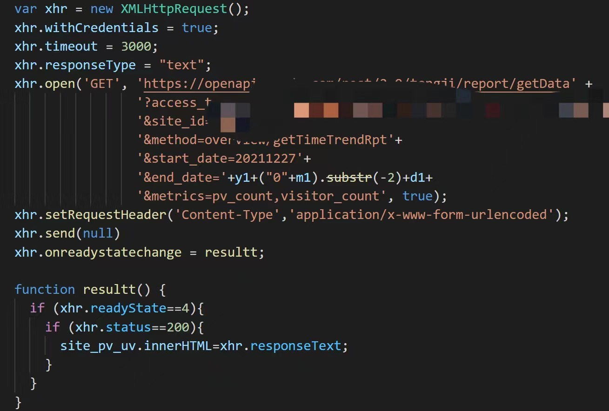
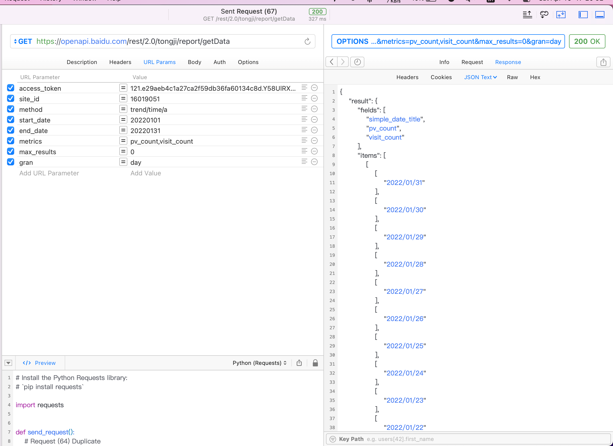
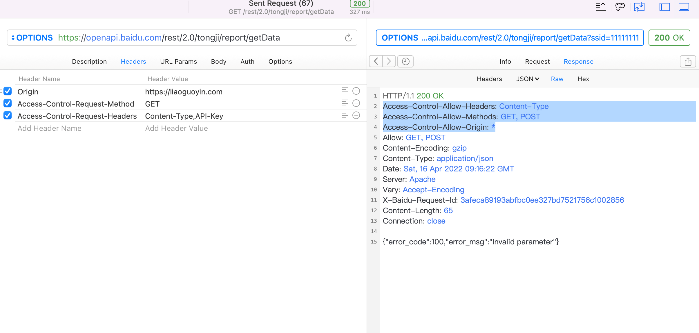
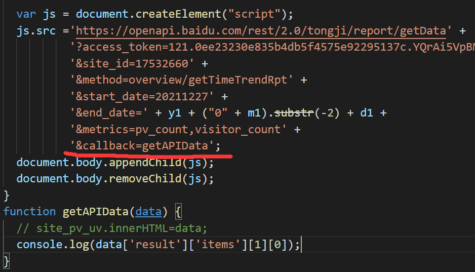

## 前言

起因是出现了卜算子统计的访问量和访客数一致的bug，于是想换个访客信息统计的API，于是换了百度统计。

一切都很顺利，直至在用**XMLHttpRequest**向api发送请求的时候，出现了跨源请求问题。

请求是正常发出去的，数据也正常从服务端返回了，但是被浏览器拦截了。

## 跨源请求相关知识

一个 URL 大概包含的部分：scheme://host:port/path?#hash

比如一个 URL 为 http://www.xxx.com:8888/school/student.html，

那么 **http** 就是 **scheme**，**www.xxx.com** 就是 **host**，**8888** 就是 **port**

### 什么是同源？

如果两个 URL 的 **scheme://host:port** 内容一样，就叫同源。

### 什么是跨源访问？

如果两个 URL 的 scheme、host、port 有任何一个不一样，就不同源。这时候，一个 URL 的脚本从另一个 URL 获取数据，就叫跨源访问。

针对跨源访问，W3C 提出了一个方案叫做 CORS（Cross-Origin Resource Sharing），只有现代浏览器支持此方案。

### CORS 的工作方式

1. 浏览器中当前页面的脚本请求另外一个服务器的数据时，浏览器在发起连接的数据报头中附加一个 **Origin 报头，表明当前页面的来源**，然后向另外一个服务器发起连接
2. 目标服务器接收到浏览器的连接请求后，如果接受请求，则在响应数据流的报头中添加一个**Access-Control-Allow-Origin 报头**，并给这个报头赋一个值，值为**浏览器发过来的 Origin 报头值**，或者为 **“*”（表示此服务器运行任何跨站请求）**。如果**不接受**请求，则**不包含** Access-Control-Allow-Origin 报头。
3. 浏览器接受到返回来的数据包进行解析，如果不包含 Access-Control-Allow-Origin 报头，则丢弃响应数据包。

## 问题的解决

### Debug（失败）

**直接请求后端**，可以正常获取到数据。

查看百度统计API允许的域名，是 **“ * ”** 。

但一旦通过前端js发送请求，就会失败。

怀疑是百度后端的问题=_=

### 解决

上网又搜了一轮，看到有博客说，**百度api允许用jsonp动态创建script，通过callback获取数据**

于是修改代码如下：

**用script的src属性去访问数据端口，然后通过callback回调函数传值回来，这样可以解决问题，但是只能用于GET。**

------

时隔了大半年，才想起来这儿还有个坑。。。
