仿照**U-COS II**写的一个抢占式实时操作系统——[Easy OS](https://github.com/shen962806862/EasyOS)。目前只实现了任务的简单调度，功能比较单一，后续会不断完善更新。


# 底层架构


## STM32硬件支持

Cortex-M3内核提供了以下异常：


编号大于15的均属于外部中断。

异常是可以打断正常执行流的事件，这是实现实时操作系统的关键，本文中将会使用——**PendSV可悬起异常**和**SysTick滴答定时器**。

<!--more-->

## SysTick系统滴答定时器

SysTick是一个**24位**的系统节拍定时器，具有自动重载和溢出中断功能，所有基于Cortex_M3处理器的微控制器都可以由这个定时器获得一定的时间间隔。

SysTick在实现本文的实时操作系统中起到了非常关键的作用——节拍 / 时间片，它保证了操作系统运行的基准单位。同时，通过将其优先级设置为最高，就可以实现在一个时间片用完之后，稳定触发该异常，从而实现**时间片的轮转**。

通过以下函数初始化SysTick计数器，设置两次中断之间的时间。

```c
#define TICKS_PER_SEC 1000
SysTick_Config(SystemCoreClock / TICKS_PER_SEC);
```

**重装载值 = SysTick 时钟频率(Hz) x 想要的定时时间（S）**

例如，**SystemCoreClock**为72MHZ，想要实现1ms进一次中断，就只需要将**TICKS_PER_SEC**设置为1000，也就是 x 0.001即可。


## PendSV可悬起异常

基于其可悬起的特点，将其配置为最低优先级，OS就可以利用它“缓期执行”一个异常——直到其它重要的任务完成后才执行动作。

悬起 PendSV 的方法是：手工往 NVIC的 PendSV悬起寄存器中写 1。悬起后，如果优先级不够高，则将缓期等待执行。

PendSV的典型使用场合是在**上下文切换时（在不同任务之间切换）**。

例如，一个系统中有两个就绪的任务，上下文切换被触发的场合可以是：
1、执行一个系统调用
2、**系统滴答定时器（SYSTICK）中断（本文中使用）**

为什么PendSV好用，如下：

假设有这么一个系统，里面有两个就绪的任务，并且通过SysTick异常启动上下文切换。但若在产生 SysTick 异常时正在响应一个中断，则 SysTick异常会抢占其 ISR。在这种情况下，OS是不能执行上下文切换的，否则将使中断请求被打断延迟，而且在真实系统中延迟时间还往往不可预知，这是不应该被允许的。

在Cortex-M3中，如果 OS 在某中断活跃时尝试切入线程模式，将触犯用法fault异常。


PendSV完美解决了这个问题。PendSV异常会自动延迟上下文切换的请求，直到其它的 ISR都完成了处理后才放行。为实现这个机制，需要把 PendSV编程为最低优先级的异常。

如果 OS检测到某 IRQ正在活动并且被 SysTick抢占，它将悬起一个 PendSV异常，以便缓期执行 上下文切换。


上图很好的展示了本文实现的操作系统的任务切换的时序实现。


## 汇编实现

使用SysTick异常实现时间片轮转，并触发PendSV中断。

在PendSV中实现上下文的切换。


### SysTick中断调用

```assembly
;EQU 等价替换
NVIC_INT_CTRL    EQU            0xE000ED04    ; 中断控制寄存器
NVIC_PENDSVSET   EQU            0x10000000    ; 触发软中断，通过给NVIC_INT_CTRL第28bit写1

CPU_TASK_SCHEDULE                    ;OS context switch（任务切换）
;PUSH 压栈。{}表示一个列表，这里先将R4压栈再压R5
    PUSH    {R4, R5}
;LDR 将源寄存器的值（这里是直接取NVIC_INT_CTRL的值，也就是ICSR的地址）加载到目标寄存器中（R4）
    LDR     R4, =NVIC_INT_CTRL       ; R4 = NVIC_INT_CTRL（触发 PendSV 异常）
    LDR     R5, =NVIC_PENDSVSET      ; R5 = NVIC_PENDSVSET
    ; *R4 = R5（向 NVIC_INT_CTRL 写入NVIC_PENDSVSET 触发 PendSV 中断）
    STR     R5, [R4]                 
    POP     {R4, R5}
    BX      LR                       ; return;
    
    align 4							 ; 4字节对齐，写于文件末
    end
```

其中中断控制寄存器片段


### PendSV汇编函数

```assembly
PendSV_Handler                          ; 保存现场
    CPSID    I                          ; 关中断，任务切换期间要关中断
    ; 异常处理或进程切换时，需要保存程序状态寄存器的值，可用该指令读出程序状态寄存器的值，然后保存。
	MRS     R0, PSP                     
    CBZ     R0, PendSV_Handler_NoSave   ; PSP指针为0就跳转，只在第一次运行时跳转
;----------------------------------------------------------------------------------------
    SUB     R0, R0, #0x20               ; R0 = R0 - 0x20;  
    STM     R0, {R4-R11}				; 将R4-R11的值暂存起来             
;----------------------------------------------------------------------------------    
    LDR     R1, =TCB_CurP               ; LDR伪指令获取 TCB_CurP->StackTop 指针
	; R1 = *R1; 获取 TCB_CurP->StackTop 指向的值（这个值是一个地址）
	LDR     R1, [R1]                    
	; *R1 = R0; 将现场信息（R4-R11）存入 TCB_CurP->StackTop 指向的地址所在的内存
    STR     R0, [R1]                    

; 由于汇编语言是顺序执行，所以执行完上面那条语句后，在没有跳转等指令的情况下，会接下去执行。
PendSV_Handler_NoSave            	    ; 恢复现场
    LDR     R0, =TCB_CurP               ; R0 获取 TCB_CurP->StackTop 指针
    LDR     R1, =TCB_NextP          	; R1 获取 TCB_NextP->StackTop 指针
    LDR     R2, [R1]              		; R2 获取 TCB_NextP->StackTop 指向的值
    STR     R2, [R0]                	; 将 TCB_CurP->StackTop 指向这个值
	; 将 以这个值为地址的内存里的值（也就是之前保存的现场信息）存入R0，开始恢复
    LDR     R0, [R2]                	
    
    LDM     R0, {R4-R11}				; 从 R0 存储的地址处恢复R4-R11的值
    MSR     PSP, R0                  	; PSP 指向R0（恢复现场）

    ORR     LR, LR, #0x04           	; LR=LR|0x04; EXC_RETURN, 第2位赋1表示返回后使用PSP
    CPSIE     I                     	; 开中断
    BX    LR                        	; return;
```

#### 汇编指令

**`CPSID I`**

1. `CPSID`: 这是 "Change Processor State, Interrupts Disabled" 的缩写，表示**更改处理器状态以禁用中断**。
2. `I`:  `Interrupts` 的缩写，指定要更改的处理器状态。当前情况下，表示**禁用中断**。

**`MRS	R0, PSP`**

1. `MRS`："Move to Register from Special register"的缩写，表示从特殊寄存器中将值移动到通用寄存器。
2. `PSP` 是 `Process Stack Pointer` 的缩写，它是 ARM Cortex-M 处理器中用于**指示当前进程（线程）的堆栈指针**。**该指针为0**代表当前进程的堆栈指针未初始化或者**当前没有运行的任务**。Cortex-M 处理器通常具有两个堆栈指针，另一个是 `MSP`（Main Stack Pointer）。

**`CBZ`**

条件分支指令，用于在**指定的寄存器为零时跳转**到目标地址。 "Compare and Branch on Zero"的缩写。

**`SUB	R0, R0, #0x20`**

这里将PSP指针减去0x20是为了保存R4-R11的上下文（8个寄存器共32字节->0x20）。**避免堆栈溢出**。

**`STM	R0, {R4-R11}`** 

**将多个寄存器的值保存到内存中**，常用于保存上下文。<font color="red">注意是**内存**！！！</font>  "Store Multiple" 的缩写。这里将R4-R11保存至R0中存储的地址所指向的内存。

**`STR	R0, [R1]`**

用于将寄存器 `R0` 中的值存储到 `R1` 中地址指向的内存位置。 "Store Register" 的缩写。

**`LDM	R0, {R4-R11}`** 

**从内存中加载多个寄存器的值**， "Load Multiple" 的缩写。

**`MSR	PSP, R0`**

将R0中的地址移动到PSP指针中。即恢复现场。

**`ORR	LR, LR, #0x04`**

执行按位或操作，这里将第2位赋1，告诉处理器返回后使用PSP指针继续执行程序。

#### LR寄存器

在出入ISR的时候，LR的值将得到重新的诠释，这种特殊的值称为**EXC_RETURN**。

EXC_RETURN的二进制值除了最低4位外全为1，而其最低4位则有另外的含义，如下：


#### 上下文切换

一个形象的GIF如下所示：


上下文切换，其实就是保存和恢复上图中这些CM3内核寄存器中的值。

|   寄存器   | 用途                                                         |
| :--------: | :----------------------------------------------------------- |
| **R0~R3**  | 用作传入函数参数，传出函数返回值。在子程序调用之间，可以将 r0-r3 用于任何用途。被调用函数在返回之前不必恢复 r0-r3。如果调用函数需要再次使用 r0-r3 的内容，则它必须保留这些内容。 |
| **R4~R11** | 存放函数的局部变量。若被调用函数使用了这些寄存器，返回之前必须恢复这些寄存器的值。 |
|  **R12**   | 内部调用暂时寄存器 ip。它在过程链接胶合代码（例如，交互操作胶合代码）中用于此角色。 在过程调用之间，可以将它用于任何用途。被调用函数在返回之前不必恢复 r12。 |
|  **R13**   | 栈指针 sp。它不能用于任何其它用途。sp 中的值在退出被调用函数时必须与进入时的值相同。 |
|  **R14**   | 链接寄存器 lr。若保存了返回地址，则可以在调用之间将 r14 用于其它用途，程序返回时要恢复。 |
|  **R15**   | 程序计数器 PC。它不能用于任何其它用途。                      |

CM3处理异常/中断时，硬件会把**R0-R3，R12，LR，PC,  XPSR**自动压栈。然后由PendSV的中断服务程序(后面简称PendSV ISR)手动把**R4-R11**寄存器压入任务栈中，这样就完成了任务上下文的保存。

恢复下一个任务的寄存器(包含PC)，当恢复PC时就能跳转到任务被打断的地方继续执行。
恢复过程正好与保存过程相反，PendSV ISR会先手动地将R4-R11恢复到CM3中，然后在PendSV ISR退出时，CM3硬件会自动将R0-R3，R12，LR, XPSR恢复到CM3的寄存器中。


### 中断控制的汇编函数

```assembly
CPU_SR_Save                     ; 关中断（进入临界区）
    MRS     R0, PRIMASK			; 读取 PRIMASK 到 R0,R0 为返回值
   								; PRIMASK寄存器只有一位，当这个位置 1 时 就关掉所有可屏蔽的异常
    CPSID   I					; PRIMASK=1,关中断(NMI和硬件FAULT可以响应)
    BX      LR					; 返回

CPU_SR_Restore			    	;开中断（退出临界区）
    MSR     PRIMASK, R0			;读取 R0 到 PRIMASK 中,R0 为参数
    BX      LR					
```

c语言定义宏实现调用

```c
u32 	 CPU_SR;  				 // 保存PRIMASK的值(中断开关的状态控制)
#define  ENTER_CRITICAL()  {  CPU_SR = CPU_SR_Save();  }   // 关中断
#define  EXIT_CRITICAL()   {  CPU_SR_Restore(CPU_SR); }
```

注意，ARM架构中汇编函数的返回值默认为存储在R0中；同理，汇编函数的前四个输入参数一般为R0-R3。

再注意，由于这种写法问题，两者必须**成对出现**，不能在`EXIT_CRITICAL()`前再调用`ENTER_CRITICAL()`，会导致**中断永远关闭**。


### 初始化的汇编函数

```assembly
NVIC_INT_CTRL    EQU            0xE000ED04    ; 中断控制寄存器的地址
NVIC_PENDSVSET   EQU            0x10000000    ; 触发软中断，通过给NVIC_INT_CTRL第28bit写1
NVIC_SYSPRI14    EQU            0xE000ED22    ; 系统优先级寄存器(14)  对应 PendSV
NVIC_PENDSV_PRI  EQU            0xFFFF0000    ; PendSV 中断优先级为最低(0xFF)

CPU_Start
    CPSID    I          
    
    LDR     R4, =NVIC_SYSPRI14      ; 初始化PendSV，并设置中断优先级为255，最低     
    LDR     R5, =NVIC_PENDSV_PRI          
    STRB    R5, [R4]                      
    
    MOV 	R4, #0                	; 初始化PSP为0   
    MSR    	PSP, R4                           
    
	LDR     R4, =SCHEDULE         	; SCHEDULE = TRUE
	MOV 	R5, #1
	STRB    R5, [R4]
	
    LDR    	R4, =NVIC_INT_CTRL      ; 先触发一次PendSV异常
    LDR    	R5, =NVIC_PENDSVSET       
    STR    	R5, [R4]                   

    CPSIE    I  
```


# STM32F103

## 初始化


在stm32的启动汇编文件中，最重要的就是这段启动代码。

### 跳转指令

ARM指令中，**B、BL、BX、BLX** 区别如下：

- **B——跳转**

`B {条件} 目标地址`

B 指令是最简单的跳转指令。一旦遇到B 指令，ARM 处理器将立即跳转到给定的目标地址，从那里继续执行。

注意存储在跳转指令中的实际值是相对当前PC 值的一个**偏移量**，而不是一个绝对地址，它的值由汇编器来计算（参考寻址方式中的相对寻址）。它是 24 位有符号数，左移两位后有符号扩展为 32 位，表示的有效偏移为 26 位(前后32MB 的地址空间)。

- **BL——带链接的跳转**

`BL {条件} 目标地址`

首先将当前指令的下一条指令地址保存在LR寄存器，然后跳转至目标地址。通常用于调用子程序，可通过在子程序的尾部添加mov  pc, lr 返回。

BL 是另一个跳转指令，但跳转之前，会在寄存器R14 中保存PC 的当前内容，因此，可以通过将R14 的内容重新加载到PC 中，来返回到跳转指令之后的那个指令处执行。

- **BX——带状态切换的跳转**

`BX {条件} 目标地址`

最低位为1时，切换到Thumb指令执行，为0时，解释为ARM指令执行。

BX 指令跳转到指令中所指定的目标地址，目标地址处的指令既可以是ARM 指令，也可以是Thumb指令。

- **BLX——带链接和状态切换的跳转**

`BLX  目标地址`

相当于 BL 和 BX 的结合。BLX 指令从ARM 指令集跳转到指令中所指定的目标地址，并将处理器的工作状态由ARM 状态切换到Thumb 状态，该指令同时将PC 的当前内容保存到寄存器R14 中。因此，当子程序使用Thumb 指令集，而调用者使用ARM 指令集时，可以通过BLX 指令实现子程序的调用和处理器工作状态的切换。

### SystemInit


首先跳转到`SystemInit()`进行时钟的初始化工作（RTOS的基础）后返回。

1. 开启内部8MHz振荡器
2. 根据芯片容量不同默认初始化CFGR寄存器（Reset SW, HPRE, PPRE1, PPRE2, ADCPRE and MCO bits ）
3. 赋值CR寄存器的某些位，其作用为：Reset HSEON, CSSON and PLLON
4. 把CFGR寄存器的PLLSRC, PLLXTPRE, PLLMUL and USBPRE/OTGFSPRE位置0
5. 根据芯片容量初始化中断位（关闭中断位）
6. 初始化Memory控制
7. 调用宏定义指定频率系统时钟设置函数，默认 `SetSysClockTo72()`。即**将SYSCLK设置为72MHz，这是后续一切时间操作的基础**。
8. 在 `SetSysClockTo72()` 函数中，实现了：配置CR、CFGR、ACR（设置FLASH）寄存器的某些位（使能，判断是否就绪，设置相应位，设置FLASH，设置AHB、APB预分频系数，设置HCLK、PCLK等等外设时钟，设置PLL锁相环倍频系数最终确定系统时钟）。


## systick

在上述文本中提到的 `SysTick_Config()` 函数，内部实现如下：

```c
static __INLINE uint32_t SysTick_Config(uint32_t ticks) { 
 	if (ticks > SysTick_LOAD_RELOAD_Msk)  return (1);
    SysTick->LOAD  = (ticks & SysTick_LOAD_RELOAD_Msk) - 1;
    NVIC_SetPriority (SysTick_IRQn, (1<<__NVIC_PRIO_BITS) - 1);
    SysTick->VAL   = 0;
    SysTick->CTRL  = SysTick_CTRL_CLKSOURCE_Msk | 
                   SysTick_CTRL_TICKINT_Msk   | 
                   SysTick_CTRL_ENABLE_Msk;
    return (0);
}
```

通过设置为 `SystemCoreClock / ticks_per_sec`，即 72MHz / 1000，实现1ms结束一次计时。

### 相关寄存器


上表中的四个寄存器负责管理systick的运行。


用来装载我们需计数的次数的寄存器。(即VAL寄存器重置时的值)


每一个时钟周期，VAL的值自减1。当VAL值为0时,会重新加载LOAD中的值，并且产生COUNTFLAG标志。(COUNTFLA标志在CTRL寄存器)


- 第0位：定时器使能位。**使能即运行**。
- 第1位：中断使能位，用于决定自减为0后**是否执行 `SysTick_Handler` 中断**。
- 第2位：时钟源选择位 ，可以选择内部时钟或外部时钟作为时钟源。
  - **内部时钟**：上述时钟树中的SYSCLK系统时钟，也是输入给AHB总线的HCLK时钟，**72MHz**；
  - **外部时钟**：RCC通过AHB时钟(HCLK)8分频后作为Cortex系统定时器(SysTick)的外部时钟，**9MHz**。
- 第16位：计数标志位 ，SysTick自减到0时，该位置1，表示计数完毕。读取该位后，该位自动清零。


不常用。

至此以上两步，完成了systick时钟的初始化，用作RTOS的时间片基准。


## 定时器

### systick内核定时器

可参考 [任务的延时](#任务的延时) 。


### tim定时器

分为：1.高级控制定时器（TIM1、TIM8）、2.通用定时器（TIM2 ~ TIM5）、3.基本定时器（TIM6、TIM7）

其中1在APB2总线上，2、3在APB1总线上。

#### 实现

```c
u16 fac_ms[6] = {1};
TIM_TypeDef* tims[6] = {TIM2, TIM3, TIM4, TIM5, TIM6, TIM7}; 
bool delay_init(u16 psc, u8 tim_used)
{
    if(tim_used < 2 || tim_used > 7) return false;
    tim_used -= 2;
    RCC->APB1ENR |= (1 << tim_used); 			// 1.总线时钟使能
    tims[tim_used]->DIER &= ~TIM_DIER_UIE;		// 2.禁用中断
    tims[tim_used]->PSC = psc - 1; 				// 3.设置预分频器
    fac_ms[tim_used] = SystemCoreClock / (psc * 1000);	// 设置ms倍因子
}
void delay_ms(u16 ms, u8 tim_used)
{
    tim_used -= 2;
    tims[tim_used]->ARR = ms * fac_ms[tim_used] - 1;	// 设置重装载值
    tims[tim_used]->CNT = 0;							// 设置计数初始值
    tims[tim_used]->CR1 |= TIM_CR1_CEN;					// 使能指定tim定时器
    while(!(tims[tim_used]->SR&1));						// 判断是否计时结束(延时)
    tims[tim_used]->SR &= ~TIM_SR_UIF;					// SR状态复位
}
```

#### 寄存器

**初始化部分**

1.首先需要使能APB1总线上的对应tim时钟。


2.频繁产生中断有损性能，因此需要禁用，定时结束可以通过SR寄存器判断，以此实现延时。该寄存器仅使用第0位。


3.对时钟进行分频，然后提供给计数器，作为计数器的时钟。根据上述时钟树，可以看到APB1经过了2分频，因此最后tim2-7的时钟频率为 APB1 x 2，即 **fck_psc = 72MHz**。


此时，当设置该寄存器为7199时（上限65535，没法7w2），可以得到时钟频率为**10KHz**，也就是计数累加一次需要**0.1ms**

**延时部分**

4.设置重装载值。上述计数一次0.1ms，因此每十次为1ms。输入参数为延时ms，乘以10后存入ARR寄存器中。


5.开始计数前设置计数器CNT初值为0（向上计数）。


6.使能tim定时器。计数方向默认0为向上不需要设置。


7.通过while判断SR寄存器的第0位是否置位实现延时。


注意这里需要软件清0，因此在结束循环后将该位复位。

#### Note

在RTOS中的不同任务，使用的是相同的定时器资源，因此调用延时函数时应注意**同时进行的任务中不能使用相同的tim定时器**。否则在出现任务切换时会修改同一tim寄存器的值，导致时序混乱。


## USART

### 初始化

```c
void uart_init(u32 bound) {
	float uart_div; 
	u16 div_m, div_f; 
	RCC->APB2ENR |= 1 << 2;  	
	RCC->APB2ENR |= 1 << 14; 
	RCC->APB2RSTR |= 1 << 14;   
	RCC->APB2RSTR &= ~(1 << 14);
	GPIOA->CRH &= 0xFFFFF00F;
	GPIOA->CRH |= 0x000008B0;
    uart_div = (float)SystemCoreClock / (bound * 16);
	div_m = uart_div;
	div_f = (uart_div - div_m) * 16 + 0.5f;
 	USART1->BRR = div_m << 4 | div_f;
	USART1->CR1 |= 0x202C;  
	NVIC_SetPriority(USART1_IRQn, 0x08);
	NVIC->ISER[USART1_IRQn / 32] |= (1 << USART1_IRQn % 32);	
}
```

#### 使能

串口作为 STM32 的一个外设，其时钟由外设时钟使能寄存器控制，usart1是在APB2ENR寄存器的**第14位**，其余都在 APB1ENR 寄存器。同时usart1默认是复用GPIOA的9、10端口，因此还需要使能**第2位**。


#### 复位清0

由软件手动复位后再置0


#### IO模式

PA9为TX，因此为**复用推挽输出**，50MHz，即 `1011` 。

PA10为RX，因此为上拉输入，即 `1000`，同时把ODR相应位置1。（为什么是上拉，因为usart协议规定在RX输入信号中, 以低电平脉冲 （**下降沿**）作为数据接收的开始. 所以上拉可以保持 RX 无数据接收的状态）

#### 波特率


根据公式，输入波特率后反推出填入寄存器的值。


#### 使能


第2、3、13位，分别为接收使能、发送使能、usart使能。

第5位如下：


第10位，校验位不使能。


最后即 `0x202C`。

#### 中断

既然用到了中断，就需要设置中断的优先级并<font color="red">**使能**</font>（很关键，中断不使能就用不了，调了好久的bug才发现）。

NVIC 是嵌套向量中断控制器，控制着整个STM32芯片中断相关的功能。其中最常用的三个寄存器：

- NVIC->ISER，用于使能中断
- NVIC->ICER，用于清除中断使能
- NVIC->IP，用于设置中断优先级


### 数据帧

注意途中的 **位0 - 位7** ，USART**先发送最低位字节**（LSB）。


#### 标准


在上面的通讯方式中，两个通讯设备的DB9 接口（常说的**COM口**）之间通过串口信号线建立起连接，串口信号线中使用RS-232 标准传输数据信号。由于 RS-232 电平标准的信号不能直接被控制器直接识别，所以这些信号会经过一个电平转换芯片转换成控制器能识别的TTL 标准的电平信号，才能实现通讯。


#### 波特率

串口异步通讯中由于没有时钟信号（DB9接口没有时钟信号），所以两个通讯设备之间需要约定好波特率，即每个码元的长度，以便对信号进行解码，图中用虚线分开的每一格就是代表一个码元。常见的波特率为4800、9600、115200 等。

#### 起始和停止信号

串口通讯的一个数据包从起始信号开始，直到停止信号结束。数据包的起始信号由一个逻辑 0 的数据位表示，而数据包的停止信号可由 0.5、1、1.5 或 2 个逻辑 1 的数据位表示，只要双方约定一致即可。

#### 有效数据

起始位之后接着的就是要传输的数据，也称为有效数据，有效数据的长度常被约定为 5、6、7 或 8 位长。

#### 数据校验

在有效数据之后，有一个**可选**的数据校验位。由于数据通信相对更容易受到外部干扰导致传输数据出现偏差，可以在传输过程加上校验位来解决这个问题。

校验方法有奇校验(odd)、偶校验(even)、0 校验(space)、1 校验(mark)以及无校验(noparity)。

- 奇校验要求有效数据和校验位中“1”的个数为奇数，比如一个 8 位长的有效数据为：01101001，此时总共有 4 个“1”，为达到奇校验效果，校验位为“1”，最后传输的数据将是 8 位的有效数据加上 1 位的校验位总共 9 位。
- 偶校验与奇校验要求刚好相反，要求帧数据和校验位中“1”的个数为偶数，比如数据帧：11001010，此时数据帧“1”的个数为 4 个，所以偶校验位为“0”。
- 0 校验是不管有效数据中的内容是什么，校验位总为“0”，
- 1 校验是校验位总为“1”。


### 协议帧

自定义RX状态寄存器变量：`USART1_RX`

|                         校验位 [15]                          |                     状态位 [14:13]                     |                       指令编号 [12:8]                        |                       数据长度 [7:0]                        |
| :----------------------------------------------------------: | :----------------------------------------------------: | :----------------------------------------------------------: | :---------------------------------------------------------: |
| 当协议第一帧为 `0xFE` 时，数据接收状态置1，允许接收数据。<br />数据接收完毕后，由软件清0。 | 00：接收指令01：接收数据长度<br />10：接收数据11：TODO | 协议第二帧固定为自定义指令编号，用于调用API。编号范围 [1, 31]，`0x00`默认为不使用指令。 | 存储协议第三帧，表示接下来还需要传输的数据字节数（最大256） |

#### 起始校验信号

第一帧固定为`0xFE`，收到后将`USART1_RX`第15位置1，开启后续帧接收。

#### 指令信号

第二帧固定为指令编号，范围 [0x01, 0x1F]。`0x00` 默认为不使用指令，忽略该帧。结束该帧时将状态位置01，表示等待接收数据长度帧。

#### 数据长度信号

第三帧固定为数据长度，表明接下来要传输的数据字节数。结束该帧时将状态位置10，表示开始接收数据帧。

若剩余接收字节数大于缓冲区（最大256）剩余空间，将第13位置1。当不再大于时，置0。用于在缓冲区满或数据接收完成时判断是否存在溢出丢失现象。

#### 接收实现

```c
extern u8 usart_rx_end;
#define UR_PARITY(RXx)		(RXx & 0x8000) == 0
#define UR_STAT(RXx)		RXx & 0x6000
#define UR_END(RXx)			(RXx & 0x00FF) == 0
#define UR_END_SET(x)		usart_rx_end |= 1 << (x-1)
#define UR_END_RESET(x)		usart_rx_end &= ~(1 << (x-1))
void RX_Protocol(void) {
	u8 res;
	res = USART1->DR;
	if(UR_PARITY(usart1_rx)) {
		if(res == 0xFE)	
			usart1_rx |= 1 << 15;
	}	
	else {
		switch(UR_STAT(usart1_rx)) {
			case 0: {
				usart1_rx |= 1 << 13;
				if(res) {
					// TODO: order case
				}
				break;
			}
			case 0x2000: {
				usart1_rx |= res;
				usart1_rx ^= (1 << 13 | 1 << 14);
				if(UR_END(usart1_rx)) {
					usart1_rx = 0;
					UR_END_RESET(1);
				}
				break;
			}
			case 0x4000: {
				lwrb_write(&fifo_buff, &res, 1);
				usart1_rx--;
				if(UR_END(usart1_rx)) {
					usart1_rx = 0;
					UR_END_SET(1);
				}
				break;
			}
			case 0x6000: {
				// TODO: overflow?
			}
		} 		
	}	
}
void USART1_IRQHandler(void) {
#if SYSTEM_SUPPORT_OS 		
	OSIrqEnter();    
#endif
	if(USART1->SR & (1 << 5))
		RX_Protocol();
	
#if SYSTEM_SUPPORT_OS 	
	OSIrqExit();  											 
#endif
} 
```

#### 发送实现

发送的实现只完成了基础的字节发送和字符串发送，因为要根据另一端的接收协议来决定发送顺序，因此只实现了基础功能。

```c
void send(u8* str) {
	while(*str != '\0')
		send_byte(*str++);
}
void send_byte(u8 c) {
	USART1->DR = c;
	while(!(USART1->SR & 0x40));
}
```


### 接收缓冲区

用了一个轻量级的C99开源库：[MaJerle/lwrb at v2.0.0 (github.com)](https://github.com/MaJerle/lwrb/tree/v2.0.0)

**Lightweight ring buffer manager**，提供了一个通用FIFO环形缓冲区的C99实现（v3.0支持C11）。

根据协议设定，每次在将所有数据读入环形缓冲区后，将标志位`usart_rx_end`置位。task在检测到该标志位置位后即表明有数据可读。


## IIC

### 规范

对于面向8 位的数字控制应用，譬如那些要求用微控制器，的要建立一些设计标准：

• 一个完整的系统通常由至少一个微控制器和其他外围器件，例如存储器和I/O 扩展器组成。

• 系统中不同器件的连接成本必须最小。

• 执行控制功能的系统不要求高速的数据传输。

• 总的效益由选择的器件和互连总线结构的种类决定。

产生一个满足这些标准的系统需要一个串行的总线结构，尽管串行总线没有并行总线的数据吞吐能力，但它们只要很少的配线和IC 连接管脚。然而，总线不仅仅是互连的线，还包含系统通讯的所有格式和过程。

串行总线的器件间通讯必须有某种形式的协议避免所有混乱、数据丢失和妨碍信息的可能性。快速器件必须可以和慢速器件通讯。系统必须不能基于所连接的器件，否则不可能进行修改或改进。应当设计一个过程决定哪些器件何时可以控制总线。而且，如果有不同时钟速度的器件连接到总线，必须定义总线的时钟源。所有这些标准都在I²C 总线的规范中。


### 概念

**I²C 总线**是一个多主机的总线。这就是说可以连接多于一个能控制总线的器件到总线。由于主机通常是微控制器，让我们考虑以下数据在两个连接到I2C 总线的微控制器之间传输的情况。这突出了I²C 总线的主机从机和接收器发送器的关系。应当注意的是：这些关系不是持久的，只由当时数据传输的方向决定。传输数据的过程如下：

1）假设主设备要发送信息到从设备：

- 主设备发送起始（START）信号
- 主设备发送设备地址到从设备
- 等待从设备响应(ACK)
- 主设备发送数据到从设备，一般发送的**每个字节**数据后会跟着等待接收来自从设备的响应(ACK)
- 数据发送完毕，主设备发送停止(STOP)信号终止传输

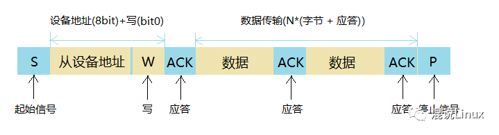

2）如果主设备想从从设备接收信息：

- 设备发送起始（START）信号
- 主设备发送设备地址到从设备
- 等待从设备响应(ACK)
- 主设备接收来自从设备的数据，一般接收的**每个字节**数据后会跟着向从设备发送一个响应(ACK)
- 一般接收到最后一个数据后会发送一个无效响应(NACK)，然后主设备发送停止(STOP)信号终止传输

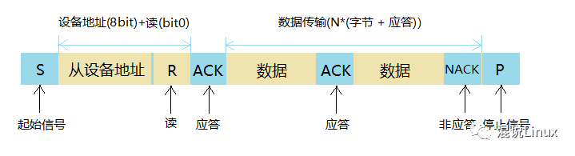

连接多于一个微控制器到I²C总线的可能性意味着**超过一个主机可以同时尝试初始化传输数据**。为了避免由此产生混乱，发展出一个仲裁过程。如果两个或多个主机尝试发送信息到总线，在其他主机都产生“0 ”的情况下首先产生一个“1” 的主机将丢失仲裁。**仲裁时的时钟信号是用线与连接到SCL线的主机产生的时钟的同步结合。**


### 协议

IIC**先发送最高位字节**（MSB）。

#### 空闲状态

时钟线（SCL）和数据线（SDA）接上拉电阻，默认高电平，表示总线是空闲状态。

#### 从设备地址

从设备地址用来区分总线上不同的从设备，一般发送从设备地址的时候会在最低位加上读/写信号，比如设备地址为0x50，0表示写，1表示读，写数据就会发送0x50，读数据就会发送0x51。因此设备地址其实为7位，最低位是单独的读/写方向位。

#### 起始信号

由主设备发起，SCL保持高电平，SDA由高电平跳变到低电平（**下降沿**）。

#### 停止信号

由主设备终止，SCL保持高电平，SDA由低电平跳变到高电平（**上升沿**）。

#### 数据有效性

I2C总线进行数据传送时，在SCL的每个时钟脉冲期间传输一个数据位，**时钟信号SCL为高电平期间，数据线SDA上的数据必须保持稳定**，只有在时钟线SCL上的信号为低电平期间，数据线SDA上的高电平或低电平状态才允许变化，因为当SCL是高电平时，数据线SDA的变化被规定为**控制命令**（**START**或**STOP**，也就是前面的**起始信号**和**停止信号**）。

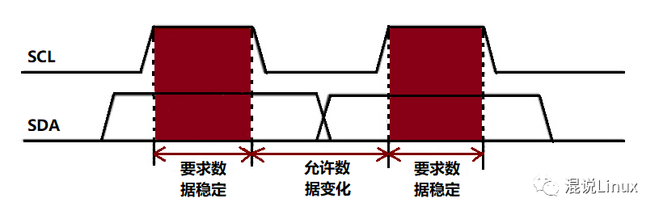

#### 应答信号

分为**有效应答**（ACK）和**无效应答**（NACK）。

接收端收到有效数据后向对方响应的信号，发送端每发送一个字节(8位)数据，在第9个时钟周期释放数据线去接收对方的应答。

- 当SDA是低电平为有效应答(ACK)，表示对方**接收成功**；
- 当SDA是高电平为无效应答(NACK)，表示对方**没有接收成功**。


### 时钟同步

SCL同步是由于总线具有**线“与”**的逻辑功能，即**只要有一个节点发送低电平时，总线上就表现为低电平。当所有的节点都发送高电平时，总线才能表现为高电平**。正是由于线“与”逻辑功能的原理，当多个节点同时发送时钟信号时，在总线上表现的是统一的时钟信号。这就是SCL的同步原理。

SCL 线的高到低切换会使器件开始数它们的低电平周期，而且一旦器件的时钟变低电平，它会使SCL 线保持这种状态直到到达时钟的高电平。但是，如果另一个时钟仍处于低电平周期，这个时钟的低到高切换不会改变SCL 线的状态。因此，SCL 线被有最长低电平周期的器件保持低电平。此时，低电平周期短的器件会进入高电平的等待状态。

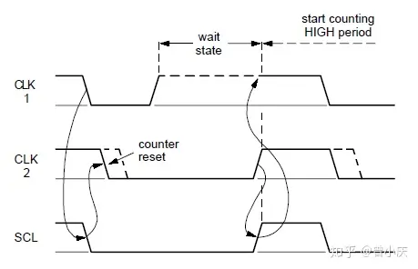

当所有有关的器件数完了它们的低电平周期后，时钟线被释放并变成高电平。之后，器件时钟和SCL线的状态没有差别。而且所有器件会开始数它们的高电平周期。首先完成高电平周期的器件会再次将SCL线拉低。

**同步SCL 时钟的低电平周期由低电平时钟周期最长的器件决定，高电平周期由高电平时钟周期最短的器件决定。**

#### 握手

在字节级的快速传输中，器件可以快速接收数据字节，但需要更多时间保存接收到的字节或准备另一个要发送的字节。然后，从机**以一种握手过程**在接收和响应一个字节后使SCL 线保持低电平，迫使主机进入等待状态，直到从机准备好下一个要传输的字节。

在位级的快速传输中，器件（例如对I²C总线有或没有限制的微控制器）可以通过延长每个时钟的低电平周期**减慢总线时钟**。从而，任何主机的速度都可以适配这个器件的内部操作速率。

在Hs 模式中，握手的功能只能在字节级使用。


### 仲裁

主机只能在总线空闲的时侯启动传输，但两个或多个主机可能在起始条件的最小持续时间内产生一个起始条件，数据传输就可能会发生冲突，因此需要仲裁竞争。

#### 仲裁过程

1. SDA线的仲裁也是建立在总线具有**线“与”**逻辑功能的原理上的。节点在发送1位数据后，**比较总线上读取的数据与自己发送的是否一致**。是，继续发送；否，则退出竞争。SDA线的仲裁可以保证IIC总线系统在多个主节点同时企图控制总线时通信正常进行并且数据不丢失。总线系统通过仲裁只允许一个主节点可以继续占据总线。
2. 同样因为**线“与”**的逻辑功能，当多主机发送时，**低电平**优先掌握对总线的控制权。

#### 仲裁丢失

当设备失去与总线的控制权时，即出现仲裁丢失（stm32中SR1的ARLO状态位）。此时该设备需立刻切换为从模式，以接收接下来的总线数据。

假设有主控器1要发送的数据DATA1为`10100000`；主控器2要发送的数据DATA2为`10010000`。总线被启动后，因为有SDA回读机制，两个主控器在每发送一个数据位时都要对自己的输出电平进行检测。

在前2位数据的时候下总线还是得不到仲裁。但是**不影响数据传输**，因为发的数据是完全一样的。

当主控器1发送第3位数据 **“1”** 时（主控器2发送 **“0”** ），由于**线与**的结果SDA上的电平为 **“0”**，这样主控器1就会测到一个与自己发送的不相符的**“0”电平**。这时主控器1只好放弃对总线的控制权；因此主控器2就成为总线的唯一主宰者。在整个仲裁过程主控器1和主控器2都不会丢失数据。

#### 总线死锁

如果所有设备都检测到自己的仲裁位与总线上的不匹配，可能会出现所有设备都停止传输的情况，这被称为**仲裁失败**或**总线死锁**。

为防止这一现象，通常在I2C系统中采取以下策略：

1. **重试**：当设备检测到仲裁失败时，它通常会**等待一个随机时间**，然后重新尝试通信。这个随机的等待时间可以减少再次发生仲裁冲突的可能性，从而增加通信的成功率。
2. **超时**：在某些情况下，如果设备在一定时间内没有成功地完成通信，它可以选择**超时并执行错误处理程序**。这可以防止设备无限期地等待重试，从而影响系统的性能。（类似stm32中的SR1的TIMEOUT状态位）
3. **设备地址设置**：确保每个设备的I2C地址都是**唯一**的，以减少仲裁冲突的可能性。


### 软件模拟

通常stm32中使用的软件模拟IIC例程多为单主机的设计方案，即实现了简单的**IIC信号**而没有实现多主机的**时钟同步与仲裁**。这需要通过额外检测和处理SCL、SDA上的电平来实现。并没有特定的硬件寄存器来存储仲裁状态。


更多详细内容参考 [I²C（IIC）总线协议详解—完整版 - 知乎 (zhihu.com)](https://zhuanlan.zhihu.com/p/149364473)


## SPI

SPI通常有一个主设备和一个或多个从设备，通常采用的是4根线，它们是**MISO**（数据输入，针对主机来说）、**MOSI**（数据输出，针对主机来说）、**SCLK**（时钟，主机产生）、**CS/SS**（片选，一般由主机发送或者直接使能，通常为低电平有效）。全双工。

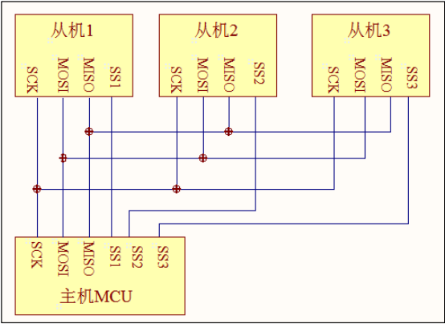

 一个主机可以连接多个从机，其中SCK，MOSI，MISO所有从机共用。SSx单独连接主机。当主机需要和从机通信时，主机把对应的从机的SSx线拉低。从机发现自己的SSx线被拉低，则表示主机要和它通信了。对比IIC，**SPI不需要外接上拉电阻，也不需要广播地址来寻机**。

### 协议

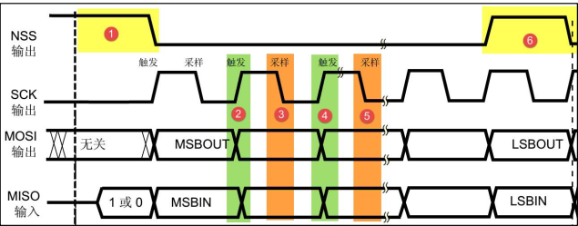

SPI只有开始信号，停止信号，和数据有效性信号，读写信号（同步的）。相比IIC，少了应答机制。

1. **开始**信号：NSS（也叫SSx、CS等，即使能线，片选线。）被拉低的**下降沿**。
2. **停止**信号：NSS被拉高的**上升沿**。
3. **触发**和**采样**：一个用于主从机将数据转移至总线中，一个用于从总线中读取数据。具体哪个对应哪个取决于下述的模式设置。


### 4种模式

#### 时钟极性

时钟极性 CPOL 是指 SPI 通讯设备处于空闲状态时，SCK 信号线的电平信号(即 SPI 通讯开始前、 NSS 线为高电平时 SCK 的状态)。

- CPOL=0 时， SCK 在空闲状态时为低电平①，在SCK有效期间为高电平 ②
- CPOL=1 时，SCK 在空闲状态时为高电平③，在SCK有效期间为低电平 ④
             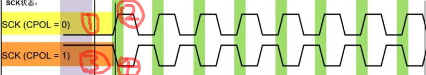

#### 时钟相位

时钟相位 CPHA 是指数据的采样的时刻。

- 当 CPHA=0 时， MOSI 或 MISO 数据线上的信号将会在 SCK 时钟线的“奇数边沿” 被采样。
- 当 CPHA=1 时，数据线在 SCK 的“偶数边沿” 采样。

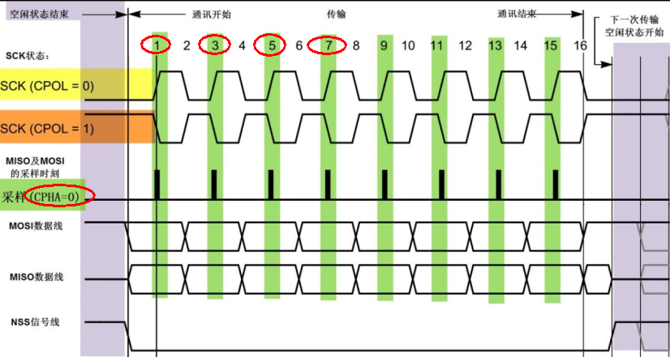

当 CPHA=0 时， MOSI 或 MISO 数据线上的信号将会在 SCK 时钟线的“奇数边沿” 被采样。根据时钟极性的不同，**奇数边沿可能是上升沿也可能是下降沿**。

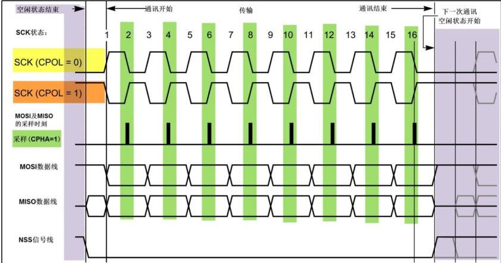

当 CPHA=1时， MOSI 或 MISO 数据线上的信号将会在 SCK 时钟线的“偶数边沿” 被采样。

#### 模式

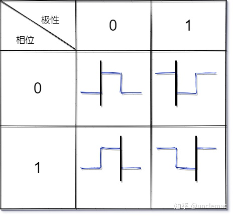

黑线即为数据的采样时刻（从总线中读取）。而该时钟信号的另一个边沿就是主从机将数据放至总线的时刻。

#### 数据交换

为什么SPI的数据传输可以称之为数据交换？

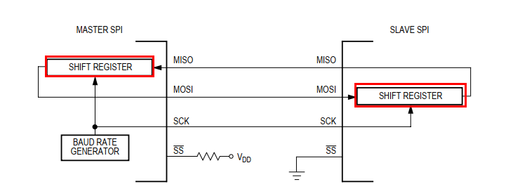

两个设备都有一个shift寄存器。假设当CPHA=0时，在第一个边沿采集到了数据，在第二个边沿转换，主机的shift寄存器的最高位移到了从机的shift寄存器的最低位。两个寄存器都左移，循环8次。就能完成8位数据的交换，主机shift寄存器的数据都移到从记得shift寄存器里面了。从机的也都移到主机里了。（很巧妙 用互相转移完成读写同步）。

#### 模式选择

有些外设在被选中后（CS被拉低）就会把数据放到总线上，让主机区读。这个时候用CPHA=0模式。

而有些在设备发送数据前需要一个SCK时钟来激活外设，外设在接收到第一个始终后才会把数据放到总线上。这个时候用CPHA=1模式。

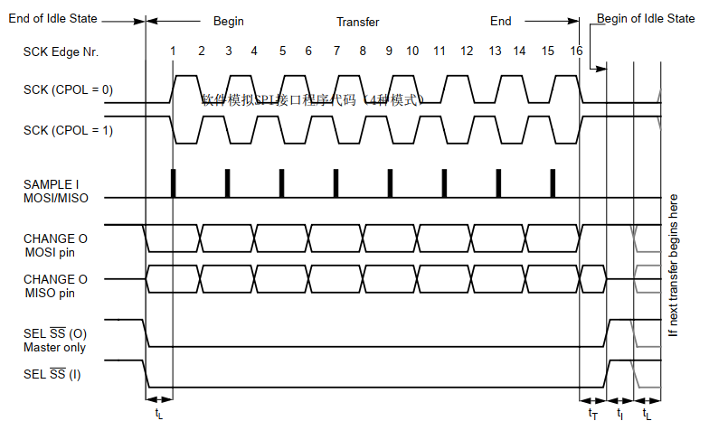

上图为CPHA=0时：

1. 时钟的第一个边沿发生时，MOSI、MISO上的数据将被采集并被锁存，在第一个时钟边沿发生之前，必须有个CS被拉低的信号（设备必须使能），从CS被拉低。到第一个时钟边沿发生，需要有个**延时**。为什么需要延时？因为在CS被拉低到出现第一个边沿这个过程中，被使能的从机设备将会把自己的数据放在MISO上让主机去读。主机把自己的数据放在MOSI上让从机去读。
2. 当时钟的第二个边沿发生时，MISO、MOSI上被采集并锁存的数据将会转移。（交换一位，参考[数据交换](#数据交换)）
3. 第二个时钟沿发生后，从机的下一位数据将会被发送到MISO上，主机上，我们需要主动把数据放在MOSI上。这个也就是说的在奇数边沿采集，在偶数边沿转移。我们可以看到发送8位数据，需要8个时钟周期，16个时钟边沿。
4. 在第16个时钟边沿发生后，主机的shift寄存器和从机的shift寄存器的数据就完全交换了。


## BootLoader

### stm32运行原理

#### 启动方式

M3，M4内核芯片上电复位后，要固定从`0x0000 0000`地址读取中断向量表，获取复位中断服务程序的入口地址后，进入复位中断服务程序，其中`0x0000 0000`是栈顶地址，`0x0000 0004`存的是复位中断服务程序地址。

stm32将内部flash启动设置为 `0x0800 0000`，是因为stm32不仅可以从**内部Flash启动**，还可以从**系统存储器**（可以实现串口ISP、USB、DFU等程序下载方式，这个程序是ST固化好的程序代码）和从**内部SRAM**启动。

因此需要实现地址映射，以保证同样可以从系统存储器和内部SRAM启动。

选择启动方式的方法：

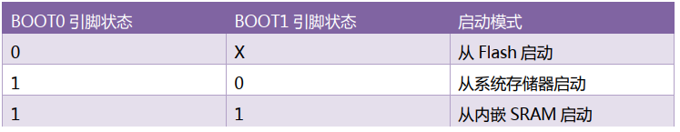

STM32在这里取了个巧，它在`0x0000 0000`开始的一段地址空间是虚拟的，可以通过设置BOOT[1:0]管脚状态，在启动时动态将另外一段地址空间映射到这部分上面去。 当arm复位之后，读到的`0x0000 0000`内容已经是被STM32重映射之后的了，所以它可以system boot模式启动、Flash启动或者内存启动。 如果是正常的Flash启动，则会将`0x8000 0000`映射到`0x0000 0000`，因此arm以为自己还在操作`0x0000 0000`，其实是在操作`0x8000 0000`，已经被STM32偷梁换柱了，当然，此时直接操作`0x8000 0000`也是可以的，二者完全等价。

#### 中断向量表

怎么保证0x08000 0000首地址存的就是中断向量表？

在xxx.s的启动文件中，可以看到定义了一个名为 `RESET` 的段，存储的就是中断向量表。

在xxx.sct分散加载文件中，将 `RESET` 段放在了`0x0800 0000`优先存储。

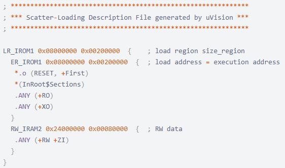

在stm32中，寄存器的**SCB->VTOR**为Cortex内核的**中断向量表的基地址**，也是stm32**程序运行的起始地址**。可以不设置默认为0，也可以默认设置为`0x8000 0000`，两者是等价的，原因见上。

因此如果想运行不存储在flash头部的程序，就需要拿到程序存储位置的首地址，来作为中断向量表的基地址。

#### 运行流程

**正常流程**

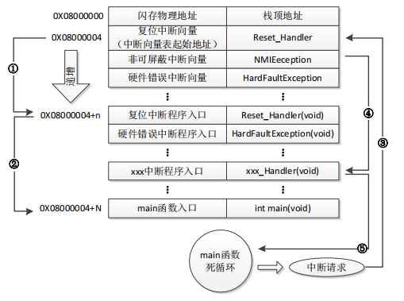

1. STM32复位后，先从 `0X08000004` 地址取出复位中断向量地址，并跳转到复位中断服务程序，如图标号①。
2. 在复位中断服务程序执行完之后，会跳转到我们的 main 函数，如图标号②。
3. 而我们的 main 函数一般都是一个死循环，在 main 函数执行过程中，如果收到中断请求（发生中断），此时 STM32F1 强制将 PC 指针指回中断向量表处，如图标号③。
4. 然后，根据中断源进入相应的中断服务程序，如图标号④。
5. 在执行完中断服务程序以后，程序再次返回 main 函数执行，如图标号⑤所示。

**加入IAP**

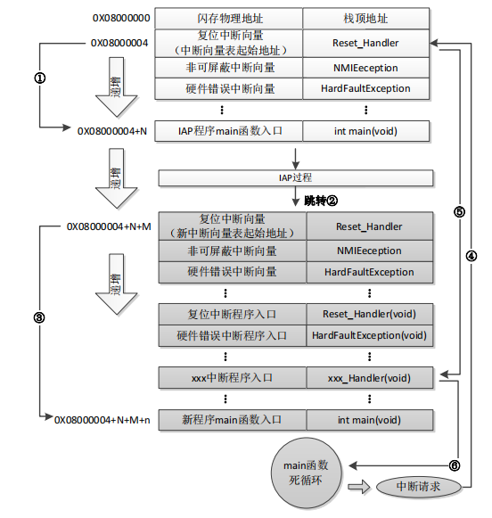

1. STM32F1 复位后，还是从 `0X08000004` 地址取出复位中断向量的地址，并跳转到复位中断服务程序，在运行完复位中断服务程序之后跳转到 IAP 的 main 函数，如图标号①。
2. 在执行完 IAP 后（新的 APP 代码写入 FLASH，其复位中断向量起始地址为 `0X08000004 + N + M`），跳转至新写入程序的复位向量表，取出新程序的复位中断向量的地址，并跳转执行新程序的复位中断服务程序，随后跳转至新程序的 main 函数，如图标号②和③。
3. 同样 main 函数为一个死循环，并且此时 STM32 的 FLASH，在不同位置上，共有**两个中断向量表**。在 main 函数执行过程中，如果 CPU 得到一个中断请求，PC 指针仍强制跳转到地址 `0X08000004` 中断向量表处，而不是新程序的中断向量表，如图标号④所示。
4. 程序再根据我们设置的中断向量表偏移量，跳转到对应中断源新的中断服务程序中，如图标号⑤所示。
5. 在执行完中断服务程序后，程序返回 main 函数继续运行，如图标号⑥所示。


### 关于BootLoader

1. BootLoader就是单片机启动时候运行的一段小程序，这段程序负责单片机固件（即APP程序，可以有多个）的更新，当然也可以不更新。结束BootLoader设计的流程后，跳转到指定APP程序处运行。
2. BootLoader更新完程序后并不擦除自己，下次启动后依然先运行BootLoader程序，又可以选择性的更新或者不更新程序。
3. 在实际的单片机工程项目中，加入BootLoader功能可以给单片机日后升级程序留出一个接口。当然，这就需要创建多个工程项目，一个为BootLoader工程，其余为APP工程。
4. BootLoader工程生成的.hex或者.bin文件通常下载到ROM或Flash中的首地址，这样可以保证上电后先运行BootLoader程序。而APP工程生成的.hex或者.bin文件则下载到ROM或Flash中BootLoader后面的地址中。
5. 要实现在同一个ROM/Flash中保存两段程序，并且保证不能相互覆盖，则需要在下载程序时指定地址。如在Keil下，可以进行如下的调整：

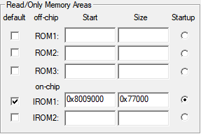

​		IROM为片内FLASH、IRAM为片内RAM。


### 固件为何为bin

1. **简单和高效**：二进制文件以二进制形式存储数据，没有额外的格式和标记，因此它们在传输和处理时更加简单和高效。这使得固件更新过程更容易实现。
2. **节省空间**：二进制文件不包含任何文本或元数据，只包含数据和指令，因此文件体积相对较小。这对于将固件传输到嵌入式设备或网络上的设备是有利的，因为可以节省带宽和存储空间。
3. **硬件相关性**：固件更新通常涉及到硬件设备的低级编程和配置。二进制文件可以直接映射到设备的存储器或寄存器，而不需要进行额外的解析或处理。


### OTA方式

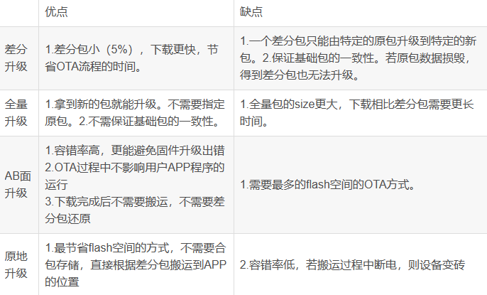

其他都比较好理解，AB面升级方案如下：

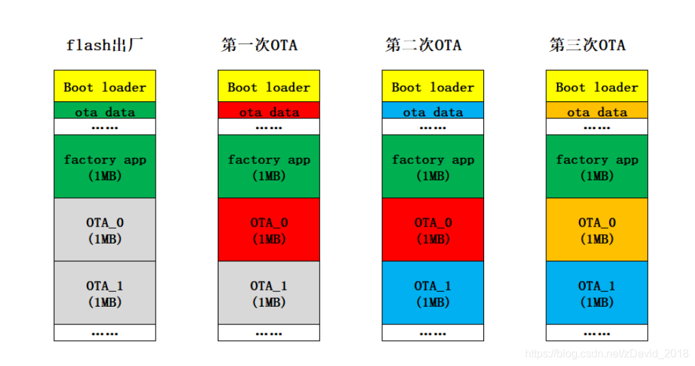


# 系统结构

## 任务管理

### 任务控制块TCB

包含三个部分，任务栈顶指针、延时时长以及任务状态

```c
typedef u32  STACK_Type;
typedef u8   PRIO_Type;
typedef void (*TASK_Type)(void);

typedef enum task_status {
	TASK_READY 		= 0x00u,
	TASK_SUSPEND 	= 0x01u,
	TASK_SEM 		= 0x02u,
	TASK_MUTEX 		= 0x04u,
	TASK_MBOX 		= 0x08u,
	TASK_MSGQUEUE 	= 0x10u,
	TASK_PEND_ANY	= (TASK_SEM | TASK_MUTEX | TASK_MBOX | TASK_MSGQUEUE)
} TASK_STATUS;

typedef struct task_tcb {
	STACK_Type 			*StackTop; 
	STACK_Type 			*StackBottom;
	u32					StackSize;
	u16 				TaskId;
	
	struct task_tcb 	*NextTCB;
	struct task_tcb 	*PrevTCB;
	
	//OS_EVENT			*EventPtr;
	void				*Message;
	
	PRIO_Type			Priority;
	PRIO_Type			PrioGroup;
	PRIO_Type			PrioTable;
	PRIO_Type			PrioGroupBit;
	PRIO_Type			PrioTableBit;
	
	TASK_STATUS   		State;
	u32			 		Delay;
} TASK_TCB;
            
#define MAX_TASKS		8u 

extern  TASK_TCB      	TCB[MAX_TASKS + 1u];
extern	TASK_TCB		*PRIO2TCB[LOWEST_PRIO + 1u];
extern	TASK_TCB		*TCB_Cur;
extern	TASK_TCB		*TCB_HighRdy;
extern	TASK_TCB		*TCB_FreeList;
extern	TASK_TCB		*TCB_UsedList;
```

os中TCB的维护大致如下：

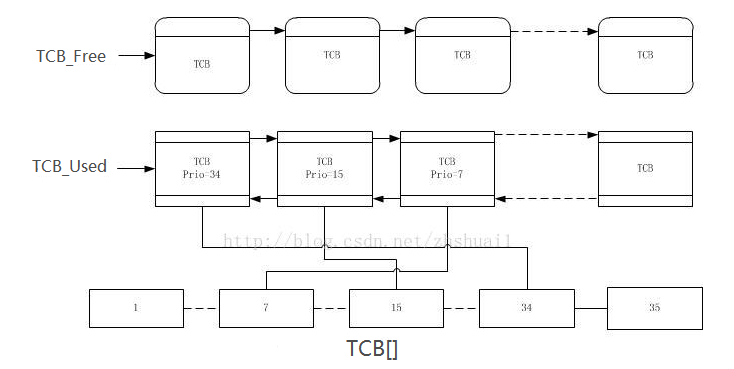

TCB本身使用**静态数组**进行存储。

使用**单链表**（只用TCB结构体中的`NextTCB`指针）将空闲的TCB控制块连起来，维护一个 `TCB_FreeList` 指针指向单链表的头节点。

使用**双向链表**（使用结构体中的 `NextTCB` 和 `PrevTCB` 指针）将已被使用的TCB控制块连起来，维护一个 `TCB_UsedList` 指针指向双链表的头节点。

维护一个 `TCB_Cur` 指针指向当前正在执行任务的TCB控制块，一个 `TCB_HighRdy` 指针指向当前就绪任务中优先级最高的TCB控制块。

使用**指针数组**存储**优先级到TCB控制块的映射关系**。


### 就绪任务列表

```c
extern  PRIO_Type		PrioRdyGroup;		      
extern  PRIO_Type		PrioRdyTable[PRIO_RDY_TBL_SIZE];  
extern  PRIO_Type		PrioCur;		      
extern  PRIO_Type		PrioHighRdy;   
```

就绪任务表的存储采用**二维数组的思想**，分为**优先组（0~7）**和**组内优先级（0~7）**两部分。因此优先级共64级。

维护一个**8位变量**，用于标记有就绪任务的组，将相应位置1（组号2，则将 `PrioRdyGroup` 的第二位置1）。

维护一个**长度为8的静态数组**，数组的每一个8位元素表示该组内的8个优先级任务是否就绪（同样是位运算）。

维护一个 `PrioCur` 变量存储当前运行任务的优先级，一个 `PrioHighRdy` 变量存储当前已就绪的最高优先级。

每个任务都有相对应的、**不同**的优先级，以此区分任务。

```c
tcbptr->PrioGroup 	 	= prio >> 3u;
tcbptr->PrioTable 	 	= prio & 0x07u;
tcbptr->PrioGroupBit 	= (1uL << tcbptr->PrioGroup);
tcbptr->PrioTableBit 	= (1uL << tcbptr->PrioTable);
```

由于上述任务优先级为8 x 8，因此优先级最低为 `0x111111` 共6位。其中TCB控制块中的 `PrioGroup` 为高三位（即组别），因此右移3位进行存储。`PrioTable` 为低三位，组内优先级，因此 & `0x07` 只存储低三位。`PrioGroupBit` 和 `PrioTableBit` 分别为 **组间优先级和组内优先级所在位的掩码**，便于修改就绪任务表。

```c
void SetTaskReady(TASK_TCB* ptr) {
	PrioRdyGroup 					|= ptr->PrioGroupBit;
	PrioRdyTable[ptr->PrioGroup] 	|= ptr->PrioTableBit;
};	
void DelTaskReady(TASK_TCB* ptr) {
	PrioRdyTable[ptr->PrioGroup] &= ~ptr->PrioTableBit;
	if(PrioRdyTable[ptr->PrioGroup] == 0u)
		PrioRdyGroup &= ~ptr->PrioGroupBit;
};
```

- 添加就绪任务则分别将组间优先级和组内优先级相应位置位。
- 删除就绪任务则先删除组内优先级，若此时该组内没有就绪任务则再将组间优先级复位。


### 任务的创建

```c
STACK_Type* OSTaskStackInit(TASK_Type task, STACK_Type *stack, PRIO_Type prio) {
    STACK_TypeDef  *p_stk;
    p_stk      = stack;                           //加载栈顶指针
    
    *(--p_stk) = (STACK_TypeDef)0x01000000uL;     // xPSR的T位置1，设置为Thumb模式？TODO
    *(--p_stk) = (STACK_TypeDef)task;             // PC指针
    // 无意义，只为了--p_stk
    *(--p_stk) = (STACK_TypeDef)0x14141414uL;     // R14 (LR)
    *(--p_stk) = (STACK_TypeDef)0x12121212uL;     // R12
    *(--p_stk) = (STACK_TypeDef)0x03030303uL;     // R3
    *(--p_stk) = (STACK_TypeDef)0x02020202uL;     // R2
    *(--p_stk) = (STACK_TypeDef)0x01010101uL;     // R1
    *(--p_stk) = (STACK_TypeDef)0x00000000u;      // R0
    *(--p_stk) = (STACK_TypeDef)0x11111111uL;     // R11
    *(--p_stk) = (STACK_TypeDef)0x10101010uL;     // R10
    *(--p_stk) = (STACK_TypeDef)0x09090909uL;     // R9
    *(--p_stk) = (STACK_TypeDef)0x08080808uL;     // R8
    *(--p_stk) = (STACK_TypeDef)0x07070707uL;     // R7
    *(--p_stk) = (STACK_TypeDef)0x06060606uL;     // R6
    *(--p_stk) = (STACK_TypeDef)0x05050505uL;     // R5
    *(--p_stk) = (STACK_TypeDef)0x04040404uL;     // R4
    	
	return p_stk;
}
u8 TaskCreate(void (*p_Task)(void), STACK_Type *p_Stack, PRIO_Type prio, u16 id) {
	STACK_Type 	*psp;
	u8 			err;
	u32		 	CPU_SR = 0; 
	ENTER_CRITICAL();
	if(OSIrqNest > 0u) {
		EXIT_CRITICAL();
		return OS_ERR_TASK_CREATE_IRQ;
	}
    if(PRIO2TCB[prio] == NULL) {
		PRIO2TCB[prio] = TCB_PLACEHOLDER;
		EXIT_CRITICAL();
		psp = OSTaskStackInit(p_Task, p_Stack, prio);
		err = OSTaskTCBInit(prio, psp, (STACK_Type*)0, id, 0);
		if(err == OS_ERR_NONE) {
			if(SCHEDULE)	
				SysSchedule();
		}
		else {
			ENTER_CRITICAL();
			PRIO2TCB[prio] = NULL;
			EXIT_CRITICAL();
		}
		return err;
    }
	EXIT_CRITICAL();
	return OS_ERR_TASK_PRIO_EXIST;
}
```

任务创建不允许出现在中断过程中，因为可能会导致中断嵌套。如果在中断处理中创建任务并立即切换到新任务，而中断本身尚未完成，可能会导致**竞态条件和不确定的行为**。因此需要做个判断。

如果该优先级未被使用，则开始创建任务：

1. 先将 `PRIO2TCB[prio] = ((TASK_TCB*)1);`，用于占位，防止创建到一半时再次创建相同优先级的任务。
2. 之后是上下文的初始化（并获取栈顶指针）和TCB块的初始化。
3. 若以上成功完成，则执行任务调度（任务调度里会判断是否是最高优先级任务在运行，是则不切换）。
4. 若以上出现报错，则释放占用的TCB控制块指针，返回报错信息。

#### ARM or Thumb

##### 指令集

- ARM 模式：在 ARM 模式下，处理器执行的是 ARM 指令集，这是一种**32位**的指令集，指令长度固定为32位。ARM 指令集通常用于执行复杂的指令，适用于高性能和较大的内存空间。
- Thumb 模式：在 Thumb 模式下，处理器执行的是 Thumb 指令集，这是一种**16位**的指令集，指令长度较短。Thumb 指令集通常用于节省存储空间和提高代码密度，*适用于资源受限的嵌入式系统*。

##### 指令宽度

- ARM 模式：ARM 模式下的指令宽度固定为32位，每条指令都是32位长。
- Thumb 模式：Thumb 模式下的指令宽度为16位，每条指令都是16位长。

##### 代码密度

- ARM 模式：由于指令宽度较大，ARM 模式下的指令通常需要更多的存储空间，因此代码密度相对较低。
- Thumb 模式：Thumb 模式下的指令长度更短，可以实现更高的代码密度，适用于存储空间有限的系统。

##### 性能

- ARM 模式：由于指令更长，每条指令通常执行的操作更多，因此在 ARM 模式下可以实现更高的性能。
- Thumb 模式：虽然指令更短，但执行速度可能较慢，因为一些操作需要多条 Thumb 指令来实现。

##### 中断处理

- ARM 模式：在 ARM 模式下，通常可以更快速地响应中断，因为每条指令执行的操作较多。
- Thumb 模式：Thumb 模式下，由于指令较短，中断处理可能需要更多的指令来完成，因此响应中断的速度可能较慢。


### 部分函数接口

#### 任务的调度

##### 调度函数

包含用户级的调度 `SysCtxSw()` 和内核级的调度 `OsCtxSw()`。

```c
void SysCtxSw(void) {
	u8 	idx;
	u32	CPU_SR = 0; 
	ENTER_CRITICAL();
	idx = PrioJudgeTBL[PrioRdyGroup];
	PrioHighRdy = (idx << 3u) + PrioJudgeTBL[PrioRdyTable[idx]];
	TCB_HighRdy = PRIO2TCB[PrioHighRdy];
	EXIT_CRITICAL();
}
#define OsCtxSw	CPU_TASK_SCHEDULE		// 即为上文中汇编代码函数
```

任务的调度只应该出现在两种情况：

1. 任务等待资源就绪（挂起、恢复）或自我延时；**任务主动放弃 cpu 的使用权**。
2. 退出中断；**中断后，某种资源可能就绪了，需要任务切换**。

##### 优先级判定表

上述代码中就是通过优先级判定表 `PrioJudgeTBL` 获取当前最高优先级的。

```c
u8 const PrioJudgeTBL[256] = {
    0u, 0u, 1u, 0u, 2u, 0u, 1u, 0u, 3u, 0u, 1u, 0u, 2u, 0u, 1u, 0u, /* 0x00 to 0x0F */
    4u, 0u, 1u, 0u, 2u, 0u, 1u, 0u, 3u, 0u, 1u, 0u, 2u, 0u, 1u, 0u, /* 0x10 to 0x1F */
    5u, 0u, 1u, 0u, 2u, 0u, 1u, 0u, 3u, 0u, 1u, 0u, 2u, 0u, 1u, 0u, /* 0x20 to 0x2F */
    4u, 0u, 1u, 0u, 2u, 0u, 1u, 0u, 3u, 0u, 1u, 0u, 2u, 0u, 1u, 0u, /* 0x30 to 0x3F */
    6u, 0u, 1u, 0u, 2u, 0u, 1u, 0u, 3u, 0u, 1u, 0u, 2u, 0u, 1u, 0u, /* 0x40 to 0x4F */
    4u, 0u, 1u, 0u, 2u, 0u, 1u, 0u, 3u, 0u, 1u, 0u, 2u, 0u, 1u, 0u, /* 0x50 to 0x5F */
    5u, 0u, 1u, 0u, 2u, 0u, 1u, 0u, 3u, 0u, 1u, 0u, 2u, 0u, 1u, 0u, /* 0x60 to 0x6F */
    4u, 0u, 1u, 0u, 2u, 0u, 1u, 0u, 3u, 0u, 1u, 0u, 2u, 0u, 1u, 0u, /* 0x70 to 0x7F */
    7u, 0u, 1u, 0u, 2u, 0u, 1u, 0u, 3u, 0u, 1u, 0u, 2u, 0u, 1u, 0u, /* 0x80 to 0x8F */
    4u, 0u, 1u, 0u, 2u, 0u, 1u, 0u, 3u, 0u, 1u, 0u, 2u, 0u, 1u, 0u, /* 0x90 to 0x9F */
    5u, 0u, 1u, 0u, 2u, 0u, 1u, 0u, 3u, 0u, 1u, 0u, 2u, 0u, 1u, 0u, /* 0xA0 to 0xAF */
    4u, 0u, 1u, 0u, 2u, 0u, 1u, 0u, 3u, 0u, 1u, 0u, 2u, 0u, 1u, 0u, /* 0xB0 to 0xBF */
    6u, 0u, 1u, 0u, 2u, 0u, 1u, 0u, 3u, 0u, 1u, 0u, 2u, 0u, 1u, 0u, /* 0xC0 to 0xCF */
    4u, 0u, 1u, 0u, 2u, 0u, 1u, 0u, 3u, 0u, 1u, 0u, 2u, 0u, 1u, 0u, /* 0xD0 to 0xDF */
    5u, 0u, 1u, 0u, 2u, 0u, 1u, 0u, 3u, 0u, 1u, 0u, 2u, 0u, 1u, 0u, /* 0xE0 to 0xEF */
    4u, 0u, 1u, 0u, 2u, 0u, 1u, 0u, 3u, 0u, 1u, 0u, 2u, 0u, 1u, 0u  /* 0xF0 to 0xFF */
};
```

这个表本质就是把0~255的二进制中**最低位1的位数**枚举出来。找最高优先级就是先找组间的最低位1的位置X，再找组内的最低位1的位置Y，最后即可计算得最高优先级 `(X << 3u) + Y `。

##### systick

需要注意的是 SysTick 中断，这个中断是 os 的“心跳”，必须得有。在该中断中必须做的工作仅有 os 的时间管理 `SysStatUpdate()`（即**计时、任务延时时间的减少**等）。

```c
void SysStatUpdate(void) {
	u32		 CPU_SR = 0; 
	TASK_TCB *ptr = TCB_UsedList;
	ENTER_CRITICAL();
	OSTick++;
	while(ptr->Priority != LOWEST_PRIO) {
		if(ptr->Delay != 0u) {
			ptr->Delay--;
			if(ptr->Delay == 0u) {
				if((ptr->State & TASK_PEND_ANY) != TASK_READY)
					ptr->State &= ~TASK_PEND_ANY;
				if((ptr->State & TASK_SUSPEND) == TASK_READY)
					SetTaskReady(ptr);
			}
		}
		ptr = ptr->NextTCB;
	}
	EXIT_CRITICAL();
}
```

采用链表维护已使用TCB控制块得好处就是遍历次数最低。将任务延时减1。

若达到0，先判断是否是某种事件等待状态，若**是**则**清除该状态**。再判断是否是被挂起了，若**没有**被挂起，则将其**加入就绪任务表**。

##### 中断嵌套处理

同进出临界区，也必须成对出现。任务的切换发生在**最后一个中断结束时，且最高优先级任务并非当前运行任务**。

每一个使用到的中断（除了PendSV），都需要在进入和退出时加上这一对函数。

```c
void OSIrqEnter(void) {
    if(SCHEDULE) {
        if (OSIrqNest < 255u)	OSIrqNest++;   
	}
}
void OSIrqExit(void) {
	u32		 CPU_SR = 0; 
	if(SCHEDULE) {
		if(OSIrqNest > 0u) {
			ENTER_CRITICAL();
			OSIrqNest--;
			EXIT_CRITICAL();
		}
		SysSchedule();
	}
}
```

##### 任务上锁与解锁

`OSCtxSwLock()` 和 `OSCtxSwUnlock()` 必须成对调用。上锁后必须要记住解锁。使用时务必非常谨慎，因为它们**影响μC/OS-Ⅱ对任务的正常管理**。　　
当一个任务调用`OSCtxSwLock()`以后，应用程序**不得使用任何系统调用将该任务挂起**。因为调度器一旦上锁，系统就被锁住，其它任何任务都不能运行，直至 `OSLockNest` 归0。

```c
void OSCtxSwLock(void) {
	u32		 CPU_SR = 0; 
    if(SCHEDULE) {
		ENTER_CRITICAL();
        if(OSIrqNest == 0u)	{
			if(OSLockNest < 255u) {
				OSLockNest++;  
			}
		}			
		EXIT_CRITICAL();
	}       
}
void OSCtxSwUnlock(void) {
	u32		 CPU_SR = 0; 
	if(SCHEDULE) {
		ENTER_CRITICAL();
		if(OSLockNest > 0u) {
			OSLockNest--;
			if(OSLockNest == 0u) {
				if(OSIrqNest == 0u) {
					EXIT_CRITICAL();
					SysSchedule();
				}
				else	EXIT_CRITICAL();
			}
			else	EXIT_CRITICAL();
		}
		else	EXIT_CRITICAL();
	}
}
```


#### 任务的挂起

```c
u8 TaskSuspend(PRIO_Type prio) {
	TASK_TCB *ptr;
	u32		 CPU_SR = 0; 
	ENTER_CRITICAL();
	ptr = PRIO2TCB[prio];
	if(ptr == NULL || ptr == TCB_PLACEHOLDER) {
		EXIT_CRITICAL();
		return OS_ERR_TASK_PRIO_NO_EXIST;
	}
	DelTaskReady(ptr);
	ptr->State |= TASK_SUSPEND;
	EXIT_CRITICAL();
	
	if(PrioCur == ptr->Priority) {		
		SysCtxSw();
		OsCtxSw();
	}	
	return OS_ERR_NONE;
}
```


#### 任务的恢复

```c
u8 TaskResume(PRIO_Type prio) {
	TASK_TCB *ptr;
	u32		 CPU_SR = 0; 
	ENTER_CRITICAL();
	ptr = PRIO2TCB[prio];
	if(ptr == NULL || ptr == TCB_PLACEHOLDER) {
		EXIT_CRITICAL();
		return OS_ERR_TASK_PRIO_NO_EXIST;
	}
	if((ptr->State & TASK_SUSPEND) != TASK_READY) {
		ptr->State &= ~TASK_SUSPEND;
		if(ptr->State == TASK_READY && ptr->Delay == 0) {
			SetTaskReady(ptr);
			EXIT_CRITICAL();
			if(SCHEDULE == 1)
				SysSchedule();
		}
		else	EXIT_CRITICAL();	
		return OS_ERR_NONE;
	}
	EXIT_CRITICAL();	
	return OS_ERR_TASK_NO_SUSPEND;
}
```


#### 任务的延时

```c
void TaskDelay(u32 ticks) {
	u32		 CPU_SR = 0; 
	if(OSIrqNest > 0u || OSLockNest > 0u)
		return;
	if (ticks > 0u) {
		ENTER_CRITICAL();
		DelTaskReady(TCB_Cur);				 
		TCB_Cur->Delay = ticks;	
		EXIT_CRITICAL();
		
		SysCtxSw();
		OsCtxSw();
	}
}
```


## 内存管理

### 原理

本质上是在 栈/BSS段 中开辟了一个 局部/全局 **静态空间（数组）**，通过对数组的动态管理，实现内存的动态分配。类似于进程分配管理中的**固定分区分配**。

**为什么不用 `malloc` 和 `free` ？**

1. 由于分配算法的复杂度及堆空间的使用情况，内存分配的**时间具有不确定性**。
2. 在不断进行的内存分配及释放的过程中，产生**内存碎片**，导致可分配的内存变少。

**这种分配方式的优缺点？**

- 优点：内存分配时间快，没有内存碎片
- 优点2：**不需要释放？TODO**当MCB绑定的静态数组为**全局变量**时，生命周期即为整个程序运行期间，直至掉电结束。而当数组为**局部变量**时，生命周期仅在作用域内，退出时会自动释放该部分内存和MCB指针。
- 缺点: 一次只能分配一块固定大小的内存，内存分配灵活性差


### 内存控制块

```c
typedef struct os_mem {
	void*	addr;
    void*	freeBlock;
    u32  	blockSize;
    u32  	blockNums; 
    u32  	freeNums;
} OS_MEM;	
OS_MEM	MCB[MAX_MEMORY_PART];
OS_MEM	*FreeMemoryPtr;
```

如下图所示：

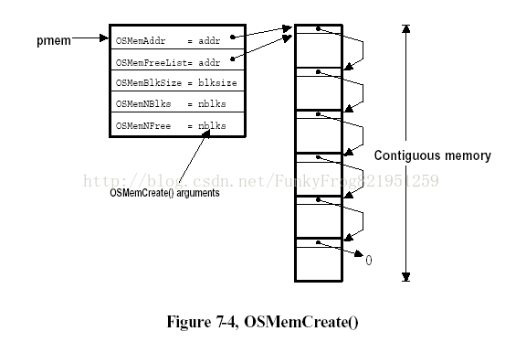

每个分区都会维护一个内存控制块（MCB），记录该分区的连续静态内存空间的首地址、可用空闲块的首地址（*指针*），总内存块数、内存块大小、可用内存块数（*u32*）。

MCB是对整个内存分区的管理，无法控制到分区内的具体内存块上，只会标记下一个空闲的内存块。因此，应用程序在申请内存块后，需要更新下一个空闲内存块的首地址。如何更新呢？

如上图右侧所示，将分区空间按照相同大小划分为内存块，**每个块的首地址处存储下一个块的首地址**，以此实现**单链表**的数据结构，从而在取出一个内存块时，可以更新下一个空闲块的地址。实现方式为***注释核心处***。


### 开辟空间（绑定）

```c
OS_MEM* OSMemoryAlloc(void *addr, u32 nblocks, u32 blocksize, u8 *err) {
	OS_MEM	*memptr;
	u8	   	*blk_ptr;
	void	**link_ptr;
	u32		i;
	u32		CPU_SR = 0;
	ENTER_CRITICAL();
	memptr = FreeMemoryPtr;
	if(FreeMemoryPtr)
		FreeMemoryPtr = FreeMemoryPtr->freeBlock;
	EXIT_CRITICAL();
	if(!memptr) {
		if(err)	*err = OS_ERR_MEM_INVALID_PART;
		return	NULL;
	}
	// 核心
	link_ptr = (void**)addr;
	blk_ptr	= (u8*)addr;
	for(i = 0; i < nblocks - 1u; ++i) {
		blk_ptr += blocksize;
		*link_ptr = (void*)blk_ptr;
		link_ptr = (void**)blk_ptr;
	}
	*link_ptr = NULL;
	
	memptr->addr 		= addr;
	memptr->freeBlock 	= addr;
	memptr->blockNums 	= nblocks;
	memptr->freeNums 	= nblocks;
	memptr->blockSize 	= blocksize;
	
	if(err)	*err = OS_ERR_NONE;
	return memptr;
}
```


### 释放空间（解绑）

```c
u8 OSMemoryFree(OS_MEM *memptr) {
    u32		 CPU_SR = 0;
	if(!memptr)	
		return OS_ERR_MEM_NULL_MCB;
	
	memclr((u8*)memptr, sizeof(OS_MEM));
	
	ENTER_CRITICAL();
	memptr->freeBlock = FreeMemoryPtr;
	FreeMemoryPtr = memptr;
	EXIT_CRITICAL();

	return OS_ERR_NONE;
}
```


### 内存申请

```c
void* OSMemoryGet(OS_MEM *memptr, u8 *err) {
	void *block_ptr;
    u32	 CPU_SR = 0;
	ENTER_CRITICAL();
	if(memptr->freeNums) {
		block_ptr = memptr->freeBlock;
		memptr->freeBlock = *(void**)block_ptr;
		memptr->freeNums--;
		EXIT_CRITICAL();
		if(err)	*err = OS_ERR_NONE;
		return block_ptr;
	}
	EXIT_CRITICAL();
	if(err)	*err = OS_ERR_MEM_NO_FREEBLKS;
	return NULL;
}
```


### 内存释放

本质就是把这一内存块的**首地址重新插入至单链表的头节点处**。

```c
u8 OSMemoryPut(OS_MEM *memptr, void* blockptr) {
    u32		 CPU_SR = 0;
	ENTER_CRITICAL();
	if(memptr->freeNums >= memptr->blockNums) {
		EXIT_CRITICAL();
		return OS_ERR_MEM_FULL;
	}
	*(void**)blockptr = memptr->freeBlock;
	memptr->freeNums++;
	memptr->freeBlock = blockptr;
	EXIT_CRITICAL();
	return OS_ERR_NONE;
}
```


### 可用内存块数查询

内存控制块MCB应是用户不可见的，因此需要函数封装。

```c
u32 OSMemoryQueryFree(OS_MEM *memptr) {
	return memptr->freeNums;
}
```


## 任务通信

任务之间采用**事件**进行通讯。


事件类型包括：**信号量**、**互斥信号量**、**邮箱**、**消息队列**等。

同样维护一个事件控制块ECB，用于记录事件信息。

```c
typedef struct os_event {
    u8    		Type;			// 事件类型
    void* 		MsgPtr;			// 用于指向消息存储区域
    u16   		SemCnt; 		// 用于信号量计数值
    PRIO_Type  	PrioGroup;		// 类似任务就绪表，存储优先级
    PRIO_Type  	PrioTable[EVENT_TBL_SIZE];
} OS_EVENT;
```


# 实例应用

## 测试例程

### led闪烁 + usart通信

```c
#include "os.h"
#include "led.h"
#include "delay.h"
#include "uart.h"
#include "iic.h"
#include "incs.h"

static STACK_Type	IdleStack[128];
static STACK_Type TASK_1_STK[128];
static STACK_Type TASK_2_STK[128];
static STACK_Type TASK_3_STK[128];

void task_1() {
	while(1) {
		LED1 = 0;
		TaskDelay(1000);
		LED1 = 1;
		TaskDelay(1000);
	}
}
void task_2() {
	while(1) {
		if(usart_rx_end) {
			u8 text[256];
			recv(text, recv_max_len());
			send(text);
		}
	}
}
void task_3() {
	while(1) {
		LED0 = 0;
		tim_delay_ms(1000, 3);
		LED0 = 1;
		tim_delay_ms(1000, 3);
	}
}

void IdleTask(void) {	
	u32		 CPU_SR = 0; 
	ENTER_CRITICAL();
	TaskCreate(task_1, &TASK_1_STK[127], 0, 0);
	TaskCreate(task_2, &TASK_2_STK[127], 1, 1);
	TaskCreate(task_3, &TASK_3_STK[127], 2, 2);
	TaskSuspend(MAX_TASKS);
	EXIT_CRITICAL();
}

int main()
{
	// device init
	tim_delay_init(7200, 3);
	led_init();
	uart_init(115200);

	// OS init
	Sys_Init();
	TaskCreate(IdleTask, &IdleStack[127], 63, 63);
	Sys_Start();

 	return 0;
}

```


## Debug

在调试过程，最常见的问题就是程序跑崩了进入了`HardFault_Handler`。该硬件错误的原因主要有两点：

1. 内存溢出或者访问越界（包括使用野指针）
2. 堆栈溢出

**常用解决方案如下：**

### 1.代码定位

查看左侧Registers Window窗口中R14(LR)的值。如果R14(LR) = 0xFFFFFFF9，继续查看MSP（主堆栈指针）的值，如果R14(LR) = 0xFFFFFFFD，继续查看PSP（进程栈指针）的值。

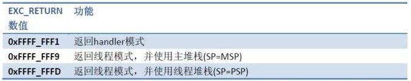

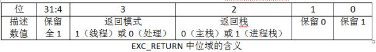

例如：

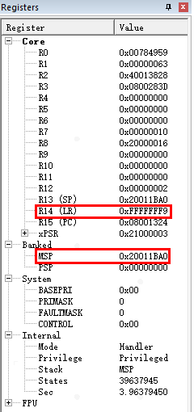

R14(LR) = `0xFFFFFFF9`，注意这里R13(SP)的值实际上与MSP的值一致。因此需要查看`0x20011BA0`地址处的值。

Keil菜单栏点击“View”——“Memory Windows”——“Memory1”，在“Address”地址栏中输入MSP的值：`0x20011BA0`，然后在对应行里找到地址。

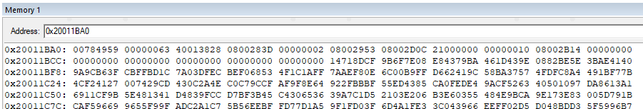

因为STM32内核将R0~R3，R12，LR，PC，xPRS寄存器依次入栈，因此先找到R0中的值在Memory Windows的位置，之后依次数过去第7个位置就是PC的值，也就是下一条指令的地址。这里是`0x08002D0C`。

拿到了PC地址，就可以去反汇编代码中定位具体代码了。在“Disassembly”窗口中右击，在下拉菜单中选择“Show Disassemblyat Address…”。输入地址`0x08002D0C`进行搜索，然后就会找到相对应的代码。

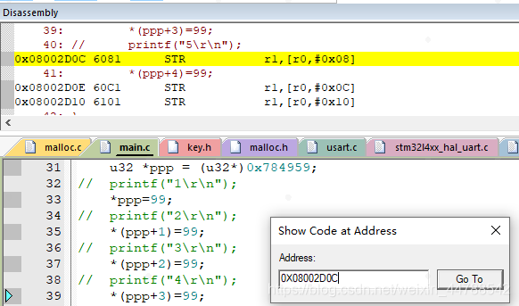

**另一个更简单的方法：**

在硬件中断函数HardFault_Handler里的while(1)处打调试断点，程序执行到断点处时自动停止。在Keil菜单栏点击“View”——“Call Stack Window”。然后在对话框中HardFault_Handler处右键选择“Show Caller Code”，就会跳转到出错之前的函数处。

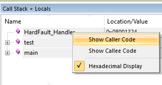

### 2.错误判断

在进入HardFault_Handler里的while(1)处断点后，菜单栏Peripherals——Core Peripherals——FaultReports打开异常发生的报告，可以查看发生异常的原因。

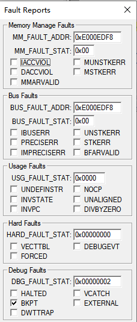

可以看到，在Cortex-M3中总共有四类Fault。哪个类错误就会在对应位置打勾。

#### 存储器管理faults

存储器管理 faults 多与 **MPU** 有关，其诱因常常是某次访问触犯了 MPU 设置的保护规范。另外，某些非法访问（例如，在不可执行的存储器区域试图取指）也会触发，并且在这种场合下，即使没有 MPU 也会触发存储器管理faults。 其常见诱因如下：

- 访问了所有 MPU regions 覆盖范围之外的地址；
- 访问了没有存储器与之对应的空地址；
- 往只读 region 写数据；
- 用户级下访问了只允许在特权级下访问的地址；

存储器管理 fault 状态寄存器(**MFSR**)，地址：`0xE000_ED28`，MFSR的各个位的定义如下：

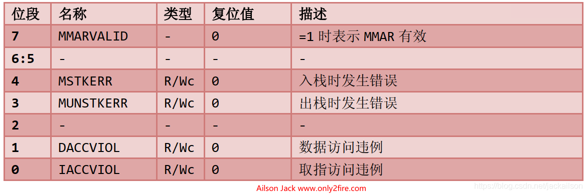

#### 总线faults

当 AHB 接口上正在传送数据时，如果回复了一个错误信号，则会产生总线faults，产生的场合可以是：

- 取指，通常被称作“预取流产”；
- 数据读/写，通常被称作“数据流产”；

在 CM3 中，执行如下动作时，如果地址有误，亦会触发总线异常：

- 中断处理起始阶段的堆栈 PUSH 动作。此时若发生总线 fault，则称为“入栈错误”；
- 中断处理收尾阶段的堆栈 POP 动作。此时若发生总线 fault，则称为“出栈错误”；

总线 fault 状态寄存器(**BFSR**)，地址：`0xE000_ED29`，BFSR的各个位的定义如下：

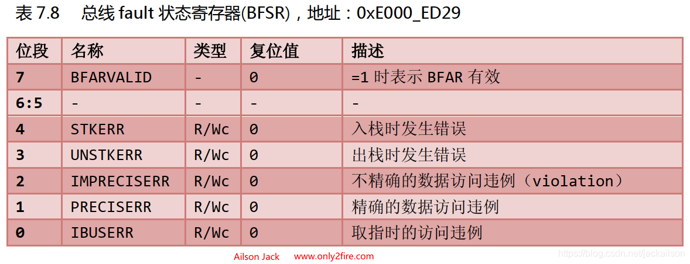

#### 用法faults

用法 faults 发生的场合可以是：

- **执行了协处理器指令**。 Cortex-M3 本身并不支持协处理器，但是通过 fault 异常机制，可以建立一套“软件模拟”的机制，来执行一段程序模拟协处理器的功能，从而可以方便地在其它 Cortex 处理器间移植。
- **执行了未定义的指令**。同上一点的道理，亦可以软件模拟未定义指令的功能。
- **尝试进入 ARM 状态**。因为 CM3 不支持 ARM 状态，所以用法 fault 会在切换时产生。软件可以利用此机制来测试某处理器是否支持 ARM 状态。
- **无效的中断返回**（LR 中包含了无效/错误的值）；
- **使用多重加载/存储指令时，地址没有对齐**。 另外，如果需要严格要求程序的质量，还可以让 CM3 在遇到除数为零的时候，以及遇到未对齐访问的时候也产生用法 fault。在 NVIC 中有两个控制位分别与它们对应。通过设置这两个控制位，就可以激活它们。

用法 fault 状态寄存器(**UFSR**)，地址：`0xE000_ED2A`，UFSR的各个位的定义如下：

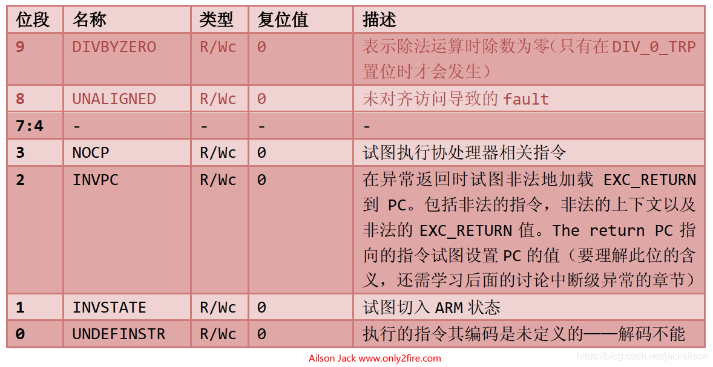

#### 硬faults

硬 fault 是上述总线 fault、存储器管理 fault 以及用法 fault **上访**的结果。若这些 fault 的服务例程无法执行，就会上访成硬 fault。另外，在取向量（异常处理时对异常向量表的读取）时产生的总线 fault 也按硬 fault 处理。

在 NVIC中有一个硬 fault 状态寄存器（HFSR），它指出产生硬 fault 的原因。如果不是由于取向量造成的，则硬 fault 服务例程必须检查其它的 fault 状态寄存器，以最终决定是谁上访的。

硬 fault 状态寄存器(**HFSR**)，地址：`0xE000_ED2C`，HFSR的各个位的定义如下：

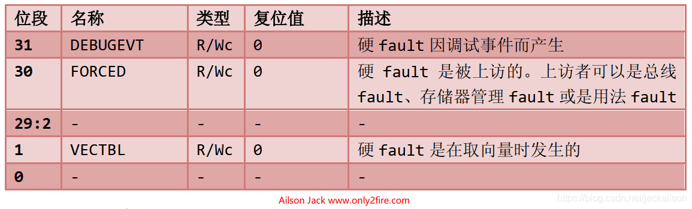


# 项目面经

## 简要描述一下RTOS项目

项目所用硬件为STM32F1开发板，设计模式采用**基于优先级抢占式的多任务调度模型**，在嵌入式系统中实现**多任务并发运行**，以满足实时性、可靠性和复杂性要求。该RTOS系统中提供了任务管理调度、内存管理、任务通信和外设交互等功能，并支持以IAP方式更新系统软件。


## 项目难点

一个是**硬件相关**。因为我的RTOS是运行在嵌入式开发板上的，它的硬件抽象级别较低，会更多的涉及到底层寄存器、硬件方面的知识。这就需要我在设计这个RTOS的时候，能对这个MCU的运行流程、运行原理、外设资源都有透彻的理解，而不仅仅是一些编程工作。

另一方面就是**系统整体的架构设计**，是一个比较复杂并且不断完善细节的过程。 例如有多次在添加一个新的功能模块时，发现旧有的核心结构不足以支持，需要对基础的数据结构进行修改，这需要我去修改部分的核心代码。如果我对于功能的封装和复用做的比较好，这部分工作量会相对较小一些。

比如任务就绪列表，一开始是采用一个32位的位数组进行管理的，每次寻找最高优先级只能按位从低到高遍历，并且只能存储32个任务优先级。后来为了允许更多的优先级，改为了一个长度为8的`unsigned char`数组，下标为组间优先级；数组的每一个元素都是一个8位的位数组，存储组内优先级。这样就扩容到了64个优先等级。同时通过维护一个组优先级就绪表，记录有就绪任务的组别，这样有效提高了遍历的速度。

再比如，对于任务信息的管理，一开始任务状态只有简单的就绪态、挂起态、延时态。但在加入了任务通信机制后，发现设计的过于简单了，任务的挂起可能是主动的（之前我设计的挂起态），但也可能是被动的，例如等待某个信号或者资源。因此我又增加了更详细的任务状态分类，以区分不同的阻塞情况，以适应新机制的需求等等。

待完善：内存申请没有阻塞态。


## 碰到过什么问题？

当时初步写完任务管理和调度部分的时候，想跑个实验程序测试一下，两个任务一个串口通信一个led闪烁，发现串口一发数据单片机就没反应了，之后开始调试纠错。

首先在调试时再次跑崩，停下发现是触发了硬错误中断。查看了M3相关错误寄存器的值后发现硬错误是由于上访造成的，实际的错误来自于用法错误里的一个INVPC位，意思是尝试向PC指针中载入非法的LR值。之后查看LR寄存器的值发现是0xFFFFFFF5，确实是非法的（正常只有1、9、D三种情况，分别是从中断返回另一个中断、不使用PSP和使用PSP的）。说明LR寄存器的值被修改过了。

查看寄存器发现现在SP使用的是MSP主堆栈指针，因此查看MSP指向的内存区域里保存的值（因为进入硬错误中断时硬件会先保存上下文，要看的就是进中断前的PC指针指向的内容就是错误代码处）。得到PC的值后去反汇编代码中找到了对应的代码指令，是在切换上下文的PendSV中断（就是执行任务调度功能的中断）返回时LR值错误了。

在我的系统中设计的是不允许任务在中断中切换的，因此在返回前我写了一条LR或0x04的指令，来保证用户返回时使用PSP堆栈，回到用户代码。而最终LR的值为0xFFFFFFF5，说明之前的正常LR值是0xFFFFFFF1，也就是说pendsv结束后返回了另一个中断中，这跟我写的程序逻辑不匹配了。因为正常pendsv中断是最低优先级的情况下是不可能出现中断嵌套的，因此去查看了设置pensv优先级的代码，发现写错了位。。。纠正后程序就能正常运行了。

经过这次调试，中间不断的查询资料，让我对stm32上的内置资源以及任务切换原理等方面都有了更深的理解。


## 任务调度是如何实现的

其任务调度的实现原理基于优先级抢占式的多任务调度模型。

### **任务管理**

每个任务都有一个唯一的静态优先级在创建任务时设定，并从空闲的任务控制块（TCB）链表中取出一个，用来存储任务的状态、堆栈、优先级等信息，并加入到已使用的TCB链表中。

### 任务优先级

任务的优先级共有64级，分为 8 x 8，8级组优先级，每组有8级组内优先级。

### 任务就绪列表

通过一个长度为8的`unsigned char`数组，下标索引表示**组优先级**，数组元素**以位数组的方式标记8位组内优先级是否就绪**。额外维护一个8位的位数组，标记**有就绪任务的优先级组**。寻找就绪任务的最高优先级只需找到组优先级和组内优先级的最低位1即可。

### 任务切换

1. **上下文切换方式**——采用STM32内置的PendSV异常实现，设置为最低优先级，硬件自动将特殊寄存器的值压入当前任务堆栈，通过汇编代码手动将R4-R11寄存器的值压栈，之后切换任务，从下一个任务的堆栈中取出之前保存的R4-R11寄存器值，并将PSP指向下一个任务的堆栈，这样退出PendSV后硬件会自动将下一个任务堆栈中的特殊寄存器值恢复，从而实现上下文的切换。
2. **时间片轮转**——采用STM32的系统时钟定时器Systick作为RTOS的时间片基准，并将该异常设置为最高优先级，每1ms触发一次，在中断中进行任务的状态更新（延时、超时时间更新等）。
3. **任务切换时机**——RTOS中任务的切换只会发生在三种情况下：1.任务主动放弃对CPU的控制权（即挂起、延时等）；2.中断结束时，某个任务或任务等待的某种资源可能就绪了，需要任务切换；3.任务因为申请资源被占用而阻塞或任务释放某个资源后通知系统进行上下文切换。因此在挂起任务、所有中断（包括Systick）结束时，通过软件触发PendSV异常，实现任务切换。

### 为什么用PendSV？为什么优先级最低？

可控性：`PendSV`中断是由软件触发的，而不是由硬件事件触发的。这意味着任务切换的时机完全由开发人员控制，可以在确保安全的情况下进行。其他中断通常是由硬件事件触发的，而它们的时机不容易控制。

**它的挂起状态可在更高优先级异常处理内设置，且会在高优先级处理完成后执行**。利用该特性，若将PenSV设置为最低的异常优先级，可以让PenSV异常处理在所有其他中断处理完成后执行。


## 内存管理是如何实现的

- **栈内存管理：**每个任务在创建时都会以静态数组的形式分配一块栈内存，用于保存任务的局部变量、函数调用信息等。
- **堆内存管理：**
  1. 采用的是**静态内存池**的管理方式。
  2.  静态内存池中存在多个静态的内存分区（绑定的全局数组），每个内存分区内包含多个相同的内存块。
  3. 在同一内存分区中的内存块，通过将下一内存块的首地址存入当前内存块的开头来实现基于单链表的空闲内存块管理模式。
  4.  每个内存分区均维护一个内存控制块，记录该分区的首地址、下一个空闲内存块的首地址、剩余空闲内存块数等信息。
  5.  当用户申请动态内存空间时，从空闲块链表的表头取出一个内存块供用户使用，并更新空闲内存块指针即可。
  6.  当用户释放内存块时，只需将其放回链表首部（即将首部地址存入释放的内存块的首地址，以此重新链接，并更新指针等信息）。


### 外部碎片和内部碎片？

- **位置**：
  1. 外部碎片：外部碎片是指分散在内存区域之间的未分配的小块内存。这些未分配的内存块通常太小，无法用于分配请求的大块内存。
  2. 内部碎片：内部碎片是指已分配的内存块中未被使用的部分。这些未使用的内存位于已分配块的内部，但由于不足够大，不能用于满足更大内存请求。
- **形成原因**：
  1. 外部碎片：外部碎片通常是由于多次内存分配和释放操作导致的。当释放的内存块不是连续的，而新的内存请求需要连续的内存块时，就会产生外部碎片。
  2. 内部碎片：内部碎片通常是由于内存分配器分配了比请求的内存块更大的内存块，而没有充分利用整个内存块，留下了未使用的部分。
- **解决方法**：
  1. 外部碎片：解决外部碎片通常需要内存紧凑（或内存整理）操作，这会重新排列已分配和未分配的内存块，以便创建足够大的连续内存块来满足大内存请求。
  2. 内部碎片：解决内部碎片通常需要更加有效地管理内存分配，避免分配比所需更大的内存块。这可能涉及到使用内存池、自定义内存分配策略或调整内存分配器的配置。


## 任务通信是如何实现的

任务通信是基于事件管理的。通过维护一个事件控制块，记录当前触发的事件类型（信号量、消息队列等），以及要传递的信息（信号量的信号、指向消息队列控制块的指针）、当前等待该事件的任务的优先级。

### 消息队列

采用**环形队列**的数据结构对消息队列进行管理。维护一个消息队列控制块，记录该队列的内存起始地址、结束地址、下一个写入消息的地址、下一次读取消息的地址、队列大小和已用空间。

#### 1.**读取消息**

当任务需要读取某个消息队列中的消息时，先判断队列中是否有数据，若有则直接读取，并修改消息队列控制块的相关指针。若没有，则需要将当前任务阻塞以等待消息到来（可以设置超时时间），并且将该任务的优先级加入该消息队列事件的控制块中的等待列表。

之后执行任务调度。

当该任务等待超时或被唤醒时，任务调度切换回当前任务继续执行后续代码。根据TCB中的阻塞状态分别处理（唤醒取数据、中止退出、超时从等待列表中删除）。最后更新任务的状态。

#### 2.**发送消息**

先判断该消息队列事件是否有在等待的任务，有则取其中优先级最高的唤醒（从等待列表中删除并加入就绪任务列表），此时消息内容是直接传入TCB中的，之后执行任务调度。

若没有，则再判断队列是否满了，满了直接返回，没满就传入消息，同时修改消息队列控制块的相关指针。

其中，若此时下一个写入消息的地址即为队列的结束地址，需要将其设置为队列的起始地址。这样在队头数据被取出后下一个被放入的位置就是队头处，这样就实现了环形链表的数据结构。

#### 3.紧急消息

正常消息的发送读取都遵循FIFO先进先出的队列规则，但若是有较为紧急的信息，可以将消息直接插入在消息队列的队头（LIFO后进先出），以达到先被读取处理的目的。

### 信号量

原理和消息队列基本一致，数据管理更加简洁。


## usart、iic的区别

1. **通信方式**
   1. USART 是一种通用的串行通信接口，支持**同步和异步通信**。它可以以同步或异步模式进行数据传输，因此适用于多种应用场景。
   2. I2C 是一种串行通信总线，主要用于**短距离**、多设备的**同步通信**。它采用主从结构，允许多个设备在同一总线上通信。
2. **速度**
   1. USART 的通信速度可以非常高，通常达到几十MHz，适合高速通信。
   2. I2C 的通信速度相对较低，通常在几百kHz范围内，尤其适用于低速、短距离通信。
3. **引脚数量**
   1. USART 通常需要多个引脚，包括**数据线（TX和RX）、时钟线、控制线**等，以支持同步和异步通信。
   2. I2C 只需要两根引脚：**数据线（SDA）和时钟线（SCL）**。
4. **应用领域**
   1. USART 通常用于串口通信，如UART（Universal Asynchronous Receiver Transmitter）或RS-232通信，用于连接计算机、外设等。
   2. I2C 主要用于连接多个设备的短距离通信，如传感器、存储器、外设等，通常用于嵌入式系统中。
5. **电平标准**
   1. USART 的电平标准可以是TTL、CMOS或RS-232等，具体取决于应用和硬件配置。
   2. I2C 使用的是开漏极性设计，电平标准一般是TTL或CMOS。
6. **应用举例**
   1. USART 可用于串口调试、串口通信、无线模块通信等。
   2. I2C 常见于传感器读取、EEPROM编程、温度监测等应用。


## USART、IIC、SPI

| 特性       | USART                           | I2C (IIC)                               | SPI                      |
| ---------- | ------------------------------- | --------------------------------------- | ------------------------ |
| 通信方式   | 同步和异步                      | 同步                                    | 同步                     |
| 数据线数目 | 2或4（同步模式）                | 2                                       | 4                        |
| 通信类型   | 点对点或多点                    | 多点                                    | 主从                     |
| 传输速率   | 较低到较高                      | 较低到中等                              | 中等到高                 |
| 数据帧结构 | 起始位、数据位、校验位、停止位  | 起始位、数据位、ACK位、停止位           | 数据位、时钟位、片选位   |
| 硬件支持   | 是                              | 是                                      | 是                       |
| 主要用途   | 通用串口通信、传感器、GPS模块等 | 传感器、EEPROM、RTC、LCD等              | 闪存、显示屏、通信模块等 |
| 速率       | 115.2kb/s                       | 标准100kb/s 快速400kb/s 字节快速3.4Mb/s | stm32中18Mb/s            |


## OTA升级方式有哪几种

原地、差分、全量、AB面


## BootLoader中你应用程序的代码段是什么时候写入的？

代码段实际就是烧录的二进制固件，存储在flash中，因此代码的运行（PC指针）也是始终在FLASH中的。

之后的全局区、堆栈都存储在SRAM中。

任务的堆栈实际是在全局区中的，而主堆栈实际是在全局区后的栈中的。


## STM32的FLASH和SRAM

STM32和类似的微控制器通常使用**分布式存储器架构**，其中Flash存储器和SRAM存储器具有不同的特性和用途，因此它们用于存储不同类型的数据。

1. **Flash存储器**：
   1. Flash存储器通常用于存储程序代码（代码段）以及只读数据，例如常量和初始化数据。
   2. **非易失性存储器**：其中的数据在断电后仍然保持不变。代码段被加载到Flash存储器中，因为它们包含程序的执行指令，而这些指令需要在设备上电后立即可用。
   3. **擦除和编程操作相对慢**：Flash存储器的写入操作通常涉及擦除和编程过程。擦除Flash扇区或页通常需要较长的时间，而编程操作也相对较慢。这是因为Flash存储器的工作原理要求在擦除之前必须将整个扇区或页设置为已擦除状态（即全部1），然后才能将位设置为0以编写数据。
   4. **有限的写入寿命**：Flash存储器通常具有有限的写入寿命，因为多次写入同一位置会导致逐渐减小的擦除/编程耐受性。
2. **SRAM存储器**：
   1. SRAM（静态随机访问存储器）通常用于存储全局变量、堆栈和动态分配的内存（例如通过`malloc`分配的内存）。
   2. **易失性存储器**：其中的数据在断电后会丢失。
   3. **更快的读写访问**：SRAM是静态存储器，与Flash相比，它具有更快的读写访问速度。因为SRAM不需要擦除或编程过程，数据可以直接读取和写入，速度更快。
   4. **无限的写入寿命**：SRAM没有写入寿命的限制。它可以无限次写入，不会导致性能下降或损坏。

这种存储器分配的方式充分利用了Flash和SRAM的特性，使得**代码段可以在设备启动时立即可用，而全局变量和堆栈等数据可以在程序的运行时动态分配和使用**。这种分离还有助于提高系统的**可靠性**，因为Flash的写入操作相对较慢，而SRAM允许更快的读写访问。


## 基于优先级抢占式，低优先级任务会不会饿死？

创建的每个任务都只是不停地处理自己的事情而没有其它任何事情需要等待一一由于它们不需要等待所以**总是能够进入运行态**。这种不停处理类型的任务限制了其有用性，因为它们只可能被创建在最低优先级上。如果它们运行在其它任何优先级上，那么比它们优先级更低的任务将永远没有执行的机会，即饥饿。

为了使我们的任务切实有用，我们需要通过某种方式来进行事件驱动。一个事件驱动任务只会在事件发生后触发工作(处理)，而在事件没有发生时是不能进入运行态的。调度器总是选择所有能够进入运行态的任务中具有最高优先级的任务。一个高优先级但不能够运行的任务意味着不会被调度器选中，而代之以另一个优先级虽然更低但能够运行的任务。因此，采用事件驱动任务的意义就在于任务可以被创建在许多不同的优先级上，并且最高优先级任务不会把所有的低优先级任务饿死。

高优先级应该保留给可预测、循环执行、且循环周期较短的任务。对于高优先级、CPU占用时间长的任务应该拆分为多个任务，缩小时间关键代码，通过任务同步机制，将占用CPU时间多的工作交给中或低优先级任务处理。


## RTOS和Linux系统的区别？

- **实时性**：
  1. RTOS专门设计用于实时系统，它们注重快速响应和精确的时间控制。RTOS可以保证任务在特定的时间约束内执行，适用于需要严格的实时性能的应用，如嵌入式系统、自动控制系统等。<font color="red">**重点在于执行时间的确定性**</font>
  2. Linux是通用的操作系统，其实时性能较弱。尽管可以通过一些方法来提高Linux的实时性能（如PREEMPT-RT内核补丁），但通常不适用于需要**精确实时控制**的应用。
- **复杂、资源消耗**：
  1. RTOS通常非常精简，只包含必要的组件和功能，以减小内核的大小和复杂性，从而提高响应速度，占用较少的内存和处理器资源。
  2. Linux是一个通用的、功能强大的操作系统，具有广泛的功能和驱动程序支持，但这也使得其内核相对较大和复杂，通常需要更多的内存和处理器资源。
- **内核抽象级别**：
  1. RTOS通常提供较低级别的硬件抽象，使开发人员更接近底层硬件，从而提供更高的控制能力。
  2. Linux提供更高级别的抽象，隐藏大部分底层硬件细节，使开发更容易，但也降低了对硬件的直接控制。
- **开源性**：
  1. 有些RTOS是开源的，但也有商业RTOS。开源RTOS提供了更大的灵活性和可定制性，但也需要更多的开发和维护工作。
  2. Linux是一个广泛采用的开源操作系统，具有大量的社区支持和开发资源。


## 时间效率的统计

1. **上下文切换**：1.5us
2. **任务切换**：2.5us
3. **内存块申请**：1.2us
