仿照**U-COS II**写的一个抢占式实时操作系统——[Easy OS](https://github.com/shen962806862/EasyOS)。目前只实现了任务的简单调度，功能比较单一，后续会不断完善更新。


# 底层架构


## STM32硬件支持

Cortex-M3内核提供了以下异常：

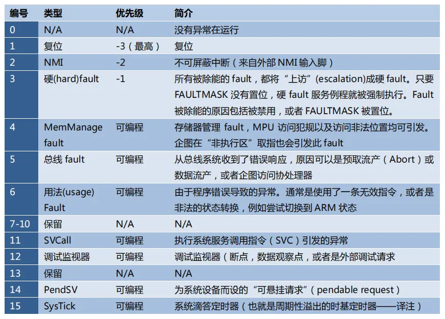

编号大于15的均属于外部中断。

异常是可以打断正常执行流的事件，这是实现实时操作系统的关键，本文中将会使用——**PendSV可悬起异常**和**SysTick滴答定时器**。

<!--more-->

## SysTick系统滴答定时器

SysTick是一个**24位**的系统节拍定时器，具有自动重载和溢出中断功能，所有基于Cortex_M3处理器的微控制器都可以由这个定时器获得一定的时间间隔。

SysTick在实现本文的实时操作系统中起到了非常关键的作用——节拍 / 时间片，它保证了操作系统运行的基准单位。同时，通过将其优先级设置为最高，就可以实现在一个时间片用完之后，稳定触发该异常，从而实现**时间片的轮转**。

通过以下函数初始化SysTick计数器，设置两次中断之间的时间。

```c
#define TICKS_PER_SEC 1000
SysTick_Config(SystemCoreClock / TICKS_PER_SEC);
```

**重装载值 = SysTick 时钟频率(Hz) x 想要的定时时间（S）**

例如，**SystemCoreClock**为72MHZ，想要实现1ms进一次中断，就只需要将**TICKS_PER_SEC**设置为1000，也就是 x 0.001即可。


## PendSV可悬起异常

基于其可悬起的特点，将其配置为最低优先级，OS就可以利用它“缓期执行”一个异常——直到其它重要的任务完成后才执行动作。

悬起 PendSV 的方法是：手工往 NVIC的 PendSV悬起寄存器中写 1。悬起后，如果优先级不够高，则将缓期等待执行。

PendSV的典型使用场合是在**上下文切换时（在不同任务之间切换）**。

例如，一个系统中有两个就绪的任务，上下文切换被触发的场合可以是：
1、执行一个系统调用
2、**系统滴答定时器（SYSTICK）中断（本文中使用）**

为什么PendSV好用，如下：

假设有这么一个系统，里面有两个就绪的任务，并且通过SysTick异常启动上下文切换。但若在产生 SysTick 异常时正在响应一个中断，则 SysTick异常会抢占其 ISR。在这种情况下，OS是不能执行上下文切换的，否则将使中断请求被打断延迟，而且在真实系统中延迟时间还往往不可预知，这是不应该被允许的。

在Cortex-M3中，如果 OS 在某中断活跃时尝试切入线程模式，将触犯用法fault异常。

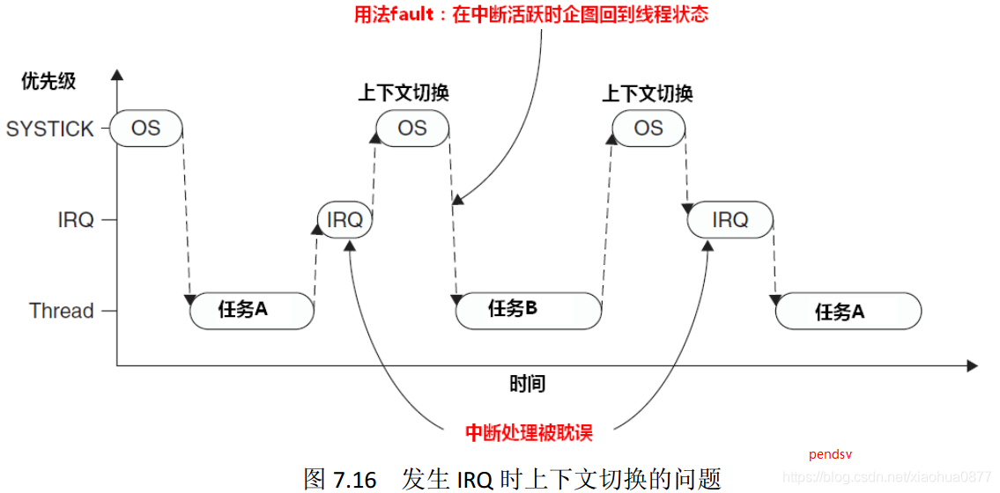

PendSV完美解决了这个问题。PendSV异常会自动延迟上下文切换的请求，直到其它的 ISR都完成了处理后才放行。为实现这个机制，需要把 PendSV编程为最低优先级的异常。

如果 OS检测到某 IRQ正在活动并且被 SysTick抢占，它将悬起一个 PendSV异常，以便缓期执行 上下文切换。

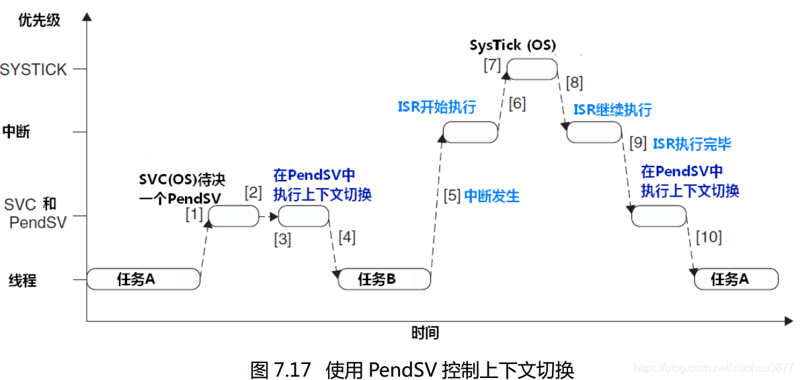

上图很好的展示了本文实现的操作系统的任务切换的时序实现。


## 汇编实现

使用SysTick异常实现时间片轮转，并触发PendSV中断。

在PendSV中实现上下文的切换。


### SysTick中断调用

```assembly
;EQU 等价替换
NVIC_INT_CTRL    EQU            0xE000ED04    ; 中断控制寄存器
NVIC_PENDSVSET   EQU            0x10000000    ; 触发软中断，通过给NVIC_INT_CTRL第28bit写1

CPU_TASK_SCHEDULE                    ;OS context switch（任务切换）
;PUSH 压栈。{}表示一个列表，这里先将R4压栈再压R5
    PUSH    {R4, R5}
;LDR 将源寄存器的值（这里是直接取NVIC_INT_CTRL的值，也就是ICSR的地址）加载到目标寄存器中（R4）
    LDR     R4, =NVIC_INT_CTRL       ; R4 = NVIC_INT_CTRL（触发 PendSV 异常）
    LDR     R5, =NVIC_PENDSVSET      ; R5 = NVIC_PENDSVSET
    ; *R4 = R5（向 NVIC_INT_CTRL 写入NVIC_PENDSVSET 触发 PendSV 中断）
    STR     R5, [R4]                 
    POP     {R4, R5}
    BX      LR                       ; return;
    
    align 4							 ; 4字节对齐，写于文件末
    end
```

其中中断控制寄存器片段

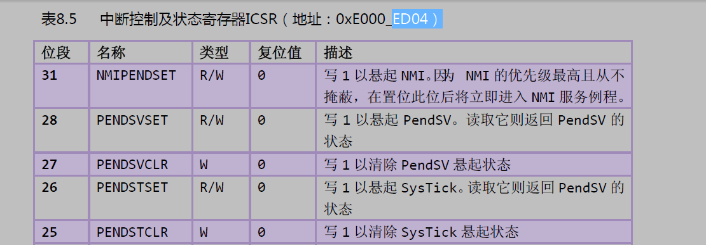


### PendSV汇编函数

```assembly
PendSV_Handler                          ; 保存现场
    CPSID    I                          ; 关中断，任务切换期间要关中断
    ; 异常处理或进程切换时，需要保存程序状态寄存器的值，可用该指令读出程序状态寄存器的值，然后保存。
	MRS     R0, PSP                     
    CBZ     R0, PendSV_Handler_NoSave   ; PSP指针为0就跳转，只在第一次运行时跳转
;----------------------------------------------------------------------------------------
    SUB     R0, R0, #0x20               ; R0 = R0 - 0x20;  
    STM     R0, {R4-R11}				; 将R4-R11的值暂存起来             
;----------------------------------------------------------------------------------    
    LDR     R1, =TCB_CurP               ; LDR伪指令获取 TCB_CurP->StackTop 指针
	; R1 = *R1; 获取 TCB_CurP->StackTop 指向的值（这个值是一个地址）
	LDR     R1, [R1]                    
	; *R1 = R0; 将现场信息（R4-R11）存入 TCB_CurP->StackTop 指向的地址所在的内存
    STR     R0, [R1]                    

; 由于汇编语言是顺序执行，所以执行完上面那条语句后，在没有跳转等指令的情况下，会接下去执行。
PendSV_Handler_NoSave            	    ; 恢复现场
    LDR     R0, =TCB_CurP               ; R0 获取 TCB_CurP->StackTop 指针
    LDR     R1, =TCB_NextP          	; R1 获取 TCB_NextP->StackTop 指针
    LDR     R2, [R1]              		; R2 获取 TCB_NextP->StackTop 指向的值
    STR     R2, [R0]                	; 将 TCB_CurP->StackTop 指向这个值
	; 将 以这个值为地址的内存里的值（也就是之前保存的现场信息）存入R0，开始恢复
    LDR     R0, [R2]                	
    
    LDM     R0, {R4-R11}				; 从 R0 存储的地址处恢复R4-R11的值
    MSR     PSP, R0                  	; PSP 指向R0（恢复现场）

    ORR     LR, LR, #0x04           	; LR=LR|0x04; EXC_RETURN, 第2位赋1表示返回后使用PSP
    CPSIE     I                     	; 开中断
    BX    LR                        	; return;
```

#### 汇编指令

**`CPSID I`**

1. `CPSID`: 这是 "Change Processor State, Interrupts Disabled" 的缩写，表示**更改处理器状态以禁用中断**。
2. `I`:  `Interrupts` 的缩写，指定要更改的处理器状态。当前情况下，表示**禁用中断**。

**`MRS	R0, PSP`**

1. `MRS`："Move to Register from Special register"的缩写，表示从特殊寄存器中将值移动到通用寄存器。
2. `PSP` 是 `Process Stack Pointer` 的缩写，它是 ARM Cortex-M 处理器中用于**指示当前进程（线程）的堆栈指针**。**该指针为0**代表当前进程的堆栈指针未初始化或者**当前没有运行的任务**。Cortex-M 处理器通常具有两个堆栈指针，另一个是 `MSP`（Main Stack Pointer）。

**`CBZ`**

条件分支指令，用于在**指定的寄存器为零时跳转**到目标地址。 "Compare and Branch on Zero"的缩写。

**`SUB	R0, R0, #0x20`**

这里将PSP指针减去0x20是为了保存R4-R11的上下文（8个寄存器共32字节->0x20）。**避免堆栈溢出**。

**`STM	R0, {R4-R11}`** 

**将多个寄存器的值保存到内存中**，常用于保存上下文。<font color="red">注意是**内存**！！！</font>  "Store Multiple" 的缩写。这里将R4-R11保存至R0中存储的地址所指向的内存。

**`STR	R0, [R1]`**

用于将寄存器 `R0` 中的值存储到 `R1` 中地址指向的内存位置。 "Store Register" 的缩写。

**`LDM	R0, {R4-R11}`** 

**从内存中加载多个寄存器的值**， "Load Multiple" 的缩写。

**`MSR	PSP, R0`**

将R0中的地址移动到PSP指针中。即恢复现场。

**`ORR	LR, LR, #0x04`**

执行按位或操作，这里将第2位赋1，告诉处理器返回后使用PSP指针继续执行程序。

#### LR寄存器

在出入ISR的时候，LR的值将得到重新的诠释，这种特殊的值称为**EXC_RETURN**。

EXC_RETURN的二进制值除了最低4位外全为1，而其最低4位则有另外的含义，如下：

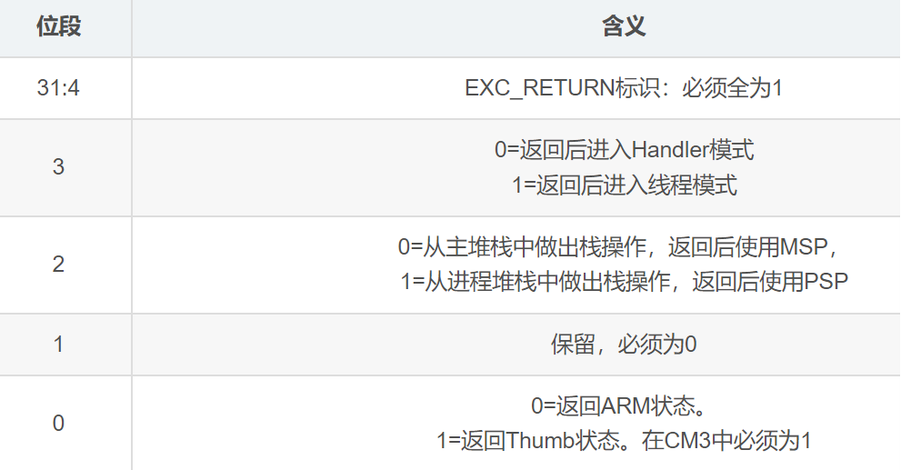

#### 上下文切换

一个形象的GIF如下所示：

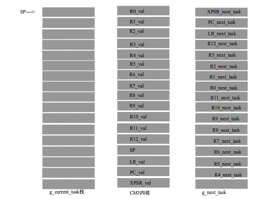

上下文切换，其实就是保存和恢复上图中这些CM3内核寄存器中的值。

|   寄存器   | 用途                                                         |
| :--------: | :----------------------------------------------------------- |
| **R0~R3**  | 用作传入函数参数，传出函数返回值。在子程序调用之间，可以将 r0-r3 用于任何用途。被调用函数在返回之前不必恢复 r0-r3。如果调用函数需要再次使用 r0-r3 的内容，则它必须保留这些内容。 |
| **R4~R11** | 存放函数的局部变量。若被调用函数使用了这些寄存器，返回之前必须恢复这些寄存器的值。 |
|  **R12**   | 内部调用暂时寄存器 ip。它在过程链接胶合代码（例如，交互操作胶合代码）中用于此角色。 在过程调用之间，可以将它用于任何用途。被调用函数在返回之前不必恢复 r12。 |
|  **R13**   | 栈指针 sp。它不能用于任何其它用途。sp 中的值在退出被调用函数时必须与进入时的值相同。 |
|  **R14**   | 链接寄存器 lr。若保存了返回地址，则可以在调用之间将 r14 用于其它用途，程序返回时要恢复。 |
|  **R15**   | 程序计数器 PC。它不能用于任何其它用途。                      |

CM3处理异常/中断时，硬件会把**R0-R3，R12，LR，PC,  XPSR**自动压栈。然后由PendSV的中断服务程序(后面简称PendSV ISR)手动把**R4-R11**寄存器压入任务栈中，这样就完成了任务上下文的保存。

恢复下一个任务的寄存器(包含PC)，当恢复PC时就能跳转到任务被打断的地方继续执行。
恢复过程正好与保存过程相反，PendSV ISR会先手动地将R4-R11恢复到CM3中，然后在PendSV ISR退出时，CM3硬件会自动将R0-R3，R12，LR, XPSR恢复到CM3的寄存器中。


### 中断控制的汇编函数

```assembly
CPU_SR_Save                     ; 关中断（进入临界区）
    MRS     R0, PRIMASK			; 读取 PRIMASK 到 R0,R0 为返回值
   								; PRIMASK寄存器只有一位，当这个位置 1 时 就关掉所有可屏蔽的异常
    CPSID   I					; PRIMASK=1,关中断(NMI和硬件FAULT可以响应)
    BX      LR					; 返回

CPU_SR_Restore			    	;开中断（退出临界区）
    MSR     PRIMASK, R0			;读取 R0 到 PRIMASK 中,R0 为参数
    BX      LR					
```

c语言定义宏实现调用

```c
u32 	 CPU_SR;  				 // 保存PRIMASK的值(中断开关的状态控制)
#define  ENTER_CRITICAL()  {  CPU_SR = CPU_SR_Save();  }   // 关中断
#define  EXIT_CRITICAL()   {  CPU_SR_Restore(CPU_SR); }
```

注意，ARM架构中汇编函数的返回值默认为存储在R0中；同理，汇编函数的前四个输入参数一般为R0-R3。


### 初始化的汇编函数

```assembly
NVIC_INT_CTRL    EQU            0xE000ED04    ; 中断控制寄存器的地址
NVIC_PENDSVSET   EQU            0x10000000    ; 触发软中断，通过给NVIC_INT_CTRL第28bit写1
NVIC_SYSPRI14    EQU            0xE000ED22    ; 系统优先级寄存器(14)  对应 PendSV
NVIC_PENDSV_PRI  EQU            0xFF          ; PendSV 中断优先级为最低(0xFF)

CPU_Start
    CPSID    I          
    
    LDR     R0, =NVIC_SYSPRI14       ; 初始化PendSV，并设置中断优先级为255，最低     
    LDR     R1, =NVIC_PENDSV_PRI          
    STRB    R1, [R0]                      
    
    LDR 	R4,  =0x0                ; 初始化PSP为0   
    MSR    	PSP, R4                           
    
    LDR    	R4, =NVIC_INT_CTRL       ; 先触发一次PendSV异常
    LDR    	R5, =NVIC_PENDSVSET       
    STR    	R5, [R4]                   

    CPSIE    I  
```


# STM32F103

## 初始化

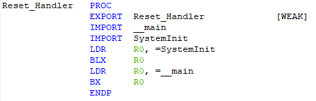

在stm32的启动汇编文件中，最重要的就是这段启动代码。

### 跳转指令

ARM指令中，**B、BL、BX、BLX** 区别如下：

- **B——跳转**

`B {条件} 目标地址`

B 指令是最简单的跳转指令。一旦遇到B 指令，ARM 处理器将立即跳转到给定的目标地址，从那里继续执行。

注意存储在跳转指令中的实际值是相对当前PC 值的一个**偏移量**，而不是一个绝对地址，它的值由汇编器来计算（参考寻址方式中的相对寻址）。它是 24 位有符号数，左移两位后有符号扩展为 32 位，表示的有效偏移为 26 位(前后32MB 的地址空间)。

- **BL——带链接的跳转**

`BL {条件} 目标地址`

首先将当前指令的下一条指令地址保存在LR寄存器，然后跳转至目标地址。通常用于调用子程序，可通过在子程序的尾部添加mov  pc, lr 返回。

BL 是另一个跳转指令，但跳转之前，会在寄存器R14 中保存PC 的当前内容，因此，可以通过将R14 的内容重新加载到PC 中，来返回到跳转指令之后的那个指令处执行。

- **BX——带状态切换的跳转**

`BX {条件} 目标地址`

最低位为1时，切换到Thumb指令执行，为0时，解释为ARM指令执行。

BX 指令跳转到指令中所指定的目标地址，目标地址处的指令既可以是ARM 指令，也可以是Thumb指令。

- **BLX——带链接和状态切换的跳转**

`BLX  目标地址`

相当于 BL 和 BX 的结合。BLX 指令从ARM 指令集跳转到指令中所指定的目标地址，并将处理器的工作状态由ARM 状态切换到Thumb 状态，该指令同时将PC 的当前内容保存到寄存器R14 中。因此，当子程序使用Thumb 指令集，而调用者使用ARM 指令集时，可以通过BLX 指令实现子程序的调用和处理器工作状态的切换。

### SystemInit

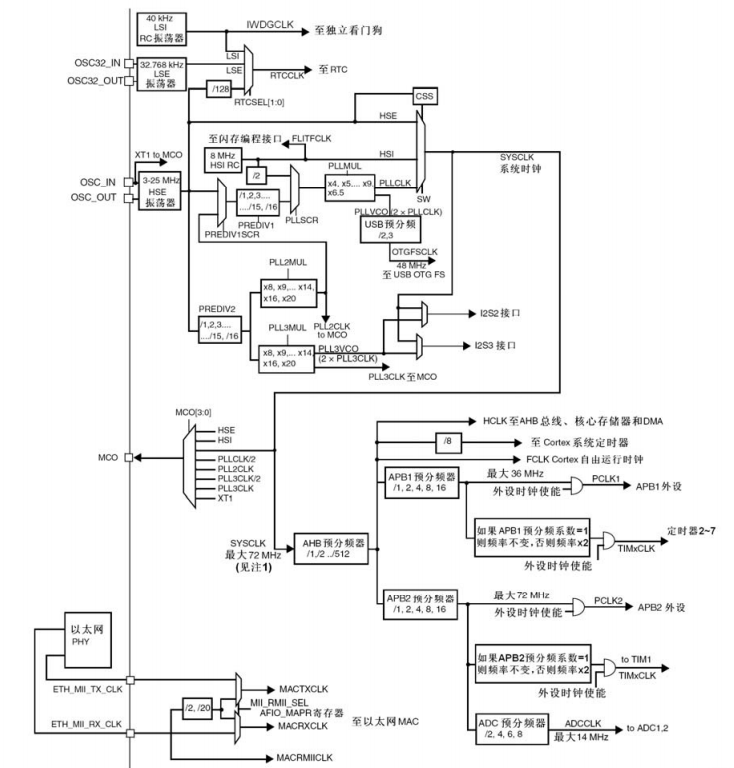

首先跳转到`SystemInit()`进行时钟的初始化工作（RTOS的基础）后返回。

1. 开启内部8MHz振荡器
2. 根据芯片容量不同默认初始化CFGR寄存器（Reset SW, HPRE, PPRE1, PPRE2, ADCPRE and MCO bits ）
3. 赋值CR寄存器的某些位，其作用为：Reset HSEON, CSSON and PLLON
4. 把CFGR寄存器的PLLSRC, PLLXTPRE, PLLMUL and USBPRE/OTGFSPRE位置0
5. 根据芯片容量初始化中断位（关闭中断位）
6. 初始化Memory控制
7. 调用宏定义指定频率系统时钟设置函数，默认 `SetSysClockTo72()`。即**将SYSCLK设置为72MHz，这是后续一切时间操作的基础**。
8. 在 `SetSysClockTo72()` 函数中，实现了：配置CR、CFGR、ACR（设置FLASH）寄存器的某些位（使能，判断是否就绪，设置相应位，设置FLASH，设置AHB、APB预分频系数，设置HCLK、PCLK等等外设时钟，设置PLL锁相环倍频系数最终确定系统时钟）。


## systick

在上述文本中提到的 `SysTick_Config()` 函数，内部实现如下：

```c
static __INLINE uint32_t SysTick_Config(uint32_t ticks) { 
 	if (ticks > SysTick_LOAD_RELOAD_Msk)  return (1);
    SysTick->LOAD  = (ticks & SysTick_LOAD_RELOAD_Msk) - 1;
    NVIC_SetPriority (SysTick_IRQn, (1<<__NVIC_PRIO_BITS) - 1);
    SysTick->VAL   = 0;
    SysTick->CTRL  = SysTick_CTRL_CLKSOURCE_Msk | 
                   SysTick_CTRL_TICKINT_Msk   | 
                   SysTick_CTRL_ENABLE_Msk;
    return (0);
}
```

通过设置为 `SystemCoreClock / ticks_per_sec`，即 72MHz / 1000，实现1ms结束一次计时。

### 相关寄存器

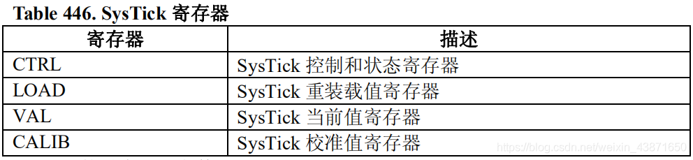

上表中的四个寄存器负责管理systick的运行。


用来装载我们需计数的次数的寄存器。(即VAL寄存器重置时的值)

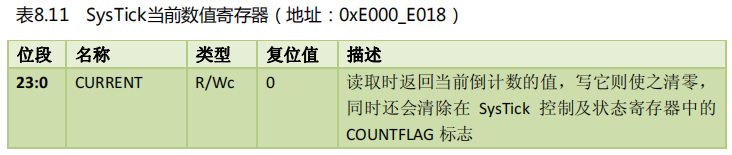

每一个时钟周期，VAL的值自减1。当VAL值为0时,会重新加载LOAD中的值，并且产生COUNTFLAG标志。(COUNTFLA标志在CTRL寄存器)

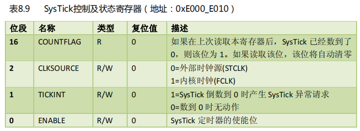

- 第0位：定时器使能位。**使能即运行**。
- 第1位：中断使能位，用于决定自减为0后**是否执行 `SysTick_Handler` 中断**。
- 第2位：时钟源选择位 ，可以选择内部时钟或外部时钟作为时钟源。
  - **内部时钟**：上述时钟树中的SYSCLK系统时钟，也是输入给AHB总线的HCLK时钟，**72MHz**；
  - **外部时钟**：RCC通过AHB时钟(HCLK)8分频后作为Cortex系统定时器(SysTick)的外部时钟，**9MHz**。
- 第16位：计数标志位 ，SysTick自减到0时，该位置1，表示计数完毕。读取该位后，该位自动清零。

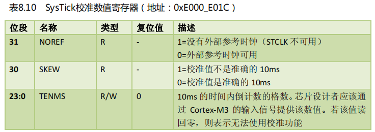

不常用。

至此以上两步，完成了systick时钟的初始化，用作RTOS的时间片基准。


## 定时器

### systick内核定时器

可参考 [任务的延时](#任务的延时) 。


### tim定时器

分为：1.高级控制定时器（TIM1、TIM8）、2.通用定时器（TIM2 ~ TIM5）、3.基本定时器（TIM6、TIM7）

其中1在APB2总线上，2、3在APB1总线上。

#### 实现

```c
u16 fac_ms[6] = {1};
TIM_TypeDef* tims[6] = {TIM2, TIM3, TIM4, TIM5, TIM6, TIM7}; 
bool delay_init(u16 psc, u8 tim_used)
{
    if(tim_used < 2 || tim_used > 7) return false;
    tim_used -= 2;
    RCC->APB1ENR |= (1 << tim_used); 			// 1.总线时钟使能
    tims[tim_used]->DIER &= ~TIM_DIER_UIE;		// 2.禁用中断
    tims[tim_used]->PSC = psc - 1; 				// 3.设置预分频器
    fac_ms[tim_used] = SystemCoreClock / (psc * 1000);	// 设置ms倍因子
}
void delay_ms(u16 ms, u8 tim_used)
{
    tim_used -= 2;
    tims[tim_used]->ARR = ms * fac_ms[tim_used] - 1;	// 设置重装载值
    tims[tim_used]->CNT = 0;							// 设置计数初始值
    tims[tim_used]->CR1 |= TIM_CR1_CEN;					// 使能指定tim定时器
    while(!(tims[tim_used]->SR&1));						// 判断是否计时结束(延时)
    tims[tim_used]->SR &= ~TIM_SR_UIF;					// SR状态复位
}
```

#### 寄存器

**初始化部分**

1.首先需要使能APB1总线上的对应tim时钟。

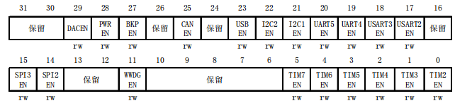

2.频繁产生中断有损性能，因此需要禁用，定时结束可以通过SR寄存器判断，以此实现延时。该寄存器仅使用第0位。

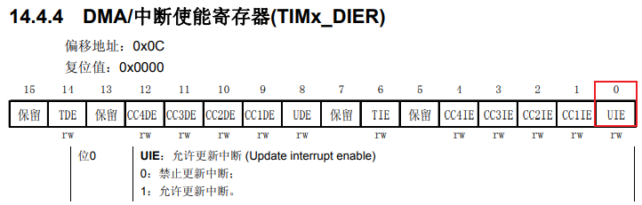

3.对时钟进行分频，然后提供给计数器，作为计数器的时钟。根据上述时钟树，可以看到APB1经过了2分频，因此最后tim2-7的时钟频率为 APB1 x 2，即 **fck_psc = 72MHz**。

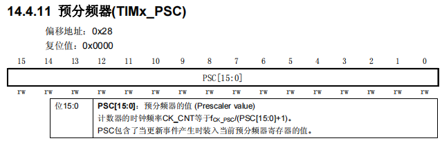

此时，当设置该寄存器为7199时（上限65535，没法7w2），可以得到时钟频率为**10KHz**，也就是计数累加一次需要**0.1ms**

**延时部分**

4.设置重装载值。上述计数一次0.1ms，因此每十次为1ms。输入参数为延时ms，乘以10后存入ARR寄存器中。

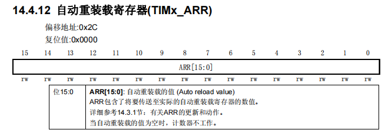

5.开始计数前设置计数器CNT初值为0（向上计数）。

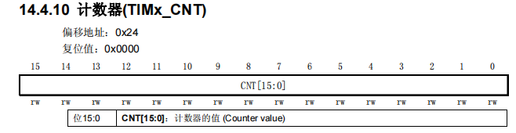

6.使能tim定时器。计数方向默认0为向上不需要设置。

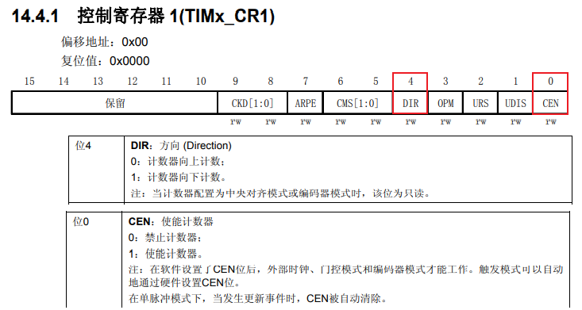

7.通过while判断SR寄存器的第0位是否置位实现延时。

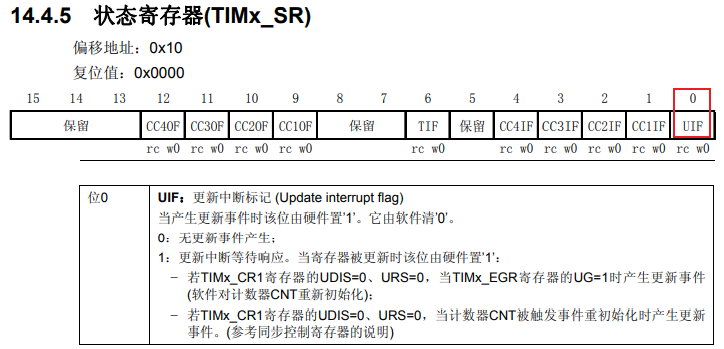

注意这里需要软件清0，因此在结束循环后将该位复位。

#### Note

在RTOS中的不同任务，使用的是相同的定时器资源，因此调用延时函数时应注意**同时进行的任务中不能使用相同的tim定时器**。否则在出现任务切换时会修改同一tim寄存器的值，导致时序混乱。


## USART

### 初始化

```c
void uart_init(u32 bound) {
	MY_NVIC_Init(3,3,USART1_IRQn,2);
	RCC->APB2ENR |= 1 << 2;  	
	RCC->APB2ENR |= 1 << 14;  
	RCC->APB2RSTR |= 1 << 14;   
	RCC->APB2RSTR &= ~(1 << 14);
	GPIOA->CRH &= 0xFFFFF00F;
	GPIOA->CRH |= 0x000008B0;
    GPIOA->ODR |= 1 << 10;
	float uart_div; 
	uart_div = (float)SystemCoreClock / (bound * 16);
	u16 div_m = (u16)uart_div;
	u16 div_f = (uart_div - div_m) * 16 + 0.5f; 
 	USART1->BRR = div_m << 4 | div_f;
	USART1->CR1 |= 0x202C;  	
}
```


#### 使能

串口作为 STM32 的一个外设，其时钟由外设时钟使能寄存器控制，usart1是在APB2ENR寄存器的**第14位**，其余都在 APB1ENR 寄存器。同时usart1默认是复用GPIOA的9、10端口，因此还需要使能**第2位**。

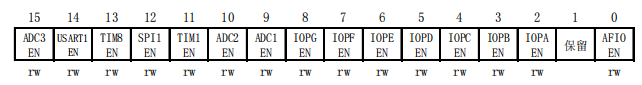

#### 复位清0

由软件手动复位后再置0

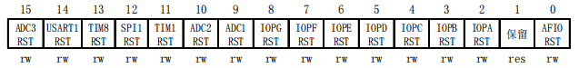

#### IO模式

PA9为TX，因此为**复用推挽输出**，50MHz，即 `1011` 。

PA10为RX，因此为上拉输入，即 `1000`，同时把ODR相应位置1。（为什么是上拉，因为usart协议规定在RX输入信号中, 以低电平脉冲 （**下降沿**）作为数据接收的开始. 所以上拉可以保持 RX 无数据接收的状态）

#### 波特率

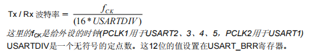

根据公式，输入波特率后反推出填入寄存器的值。

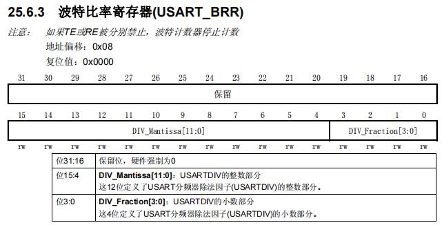

#### 使能

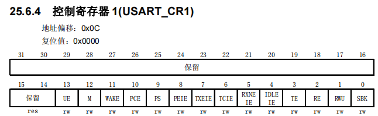

第2、3、13位，分别为接收使能、发送使能、usart使能。

第5位如下：

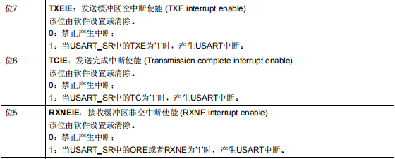

第10位，校验位不使能。

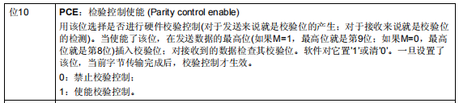

最后即 `0x202C`。

#### 中断优先级

既然开启了中断使能，就需要设置中断的优先级。


### 数据帧

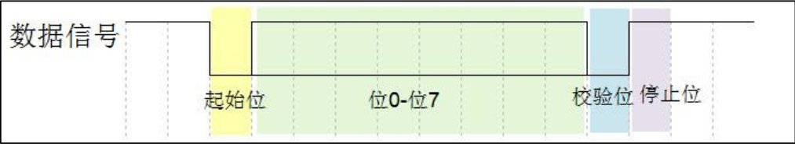

#### 标准

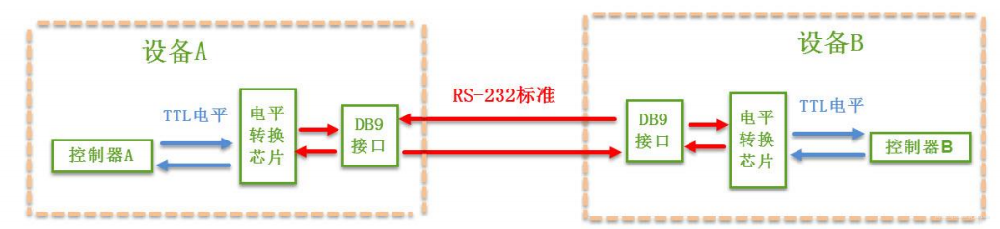

在上面的通讯方式中，两个通讯设备的DB9 接口（常说的**COM口**）之间通过串口信号线建立起连接，串口信号线中使用RS-232 标准传输数据信号。由于 RS-232 电平标准的信号不能直接被控制器直接识别，所以这些信号会经过一个电平转换芯片转换成控制器能识别的TTL 标准的电平信号，才能实现通讯。

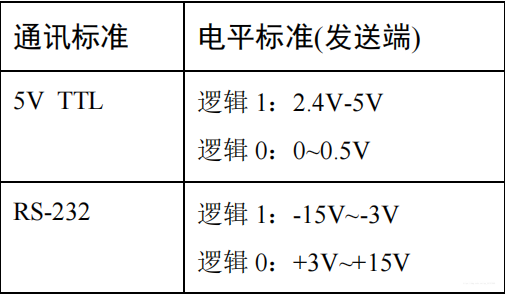

#### 波特率

串口异步通讯中由于没有时钟信号（DB9接口没有时钟信号），所以两个通讯设备之间需要约定好波特率，即每个码元的长度，以便对信号进行解码，图中用虚线分开的每一格就是代表一个码元。常见的波特率为4800、9600、115200 等。

#### 起始和停止信号

串口通讯的一个数据包从起始信号开始，直到停止信号结束。数据包的起始信号由一个逻辑 0 的数据位表示，而数据包的停止信号可由 0.5、1、1.5 或 2 个逻辑 1 的数据位表示，只要双方约定一致即可。

#### 有效数据

起始位之后接着的就是要传输的数据，也称为有效数据，有效数据的长度常被约定为 5、6、7 或 8 位长。

#### 数据校验

在有效数据之后，有一个**可选**的数据校验位。由于数据通信相对更容易受到外部干扰导致传输数据出现偏差，可以在传输过程加上校验位来解决这个问题。

校验方法有奇校验(odd)、偶校验(even)、0 校验(space)、1 校验(mark)以及无校验(noparity)。

- 奇校验要求有效数据和校验位中“1”的个数为奇数，比如一个 8 位长的有效数据为：01101001，此时总共有 4 个“1”，为达到奇校验效果，校验位为“1”，最后传输的数据将是 8 位的有效数据加上 1 位的校验位总共 9 位。
- 偶校验与奇校验要求刚好相反，要求帧数据和校验位中“1”的个数为偶数，比如数据帧：11001010，此时数据帧“1”的个数为 4 个，所以偶校验位为“0”。
- 0 校验是不管有效数据中的内容是什么，校验位总为“0”，
- 1 校验是校验位总为“1”。


### 协议帧

自定义RX状态寄存器变量：`USART1_RX`

|                         校验位 [15]                          |                       状态位 [14:13]                       |                       指令编号 [12:8]                        |                       数据长度 [7:0]                        |
| :----------------------------------------------------------: | :--------------------------------------------------------: | :----------------------------------------------------------: | :---------------------------------------------------------: |
| 当协议第一帧为 `0xFE` 时，数据接收状态置1，允许接收数据。<br />数据接收完毕后，由软件清0。 | 00：接收指令01：接收数据长度<br />10：接收数据11：数据溢出 | 协议第二帧固定为自定义指令编号，用于调用API。编号范围 [1, 31]，`0x00`默认为不使用指令。 | 存储协议第三帧，表示接下来还需要传输的数据字节数（最大256） |

#### 起始校验信号

第一帧固定为`0xFE`，收到后将`USART1_RX`第15位置1，开启后续帧接收。

#### 指令信号

第二帧固定为指令编号，范围 [0x01, 0x1F]。`0x00` 默认为不使用指令，忽略该帧。结束该帧时将状态位置01，表示等待接收数据长度帧。

#### 数据长度信号

第三帧固定为数据长度，表明接下来要传输的数据字节数。结束该帧时将状态位置10，表示开始接收数据帧。

若剩余接收字节数大于缓冲区（最大256）剩余空间，将第13位置1。当不再大于时，置0。用于在缓冲区满或数据接收完成时判断是否存在溢出丢失现象。

#### 接收实现

```c
#define PARITY_STAT(RXx)	(RXx & 0x8000) == 0
#define ORDER_STAT(RXx)		(RXx & 0x6000) == 0
#define LEN_STAT(RXx)		(RXx & 0x6000) == 0x4000
#define DATA_STAT(RXx)		(RXx & 0x6000) == 0x5000
#define END_STAT(RXx)		(RXx & 0x00FF) == 0
void USART1_IRQHandler(void) {
	u8 res;	
	if(USART1->SR & (1 << 5)) {	 
		res = USART1->DR; 
		if(PARITY_STAT(usart1_rx)) {
			if(res == 0xFE)	{
				usart1_rx |= 1 << 15;
				return;
			}
		}
		if(ORDER_STAT(usart1_rx)) {
			usart1_rx |= 1 << 13;
			if(res) {
				// order case
			}
			return;
		}
		if(LEN_STAT(usart1_rx)) {
			usart1_rx |= res;
			usart1_rx ^= (1 << 13 | 1 << 14);
			return;
		}
		if(DATA_STAT(usart1_rx)) {
			lwrb_write(&fifo_buff, &res, 1);
			usart1_rx--;
			if(END_STAT(usart1_rx)) {
				usart1_rx = 0;
			}
		}		 									     
	}
} 
```


# 系统结构

## 任务控制块TCB

包含三个部分，任务栈顶指针、延时时长以及任务状态

```c
typedef unsigned int  STACK_TypeDef;
typedef unsigned int  PRIO_TypeDef;
typedef unsigned int  TICKS_TypeDef;
typedef void (*TASK_TypeDef)(void);

// 任务状态
typedef enum TASK_STATUS
{
	TASK_READY = 0,				//就绪
	TASK_DELAY = 1,				//延时等待
	TASK_SUSPEND = 2,			//挂起
} TASK_STATUS;

// TCB控制块
typedef struct 
{
	STACK_TypeDef *StackTop;     //任务栈顶指针
	TICKS_TypeDef Delay;         //任务延时时钟
	TASK_STATUS   State;         //任务状态
} TASK_TCB, *TCB_Ptr;
            
#define TASKS_NUM	   5        // 设定运行任务的数量,不包含空闲任务 

extern  TASK_TCB      TCB[TASKS_NUM + 1];   // 定义任务控制块TCB数组
extern  PRIO_TypeDef  PrioCur;		        // 当前任务的优先级
extern  PRIO_TypeDef  PrioNext;             // 下一个运行任务的优先级	
extern  TCB_Ptr       TCB_CurP;             // 当前任务的TCB指针
extern  TCB_Ptr       TCB_NextP;            // 下一个运行任务的TCB指针
```


## 就绪任务列表

```c
extern  u32           TaskReadyTable;       // 就绪任务列表
```

维护一个任务就绪列表，通过对位进行操作来保存就绪的任务。

每个任务都有相对应的、不同的优先级，以此区分任务。

```c
// prio: 任务优先级
#define SetTaskReady(prio)	(	TaskReadyTable |= 0x01<<prio	)	
#define DelTaskReady(Prio)	(	TaskReadyTable &= ~(0x01<<Prio)	)
```

通过一个简单的for循环获取当前最高优先级的任务（实际就是获取优先级数）

```c
u32 i;
for(i = 0; (i < TASKS_NUM) && (!(TaskReadyTable & (0x01<<i))); i++);
```

相应优先级的任务，存于 **TCB[i]** 中。


## 任务的创建

```c
/*
 --- 创建任务                                                                    
 - *p_Task:  任务函数地址
 - *p_Stack：任务栈顶指针
 - prio:     任务优先级
*/
void STM32_TaskCreate(TASK_TypeDef task, STACK_TypeDef *stack, PRIO_TypeDef prio)
{
    STACK_TypeDef  *p_stk;
    p_stk      = stack;                           //加载栈顶指针
    p_stk      = (STACK_TypeDef *)((STACK_TypeDef)(p_stk) & 0xFFFFFFF8u);
    
    *(--p_stk) = (STACK_TypeDef)0x01000000uL;     // xPSR的T位置1，设置为Thumb模式？TODO
    *(--p_stk) = (STACK_TypeDef)task;             // PC指针
    // 无意义，只为了--p_stk
    *(--p_stk) = (STACK_TypeDef)0x14141414uL;     // R14 (LR)
    *(--p_stk) = (STACK_TypeDef)0x12121212uL;     // R12
    *(--p_stk) = (STACK_TypeDef)0x03030303uL;     // R3
    *(--p_stk) = (STACK_TypeDef)0x02020202uL;     // R2
    *(--p_stk) = (STACK_TypeDef)0x01010101uL;     // R1
    *(--p_stk) = (STACK_TypeDef)0x00000000u;      // R0
    *(--p_stk) = (STACK_TypeDef)0x11111111uL;     // R11
    *(--p_stk) = (STACK_TypeDef)0x10101010uL;     // R10
    *(--p_stk) = (STACK_TypeDef)0x09090909uL;     // R9
    *(--p_stk) = (STACK_TypeDef)0x08080808uL;     // R8
    *(--p_stk) = (STACK_TypeDef)0x07070707uL;     // R7
    *(--p_stk) = (STACK_TypeDef)0x06060606uL;     // R6
    *(--p_stk) = (STACK_TypeDef)0x05050505uL;     // R5
    *(--p_stk) = (STACK_TypeDef)0x04040404uL;     // R4
    
    TCB[prio].StackTop = p_stk;
    TCB[prio].Delay = 0;
    TCB[prio].State = TASK_READY;
}
```

### ARM or Thumb

#### 指令集

- ARM 模式：在 ARM 模式下，处理器执行的是 ARM 指令集，这是一种**32位**的指令集，指令长度固定为32位。ARM 指令集通常用于执行复杂的指令，适用于高性能和较大的内存空间。
- Thumb 模式：在 Thumb 模式下，处理器执行的是 Thumb 指令集，这是一种**16位**的指令集，指令长度较短。Thumb 指令集通常用于节省存储空间和提高代码密度，*适用于资源受限的嵌入式系统*。

#### 指令宽度

- ARM 模式：ARM 模式下的指令宽度固定为32位，每条指令都是32位长。
- Thumb 模式：Thumb 模式下的指令宽度为16位，每条指令都是16位长。

#### 代码密度

- ARM 模式：由于指令宽度较大，ARM 模式下的指令通常需要更多的存储空间，因此代码密度相对较低。
- Thumb 模式：Thumb 模式下的指令长度更短，可以实现更高的代码密度，适用于存储空间有限的系统。

#### 性能

- ARM 模式：由于指令更长，每条指令通常执行的操作更多，因此在 ARM 模式下可以实现更高的性能。
- Thumb 模式：虽然指令更短，但执行速度可能较慢，因为一些操作需要多条 Thumb 指令来实现。

#### 中断处理

- ARM 模式：在 ARM 模式下，通常可以更快速地响应中断，因为每条指令执行的操作较多。
- Thumb 模式：Thumb 模式下，由于指令较短，中断处理可能需要更多的指令来完成，因此响应中断的速度可能较慢。


## 部分函数接口

### 任务的调度

```c
/*
 --- 任务调度          
*/
void SysTaskSchedule(void)
{
	u32 i;

	if(SCHEDULE == 1)
	{
		for(i = 0; i < TASKS_NUM; i++)					// 刷新各任务剩余延时时间 
		{
			if(TCB[i].State == TASK_DELAY )
			{
				TCB[i].Delay--;
				if(TCB[i].Delay == 0)					// 必须是由定时器减时的才行
				{
					TCB[PrioCur].State = TASK_READY;	
					SetTaskReady(i);		    		//修改任务就绪表 使任务可以重新运行	
				}
			}
		}

		for(i = 0; (i < TASKS_NUM) && (!(TaskReadyTable & (0x01<<i))); i++);
		
		PrioNext = i;	
		PrioCur  = i;
		TCB_NextP = &TCB[i];
		CPU_TASK_SCHEDULE();
	}
}
```


### 任务的创建

```c
/*
 --- 创建任务                                                                    
 - *p_Task:  任务函数地址
 - *p_Stack：任务栈顶指针
 - prio:     任务优先级
*/
void TaskCreate(void (*p_Task)(void), STACK_TypeDef *p_Stack, PRIO_TypeDef prio)
{
    if(prio <= TASKS_NUM)
    {
		STM32_TaskCreate(p_Task, p_Stack, prio);  	
		SetTaskReady(prio);      			 
    }
}
```


### 任务的挂起

```c
void TaskSuspend(PRIO_TypeDef prio)
{
	u32 i;
	
	ENTER_CRITICAL();
	TCB[prio].Delay = 0;
	TCB[prio].State = TASK_SUSPEND;
	DelTaskReady(prio);				// 从任务就绪表上去除标志位
	EXIT_CRITICAL();
		
	if(PrioCur == prio)				// 当要挂起的任务为当前任务	重新调度		
	{
		for(i = 0; (i < TASKS_NUM) && (!(TaskReadyTable & (0x01<<i))); i++);
		
		PrioNext = i;	
		PrioCur  = i;
		TCB_NextP = &TCB[i];
		CPU_TASK_SCHEDULE();
	}	
}
```


### 任务的恢复

```c
void TaskResume(PRIO_TypeDef prio)
{
	u32 i;

	ENTER_CRITICAL();
	SetTaskReady(prio);				// 从任务就绪表上重置标志位	
    TCB[prio].Delay = 0;			// 将时间计时设为0,延时到	
    TCB[prio].State = TASK_READY;	// s	
	EXIT_CRITICAL();
	
	if(PrioCur == prio)				// 不执行？	
	{
		for(i = 0; (i < TASKS_NUM) && (!(TaskReadyTable & (0x01<<i))); i++);
		
		PrioNext = i;	
		PrioCur  = i;
		TCB_NextP = &TCB[i];
		CPU_TASK_SCHEDULE();
	}	
}
```


### 任务的延时

```c
/*
 --- 任务延时
 - ticks: 延时的节拍数
*/
void SysTimeDelay(TICKS_TypeDef ticks)
{
	u32 i = 0;
	if (ticks)								        
	{
		ENTER_CRITICAL();
		DelTaskReady(PrioCur);				 
		TCB[PrioCur].Delay = ticks;			// 设置任务延时节拍数   
		TCB[PrioCur].State = TASK_DELAY;	
		EXIT_CRITICAL();

		for(i = 0; (i < TASKS_NUM) && (!(TaskReadyTable & (0x01<<i))); i++);
		
		PrioNext = i;	
		PrioCur  = i;
		TCB_NextP = &TCB[i];
		CPU_TASK_SCHEDULE();
	}
}
```


# 实例应用


## 测试例程

### 单任务计数

```c
#define TASK_2_STK_SIZE 128
static STACK_TypeDef TASK_2_STK[TASK_2_STK_SIZE];

u32 task2count = 0;
void task_2()
{
  	while(1)
	{
		task2count++;
		display(task2count);	// 数码管显示函数
		if (task2count >= 9999) {
			task2count = 0;
		}
		SysTimeDelay(1);
	}
}

int main()
{
	delay_init(72);
	LED_Configuration();
	DigitalTube_Configuration();
	LCD_Configuration();

	Sys_Init();
	//TaskCreate(task_1, &TASK_1_STK[TASK_1_STK_SIZE-1], TASK1_PRIO);
	TaskCreate(task_2, &TASK_2_STK[TASK_2_STK_SIZE-1], TASK2_PRIO);
  	Sys_Start();
  
 	return 0;
}
```


