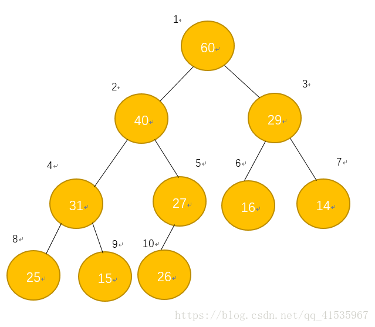
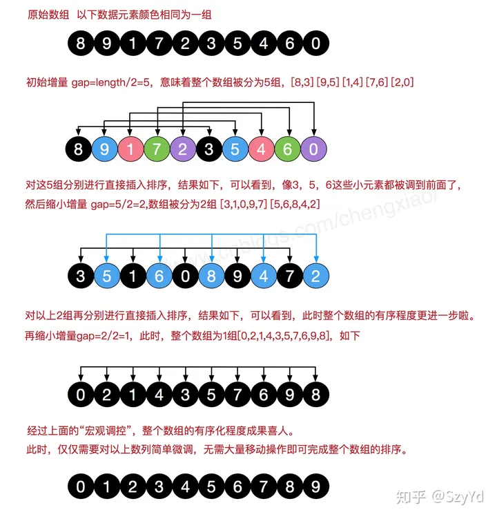

# 数据结构

## 二叉树

### 二叉树的种类

#### 满二叉树

如果一棵二叉树只有度为0的结点和度为2的结点，并且度为0的结点在同一层上，则这棵二叉树为满二叉树。具有如下性质：

1. 满二叉树中第 **i** 层的节点数为 **2 ^ (i - 1)** 个。
2. 深度为 **k** 的满二叉树必有 **2 ^ k - 1** 个节点 ，叶子数为 **2 ^ (k - 1)**。
3. 满二叉树中不存在度为 1 的节点，每一个分支点中都有两棵深度相同的子树，且叶子节点都在最底层。
4. 具有 **n** 个节点的满二叉树的深度为 **log2(n+1)**。

#### 完全二叉树

如果二叉树中除去最后一层节点为满二叉树，且最后一层的结点依次从左到右分布，则此二叉树被称为**完全二叉树**。

**优先级队列其实是一个堆，堆就是一棵完全二叉树，同时保证父子节点的顺序关系。**

#### 二叉搜索树

上述结构的树均没有数值，而二叉搜索树是有数值的。**二叉搜索树是一个有序树**，也叫二叉排序树、二叉查找树。

- 若它的左子树不空，则左子树上所有结点的值均**小于**它的根结点的值；
- 若它的右子树不空，则右子树上所有结点的值均**大于**它的根结点的值；
- 它的左、右子树也分别为二叉搜索树


#### 平衡二叉搜索树

**AVL**（Adelson-Velsky and Landis）树，且具有以下性质：它是**一棵空树**或**它的左右两个子树的高度差的绝对值不超过1，并且左右两个子树都是一棵平衡二叉树。**


最后一棵 不是平衡二叉树，因为它的左右两个子树的高度差的绝对值超过了1。

**C++中map、set、multimap，multiset的底层实现都是平衡二叉搜索树**，所以map、set的增删操作时间时间复杂度是 **logn**。


### 二叉树的属性

#### 对称性

采用**类前序遍历**，比较的是左右子树是否对称，左子树按照中左右的顺序，那么右子树就是中右左的顺序。

递归处理顺序为：

1. 比较当前左右节点
2. 比较左节点的左子节点和右子树右子节点
3. 比较左节点的右子节点和右子树左子节点

```cpp
    bool recursion(TreeNode* left, TreeNode* right) {
        if(!left && !right) return true;
        if(!left || !right || (left->val != right->val))  return false;
        return recursion(left->left, right->right) && recursion(left->right, right->left);
    }
    bool isSymmetric(TreeNode* root) {
        return recursion(root->left, root->right);
    }
```

#### 节点数

采用**后序遍历**，递归好写：

```cpp
int countNodes(TreeNode* root) {
    if (root == NULL) return 0;
    return 1 + countNodes(root->left) + countNodes(root->right);
}
```

- 时间复杂度：O(n)
- 空间复杂度：O(log n)，算上了递归系统栈占用的空间


#### 深度 & 高度

- 二叉树节点的**深度**：指从**根节点**到**该节点**的最长简单路径边的长度。（多用**层序**）
- 二叉树节点的**高度**：指从**该节点**到**叶子节点**的最长简单路径边的长度。（多用**后序**）


#### 最近公共祖先LCA

LCA（Lowest Common Ancestor）又分为普通二叉树和搜索二叉树两种遍历方式。

**普通二叉树**

1. 从根节点开始遍历整个二叉树。
2. 如果当前节点为空节点或者等于其中一个目标节点，那么当前节点就是**其中一个目标节点**或者**其中一个目标节点的祖先**。返回当前节点。
3. 递归在当前节点的左子树中寻找两个目标节点的LCA，返回结果为left。
4. 递归在当前节点的右子树中寻找两个目标节点的LCA，返回结果为right。
5. 如果left和right都不为空，说明两个目标节点分别位于当前节点的左右子树中，那么**当前节点**就是它们的LCA。返回当前节点。
6. 如果left为空，说明两个目标节点都不在当前节点的左子树中，LCA一定在右子树中。返回right。
7. 如果right为空，说明两个目标节点都不在当前节点的右子树中，LCA一定在左子树中。返回left。

这个递归的过程会自底向上地找到LCA。在遍历过程中，每个节点都会被访问一次，因此时间复杂度为**O(N)**，其中N是二叉树中的节点数。递归过程中使用的**额外空间**取决于**二叉树的高度**，最坏情况下为**O(N)**。

```cpp
TreeNode* lowestCommonAncestor(TreeNode* root, TreeNode* p, TreeNode* q) {
    if(root == p || root == q || root == NULL)    return root;
    TreeNode* left = lowestCommonAncestor(root->left, p, q);
    TreeNode* right = lowestCommonAncestor(root->right, p, q);
    if(left && right)   return root;
    if(left == NULL)    return right;
    return left;
}
```

**二叉搜索树BST**

1. 从根节点开始，将目标节点的值与当前节点的值进行比较。
2. 如果当前节点的值大于两个目标节点的值，说明两个目标节点都位于当前节点的左子树中，那么继续在左子树中寻找LCA。
3. 如果当前节点的值小于两个目标节点的值，说明两个目标节点都位于当前节点的右子树中，那么继续在右子树中寻找LCA。
4. 如果以上两种情况都不满足，那么当前节点就是我们要找的LCA。

这是因为根据BST的性质，对于任意节点x，其左子树中的所有节点值都小于x的值，右子树中的所有节点值都大于x的值。因此，**如果两个目标节点分别位于x的左右子树中，那么x就是它们的LCA。**

这个方法的时间复杂度取决于树的高度，**最坏**情况下为**O(H)**，其中H是树的高度。递归过程中使用的**额外空间**取决于递归栈的深度，**最坏**情况下为**O(H)**。

```cpp
TreeNode* lowestCommonAncestor(TreeNode* root, TreeNode* p, TreeNode* q) {
    if(root->val > p->val && root->val > q->val)	return lowestCommonAncestor(root->left, p, q);
    else if(root->val < p->val && root->val < q->val)	return lowestCommonAncestor(root->right, p, q);
    else	return root;
}
```


### 二叉树的存储方式

#### 链式存储


#### 顺序存储


用数组来存储二叉树的遍历：**如果父节点的数组下标是 i，那么它的左孩子就是 i \* 2 + 1，右孩子就是 i \* 2 + 2。**


### 二叉树的遍历方式

#### 深度优先方式（栈）

- 前序遍历（递归法，迭代法）
- 中序遍历（递归法，迭代法）
- 后序遍历（递归法，迭代法）

**前中后，指的是中间节点的遍历顺序。**

- 前序遍历：中左右
- 中序遍历：左中右
- 后序遍历：左右中


#### 广度优先方式（队列）

- 层次遍历（迭代法）


### 二叉树的构造

#### 后序 + 中序


- 第一步：如果数组大小为零的话，说明是空节点
- 第二步：如果不为空，那么取后序数组最后一个元素作为节点元素
- 第三步：找到后序数组最后一个元素在中序数组的位置，作为切割点
- 第四步：切割中序数组，切成中序左数组和中序右数组 
- 第五步：切割后序数组，切成后序左数组和后序右数组（切割后的两个数组长度依旧和中序的相等）
- 第六步：递归处理左区间和右区间

#### 前序 + 中序

前序和后序的构造步骤差不多，区别在于第二步，前序是从序列头部取第一个值。

#### 前序 + 后序 X

**前序和后序不能唯一确定一棵二叉树！**，因为没有中序遍历无法确定左右部分，也就是无法分割。例如：


tree1 和 tree2 的前序遍历都是[1 2 3]， 后序遍历都是[3 2 1]。


### 二叉树的实现

#### 链表：节点实现

```cpp
struct TreeNode {
    int val;
    TreeNode *left;
    TreeNode *right;
    TreeNode() : val(0), left(nullptr), right(nullptr) {}
    TreeNode(int x) : val(x), left(nullptr), right(nullptr) {}
    TreeNode(int x, TreeNode *left, TreeNode *right) : val(x), left(left), right(right) {}
};
```

#### 前中后序遍历（递归）

```cpp
void traversal(TreeNode* cur, vector<int>& vec) {
    if (cur == NULL) return;
    vec.push_back(cur->val);    // 中
    traversal(cur->left, vec);  // 左
    traversal(cur->right, vec); // 右
}
```

- 前序：中左右
- 中序：左中右
- 后序：左右中

#### 前序遍历（迭代）

```cpp
void traversal(TreeNode* root, vector<int>& vec) {
    stack<TreeNode*> st;
    if(root == nullptr)	return;
    st.push(root);
    while(!st.empty()){
        TreeNode* node = st.top();
        st.pop();
        vec.push_back(node->val);
        if(node->right)	st.push(node->right);
        if(node->left)	st.push(node->left);	// 因为读完根节点后是左节点，因此需要先将右节点压栈，才能先读左节点
    }
}
```

#### 后序遍历（迭代）

前序是中左右，反一下遍历子节点的顺序，先右再左，就是中右左；而后序是左右中，两者相反，只需在中序的基础上反转数组即可。

```cpp
void traversal(TreeNode* root, vector<int>& vec) {
    stack<TreeNode*> st;
    if(root == nullptr)	return;
    st.push(root);
    while(!st.empty()){
        TreeNode* node = st.top();
        st.pop();
        vec.push_back(node->val);
        if(node->left)	st.push(node->left);	
        if(node->right)	st.push(node->right);
    }
    reverse(vec.begin(), vec.end());
}
```

#### 中序遍历（迭代）

比较特殊，存在**访问节点（遍历节点）和处理节点（将元素放进结果集）不一致**的情况。

因为中序是左中右的顺序，所以需要先遍历到最左侧的左节点（**没下一个左节点时**），加入结果中。此时该节点为局部根节点（相当于中），然后就访问右节点。（右节点可能存在左节点和右节点，所以跟根节点的遍历一样处理）。

```cpp
class Solution {
public:
    vector<int> inorderTraversal(TreeNode* root) {
        vector<int> res;
        stack<TreeNode*> st;
        TreeNode* cur = root;
        if(root == nullptr) return res;
        while(!st.empty() || cur){
            if(cur){
                st.push(cur);
                cur = cur->left;
            }
            else {
                cur = st.top();
                st.pop();
                res.push_back(cur->val);
                cur = cur->right;
            }            
        }
        return res;
    }
};
```

#### 层序遍历

```cpp
void levelOrder(TreeNode* root, vector<vector<int>>& res) {
    if(root == nullptr)  return;
    queue<TreeNode*> q;
    q.push(root);
    while(!q.empty()){
        vector<int> layer;
        int n = q.size();
        for(int i = 0; i < n; ++i){
            TreeNode* node = q.front();
            q.pop();
            layer.push_back(node->val);
            if(node->left)  q.push(node->left);
            if(node->right)  q.push(node->right);
        }
        res.push_back(layer);
    }
    return;
}
```

#### 前中序构造

```cpp
TreeNode* buildChild(vector<int>& preorder, vector<int>& inorder, int preHead, int inHead, int len) { 
    if(len == 0)    return nullptr;
    TreeNode* node = new TreeNode(preorder[preHead]);
    if(len == 1)    return node;
    int seg;
    for(seg = inHead; seg < inHead + len; ++seg) 
        if(inorder[seg] == node->val)
            break;
    int rightLen = inHead + len - seg - 1;
    node->left = buildChild(preorder, inorder, preHead + 1, inHead, seg - inHead);
    node->right = buildChild(preorder, inorder, preHead + 1 + seg - inHead, seg + 1, rightLen);
    return node;
}
buildChild(preorder, inorder, 0, 0, preorder.size());
```

#### 中后序构造

```cpp
TreeNode* buildChild(vector<int>& inorder, vector<int>& postorder, int inHead, int postTail, int len) {
    if(len == 0)    return nullptr;
    TreeNode* node = new TreeNode(postorder[postTail]);
    if(len == 1)    return node;
    int seg;
    for(seg = inHead; seg < inHead + len; ++seg) 
        if(inorder[seg] == node->val)
            break;
    int rightLen = inHead + len - seg - 1;
    node->left = buildChild(inorder, postorder, inHead, postTail - rightLen - 1, seg - inHead);
    node->right = buildChild(inorder, postorder, seg + 1, postTail - 1, rightLen);
    return node;
}
buildChild(inorder, postorder, 0, postorder.size() - 1, postorder.size());
```

#### 删除

```cpp
TreeNode* deleteNode(TreeNode* root, int key) {
    if (root == nullptr) return root;
    if (root->val == key) {
        if (root->right == nullptr) { // 这里第二次操作目标值：最终删除的作用
            return root->left;
        }
        TreeNode *cur = root->right;
        while (cur->left) {
            cur = cur->left;
        }
        swap(root->val, cur->val); // 这里第一次操作目标值：交换目标值其右子树最左面节点。
    }
    root->left = deleteNode(root->left, key);
    root->right = deleteNode(root->right, key);
    return root;
}
```


#### BST插入

**递归**

```cpp
TreeNode* insertIntoBST(TreeNode* root, int val) {
    if(root ==nullptr)  
        return new TreeNode(val);
    if(root->val > val) 
        root->left = insertIntoBST(root->left, val);
    else  				
        root->right = insertIntoBST(root->right, val);
    return 	root;
}
```

**迭代**

```cpp
TreeNode* insertIntoBST(TreeNode* root, int val) {
    if(root == nullptr) return new TreeNode(val);
    TreeNode* cur = root;
    TreeNode* parent = root;
    while(cur) {
        parent = cur;
        if(cur->val > val)  
            cur = cur->left;
        else    
            cur = cur->right;
    }
    if(parent->val > val)  
        parent->left = new TreeNode(val);
    else    
        parent->right = new TreeNode(val);
    return root;
}
```

#### BST删除（迭代）

```cpp
TreeNode* deleteNode(TreeNode* root, int key) {
    if(root == nullptr) return root;
    if(root->val > key)
        root->left = deleteNode(root->left, key);
    else if(root->val < key)
        root->right = deleteNode(root->right, key);
    else {
        if(!root->left && !root->right) {	// 全空，叶子节点不用调整结构
            delete root;
            return nullptr;
        }
        if(!root->left) {					// 只有右子树，把右子树挪上来
            TreeNode* tmp = root->right;
            delete root;
            return tmp;
        }
        if(!root->right) {					// 只有左子树，把左子树挪上来
            TreeNode* tmp = root->left;
            delete root;
            return tmp;
        }
        else {								// 左右子树均有，左子树归入右子树的最左侧叶子节点下，右子树上挪
            TreeNode* cur = root->right;
            while(cur->left)
                cur = cur->left;
            cur->left = root->left;
            TreeNode* tmp = root->right;
            delete root;
            return tmp;
        }
    }
    return root;
}
```

#### 有序数组构造高度平衡BST（递归）

迭代会较为麻烦，因为需要开辟多个队列存储数组下标和节点信息。

```cpp
TreeNode* sortedArrayToSubBST(vector<int>& nums, int l, int r) {
    if(l > r)   return nullptr;
    int mid = l + (r - l) / 2;
    TreeNode* nd = new TreeNode(nums[mid]);
    nd->left = sortedArrayToSubBST(nums, l, mid - 1);
    nd->right = sortedArrayToSubBST(nums, mid + 1, r);
    return nd;
}
TreeNode* sortedArrayToBST(vector<int>& nums) {
    return sortedArrayToSubBST(nums, 0, nums.size() - 1);
}
```

#### BST2平衡BST

在上一步的基础上，先用中序遍历将BST转化为有序数组，再将数组构造为平衡BST

```cpp
TreeNode* balanceBST(TreeNode* root) {
    vector<int> nums;
    auto tree2SortedArray = [&nums,
        circle = [&](auto&& self, TreeNode* cur) -> void {
            if(cur == nullptr)  return;
            self(self, cur->left);
            nums.emplace_back(cur->val);
            self(self, cur->right);
            return;
        }
    ](TreeNode* root) { circle(circle, root); };
    auto SortedArray2BBST = [&nums,
        circle = [&](auto&& self, int l, int r) -> TreeNode* {
            if(l > r)   return nullptr;
            int mid = (l + r) / 2;
            TreeNode* node = new TreeNode(nums[mid]);
            node->left = self(self, l, mid - 1);
            node->right = self(self, mid + 1, r);
            return node;
        }
    ]() { return circle(circle, 0, nums.size() - 1); };
    tree2SortedArray(root);
    return SortedArray2BBST();
}
```


### 注

- 涉及到二叉树的构造，无论普通二叉树还是二叉搜索树一定前序，都是先构造中节点。
- 求普通二叉树的属性，一般是后序，一般要通过递归函数的返回值做计算。
- 求二叉搜索树的属性，一定是中序了，要不白瞎了有序性了。


## 堆

### 堆的定义

#### 二叉堆

堆是一个树形结构，底层是一棵**完全二叉树**。而完全二叉树是一层一层按照进入的顺序排成的。按照这个特性，我们可以用**数组**来按照完全二叉树实现堆。



上图就是一个完全二叉树，也是一个最大堆。而最大堆有一个性质：**每一个节点的值都小于它父节点的值**。

需要注意的是，**每一个节点的值的大小与它所处的深度没有必然的联系**。如第三层的六号和七号节点都小于处于最后一层的八号和十号节点。


### 堆的实现

#### 堆的存储

如果将这个最大堆存入数组中，黑色的数字就是存储的顺序。可以根据任意一个节点的索引(除去根节点)找到它的父节点的索引，如果当前节点的索引为index，那么：

- 当前节点的父节点 = index / 2(这里我们将结果取整)。
- 当前节点的左子节点 = index * 2
- 当前节点的右子节点 = index * 2 + 1。


#### 堆的插入删除

**1.建立堆**

数组具有对应的树表示形式。一般情况下，树并不满足堆的条件，通过重新排列元素，可以建立一颗“堆化”的树。以下以大根堆为例。

**2.插入元素**

新元素被插入到列表层（即完全二叉树最后的位置），将其和父节点比较。如果新元素比父节点大，那么交换两者。交换之后，继续和新的父节点比较，直至新元素不比父节点大，随后树被更新以恢复堆次序。（其时间复杂度为**O(logN)**），以上操作称为**上溯**（**percolate up**）操作。

**3.删除元素**

删除总是发生在**根节点**处。树中最后一个元素被用来填补空缺位置，称为暂时根节点，然后将暂时根节点不断和子节点（**左右两子节点中大的那一个节点**）进行比较，如果他比子节点小，则交换节点位置，直到暂时根节点不小于任何一个子节点，结果树被更新以恢复堆条件。以上操作被称为**下溯**（**percolate down**）。


#### 具体实现

**简单版本：**

一个固定空间大小，支持选择基础数据类型的大根堆。

```cpp
template<typename T>
class MaxHeapStable{
private:
    T* data;
    int idx;
    int len;

    void percolate_up(int i){
        while(i > 1 && data[i] > data[i/2]){
            swap(data[i], data[i/2]);
            i /= 2;
        }
    }
    void percolate_down(int i){
        while(i * 2 <= idx){
            int child = i * 2;
            if(child + 1 <= idx && data[child] < data[child + 1])	child += 1;
            if(data[i] >= data[child])	break;
            swap(data[i], data[child]);
            i = child;
        }
    } 
public:
    MaxHeapStable(int len){
        data = new T[len + 1];
        idx = 0;
        this->len = len;
    }
    ~MaxHeapStable(){
        delete [] data;
    }
    int size(){
        return idx;
    }
    bool isEmpty(){
        return idx == 0;
    }
    void push(T val){
        assert(idx < len);
        data[++idx] = val;
        percolate_up(idx);
    }
    T pop(){
        assert(idx > 0);
        T res = data[1];
        swap(data[1], data[idx]);
        idx--;
        percolate_down(1);
        return res;
    }
};
```

**2.0版本**

底层改用vector实现，支持动态大小、选择基础数据类型的大根堆。

```cpp
template<typename T>
class MaxHeapBase{
private:
    vector<T> data;
    int idx;

    void big_percolate_up(int i){
        while(i > 1 && data[i] > data[i/2]){
            swap(data[i], data[i/2]);
            i /= 2;
        }
    }
    void big_percolate_down(int i){
        while(i * 2 <= idx){
            int child = i * 2;
            if(child + 1 <= idx && data[child] < data[child + 1])	child += 1;
            if(data[i] >= data[child])	break;
            swap(data[i], data[child]);
            i = child;
        }
    } 
public:
    MaxHeapBase(){
        data.emplace_back(0);
    }
    MaxHeapBase(int len){
        data.resize(len + 1);
        data.emplace_back(0);
    }
    MaxHeapBase(initializer_list<T> vals){
        data.resize(vals.size() + 1);
        idx = 0;
        for(auto v : vals)
            push(v);
    }
    ~MaxHeapBase() { vector<T>().swap(data); }

    int size() { return idx; }
    int capacity() { return data.capacity(); }
    int depth() { return ceil(log2(idx + 1)); }
    bool isEmpty() { return idx == 0; }
    void clear() { 
        data.clear(); 
        idx = 0;
    }

    void push(T val){
        idx++;
        if(idx < capacity())
            data[idx] = val;
        else
            data.emplace_back(val);
        big_percolate_up(idx);
    }
    T pop(){
        assert(idx > 0);
        swap(data[1], data[idx]);
        idx--;
        big_percolate_down(1);
        return data[idx+1];
    }
    T top(){
        return data[1];
    }
};
```

####  STL版本（priority_queue）

刚好写了道算法题，打算测试2.0时，发现需要对 pair<int, int> 类型进行排序，也就意味着需要真正的泛型编程，支持自定义比较方式，才能支持底层容器vector能支持的全部类型。

注意，使用template实现模板类和函数时，必须将实现也放在头文件中，因为模板类和函数的实例化都是在预处理阶段，而不是编译、链接。若将其声明和定义分开，在预处理阶段在CPP文件填入声明时，找不到定义会报错。

**学习STL源码：**

1.首先形成一个堆的核心结构在于两个算法：**上溯和下溯**。

```cpp
// 上溯
template<typename _Iterator, typename _Distance, typename _Tp, typename _Compare>
void _push_heap_S(_Iterator __first, _Distance __holeIndex, _Distance __topIndex, _Tp __value, _Compare __cp) {
    // 获取它的父节点
    _Distance __parent = (__holeIndex - 1) / 2;
    // 不断向上更新直至不满足_Compare规则
    while(__holeIndex > __topIndex && __cp(__first + __parent, __value)) {
        *(__first + __holeIndex) = _GLIBCXX_MOVE(*(__first + __parent));
        __holeIndex = __parent;
        __parent = (__holeIndex - 1) / 2;
    }
    *(__first + __holeIndex) = _GLIBCXX_MOVE(__value);
}
```

在上溯中， **__holeIndex**就是新加入的需要调整的节点序号（从0开始）， **__value**是该节点的值， **__cp**是一个实现自定义比较方式的 **funtor仿函数**的临时对象。

**__topIndex**需要和后文结合起来看才明白意义，这里只是表明在调整过程中新加节点的位置不得超过它。

只要满足上述条件并且满足 **__cp**规则，就将父节点的值赋给新节点处，并更新待调整节点及其父节点位置。直至不满足 **__cp**规则，将 **__value**赋给当前待调整节点。

```cpp
// 下溯
template<typename _Iterator, typename _Distance, typename _Tp, typename _Compare>
void _adjust_heap_S(_Iterator __first, _Distance __holeIndex, _Distance __len, _Tp __value, _Compare __cp) {
    // __topIndex是保持整体结构不出问题的关键
    const _Distance __topIndex = __holeIndex;
    _Distance __secondChild = __holeIndex;
    // 将非叶子节点沉入叶子节点深度
    while (__secondChild < (__len - 1) / 2) {
        // 取子节点中更符合__Compare的节点
        __secondChild = 2 * (__secondChild + 1);
        if (__cp(__first + __secondChild, __first + (__secondChild - 1)))
            __secondChild--;
        // 交换两者位置（此时不比较）
        *(__first + __holeIndex) = _GLIBCXX_MOVE(*(__first + __secondChild));
        __holeIndex = __secondChild;
    }
    // 当size()为偶数，且洞节点被移至这个最小的非叶节点时，需要特殊处理（因为只有左节点）
    if ((__len & 1) == 0 && __secondChild == (__len - 2) / 2) {
        __secondChild = 2 * (__secondChild + 1);
        *(__first + __holeIndex) = _GLIBCXX_MOVE(*(__first + (__secondChild - 1)));
        __holeIndex = __secondChild - 1;
    }
    // 此时洞节点为最右的叶子节点，前面的节点均调整至了符合__cp规则的情况（合理的堆），相当于将这个洞节点的值插入前面的堆中
    _push_heap_S(__first, __holeIndex, __topIndex, _GLIBCXX_MOVE(__value),
            __gnu_cxx::__ops::__iter_comp_val(__cp));
}
```

该函数表现为以 **__holeIndex** 为根节点的局部下溯操作。当 **__holeIndex = 0** 为根节点时，该函数表现为全局的下溯操作。

while循环负责将 **__holeIndex** 节点逐层下沉直至叶子节点深度。

<font color="red">注意：</font>当size()为奇数时，最后一个非叶节点有两个叶子节点，此时正常完成循环，选择符合 **__cp** 规则的子节点交换沉入；但当size()为偶数时， **(__len - 1) / 2**计算得到的序号为最后的非叶节点，但实际上该节点依旧可以下沉一步，因此由下面的if处理特殊情况。

size()为偶数时， **(__len - 1) / 2**和 **(__len - 2) / 2**的计算结果是一致的（后者用于计算最后的非叶节点序号）。

此时，已经完成了一次下溯操作，，除去刚下沉至最后的那个叶子节点， **__holeIndex**及以下的节点已经调整至了符合 **__cp**规则的情况（合理的堆），此时又进行了一次上溯操作，相当于将这个节点插入堆中（<font color="red">TODO：这里不太明白为什么不直接下溯一步到位，要排除这个下沉元素再重新上溯一次</font>）。


2.其次，在初始化堆时，需要执行建堆操作。

```cpp
template<typename _Iterator, typename _Compare>
void _make_heap_S(_Iterator __first, _Iterator __last, _Compare __cp) {
    typedef typename iterator_traits<_Iterator>::value_type
    _ValueType;
    typedef typename iterator_traits<_Iterator>::difference_type
    _DistanceType;

    if (__last - __first < 2)
	    return;
    // size()
    const _DistanceType __len = __last - __first;
    // 获取最后一个非叶子节点的位置
    _DistanceType __parent = (__len - 2) / 2;
    // 从后向前遍历所有非叶子节点，每个节点都仅与其下面的节点按照_Compare进行调整，不影响树的整体结构
    while (true) {
        // 取出每个非叶子节点的值
        // _GLIBCXX_MOVE根据_Compare版本选择使用std::move还是直接赋值。
        _ValueType __value = _GLIBCXX_MOVE(*(__first + __parent));
        _adjust_heap_S(__first, __parent, __len, _GLIBCXX_MOVE(__value), __cp);
        if (__parent == 0)
            return;
        __parent--;
	}
}
// make heap
template<typename _Iterator> inline 
void make_heap_S(_Iterator _first, _Iterator _last) {
    _make_heap_S(_first, _last, 
        __gnu_cxx::__ops::__iter_less_iter());
}
template<typename _Iterator, typename _Compare> inline 
void make_heap_S(_Iterator _first, _Iterator _last, _Compare _cp) {
    _make_heap_S(_first, _last, 
        __gnu_cxx::__ops::__iter_comp_iter(_cp));
}
```

<font color="red">注意：</font>这里有个关键点就是把 **__parent**作为 **__topIndex**参数传入，保证非叶节点在调整时不会和节点上方的父节点有交集，影响树的整体结构。

举个例子：大根堆中，根节点序号0是整个堆的最小值，而最后一个非叶节点序号2是整个堆的最大值，此时按照 **_adjust_heap_S()** 函数的逻辑，2将下沉至叶子节点然后上溯。若没有 **__topIndex**限制，2回到原本位置后并不会停止，而是会继续向上与根节点比较，来到根节点的位置。此时根节点最小值被换到了2原本的位置，但2这个位置在 **_make_heap_S()** 中已经遍历结束了，不再碰了。但实际上这个节点是比它的叶子节点更小的，却没有处理的机会了，这就破坏了堆的结构。


3.然后就是堆的**插入、删除**。

插入就是在底层容器vector中加入新元素，然后调用上文中的上溯函数调整即可。

```cpp
// push heap
template<typename _Iterator> inline 
void push_heap_S(_Iterator _first, _Iterator _last) {
    typedef typename iterator_traits<_Iterator>::value_type
    _ValueType;
    typedef typename iterator_traits<_Iterator>::difference_type
    _DistanceType;
    _ValueType _value = _GLIBCXX_MOVE(*(_last - 1));
    _push_heap_S(_first, _DistanceType(_last - _first - 1), _DistanceType(0),
        _value, __gnu_cxx::__ops::__iter_less_val());
}
template<typename _Iterator, typename _Compare> inline 
void push_heap_S(_Iterator _first, _Iterator _last, _Compare _cp) {
    typedef typename iterator_traits<_Iterator>::value_type
    _ValueType;
    typedef typename iterator_traits<_Iterator>::difference_type
    _DistanceType;
    _ValueType _value = _GLIBCXX_MOVE(*(_last - 1));
    _push_heap_S(_first, _DistanceType(_last - _first - 1), _DistanceType(0),
        _value, __gnu_cxx::__ops::__iter_comp_val(_cp));
}
```

删除是对 **_adjust_heap_S()** 函数的应用。

```cpp
template<typename _Iterator, typename _Compare> inline 
void _pop_heap_S(_Iterator __first, _Iterator __last, _Iterator __res, _Compare __cp) {
    typedef typename iterator_traits<_Iterator>::value_type
    _ValueType;
    typedef typename iterator_traits<_Iterator>::difference_type
    _DistanceType;
    _ValueType __value = _GLIBCXX_MOVE(*__res);
    *__res = _GLIBCXX_MOVE(*__first);
    _adjust_heap_S(__first, _DistanceType(0), _DistanceType(__last - __first),
        _GLIBCXX_MOVE(__value), __cp);
}
//pop heap
template<typename _Iterator> inline 
void pop_heap_S(_Iterator _first, _Iterator _last) {
    if(_last - _first > 1){
        --_last;
        _pop_heap_S(_first, _last, _last, __gnu_cxx::__ops::__iter_less_iter());
    }
}
template<typename _Iterator, typename _Compare> inline 
void pop_heap_S(_Iterator _first, _Iterator _last, _Compare _cp) {
    if(_last - _first > 1){
        --_last;
        _pop_heap_S(_first, _last, _last, __gnu_cxx::__ops::__iter_comp_iter(_cp));
    }
}
```

这里 **__last**自减后再计算 **_DistanceType(last - first)** ，相当于忽略最后一个元素（被换下来的根节点），从第一个元素（被换到根节点的叶节点）开始进行下溯操作。


4.最后是**堆排序**

```cpp
template<typename _Iterator, typename _Compare>
void _sort_heap_S(_Iterator __first, _Iterator __last, _Compare __cp) {
    typedef typename iterator_traits<_Iterator>::value_type
    _ValueType;
    typedef typename iterator_traits<_Iterator>::difference_type
    _DistanceType;
    while(__last - __first > 1){
        --__last;
        _pop_heap_S(__first, __last, __last, __cp);
    }
}
template<typename _Iterator> inline 
void sort_heap_S(_Iterator _first, _Iterator _last) {
    _sort_heap_S(_first, _last, 
        __gnu_cxx::__ops::__iter_less_iter());
}
template<typename _Iterator, typename _Compare> inline 
void sort_heap_S(_Iterator _first, _Iterator _last, _Compare _cp) {
    _sort_heap_S(_first, _last, 
        __gnu_cxx::__ops::__iter_comp_iter(_cp));
}
```

堆排序在建堆完成之后就非常简单了，就是不断将堆顶元素弹出，加入到迭代器末端end()的过程。之后end()前移，继续在 **[ begin(),  end() )** 范围内完成pop操作直至范围内仅剩一个元素。


5.以上堆的方法函数设计好后，就可以通过它们定义一些利用堆特性的类了，例如**优先队列**。

```cpp
template<typename _Tp, typename _Sequence = vector<_Tp>,
	typename _Compare  = less<typename _Sequence::value_type> >
class priority_queue_S{
public:
    typedef typename _Sequence::value_type                value_type;
    typedef typename _Sequence::reference                 reference;
    typedef typename _Sequence::const_reference           const_reference;
    typedef typename _Sequence::size_type                 size_type;
    typedef          _Sequence                            container_type;
public:
    _Sequence sq;
    _Compare  cp;
public:
    explicit
    priority_queue_S(const _Sequence& _s, const _Compare& _c)
    : sq(_s), cp(_c) {
        make_heap_S(sq.begin(), sq.end(), cp);
    }
    explicit
    priority_queue_S(const _Sequence& _s = _Sequence(), _Compare&& _c = _Compare())
    : sq(move(_s)), cp(_c) {
        make_heap_S(sq.begin(), sq.end(), cp);
    }

    bool empty() const { return sq.empty(); }
    size_type size() const { return sq.size(); }
    size_type depth() const { return ceil(log2(this->size() + 1)); }
    void clear() { sq.clear(); }
   
    const_reference top() const { 
        __glibcxx_requires_nonempty();
        return sq.front(); 
    }

    void push(const value_type& _x){
        sq.push_back(_x);
        push_heap_S(sq.begin(), sq.end(), cp);
    }
    void push(value_type&& _x){
        sq.push_back(move(_x));
        push_heap_S(sq.begin(), sq.end(), cp);
    }

    template<typename... _Args>
    void emplace(_Args&&... _args){
        sq.emplace_back(forward<_Args>(_args)...);
        push_heap_S(sq.begin(), sq.end(), cp);
    }
    
    void pop(){
        __glibcxx_requires_nonempty();
        pop_heap_S(sq.begin(), sq.end(), cp);
        sq.pop_back();
    }
};
```


# 算法

## 链表

### 头插法

```cpp
ListNode* dummy = new ListNode();
dummy->next = new ListNode(val, dummy->next);
```


### 翻转链表 - O(n)

#### 双指针法1

```cpp
ListNode* reverseList(ListNode* head) {
    ListNode* cur = head;
    ListNode* pre = NULL;
    while(cur) {
        ListNode* temp = cur->next; 	// 保存cur的下一个节点
        cur->next = pre; 
        pre = cur;
        cur = temp;
    }
    return pre;
}
```

#### 双指针法2

```cpp
ListNode* reverseList(ListNode* head) {
    ListNode* dummy = new ListNode(-1, head);
    ListNode* pre = dummy, *cur = head;
    while(cur) {
        ListNode* temp = cur->next; 
        cur->next = temp->next; 
        temp->next = pre->next;
        pre->next = temp;
    }
    return pre;
}
```


### 环形链表

#### 判断

```cpp
bool hasCycle(ListNode *head) {
    ListNode* slow = head;
    ListNode* fast = head;
    while(fast && fast->next) {
        fast = fast->next->next;
        slow = slow->next;
        if(fast == slow)    return true;
    }
    return false;
}
```

#### 找入口

**计算环长**

```cpp
ListNode* slow = head;
ListNode* fast = head;
int len = 0;
int count = 0;
while(fast && fast->next && fast->next->next){
    slow = slow->next;
    fast = fast->next->next;
    if(count)   len++;   
    if(slow == fast){
        if(count)   break;   
        count++;
    }
}
```

快指针先移动环长距离，之后一同移动，相同时即为入口。


### 中点切链

```cpp
ListNode* getMid(ListNode* cur) {
    ListNode* slow = cur;
    ListNode* fast = cur;
    while(fast->next && fast->next->next) {
        slow = slow->next;
        fast = fast->next->next;
    }
    fast = slow->next;
    slow->next = nullptr;
    return fast;
}
```


### 合并有序链表

```cpp
ListNode* mergeList(ListNode* a, ListNode* b) {
    ListNode* dummy = new ListNode();
    ListNode* cur = dummy;
    while(a && b) {
        ListNode* &tmp = a->val > b->val ? b : a;
        cur = cur->next = tmp;
        tmp = tmp->next;
    }
    cur->next = a ? a : b;
    return dummy->next;
}
```


### 链表排序

**归并**

```cpp
ListNode* sortList(ListNode* head) {
    if(head == nullptr || head->next == nullptr)    return head;
    ListNode* mid = getMid(head);
    return mergeList(sortList(head), sortList(mid));
}
```


### 相交链表

对于相交在尾部的两个链表，要找其交点，首先要让两个链表指针距交点的距离相同。只需计算两个链表的长度并求差值sub，那么长的链表先往前遍历sub个节点，此时两个指针距离交点的位置是一样的，只需在后续共同遍历时判断相等即可。


## 查找

### 二分查找 - O(log(n))

#### 时间复杂度计算

假使总共有 **n **个元素，那么二分后每次查找的区间大小就是n，n/2，n/4，…，n/2^k（接下来操作元素的剩余个数），其中k就是循环的次数。**最坏的情况**是K次二分之后，每个区间的大小为1，找到想要的元素，于是：

令n/2^k=1，可得k=log2n，得到时间复杂度 **O(log(n))**。


#### 递归实现

```cpp
int binarySearch(vector<int>& vec, int low, int high, int key) {
    if(low > high) return -1;
    int mid = (low + high) / 2;
    if(vec[mid] == key)	return mid;
    else if(vec[mid] < key)	binarySearch(vec, mid + 1, high, key);
    else	binarySearch(vec, low, mid - 1, key);
}

int main() {
    vector<int> vec = xxx;
    int key = yyy;
    // method 1
    res = binarySearch(vec, 0, vec.size() - 1, key);
    
    //method 2
    auto binarySearch = [&,
        circle = [&](auto&& self, int low, int high) -> int {
            if(low > high) return -1;
            int mid = (low + high) / 2;
            if(vec[mid] == key)	return mid;
            else if(vec[mid] < key)	self(self, mid + 1, high);
            else	self(self, low, mid - 1);
        }
    ]() { return circle(circle, 0, vec.size() - 1); };
    res = binarySearch();
}
```


#### 迭代实现

```cpp
int binarySearch(vector<int>& vec, int key) {
    if(vec.size() == 0)	return -1;
    int low = 0, high = vec.size() - 1;
    while(low <= high) {
        int mid = (low + high) / 2;
        if(vec[mid] == key)	return mid;
        else if(vec[mid] < key)	low = mid + 1;
        else	high = mid - 1;
    }
    return -1;
}
```


<font color="red">**注意：**</font>以上代码中，均是 `low <= high`， 这是建立在**闭区间**的情况下的。若是写成 `low < high`，则双指针是在**左闭右开**的区间内实现的。


### 单调栈 - O(n)

通常是在一维数组中，要寻找任一个元素的右边或者左边**第一个比自己大或者小**的元素的**位置**。

**单调栈的本质是空间换时间**，因为在遍历的过程中需要用一个栈来记录右边第一个比当前元素高的元素，优点是整个数组只需要遍历一次。

- 单调栈只需要存放元素的**下标**。
- 单调栈需要明确在遍历时，`vec[i]` 与 `vec[st.top()]` 之间的三种大小关系的处理方式

#### Code

```cpp
vector<int> dailyTemperatures(vector<int>& vec) {
    vector<int> res(vec.size());
    stack<int> st;
    for(int i = 0; i < vec.size(); ++i) {
        while(!st.empty() && vec[i] > vec[st.top()]) {
            res[st.top()] = i;
            st.pop();
        }
        st.push(i);
    }
    return res;
}
```


## 排序


下图好像有点问题。


### 冒泡排序 - n^2

```cpp
void bubbleSort(vector<int>& arr) {
    bool order = true;
    for(int i = 0; i < arr.size()-1 && order; ++i) {
        order = false;
        for(int j = 0; j < arr.size()-i-1; ++j) {
			if(arr[j] > arr[j+1]) {
                order = true;
				swap(arr[j], arr[j+1]);
            }
        }
    }
}
```


### 选择排序 - n^2

选择排序通过遍历查找出最小元素位置，并进行排序。首先在未排序序列中找到最小元素，将其和序列中的第一个元素交换；然后，再从剩余未排序元素中继续寻找最小元素并进行排序。以此类推，直到所有元素均排序完毕。

```cpp
void selectSort(vector<int>& arr) {
    for(int i = 0; i < arr.size()-1; ++i) {
        int minVal = arr[i];
        for(int j = i+1; j < arr.size(); ++j) {
			if(arr[j] < minVal) {
                minVal = arr[j];
                swap(arr[i], arr[j]);
            }
        }
    }
}
```


### 插入排序 - n^2

1. 首先对前两个元素进行比较并排序
2. 将第三个元素放入到前两个有序数组的合适位置，完成后，前三个元素为有序数组
3. 再对下一个元素重复1、2步骤，直至所有元素排序完成

***在快速排序中，为减少递归的深度，可以采用插入排序做优化。***

```cpp
void insertSort(vector<int>& arr) {
    for(int i = 1; i < arr.size(); ++i) {
        int cur = arr[i];
        int pre = i - 1;
        for(; pre >= 0 && cur < arr[pre]; --pre)
			arr[pre+1] = arr[pre];
        arr[pre+1] = cur;
    }
}
```


### 堆排序 - nlogn

#### 1.函数调用

实现堆排序其实仅需两个步骤：建堆、排序（将堆顶元素依次下溯）。

承接上文中的STL写法，实现仅需调用两个对应的函数：

```cpp
vector<int> a = {33, 1, 44, 2, 999, 77};
make_heap_S(a.begin(), a.end(), greater<int>());
sort_heap_S(a.begin(), a.end(), greater<int>());
```

注意，make heap和sort heap操作，要求**堆的比较方式是相同的**才行，也就是说如果不使用默认比较方式（less），就需要在两个函数中均传入同一个比较仿函数。

再注意，**sort_heap_S()** 排序的容器内的元素必须为一个堆，在排序后，这些元素将不再组成一个堆。


#### 2.简单数组实现

```cpp
void adjustHeap(vector<int>& arr, int start, int end) {
    int parent = start;
    // 这里选择左子节点，因为可能存在没有右子节点的情况
    int child = 2 * start + 1;
    while(child <= end){
        if(child+1 <= end && arr[child] < arr[child+1])
            ++child;
        if(arr[child] < arr[parent])
            return;
        else{
            swap(arr[child], arr[parent]);
            parent = child;
            child = 2 * parent + 1;
        }
    }
}
void heapSort(vector<int>& arr){
    int len = arr.size();
    // 第一步：建堆
    for(int i = (len - 2) / 2; i >= 0; --i)
        adjustHeap(arr, i, len - 1);
    // 第二步：排序
    for(int i = len - 1; i > 0; --i){
        swap(arr[i], arr[0]);
        adjustHeap(arr, 0, i - 1);
    }
}
```


### 归并排序 - nlogn

```cpp
void merge(vector<int>& arr, int l, int mid, int r) {
    vector<int> tmp(r-l+1);
    int i = l, j = mid+1, k = 0;
    while(i <= mid && j <= r)
        tmp[k++] = arr[i] <= arr[j] ? arr[i++] : arr[j++];
    while(i <= mid)	tmp[k++] = arr[i++];
    while(j <= r)	tmp[k++] = arr[j++];
    for(int& n : tmp)	arr[l++] = n;
}
void mergeSort(vector<int>& arr, int l, int r) {
    if(l < r) {
        int mid = l + (r - l) / 2;	// 防止超出int范围
        mergeSort(arr, l, mid);
        mergeSort(arr, mid+1, r);
        merge(arr, l, mid, r);
    }
}
```


### 快速排序 - nlogn

```cpp
void quickSort(vector<int>& arr, int l, int r) {
    if(l < r) {
        int i = l, j = r, pivot = arr[l];
        while(i < j) {
            while(i < j && arr[j] >= pivot) --j;
            arr[i] = arr[j];
            while(i < j && arr[i] <= pivot) ++i;
            arr[j] = arr[i];
        }
        arr[i] = pivot;
        quickSort(arr, l, i-1);
        quickSort(arr, i+1, r);
    }
}
```


### 希尔排序 - n(logn)^2

其实是插排的一种优化方案。

简单插入排序很循规蹈矩，不管数组分布是怎么样的，依然一步一步的对元素进行比较，移动，插入，比如[5,4,3,2,1,0]这种倒序序列，数组末端的0要回到首位置很是费劲，比较和移动元素均需n-1次。

希尔排序在数组中采用**跳跃式分组**的策略，通过某个**增量**将数组元素划分为若干组，然后**分组进行插入排序**。随后逐步缩小增量，继续按组进行插入排序操作，**直至增量为1**。希尔排序通过这种策略使得整个数组在初始阶段达到从**宏观上基本有序**，小的基本在前，大的基本在后。然后缩小增量，到增量为1时，其实多数情况下只需微调即可，不会涉及过多的数据移动。



```cpp
void shellSort(vector<int>& arr) {
    int gap = arr.size() / 2;
    while(gap > 0) {
        for(int i = gap; i < arr.size(); ++i) {
            int pre = i - gap;
            int cur = arr[i];
            for(; pre >= 0 && cur < arr[pre]; pre -= gap)
                arr[pre + gap] = arr[pre];
            arr[pre + gap] = cur;
        }
        gap /= 2;
    }
}
```


### 计数排序 - n+k

计数排序的本质就是**哈希**。统计每个元素出现的数量，以元素值为下标存储，利用数组下标的有序性完成排序。之后按序放回原数组即可。

很容易看出来，当 **n >> k** 时，该算法较为有利，即**待排序数组的范围尽可能小并且重复值较多**时，使用该排序。

```cpp
void countSort(vector<int>& arr, int min, int max) {
    if(arr.empty() || min > max)    
        return;
    vector<int> cnt(max - min + 1, 0);
    for(int n : arr)
        cnt[n - min]++;
    int idx = 0;
    for(int i = 0; i < cnt.size(); ++i)
        while(cnt[i]--)
            arr[idx++] = i + min;
}
```


### 桶排序 - n+k

桶排序属于升级版的技术排序。他不再是每个元素都映射一个位置，而是一组范围内的元素映射至一个数组中（称之为桶），此时桶之间的排序是完成了的。之后对桶内元素使用其他排序方式（也可以继续桶排序）完成排序，最后填充回原数组。


```cpp
void bucketSort(vector<int>& arr, int min, int max, int bucket_size) {
    if(arr.empty() || min > max || bucket_size <= 0)
        return;
    vector<vector<int> > buck((max - min + 1) / bucket_size + 1);
    for(int n : arr)
        buck[(n - min) / bucket_size].push_back(n);
    int idx = 0;
    for(vector<int>& item : buck) {
        insertSort(item);
        for(int n : item)
            arr[idx++] = n;
    }
}
```


### 基数排序 - nk

基数排序是按照低位先排序，然后收集；再按照高位排序，然后再收集；依次类推，直到最高位。有时候有些属性是有优先级顺序的，**先按低优先级排序，再按高优先级排序**。最后的次序就是高优先级高的在前，高优先级相同的低优先级高的在前。

排序的功能由**数组下标的有序性**实现。每次实现一位的排序，直至最高位排序完成。


```cpp
void radixSort(vector<int>& arr) {
    if(arr.empty()) return;
    vector<vector<int> > buck;
    bool next = true;
    for(int bit = 1, cnt = 0; next; bit *= 10) {
        buck.clear();
        buck.resize(10);
        next = false;
        cnt = 0;
        for(int n : arr) {
            int p = (n % (bit * 10)) / bit;
            buck[p].push_back(n);
            if(p)   cnt++;
        }
        if(cnt) {
            next = true;
            int idx = 0;
            for(vector<int>& item : buck)
                for(int n : item)
                    arr[idx++] = n;
        }
    }
}
```


## 回溯

回溯法，一般可以解决如下几种问题：

- **组合**问题：N个数里面按一定规则找出k个数的集合
- **切割**问题：一个字符串按一定规则有几种切割方式
- **子集**问题：一个N个数的集合里有多少符合条件的子集
- **排列**问题：N个数按一定规则全排列，有几种排列方式
- **棋盘**问题：N皇后，解数独等等

**所有回溯法的问题都可以抽象为树形结构！**

因为回溯法解决的都是在集合中递归查找子集，**集合的大小就构成了树的宽度，递归的深度，都构成的树的深度**。递归就要有终止条件，所以必然是一棵高度有限的树（N叉树）。


### 模板函数

```cpp
void backtracking(参数) {
    if (终止条件) {
        存放结果;
        return;
    }
    for (选择：本层集合中元素（树中节点孩子的数量就是集合的大小）) {
        处理节点;
        backtracking(路径，选择列表); // 递归
        回溯，撤销处理结果
    }
}
```


### 时空复杂度

子集问题分析：

- 时间复杂度：**O(n × 2 ^ n)**，因为每一个元素的状态无外乎取与不取，所以时间复杂度为**O(2^n)**，构造每一组子集都需要填进数组，又有需要**O(n)**，最终时间复杂度：**O(n × 2^n)**。
- 空间复杂度：**O(n)**，递归深度为n，所以系统栈所用空间为**O(n)**，每一层递归所用的空间都是常数级别，注意代码里的result和path都是全局变量，就算是放在参数里，传的也是引用，并不会新申请内存空间，最终空间复杂度为**O(n)**。

排列问题分析：

- 时间复杂度：**O(n!)**，这个可以从排列的树形图中很明显发现，每一层节点为n，第二层每一个分支都延伸了n-1个分支，再往下又是n-2个分支，所以一直到叶子节点一共就是 n * n-1 * n-2 * ..... 1 = n!。每个叶子节点都会有一个构造全排列填进数组的操作（对应的代码：`res.push_back(path)`），该操作的复杂度为**O(n)**。所以，最终时间复杂度为：n * n!，简化为**O(n!)**。
- 空间复杂度：**O(n)**，和子集问题同理。

组合问题分析：

- 时间复杂度：**O(n × 2^n)**，组合问题其实就是一种子集的问题，所以组合问题最坏的情况，也不会超过子集问题的时间复杂度。
- 空间复杂度：**O(n)**，和子集问题同理。


## 贪心

**手动模拟一下感觉可以局部最优推出整体最优，而且想不到反例，那么就试一试贪心**。

贪心算法一般分为如下四步：

- 将问题分解为若干个子问题
- 找出适合的贪心策略
- 求解每一个子问题的最优解
- 将局部最优解堆叠成全局最优解


## 动态规划

1. 确定dp数组（dp table）以及下标的含义
2. 确定递推公式
3. dp数组如何初始化
4. 确定遍历顺序
5. 举例推导dp数组


### 背包问题


#### 01背包

例：有n件物品和一个最多能背重量为w 的背包。第i件物品的重量是weight[i]，得到的价值是value[i] 。**每件物品只能用一次**，求解将哪些物品装入背包里物品价值总和最大。

按照动态规划五部曲进行分析：

- **确定dp数组以及下标的含义**（后续一切均以dp的含义为基础进行推理）

**dp[i] [j] 表示从下标为[0-i]的物品里任意取，放进容量为j的背包，价值总和最大是多少**。

- **确定递推公式**

有两个方向推出来**dp[i] [j] = max(dp[i - 1] [j], dp[i - 1] [j - weight[i]] + value[i])**

1. **不放物品i**：即 **dp[i - 1] [j]**。背包容量为 j ，里面不放物品 i 的最大价值，就是dp[i - 1] [j]。(其实就是当物品i的重量大于背包j的重量时，物品i无法放进背包中，所以背包内的价值依然和前面相同。)
2. **放物品i**：由 dp[i - 1] [j - weight[i]] 推出，dp[i - 1] [j - weight[i]] 为背包容量为 j - weight[i] 的时候不放物品 i的最大价值，那么**dp[i - 1] [j - weight[i]] + value[i]** （物品i的价值），就是背包放物品i得到的最大价值

- **dp初始化**

1. 如果背包容量j为0的话，即dp[i] [0]，无论是选取哪些物品，背包价值总和一定为0。
2. 状态转移方程可以看出 i 是由 i - 1 推导出来，那么 i 为0的时候就一定要初始化。

```cpp
vector<vector<int>> dp(weight.size(), vector<int>(bagweight + 1, 0));
for (int j = weight[0]; j <= bagweight; j++)
    dp[0][j] = value[0];
```

- **确立遍历顺序**

先遍历物品，然后遍历背包重量（均为**正序**）


#### 01背包 - 滚动数组

对于上述的二维dp数组，也是可以优化为一维的，类似于之前的动态规划数组一样。

可以发现在递推公式中，如果把 **dp[i - 1]**那一层拷贝到 **dp[i]**上，表达式即为：**dp[i] [j] = max(dp[i] [j], dp[i] [j - weight[i]] + value[i])**。这就是滚动数组的由来，需要满足的条件是上一层可以重复利用，直接拷贝到当前层。

于是可以得到滚动数组的通用模板如下：

先遍历物品（**正序**），然后遍历背包重量（**反序**）

```cpp
vector<int> dp(bagWeight + 1, 0);
    for(int i = 0; i < weight.size(); i++) { // 遍历物品
        for(int j = bagWeight; j >= weight[i]; j--) { // 遍历背包容量
            dp[j] = max(dp[j], dp[j - weight[i]] + value[i]);
        }
    }
```

关于<font color="red">**遍历顺序**</font>：

在01背包一维数组的遍历中，一定是**外层物品（正序）内层容量（反序）**。因为滚动数组在本质上还是一个对二维数组的遍历，并且右下角的值依赖上一层**左上角**（因此外层为遍历物品，内层容量反序）的值，因此需要保证左边的值仍然是上一层的，从右向左覆盖。


#### 完全背包

相当于01背包的变种。物品由取用1次变为了无数次。

因此上文中提到的<font color="red">**遍历顺序**</font>，在完全背包中为：**内外层可以互换，均为正序遍历**，注意判断下标是否越界。

```cpp
for(int j = 0; j <= bagWeight; j++) { // 遍历背包容量
    for(int i = 0; i < weight.size(); i++) { // 遍历物品
        if (j - weight[i] >= 0) dp[j] = max(dp[j], dp[j - weight[i]] + value[i]);
    }
}
```

**组合**

在完全背包的组合问题中，采用 += 的**累加**计算方式替换 max 等**比较**函数。

同时注意<font color="red">**遍历顺序**</font>：一定是**外层物品，内层容量，均正序**。

说明举例：给定一个由正整数组成且不存在重复数字的数组，找出和为给定目标正整数的组合的个数。

- nums = [1, 2, 3]
- target = 4

计算dp[4]的时候，结果集只有 {1,3} 这样的集合，不会有{3,1}这样的集合，因为nums遍历放在外层，3只能出现在1后面。这就**避免了同一组合多种排列导致重复的情况**。

**排列**

在完全背包的排列问题中，同样采用 += 的计算方式。

同时注意<font color="red">**遍历顺序**</font>：一定是**外层容量，内层物品，均正序**。

证明见组合的说明举例。


#### 多重背包

实际是一个**01背包**问题：每件物品最多有Mi件可用，把Mi件摊开，其实就是一个01背包问题了。

```cpp
void multi_pack() {
    vector<int> weight = {1, 3, 4};
    vector<int> value = {15, 20, 30};
    vector<int> nums = {2, 3, 2};
    int bagWeight = 10;
    for (int i = 0; i < nums.size(); i++) {
        while (nums[i] > 1) { // nums[i]保留到1，把其他物品都展开
            weight.push_back(weight[i]);
            value.push_back(value[i]);
            nums[i]--;
        }
    }
    vector<int> dp(bagWeight + 1, 0);
    for(int i = 0; i < weight.size(); i++) // 遍历物品
        for(int j = bagWeight; j >= weight[i]; j--) // 遍历背包容量
            dp[j] = max(dp[j], dp[j - weight[i]] + value[i]);
}
```

或是在遍历01背包时，将每个物品种类都再遍历一遍：

```cpp
void test_multi_pack() {
    vector<int> weight = {1, 3, 4};
    vector<int> value = {15, 20, 30};
    vector<int> nums = {2, 3, 2};
    int bagWeight = 10;
    
    vector<int> dp(bagWeight + 1, 0);
    for(int i = 0; i < weight.size(); i++) // 遍历物品
        for(int j = bagWeight; j >= weight[i]; j--) // 遍历背包容量
            // 以上为01背包，然后加一个遍历个数
            for (int k = 1; k <= nums[i] && (j - k * weight[i]) >= 0; k++) // 遍历个数
                dp[j] = max(dp[j], dp[j - k * weight[i]] + k * value[i]);
}
```


#### 总结


### 股票问题


可以发现，只有在限制最多买卖次数时，需要设立多状态：即**第 i 天买卖 0 ~ k - 1次各自的状态**。

其余均是双状态：**持有、不持有**。


### 字符串问题

#### 最长公共子序列LCS

定义 **dp[i] [j]** 为考虑 s 中前 i 个字符，t 中前 j 个字符的**LCS长度**。对于 dp[i] [j] ，包含两类决策：

- `s[i] = t[j]`，此时必然会使用 s[i] 和 t[j] ，所以**dp[i] [j] = dp[i-1] [j-1] + 1**。
- `s[i] ≠ t[j]`，此时有两种情况：**必然不使用 s[i] （可能使用 t[j]）**和 **必然不使用 t[j]（可能使用 s[i]）**时的LCS长度。于是可得 **dp[i] [j] = max(dp[i-1] [j], dp[i] [j - 1])** 。

在上述两种决策中，已经包含了 「不使用 **s[i] 和 t[j]**」、「**仅使用 s[i]** 」、「**仅使用 t[j]**」和「**使用 s[i] 和 t[j]**」四种情况。其中第一种情况是被2、3两种情况重复包含了，但对于求最值，重复比较并不想影响答案正确性。


#### 字符串匹配

对于两个**字符串匹配**，一个非常**通用的状态**定义如下：

定义 **dp[i] [j]** 为考虑 s 中 **[0，i]** 个字符，t 中 **[0，j]** 个字符的**匹配个数**。那么显然对于某个 dp[i] [j] 而言，从「最后一步」的匹配进行分析，包含两类决策：

-  **s[i]** 不参与匹配，需要让 s 中 **[0，i-1]** 个字符去匹配 t 中的  **[0，j]** 字符。此时匹配值为 **dp[i-1] [j]**
-  **s[i]** 参与匹配，这时只需让 s 中 **[0，i-1]** 个字符去匹配 t 中的  **[0，j-1]** 字符即可，同时满足 `s[i] = t[j]`。此时匹配值为 **dp[i-1] [j-1]**

显然，当出现 `s[i] = t[j]`时，dp值为以上两者之和，若不相等，则仅满足 s[i] 不参与匹配的情况。


### 树形DP

TODO


## 图论

### 无向图

无向图求**最短路径**，广搜最为合适，**广搜只要搜到了终点，那么一定是最短的路径**。


## 并查集

并查集常用来解决**连通性问题**。当我们需要**判断两个元素是否在同一个集合里**的时候，就要想到用并查集。

并查集主要有两个功能：

1. 判断两个元素在不在同一个集合。
2. 将两个元素添加到一个集合中。


### 原理

#### 思考

如何将两个元素添加到同一个集合中？

可以尝试把他放到同一个数组、set 或 map 中，这样就表述两个元素在同一个集合。但**存在问题**：可能有很多集合，那么要定义这么多个数组吗？

可以尝试定义一个二维数组。但**存在问题**：判断两个元素是否在同一个集合里时、添加一个元素到某集合时，都只能遍历一遍二维数组。这仅仅是一个粗略的思路，如果沿着这个思路去实现代码，非常复杂，因为管理集合还需要很多逻辑。那如何处理比较灵活呢？

#### 解决方案

我们将三个元素A，B，C （分别是数字）放在同一个集合，其实就是将三个元素连通在一起，如何连通呢。

只需用一个一维数组来表示，即：father[A] = B，father[B] = C 这样就表述 A 与 B 与 C连通了（有向连通图）。

#### 初始化

```cpp
int n = 1005; 	// n根据节点数量而定
vector<int> father = vector<int> (n, 0); 
// 并查集初始化
void init() {
    for (int i = 0; i < n; ++i)
        father[i] = i;
}
```


### 寻根

只要 A ，B，C 在**同一个根下就是同一个集合**。

给出A元素，就可以通过 father[A] = B，father[B] = C，找到根为 C。

给出B元素，就可以通过 father[B] = C，找到根也为为 C，说明 A 和 B 是在同一个集合里。

给出C元素，father[C] = C，这样就方便表示 A，B，C 都在同一个集合里。所以数组**初始化**的时候要 `father[i] = i`，**默认自己指向自己**。

```cpp
int find(int u) {
    if (u == father[u]) return u; 	// 如果根就是自己，直接返回
    else return find(father[u]); 	// 如果根不是自己，就根据数组下标一层一层向下找
}
```

#### 路径压缩

如上代码所示，搜索过程像是一个多叉树中从叶子到根节点的过程。如果这棵多叉树高度很深的话，每次find函数去寻找根的过程就要递归很多次。而我们的**目的**只需要知道这些**节点在同一个根下**。

通过 **路径压缩**，将**非根节点的所有节点直接指向根节点**。这样我们在寻根的时候就很快，只需要一步。

**实现：**在递归的过程中，让 father[u] 接住 递归函数 find(father[u]) 的返回结果。

```cpp
int find(int u) {
    return u == father[u] ? u : father[u] = find(father[u]);
}
```


### 元素是否在同一集合

即判断是否有相同的根。

```cpp
bool isSame(int u, int v) {
    u = find(u);
    v = find(v);
    return u == v;
}
```


### 元素加入集合

一定要先通过find函数寻根后，再进行关联，才能保证元素在这个有向图里是强连通。**关联的是根元素**。

```cpp
void join(int u, int v) {
    u = find(u); 			// 寻找u的根
    v = find(v);			// 寻找v的根
    if (u == v) return ; 	// 若根相同，则说明在一个集合，直接返回
    father[v] = u;			// 将两个元素的根关联
}
```


### 过程模拟

```cpp
join(1, 8);
join(3, 8);
join(1, 7);
join(8, 5);
join(6, 2);
join(2, 9);
```


### 按秩合并

rank表示树的高度，即树中结点层次的最大值。例如两个集合（多叉树）需要合并，如图所示：


如下图可见，树2 合入 树1 会导致整棵树的高度变的更高，而 树1 合入 树2 整棵树的高度 和 树2 保持一致。


**一定是 rank 小的树合入 到 rank大 的树，这样可以保证最后合成的树rank 最小，降低在树上查询的路径长度。**


#### 实现

**初始化**

```cpp
vector<int> rank = vector<int> (n, 1); 	// 初始化为1
```

**压缩**

操作不再在`find`函数中，而是放在添加元素时。

```cpp
void join(int u, int v) {
    u = find(u); // 寻找u的根
    v = find(v); // 寻找v的根
    // rank小的树合入到rank大的树
    rank[u] <= rank[v] ? father[u] = v : father[v] = u; 
    // 依据上一行的判断<=，如果两棵树高度相同，则 v 的高度 + 1
    if (rank[u] == rank[v] && u != v) rank[v]++; 
}
```

**效率相比路径压缩较低，不常用。**


### 时空复杂度

#### 时间

在第一次查询的时候，相当于是n叉树上从叶子节点到根节点的查询过程，时间复杂度是O(logn)，但路径压缩后，后面的查询操作都是O(1)。

因此，**路径压缩后的并查集时间复杂度在O(logn)与O(1)之间，且随着查询或者合并操作的增加，时间复杂度会越来越趋于O(1)。**


#### 空间

O(n) ，申请一个father数组。
